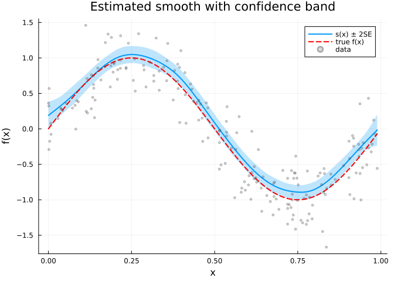
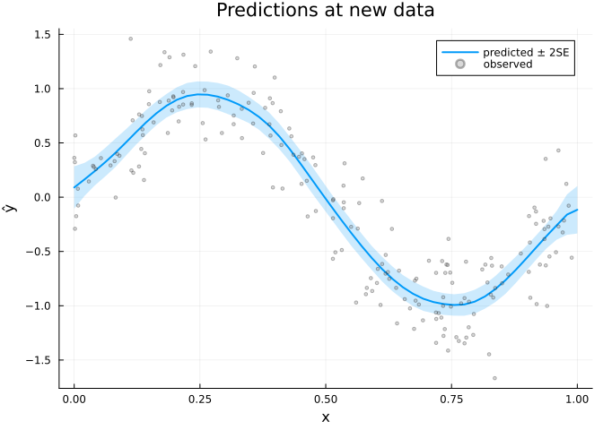

# Introduction to GAMs with GAM.jl
GAM.jl Contributors

- [Overview](#overview)
- [Setup](#setup)
- [Simulating data](#simulating-data)
- [Fitting a GAM](#fitting-a-gam)
  - [Coefficients and deviance
    explained](#coefficients-and-deviance-explained)
- [Smooth estimates](#smooth-estimates)
- [Prediction at new points](#prediction-at-new-points)
- [Smoothing parameters and REML](#smoothing-parameters-and-reml)
- [Model diagnostics](#model-diagnostics)
- [Summary](#summary)

## Overview

A **Generalized Additive Model (GAM)** extends the linear model by
replacing linear predictor terms with smooth functions of covariates.
The model takes the form:

$$g(\mu_i) = \beta_0 + f_1(x_{1i}) + f_2(x_{2i}) + \cdots + f_p(x_{pi})$$

where $g$ is a link function, $\mu_i = \mathbb{E}(y_i | \mathbf{x}_i)$,
and each $f_j$ is a smooth function estimated from the data using
penalized regression splines.

The smooth functions are represented as linear combinations of basis
functions:

$$f_j(x) = \sum_{k=1}^{K_j} \beta_{jk} \, b_{jk}(x)$$

Smoothness is controlled by a wiggliness penalty, and the smoothing
parameter $\lambda$ is estimated automatically (e.g., by REML).

This vignette demonstrates fitting a simple GAM to simulated data using
**GAM.jl**.

## Setup

``` julia
using GAM
using CSV
using StatsAPI: nobs, deviance, predict, coef, residuals, r2
using DataFrames
using Plots
```

## Simulating data

We simulate $n = 200$ observations from a sine curve with Gaussian
noise:

$$y_i = \sin(2\pi x_i) + \varepsilon_i, \quad \varepsilon_i \sim \mathcal{N}(0, 0.3^2)$$

``` julia
df = CSV.read("data.csv", DataFrame)
x = df.x
y = df.y
n = nrow(df)
first(df, 5)
```

<div><div style = "float: left;"><span>5×2 DataFrame</span></div><div style = "clear: both;"></div></div><div class = "data-frame" style = "overflow-x: scroll;">

| Row |           x |         y |
|----:|------------:|----------:|
|     |     Float64 |   Float64 |
|   1 | 0.000238897 |  0.361791 |
|   2 |  0.00138084 |  0.322101 |
|   3 |  0.00157055 | -0.291095 |
|   4 |  0.00227297 |  0.568826 |
|   5 |  0.00394834 | -0.175226 |

</div>

## Fitting a GAM

We fit a GAM with a cubic regression spline (`bs=:cr`) smooth of `x`
using 15 basis functions:

``` julia
m = gam(@gam_formula(y ~ s(x, k = 15, bs = :cr)), df)
```

    Generalized Additive Model

    Formula: y ~ 1

    Family: Normal
    Link:   IdentityLink
    Method: REML

    Parametric coefficients:
    ───────────────────────────────────────────────────
                     Coef.  Std. Error      t  Pr(>|t|)
    ───────────────────────────────────────────────────
    (Intercept)  -0.100199   0.0204975  -4.89    <1e-05
    ───────────────────────────────────────────────────

    Approximate significance of smooth terms:
    ──────────────────────────────────────────────────
    Smooth                    edf   Ref.df
    ──────────────────────────────────────────────────
    s(x,bs=cr)               7.72       14
    ──────────────────────────────────────────────────

    R² (adj) = 0.852   Deviance explained = 85.8%
    Scale est. = 0.0840   n = 200

The model summary shows parametric coefficients, smooth term EDF,
deviance explained, and scale estimate.

### Coefficients and deviance explained

``` julia
println("Number of observations: ", nobs(m))
println("EDF per smooth:         ", round.(edf(m); digits = 2))
println("Deviance explained:     ", round(r2(m) * 100; digits = 1), "%")
println("Scale estimate:         ", round(m.scale; digits = 4))
```

    Number of observations: 200
    EDF per smooth:         [7.72]
    Deviance explained:     85.8%
    Scale estimate:         0.084

## Smooth estimates

The `smooth_estimates()` function evaluates the estimated smooth on a
regular grid and returns pointwise standard errors:

``` julia
se = smooth_estimates(m; n = 200)
x_grid = se.covariates[:x]
f_hat = se.estimate
f_se = se.se
```

    200-element Vector{Float64}:
     0.09763142234598464
     0.09152560012016296
     0.08590578972752112
     0.08086761242345392
     0.07649627071273286
     0.07285701852960906
     0.06998441400440208
     0.06787288672199855
     0.06647185185290631
     0.06568774897270883
     ⋮
     0.0595697663470705
     0.06240281337308548
     0.06630289544668014
     0.07129730501497046
     0.0773352938452079
     0.08431009351770438
     0.09208297523836706
     0.10050219970148694
     0.10941500895413366

We plot the smooth estimate with ±2 SE confidence bands, overlaying the
true function:

``` julia
plot(x_grid, f_hat;
    ribbon = 2 .* f_se,
    fillalpha = 0.25,
    label = "s(x) ± 2SE",
    xlabel = "x",
    ylabel = "f(x)",
    title = "Estimated smooth with confidence band",
    linewidth = 2)
plot!(x_grid, sin.(2π .* x_grid);
    label = "true f(x)",
    linestyle = :dash,
    linewidth = 2,
    color = :red)
scatter!(df.x, df.y;
    label = "data",
    alpha = 0.3,
    markersize = 2,
    color = :gray)
```



## Prediction at new points

We can predict at new covariate values, optionally with standard errors:

``` julia
x_new = DataFrame(x = collect(range(0, 1; length = 50)))
μ_hat, se_hat = predict(m, x_new; type = :response, se = true)

plot(x_new.x, μ_hat;
    ribbon = 2 .* se_hat,
    fillalpha = 0.2,
    label = "predicted ± 2SE",
    xlabel = "x",
    ylabel = "ŷ",
    title = "Predictions at new data",
    linewidth = 2)
scatter!(df.x, df.y;
    label = "observed",
    alpha = 0.3,
    markersize = 2,
    color = :gray)
```



## Smoothing parameters and REML

GAM.jl estimates the smoothing parameter $\lambda$ by minimizing the
Restricted Maximum Likelihood (REML) criterion by default. REML is
generally preferred over GCV because it:

- Avoids the tendency to undersmooth
- Provides more stable estimates
- Has a natural Bayesian interpretation

The fitted model stores the estimated smoothing parameters:

``` julia
println("Estimation method: ", m.method)
```

    Estimation method: REML

## Model diagnostics

The `gam_check()` function provides a quick diagnostic summary:

``` julia
gam_check(m)
```

    GAM checking results
    ====================

    ✓ Model converged

    Method: REML
    Scale est. = 0.0840
    n = 200

    Basis dimension (k) checking results:
    ────────────────────────────────────────────────────────────
    Smooth                     k'      edf  k-index
    ────────────────────────────────────────────────────────────
    s(x,bs=cr)                 14     7.72    0.552
    ────────────────────────────────────────────────────────────


    Deviance explained = 85.8%
    Scale (σ²) = 0.0840

## Summary

In this vignette we:

1.  Simulated data from a sine curve with Gaussian noise
2.  Fitted a GAM using a cubic regression spline with `k = 15` basis
    functions
3.  Examined the model summary, EDF, and deviance explained
4.  Visualized the smooth estimate with confidence bands
5.  Predicted at new data points with standard errors
6.  Discussed REML-based smoothing parameter estimation

The next vignette compares different smooth basis types.
