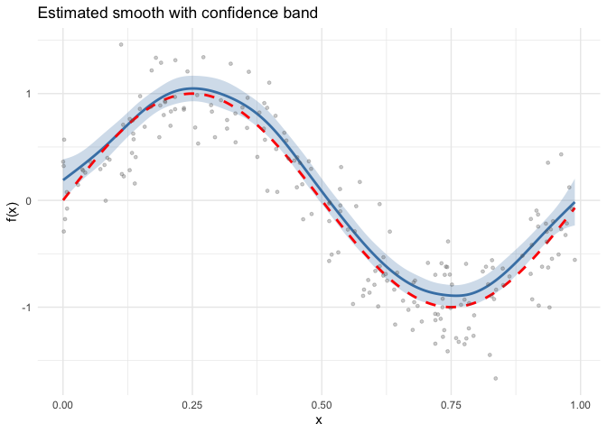
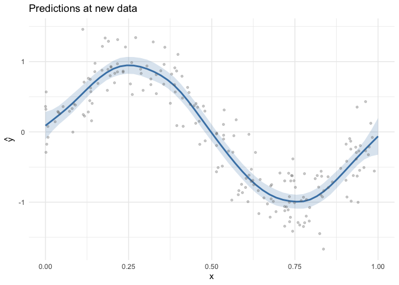
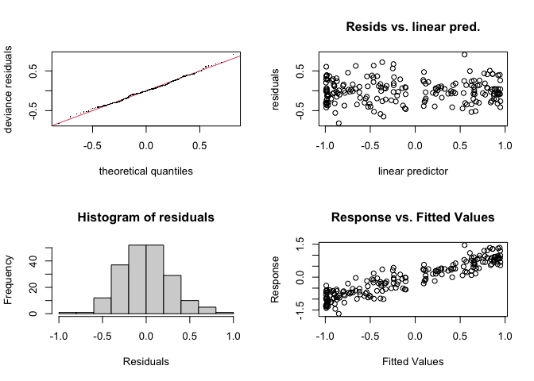

# Introduction to GAMs with mgcv
Simon Frost

- [Overview](#overview)
- [Setup](#setup)
- [Loading data](#loading-data)
- [Fitting a GAM](#fitting-a-gam)
  - [Coefficients and deviance
    explained](#coefficients-and-deviance-explained)
- [Smooth estimates](#smooth-estimates)
- [Prediction at new points](#prediction-at-new-points)
- [Smoothing parameters and REML](#smoothing-parameters-and-reml)
- [Model diagnostics](#model-diagnostics)
- [Summary](#summary)

## Overview

A **Generalized Additive Model (GAM)** extends the linear model by
replacing linear predictor terms with smooth functions of covariates.
The model takes the form:

$$g(\mu_i) = \beta_0 + f_1(x_{1i}) + f_2(x_{2i}) + \cdots + f_p(x_{pi})$$

where $g$ is a link function, $\mu_i = \mathbb{E}(y_i | \mathbf{x}_i)$,
and each $f_j$ is a smooth function estimated from the data using
penalized regression splines.

The smooth functions are represented as linear combinations of basis
functions:

$$f_j(x) = \sum_{k=1}^{K_j} \beta_{jk} \, b_{jk}(x)$$

Smoothness is controlled by a wiggliness penalty, and the smoothing
parameter $\lambda$ is estimated automatically (e.g., by REML).

This vignette demonstrates fitting a simple GAM to simulated data using
**mgcv** in R.

## Setup

``` r
library(mgcv)
```

    Loading required package: nlme

    This is mgcv 1.9-3. For overview type 'help("mgcv-package")'.

``` r
library(gratia)
library(ggplot2)
```

## Loading data

We load $n = 200$ observations generated from a sine curve with Gaussian
noise:

$$y_i = \sin(2\pi x_i) + \varepsilon_i, \quad \varepsilon_i \sim \mathcal{N}(0, 0.3^2)$$

``` r
dat <- read.csv("../data.csv")
x <- dat$x
y <- dat$y
n <- nrow(dat)
df <- data.frame(x = x, y = y)
head(df)
```

                 x           y
    1 0.0002388966  0.36179064
    2 0.0013808436  0.32210131
    3 0.0015705542 -0.29109467
    4 0.0022729661  0.56882555
    5 0.0039483388 -0.17522642
    6 0.0073341469  0.07771964

## Fitting a GAM

We fit a GAM with a cubic regression spline (`bs = "cr"`) smooth of `x`
using 15 basis functions:

``` r
m <- gam(y ~ s(x, k = 15, bs = "cr"), data = df, method = "REML")
summary(m)
```


    Family: gaussian 
    Link function: identity 

    Formula:
    y ~ s(x, k = 15, bs = "cr")

    Parametric coefficients:
                Estimate Std. Error t value Pr(>|t|)    
    (Intercept)  -0.1002     0.0205  -4.888 2.15e-06 ***
    ---
    Signif. codes:  0 '***' 0.001 '**' 0.01 '*' 0.05 '.' 0.1 ' ' 1

    Approximate significance of smooth terms:
           edf Ref.df     F p-value    
    s(x) 7.722  9.369 122.5  <2e-16 ***
    ---
    Signif. codes:  0 '***' 0.001 '**' 0.01 '*' 0.05 '.' 0.1 ' ' 1

    R-sq.(adj) =  0.852   Deviance explained = 85.8%
    -REML = 49.744  Scale est. = 0.08403   n = 200

The model summary shows parametric coefficients, smooth term EDF,
deviance explained, and scale estimate.

### Coefficients and deviance explained

``` r
cat("Number of observations:", nobs(m), "\n")
```

    Number of observations: 200 

``` r
cat("EDF per smooth:        ", round(pen.edf(m), 2), "\n")
```

    EDF per smooth:         7.72 

``` r
cat("Deviance explained:    ", round(summary(m)$dev.expl * 100, 1), "%\n")
```

    Deviance explained:     85.8 %

``` r
cat("Scale estimate:        ", round(m$scale, 4), "\n")
```

    Scale estimate:         0.084 

## Smooth estimates

The `gratia::smooth_estimates()` function evaluates the estimated smooth
on a regular grid and returns pointwise standard errors:

``` r
se <- smooth_estimates(m, n = 200)
head(se)
```

    # A tibble: 6 × 6
      .smooth .type .by   .estimate    .se        x
      <chr>   <chr> <chr>     <dbl>  <dbl>    <dbl>
    1 s(x)    CRS   <NA>      0.190 0.0976 0.000239
    2 s(x)    CRS   <NA>      0.208 0.0915 0.00521 
    3 s(x)    CRS   <NA>      0.226 0.0859 0.0102  
    4 s(x)    CRS   <NA>      0.244 0.0809 0.0151  
    5 s(x)    CRS   <NA>      0.263 0.0765 0.0201  
    6 s(x)    CRS   <NA>      0.281 0.0729 0.0251  

We plot the smooth estimate with ±2 SE confidence bands, overlaying the
true function:

``` r
ggplot(se, aes(x = x, y = .estimate)) +
  geom_ribbon(aes(ymin = .estimate - 2 * .se, ymax = .estimate + 2 * .se),
              alpha = 0.25, fill = "steelblue") +
  geom_line(linewidth = 1, colour = "steelblue") +
  geom_line(aes(y = sin(2 * pi * x)), linetype = "dashed",
            linewidth = 1, colour = "red") +
  geom_point(data = df, aes(x = x, y = y), alpha = 0.3, size = 1, colour = "grey40") +
  labs(x = "x", y = "f(x)", title = "Estimated smooth with confidence band") +
  theme_minimal()
```



## Prediction at new points

We can predict at new covariate values with standard errors:

``` r
x_new <- data.frame(x = seq(0, 1, length.out = 50))
pred <- predict(m, newdata = x_new, type = "response", se.fit = TRUE)

x_new$fit <- pred$fit
x_new$se <- pred$se.fit

ggplot(x_new, aes(x = x, y = fit)) +
  geom_ribbon(aes(ymin = fit - 2 * se, ymax = fit + 2 * se),
              alpha = 0.2, fill = "steelblue") +
  geom_line(linewidth = 1, colour = "steelblue") +
  geom_point(data = df, aes(x = x, y = y), alpha = 0.3, size = 1, colour = "grey40") +
  labs(x = "x", y = expression(hat(y)), title = "Predictions at new data") +
  theme_minimal()
```



## Smoothing parameters and REML

mgcv estimates the smoothing parameter $\lambda$ by minimizing the
Restricted Maximum Likelihood (REML) criterion by default. REML is
generally preferred over GCV because it:

- Avoids the tendency to undersmooth
- Provides more stable estimates
- Has a natural Bayesian interpretation

``` r
cat("Estimation method:", m$method, "\n")
```

    Estimation method: REML 

``` r
cat("Smoothing parameter (log):", log(m$sp), "\n")
```

    Smoothing parameter (log): 4.278883 

## Model diagnostics

The `gam.check()` function provides diagnostic plots and basis dimension
checks:

``` r
par(mfrow = c(2, 2))
gam.check(m)
```




    Method: REML   Optimizer: outer newton
    full convergence after 4 iterations.
    Gradient range [-6.776588e-10,3.284431e-10]
    (score 49.74438 & scale 0.08402973).
    Hessian positive definite, eigenvalue range [3.328508,99.11809].
    Model rank =  15 / 15 

    Basis dimension (k) checking results. Low p-value (k-index<1) may
    indicate that k is too low, especially if edf is close to k'.

            k'   edf k-index p-value
    s(x) 14.00  7.72    1.09     0.9

``` r
par(mfrow = c(1, 1))
```

## Summary

In this vignette we:

1.  Simulated data from a sine curve with Gaussian noise
2.  Fitted a GAM using a cubic regression spline with `k = 15` basis
    functions
3.  Examined the model summary, EDF, and deviance explained
4.  Visualized the smooth estimate with confidence bands using gratia
5.  Predicted at new data points with standard errors
6.  Discussed REML-based smoothing parameter estimation

The next vignette compares different smooth basis types.
