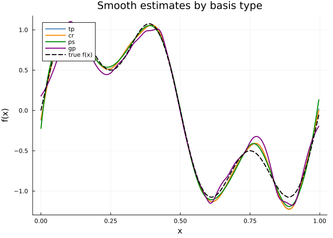
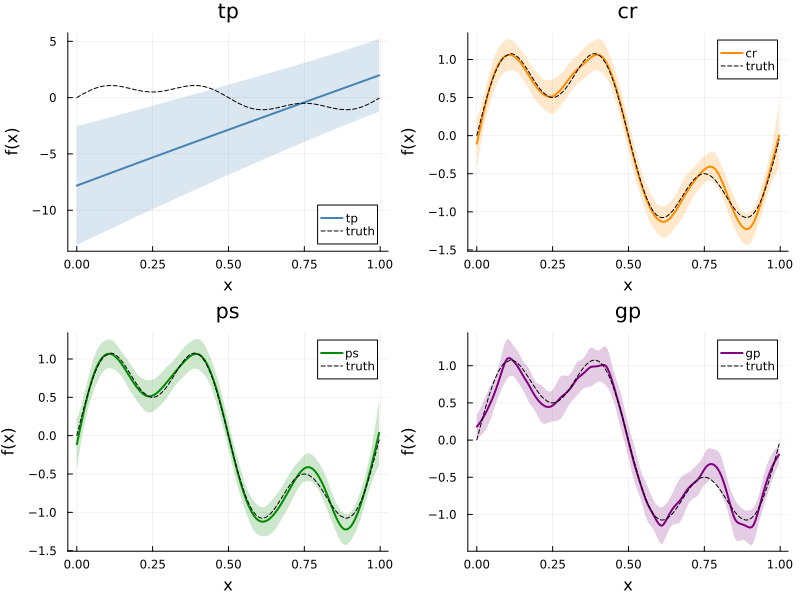
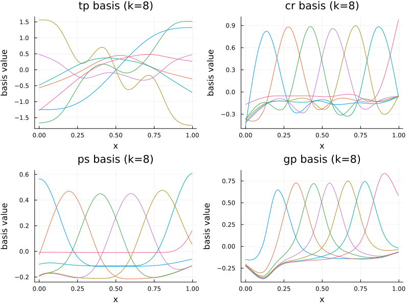

# Comparing Smooth Basis Types
Simon Frost

- [Overview](#overview)
- [Setup](#setup)
- [Simulating data](#simulating-data)
- [Fitting models with different
  bases](#fitting-models-with-different-bases)
- [Comparing EDF and deviance](#comparing-edf-and-deviance)
- [Comparing smooth estimates](#comparing-smooth-estimates)
- [Visualizing basis functions](#visualizing-basis-functions)
- [When to use which basis](#when-to-use-which-basis)
- [Summary](#summary)

## Overview

GAMs represent smooth functions as linear combinations of **basis
functions**. The choice of basis affects the shape of the fitted smooth,
computational cost, and numerical properties. GAM.jl supports several
basis types:

| Symbol | Basis | Description |
|----|----|----|
| `:tp` | Thin plate regression spline | Default. Optimal in a certain sense; no knot placement needed |
| `:cr` | Cubic regression spline | Cubic spline with knots at data quantiles; efficient for 1D |
| `:ps` | P-spline | B-spline basis with difference penalty |
| `:gp` | Gaussian process | Squared-exponential covariance as a basis |

This vignette fits the same data with each basis and compares the
results.

## Setup

``` julia
using GAM
using CSV
using StatsAPI: deviance, r2

using DataFrames
using Plots
```

## Simulating data

We simulate $n = 300$ observations from a function with both broad and
fine-scale structure:

$$y_i = \sin(2\pi x_i) + 0.5\sin(6\pi x_i) + \varepsilon_i, \quad \varepsilon_i \sim \mathcal{N}(0, 0.5^2)$$

``` julia
df = CSV.read("data.csv", DataFrame)
x = df.x
y = df.y
n = nrow(df)
f_true = sin.(2π .* x) .+ 0.5 .* sin.(6π .* x)
```

    300-element Vector{Float64}:
      0.0037525705368858914
      0.021688661920548687
      0.02466788576849125
      0.035696628985766546
      0.061983472634466685
      0.114968235996452
      0.12355964591251725
      0.2724256425429245
      0.28965184715121356
      0.3310682959041459
      ⋮
     -0.5567346453342871
     -0.4870474705846718
     -0.4415895321938606
     -0.40465766851198026
     -0.3358792607970992
     -0.2692752238447488
     -0.26688060706108724
     -0.17366833625919342
     -0.05412583454099407

## Fitting models with different bases

We fit the same formula with each basis type, using `k = 20` basis
functions:

``` julia
bases = [:tp, :cr, :ps, :gp]
models = Dict{Symbol, GamModel}()

for bs in bases
    models[bs] = gam(GamFormula(:y, Symbol[], true, [s(:x, k=20, bs=bs)]), df)
end
```

## Comparing EDF and deviance

``` julia
println("Basis   EDF       Deviance    Dev.Expl(%)")
println("─" ^ 50)
for bs in bases
    m = models[bs]
    e = round(edf(m)[1]; digits = 2)
    d = round(deviance(m); digits = 2)
    de = round(r2(m) * 100; digits = 1)
    println("$(rpad(bs, 8))$(lpad(string(e), 8))  $(lpad(string(d), 10))  $(lpad(string(de), 10))")
end
```

    Basis   EDF       Deviance    Dev.Expl(%)
    ──────────────────────────────────────────────────
    tp         12.78       64.49        75.1
    cr         12.78       64.49        75.1
    ps         11.67       64.63        75.1
    gp         14.03        65.9        74.6

## Comparing smooth estimates

We evaluate each smooth on the same grid and compare:

``` julia
p = plot(xlabel = "x", ylabel = "f(x)",
    title = "Smooth estimates by basis type", legend = :topleft)

colors = [:steelblue, :darkorange, :green4, :purple]

for (i, bs) in enumerate(bases)
    se = smooth_estimates(models[bs]; n = 200)
    plot!(p, se.covariates[:x], se.estimate;
        label = string(bs),
        linewidth = 2,
        color = colors[i])
end

plot!(p, x, f_true;
    label = "true f(x)",
    linestyle = :dash,
    linewidth = 2,
    color = :black)
p
```



We can also show each basis with its confidence band:

``` julia
plots = []
for (i, bs) in enumerate(bases)
    se = smooth_estimates(models[bs]; n = 200)
    pi = plot(se.covariates[:x], se.estimate;
        ribbon = 2 .* se.se,
        fillalpha = 0.2,
        label = string(bs),
        linewidth = 2,
        color = colors[i],
        title = string(bs),
        xlabel = "x",
        ylabel = "f(x)")
    plot!(pi, x, f_true;
        label = "truth",
        linestyle = :dash,
        color = :black)
    push!(plots, pi)
end
plot(plots...; layout = (2, 2), size = (800, 600))
```



## Visualizing basis functions

To understand how each basis works, we can examine the model matrix
columns for a small number of basis functions (`k = 8`):

``` julia
plots_basis = []
for (i, bs) in enumerate(bases)
    m_small = gam(GamFormula(:y, Symbol[], true, [s(:x, k=8, bs=bs)]), df)
    X_smooth = m_small.smooths[1].X
    k_cols = size(X_smooth, 2)
    pi = plot(title = "$(bs) basis (k=8)", xlabel = "x", ylabel = "basis value",
        legend = false)
    for j in 1:k_cols
        order = sortperm(df.x)
        plot!(pi, df.x[order], X_smooth[order, j]; linewidth = 1)
    end
    push!(plots_basis, pi)
end
plot(plots_basis...; layout = (2, 2), size = (800, 600))
```



## When to use which basis

- **Thin plate (`:tp`)**: The default choice. Works well in any
  dimension. Optimal smoothness in a certain mathematical sense.
  Slightly more expensive than knot-based alternatives for large
  datasets.

- **Cubic regression spline (`:cr`)**: Efficient for 1D smoothing with
  knots at data quantiles. Produces smooth curves that are natural cubic
  splines. Good default for univariate smooths.

- **P-spline (`:ps`)**: B-spline basis with a difference penalty on
  adjacent coefficients. Evenly spaced knots. Computationally efficient
  and well-behaved, especially for evenly sampled data.

- **Gaussian process (`:gp`)**: Uses a squared-exponential covariance
  kernel. Produces very smooth curves. Useful when the underlying
  function is believed to be infinitely differentiable.

## Summary

In this vignette we:

1.  Simulated bumpy data with both low- and high-frequency components
2.  Fitted GAMs using four different basis types (TP, CR, PS, GP)
3.  Compared EDF, deviance, and smooth estimates across bases
4.  Visualized the raw basis functions for each type
5.  Discussed when each basis is most appropriate

The next vignette demonstrates models with multiple smooth terms.
