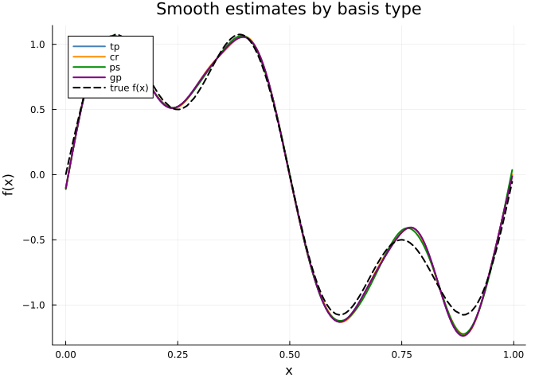
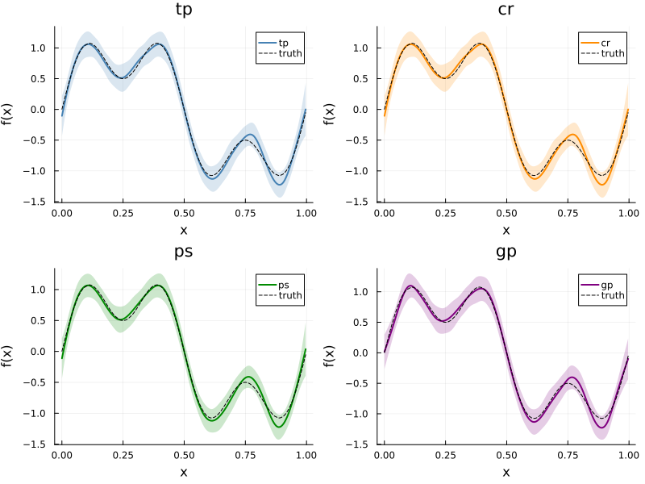
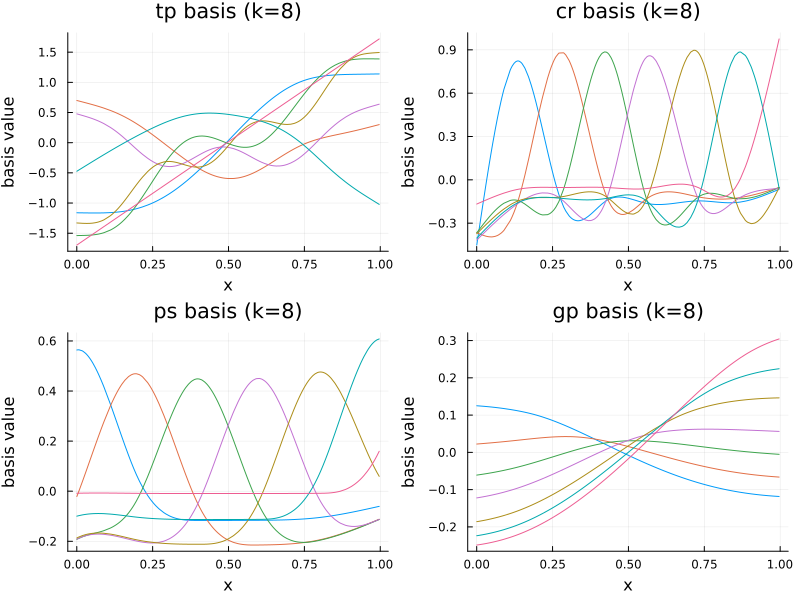
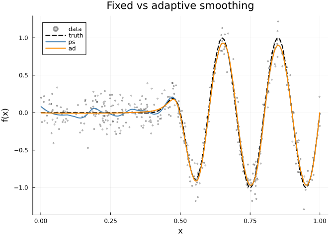

# Comparing Smooth Basis Types
Simon Frost

- [Overview](#overview)
- [Setup](#setup)
- [Simulating data](#simulating-data)
- [Fitting models with different
  bases](#fitting-models-with-different-bases)
- [Comparing EDF and deviance](#comparing-edf-and-deviance)
- [Comparing smooth estimates](#comparing-smooth-estimates)
- [Visualizing basis functions](#visualizing-basis-functions)
- [Shrinkage bases: `:ts` and `:cs`](#shrinkage-bases-ts-and-cs)
  - [`select = true` does the same job
    differently](#select--true-does-the-same-job-differently)
  - [A caveat on `:cs`](#a-caveat-on-cs)
- [Adaptive smooths: `:ad`](#adaptive-smooths-ad)
- [B-splines with derivative penalties:
  `:bs`](#b-splines-with-derivative-penalties-bs)
- [Cyclic P-splines: `:cps`](#cyclic-p-splines-cps)
- [Fractional polynomials (`:fp`) and loess
  (`:lo`)](#fractional-polynomials-fp-and-loess-lo)
- [Factor smooths: `:sz`](#factor-smooths-sz)
- [A note on `bam(...; discrete = true)`](#a-note-on-bam-discrete--true)
- [When to use which basis](#when-to-use-which-basis)
- [Summary](#summary)

## Overview

GAMs represent smooth functions as linear combinations of **basis
functions**. The choice of basis affects the shape of the fitted smooth,
computational cost, and numerical properties. GAM.jl supports several
basis types:

| Symbol | Basis | Description |
|----|----|----|
| `:tp` | Thin plate regression spline | Default. Optimal in a certain sense; no knot placement needed |
| `:cr` | Cubic regression spline | Cubic spline with knots at data quantiles; efficient for 1D |
| `:ps` | P-spline | B-spline basis with difference penalty |
| `:gp` | Gaussian process | Matérn 3/2 covariance as a basis |
| `:ts` | Thin plate with shrinkage | As `:tp`, but the penalty also covers the null space |
| `:cs` | Cubic with shrinkage | As `:cr`, but the penalty also covers the null space |
| `:bs` | B-spline | B-spline basis with an integrated squared-derivative penalty |
| `:cps` | Cyclic P-spline | P-spline constrained to wrap around: $f$ matches at both ends |
| `:ad` | Adaptive smooth | Smoothing parameter varies across the domain |
| `:fp` | Fractional polynomial | Low-dimensional parametric family of powers |
| `:lo` | Loess-style | Local-regression basis |

The first four are compared head-to-head below; the shrinkage, adaptive
and remaining bases each get their own section afterwards, because what
makes them worth choosing only shows up on data built to expose it.

## Setup

``` julia
using GAM
using CSV
using StatsAPI: deviance, r2, fitted, coef
using Statistics: mean

using DataFrames
using Plots
```

## Simulating data

We simulate $n = 300$ observations from a function with both broad and
fine-scale structure:

$$y_i = \sin(2\pi x_i) + 0.5\sin(6\pi x_i) + \varepsilon_i, \quad \varepsilon_i \sim \mathcal{N}(0, 0.5^2)$$

``` julia
df = CSV.read("data.csv", DataFrame)
x = df.x
y = df.y
n = nrow(df)
f_true = sin.(2π .* x) .+ 0.5 .* sin.(6π .* x)
ord = sortperm(x)
```

    300-element Vector{Int64}:
       1
       2
       3
       4
       5
       6
       7
       8
       9
      10
       ⋮
     292
     293
     294
     295
     296
     297
     298
     299
     300

## Fitting models with different bases

We fit the same formula with each basis type, using `k = 20` basis
functions:

``` julia
bases = [:tp, :cr, :ps, :gp]
models = Dict{Symbol, GamModel}(
    :tp => gam(@formula(y ~ s(x, k=20, bs=:tp)), df),
    :cr => gam(@formula(y ~ s(x, k=20, bs=:cr)), df),
    :ps => gam(@formula(y ~ s(x, k=20, bs=:ps)), df),
    :gp => gam(@formula(y ~ s(x, k=20, bs=:gp)), df),
)
```

    Dict{Symbol, GamModel} with 4 entries:
      :cr => GamModel(n_smooth=1, edf=13.8, deviance=64.49)
      :tp => GamModel(n_smooth=1, edf=13.9, deviance=64.44)
      :gp => GamModel(n_smooth=1, edf=13.6, deviance=64.42)
      :ps => GamModel(n_smooth=1, edf=12.7, deviance=64.63)

## Comparing EDF and deviance

``` julia
println("Basis   EDF       Deviance    Dev.Expl(%)")
println("─" ^ 50)
for bs in bases
    m = models[bs]
    e = round(edf(m)[1]; digits = 2)
    d = round(deviance(m); digits = 2)
    de = round(GAM.deviance_explained(m) * 100; digits = 1)
    println("$(rpad(bs, 8))$(lpad(string(e), 8))  $(lpad(string(d), 10))  $(lpad(string(de), 10))")
end
```

    Basis   EDF       Deviance    Dev.Expl(%)
    ──────────────────────────────────────────────────
    tp         12.92       64.44        75.1
    cr         12.78       64.49        75.1
    ps         11.66       64.63        75.1
    gp         12.62       64.42        75.2

## Comparing smooth estimates

We evaluate each smooth on the same grid and compare:

``` julia
p = plot(xlabel = "x", ylabel = "f(x)",
    title = "Smooth estimates by basis type", legend = :topleft)

colors = [:steelblue, :darkorange, :green4, :purple]

for (i, bs) in enumerate(bases)
    se = smooth_estimates(models[bs]; n = 200)
    plot!(p, se.covariates[:x], se.estimate;
        label = string(bs),
        linewidth = 2,
        color = colors[i])
end

plot!(p, x[ord], f_true[ord];
    label = "true f(x)",
    linestyle = :dash,
    linewidth = 2,
    color = :black)
p
```



We can also show each basis with its confidence band:

``` julia
plots = []
for (i, bs) in enumerate(bases)
    se = smooth_estimates(models[bs]; n = 200)
    pi = plot(se.covariates[:x], se.estimate;
        ribbon = 2 .* se.se,
        fillalpha = 0.2,
        label = string(bs),
        linewidth = 2,
        color = colors[i],
        title = string(bs),
        xlabel = "x",
        ylabel = "f(x)")
    plot!(pi, x[ord], f_true[ord];
        label = "truth",
        linestyle = :dash,
        color = :black)
    push!(plots, pi)
end
plot(plots...; layout = (2, 2), size = (800, 600))
```



## Visualizing basis functions

To understand how each basis works, we can examine the model matrix
columns for a small number of basis functions (`k = 8`):

``` julia
plots_basis = []
small_models = Dict{Symbol, GamModel}(
    :tp => gam(@formula(y ~ s(x, k=8, bs=:tp)), df),
    :cr => gam(@formula(y ~ s(x, k=8, bs=:cr)), df),
    :ps => gam(@formula(y ~ s(x, k=8, bs=:ps)), df),
    :gp => gam(@formula(y ~ s(x, k=8, bs=:gp)), df),
)
for (i, bs) in enumerate(bases)
    m_small = small_models[bs]
    X_smooth = m_small.smooths[1].X
    k_cols = size(X_smooth, 2)
    pi = plot(title = "$(bs) basis (k=8)", xlabel = "x", ylabel = "basis value",
        legend = false)
    for j in 1:k_cols
        order = sortperm(df.x)
        plot!(pi, df.x[order], X_smooth[order, j]; linewidth = 1)
    end
    push!(plots_basis, pi)
end
plot(plots_basis...; layout = (2, 2), size = (800, 600))
```



## Shrinkage bases: `:ts` and `:cs`

Every penalty seen so far leaves a **null space** unpenalised — the
functions the penalty cannot see. For a thin-plate spline penalising
$\int (f'')^2$, any straight line has zero penalty, so no matter how
large the smoothing parameter grows, a linear trend survives. The term
can be flattened, but it cannot be removed.

The shrinkage bases `:ts` and `:cs` modify the penalty so that it covers
the null space too. A single smoothing parameter can then shrink the
whole term to zero, which means **the smooth can be selected out of the
model entirely**.

To see it, we need a covariate that genuinely does nothing. We simulate

$$y_i = \sin(2\pi x_i) + \varepsilon_i, \quad \varepsilon_i \sim \mathcal{N}(0, 0.4^2)$$

with a second covariate $z_i \sim \mathrm{U}(0,1)$ that never enters the
model, then fit `s(x) + s(z)` and look at what each basis does to the
$z$ term:

``` julia
df_sh = CSV.read("data_shrink.csv", DataFrame)

function edf_pair(basis; select = false)
    spec = [GAM.s(:x; k = 15, bs = basis), GAM.s(:z; k = 15, bs = basis)]
    m = gam(GAM.GamFormula(:y, Symbol[], true, spec), df_sh; select = select)
    return (edf_x = edf(m)[1], edf_z = edf(m)[2], logsp = m.sp)
end

println("basis           edf(x)   edf(z)")
println("─" ^ 40)
for b in (:tp, :ts, :cr, :cs)
    r = edf_pair(b)
    println(rpad(b, 14), rpad(round(r.edf_x; digits = 3), 9),
        round(r.edf_z; digits = 4))
end
r_sel = edf_pair(:tp; select = true)
println(rpad("tp + select", 14), rpad(round(r_sel.edf_x; digits = 3), 9),
    round(r_sel.edf_z; digits = 4))
```

    basis           edf(x)   edf(z)
    ────────────────────────────────────────
    tp            8.421    1.6805
    ts            7.866    0.0
    cr            8.397    1.6905
    cs            7.818    0.0
    tp + select   8.385    0.0065

With `:tp` the irrelevant term keeps about 1.7 effective degrees of
freedom — the unpenalised linear component, fitting noise. With `:ts` it
falls to roughly 0.002: the term has been shrunk out.

### `select = true` does the same job differently

`select = true` (used in vignettes 03, 05, 13 and 14) reaches the same
end by another route: instead of modifying the basis, it adds a *second*
penalty per smooth covering that smooth’s null space, giving each term
an extra smoothing parameter. The last row above shows `:tp` with
`select = true` reaching an `edf(z)` comparable to `:ts`.

Which to reach for:

- **`select = true`** applies to every smooth in the model at once and
  works with any basis, including ones that have no shrinkage variant.
  It doubles the number of smoothing parameters, so it costs more to
  fit.
- **`:ts` / `:cs`** are per-term: use them when you want one particular
  smooth to be removable, or want to keep the smoothing-parameter count
  down.

### A caveat on `:cs`

`:ts` and `:cs` implement the two *different* shrinkage rules mgcv uses
(a flat rule for `ts`, a cascading one for `cs` where each successive
null eigenvalue is `shrink` times the previous). The cascading rule
leaves `:cs`’s last null direction penalised about $100\times$ more
weakly, so `:cs` needs a far larger smoothing parameter to shrink a term
out — and GAM.jl caps $\log \lambda$ at 15, which is not always enough
to get there. In the table above `:cs` stalls around `edf(z) ≈ 0.29`
with its smoothing parameter pinned at the cap, where mgcv (whose bound
is higher, reaching $\log \lambda \approx 22.6$ here) drives the same
term to essentially zero. `:ts` is unaffected, reaching the cap only
after the term is already negligible. Prefer `:ts`, or `select = true`,
when the goal is to remove a term outright.

Note also that `sp =` is supplied on the **natural** scale, while the
fitted `m.sp` is reported as $\log \lambda$.

## Adaptive smooths: `:ad`

Every basis so far has **one** smoothing parameter for the whole domain,
which assumes the function is equally wiggly everywhere. When it is not,
a single $\lambda$ has to compromise: smooth enough for the flat region
means oversmoothing the busy one, and vice versa.

An adaptive smooth lets the penalty vary over the domain. We simulate a
function that is flat on the left and oscillating on the right, with a
smooth transition:

$$f(x) = \frac{\sin(10\pi x)}{1 + e^{-40(x - 0.5)}}, \qquad
y_i = f(x_i) + \varepsilon_i, \quad \varepsilon_i \sim \mathcal{N}(0, 0.15^2)$$

and compare the fits separately on the flat half and the wiggly half:

``` julia
df_ad = CSV.read("data_adaptive.csv", DataFrame)
flat = df_ad.x .< 0.5

println("basis   edf     RMSE(flat)  RMSE(wiggly)")
println("─" ^ 44)
for b in (:ps, :tp, :ad)
    m = gam(GAM.GamFormula(:y, Symbol[], true, [GAM.s(:x; k = 40, bs = b)]), df_ad)
    fv = fitted(m)
    r_flat = sqrt(mean((fv[flat] .- df_ad.f_true[flat]) .^ 2))
    r_wig = sqrt(mean((fv[.!flat] .- df_ad.f_true[.!flat]) .^ 2))
    println(rpad(b, 8), rpad(round(edf(m)[1]; digits = 2), 8),
        rpad(round(r_flat; digits = 4), 12), round(r_wig; digits = 4))
end
```

    basis   edf     RMSE(flat)  RMSE(wiggly)
    ────────────────────────────────────────────
    ps      28.33   0.0322      0.0509
    tp      31.74   0.0339      0.0526
    ad      19.08   0.0113      0.0503

The adaptive smooth matches the others where the function oscillates,
but is roughly three times more accurate on the flat half — and it does
this with *fewer* effective degrees of freedom (about 19 against 28),
because it stops spending them where nothing is happening.

``` julia
m_ps = gam(GAM.GamFormula(:y, Symbol[], true, [GAM.s(:x; k = 40, bs = :ps)]), df_ad)
m_ad = gam(GAM.GamFormula(:y, Symbol[], true, [GAM.s(:x; k = 40, bs = :ad)]), df_ad)

p_ad = plot(df_ad.x, df_ad.y; seriestype = :scatter, markersize = 1.5,
    markeralpha = 0.35, color = :grey, label = "data",
    xlabel = "x", ylabel = "f(x)",
    title = "Fixed vs adaptive smoothing", legend = :topleft)
plot!(p_ad, df_ad.x, df_ad.f_true; color = :black, linestyle = :dash,
    linewidth = 2, label = "truth")
plot!(p_ad, df_ad.x, fitted(m_ps); color = :steelblue, linewidth = 2, label = "ps")
plot!(p_ad, df_ad.x, fitted(m_ad); color = :darkorange, linewidth = 2, label = "ad")
```



For `bs = :ad`, `m` sets the **number of adaptive sub-penalties**
(mgcv’s `p.order`, default 5) — it is not a spline order. Each
sub-penalty gets its own smoothing parameter, so the fitted model
reports several:

``` julia
for mm in (3, 5, 8)
    m = gam(GAM.GamFormula(:y, Symbol[], true,
        [GAM.s(:x; k = 40, bs = :ad, m = mm)]), df_ad)
    println("m = $mm: ", length(m.sp), " smoothing parameters, edf = ",
        round(edf(m)[1]; digits = 2))
end
```

    ┌ Warning: For `bs=:ad`, `m` follows mgcv and sets the NUMBER of adaptive sub-penalties (mgcv's `p.order`, default 5) — it is not a spline order. The smoothing basis is always a cubic P-spline with a second-order difference penalty. Use `xt=Dict(:n_penalties => n)` to be explicit.
    └ @ GAM ~/Projects/gam/GAM.jl/src/basis_adaptive.jl:103
    m = 3: 3 smoothing parameters, edf = 26.09
    m = 5: 5 smoothing parameters, edf = 19.08
    m = 8: 8 smoothing parameters, edf = 18.64

More sub-penalties means more flexibility to vary the smoothing, at the
cost of more parameters to estimate.

## B-splines with derivative penalties: `:bs`

`:bs` builds a B-spline basis and penalises an integrated squared
derivative directly, rather than differencing adjacent coefficients as
`:ps` does. Here `m` is the **order of the penalised derivative**
(default 2, giving the usual integrated squared second derivative on a
cubic basis):

``` julia
for mm in (1, 2, 3)
    m = gam(GAM.GamFormula(:y, Symbol[], true,
        [GAM.s(:x; k = 20, bs = :bs, m = mm)]), df)
    println("m = $mm (penalty on f^($mm)): edf = ", round(edf(m)[1]; digits = 3),
        ", deviance = ", round(deviance(m); digits = 3))
end
```

    m = 1 (penalty on f^(1)): edf = 15.601, deviance = 64.373
    m = 2 (penalty on f^(2)): edf = 12.49, deviance = 64.467
    m = 3 (penalty on f^(3)): edf = 10.532, deviance = 65.043

A lower penalty order penalises less about the function’s shape and so
admits a wigglier fit. Note that mgcv’s `bs="bs"` takes a *vector*
`m = c(3, 2)` setting the spline order and the penalty order
independently; GAM.jl takes a scalar `m` — the penalty order — and fixes
the spline order at `m + 2`. The defaults agree (a cubic basis with a
second-derivative penalty), but `m = [3, 2]` is not accepted here.

## Cyclic P-splines: `:cps`

A cyclic basis constrains the smooth to join up at the ends, so $f$ and
its derivatives match at the boundaries. This is right whenever the
covariate is periodic — an angle, or a time of year.

The function simulated at the top of this vignette happens to be
genuinely periodic on $[0, 1]$: both $\sin(2\pi x)$ and
$0.5\sin(6\pi x)$ complete whole cycles, so $f(0) = f(1) = 0$ and the
slopes match too. The cyclic basis is therefore legitimate here, and
imposing a constraint that is actually true buys a fit of similar
quality for **fewer** effective degrees of freedom:

``` julia
m_cps = gam(@formula(y ~ s(x, k = 20, bs = :cps)), df)
println("cps: edf = ", round(edf(m_cps)[1]; digits = 3),
    ", deviance = ", round(deviance(m_cps); digits = 3))
println("ps:  edf = ", round(edf(models[:ps])[1]; digits = 3),
    ", deviance = ", round(deviance(models[:ps]); digits = 3))
```

    cps: edf = 10.795, deviance = 64.88
    ps:  edf = 11.661, deviance = 64.634

Imposed on data that is *not* periodic, the same constraint is simply
wrong and will distort the fit near both boundaries. The applied use of
cyclic smooths — seasonal patterns, with `:cc` — is covered in the
seasonality vignette.

## Fractional polynomials (`:fp`) and loess (`:lo`)

These two are worth knowing about mainly so you can recognise when they
do not apply.

``` julia
for b in (:fp, :lo, :tp)
    m = gam(GAM.GamFormula(:y, Symbol[], true, [GAM.s(:x; k = 20, bs = b)]), df)
    println(rpad(b, 5), " coefficients = ", rpad(length(coef(m)), 5),
        " edf = ", rpad(round(edf(m)[1]; digits = 2), 7),
        " deviance = ", round(deviance(m); digits = 2))
end
```

    fp    coefficients = 3     edf = 2.0     deviance = 138.31
    lo    coefficients = 20    edf = 18.27   deviance = 75.31
    tp    coefficients = 20    edf = 12.92   deviance = 64.44

**Fractional polynomials (`:fp`)** are a low-dimensional *parametric*
family — a small set of powers of $x$ — rather than a spline basis. On
this two-frequency signal that is far too rigid: it uses 3 coefficients
and roughly doubles the deviance. Their appeal is elsewhere, in settings
where a compact, interpretable functional form is wanted and the
response really is close to a power law.

**Loess (`:lo`)** provides a local-regression basis. Here it spends more
effective degrees of freedom than the spline bases for a worse deviance,
which is typical: the penalised splines are hard to beat on a smooth
univariate signal. It is most useful when matching an existing
loess-based analysis.

## Factor smooths: `:sz`

`:sz` fits a smooth of a covariate for each level of a factor,
constrained to sum to zero across levels — so it represents the
*deviation* of each level from the overall smooth rather than a free
curve per level. It is one of several ways to let a smooth vary by
group; the others, factor-`by` smooths (each level with its own
smoothing parameter) and `bs = :fs` (all levels sharing a small fixed
set of smoothing parameters, however many levels there are), are covered
in the seasonality and mixed-model vignettes respectively.

The [seasonality vignette](../16_seasonality/16_seasonality.md) fits all
three side by side on the same data, where `:sz` recovers a common
seasonal curve plus per-region deviations that sum to zero to machine
precision, and the region whose amplitude happens to sit at the average
deviates by almost nothing — a reading that three separately-fitted `by`
curves do not give you.

## A note on `bam(...; discrete = true)`

If you are choosing a basis for a large dataset, note that covariate 1-D
smooths are binned to their unique covariate values under
`bam(...; discrete = true)` whatever basis they use, so every basis on
this page gets the fitting-time benefit. What varies is how the basis
itself is *built*. For a **whitelist** of bases — `:tp`, `:ts`, `:cr`,
`:cs`, `:cc`, `:ps`, `:cps` and `:bs` — the basis is constructed
directly at the unique values, so the full `n`-row basis is never
formed. The remaining bases, including `:ad`, `:gp`, `:fp` and `:lo`,
are built densely first and then binned: the same answer, but you pay
the construction cost once over all `n` rows. Choosing `:ad` for a very
large dataset therefore costs more up front than choosing `:ps`, though
both fit on the binned representation.

The whitelist is deliberate rather than incidental. A basis joins it
only once it has been shown to reproduce the dense basis exactly,
because a basis that discretises *almost* correctly returns a silently
wrong answer rather than an error.

## When to use which basis

- **Thin plate (`:tp`)**: The default choice. Works well in any
  dimension. Optimal smoothness in a certain mathematical sense.
  Slightly more expensive than knot-based alternatives for large
  datasets.

- **Cubic regression spline (`:cr`)**: Efficient for 1D smoothing with
  knots at data quantiles. Produces smooth curves that are natural cubic
  splines. Good default for univariate smooths.

- **P-spline (`:ps`)**: B-spline basis with a difference penalty on
  adjacent coefficients. Evenly spaced knots. Computationally efficient
  and well-behaved, especially for evenly sampled data.

- **Gaussian process (`:gp`)**: Uses a Matérn 3/2 covariance kernel,
  whose sample paths are once-differentiable — smoother than an
  exponential kernel but deliberately rougher than a
  squared-exponential. A good choice when the underlying function is
  smooth but not analytically so.

- **Shrinkage (`:ts`, `:cs`)**: `:tp` and `:cr` with the null space
  penalised too, so the term can be shrunk out of the model entirely.
  Reach for these — or `select = true` — when you want the fit to decide
  whether a covariate belongs at all. Prefer `:ts` over `:cs` for that
  purpose (see the caveat above).

- **B-spline (`:bs`)**: A B-spline basis penalising an integrated
  squared derivative directly, with the derivative order under your
  control via `m`. Useful when you want to specify exactly which
  derivative is being penalised.

- **Cyclic P-spline (`:cps`)**: For periodic covariates, where the
  smooth must join up at the ends. Imposing a true periodicity
  constraint buys accuracy for fewer degrees of freedom; imposing a
  false one distorts both boundaries.

- **Adaptive (`:ad`)**: For functions whose wiggliness varies across the
  domain. It costs several smoothing parameters instead of one, and
  falls back to dense construction under `discrete = true`, so it earns
  its keep only when the inhomogeneity is real.

- **Fractional polynomial (`:fp`)**: A compact parametric family, not a
  spline. Appropriate when a simple interpretable functional form is
  wanted, and too rigid for genuinely wiggly signals.

- **Loess (`:lo`)**: A local-regression basis, most useful for matching
  an existing loess-based analysis; the penalised splines generally fit
  smooth univariate signals better for fewer degrees of freedom.

## Summary

In this vignette we:

1.  Simulated bumpy data with both low- and high-frequency components
2.  Fitted GAMs using four different basis types (TP, CR, PS, GP)
3.  Compared EDF, deviance, and smooth estimates across bases
4.  Visualized the raw basis functions for each type
5.  Showed how the shrinkage bases `:ts` and `:cs` remove an irrelevant
    term, and how they relate to `select = true`
6.  Demonstrated adaptive smoothing (`:ad`) on a function whose
    wiggliness varies across the domain
7.  Covered the B-spline (`:bs`), cyclic P-spline (`:cps`),
    fractional-polynomial (`:fp`), loess (`:lo`) and factor (`:sz`)
    bases
8.  Discussed when each basis is most appropriate, including which bases
    benefit from `discrete = true`

The next vignette demonstrates models with multiple smooth terms.
