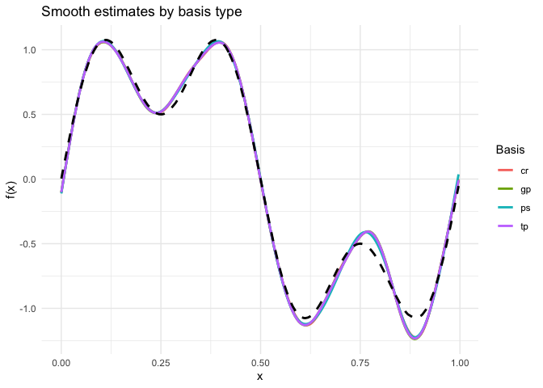
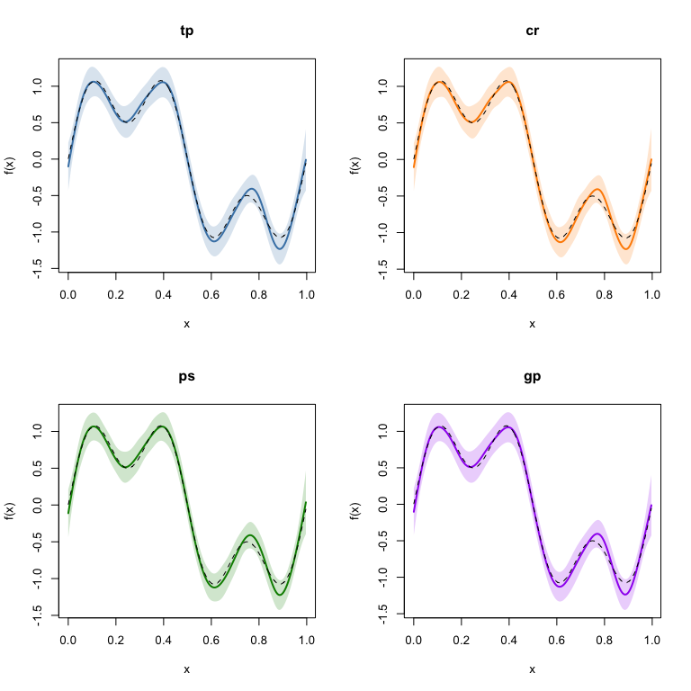
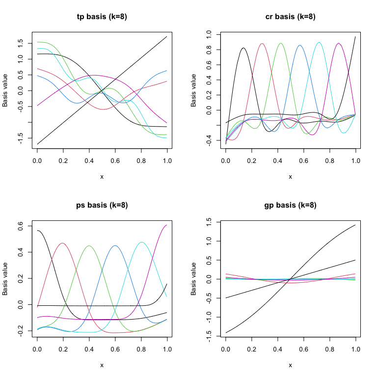

# Comparing Smooth Basis Types
Simon Frost

- [Overview](#overview)
- [Setup](#setup)
- [Loading data](#loading-data)
- [Fitting models with different
  bases](#fitting-models-with-different-bases)
- [Comparing EDF and deviance](#comparing-edf-and-deviance)
- [Comparing smooth estimates](#comparing-smooth-estimates)
- [Visualizing basis functions](#visualizing-basis-functions)
- [Shrinkage bases: `"ts"` and `"cs"`](#shrinkage-bases-ts-and-cs)
- [Adaptive smooths: `"ad"`](#adaptive-smooths-ad)
- [B-splines and cyclic P-splines](#b-splines-and-cyclic-p-splines)
- [Bases without an mgcv
  counterpart](#bases-without-an-mgcv-counterpart)
- [When to use which basis](#when-to-use-which-basis)
- [Summary](#summary)

## Overview

GAMs represent smooth functions as linear combinations of **basis
functions**. The choice of basis affects the shape of the fitted smooth,
computational cost, and numerical properties. mgcv supports several
basis types:

| Code | Basis | Description |
|----|----|----|
| `"tp"` | Thin plate regression spline | Default. Optimal in a certain sense; no knot placement needed |
| `"cr"` | Cubic regression spline | Cubic spline with knots at data quantiles; efficient for 1D |
| `"ps"` | P-spline | B-spline basis with difference penalty |
| `"gp"` | Gaussian process | Matérn covariance as a basis |
| `"ts"` | Thin plate with shrinkage | As `"tp"`, but the penalty also covers the null space |
| `"cs"` | Cubic with shrinkage | As `"cr"`, but the penalty also covers the null space |
| `"bs"` | B-spline | B-spline basis with an integrated squared-derivative penalty |
| `"cp"` | Cyclic P-spline | P-spline constrained to wrap around |
| `"ad"` | Adaptive smooth | Smoothing parameter varies across the domain |

This vignette fits the same data with each basis and compares the
results. The GAM.jl companion uses the symbols `:tp`, `:cr`, `:ps`,
`:gp`, `:ts`, `:cs`, `:bs`, `:cps` and `:ad` for the same bases — note
that mgcv’s cyclic P-spline is `"cp"` where GAM.jl writes `:cps`.

## Setup

``` r
library(mgcv)
```

    Loading required package: nlme

    This is mgcv 1.9-4. For overview type '?mgcv'.

``` r
library(gratia)
library(ggplot2)
```

## Loading data

We load $n = 300$ observations generated from a function with both broad
and fine-scale structure:

$$y_i = \sin(2\pi x_i) + 0.5\sin(6\pi x_i) + \varepsilon_i, \quad \varepsilon_i \sim \mathcal{N}(0, 0.5^2)$$

``` r
dat <- read.csv("../data.csv")
x <- dat$x
y <- dat$y
n <- nrow(dat)
f_true <- sin(2 * pi * x) + 0.5 * sin(6 * pi * x)
df <- data.frame(x = x, y = y)
```

## Fitting models with different bases

We fit the same formula with each basis type, using `k = 20` basis
functions:

``` r
bases <- c("tp", "cr", "ps", "gp")
models <- list()

for (bs in bases) {
  models[[bs]] <- gam(y ~ s(x, k = 20, bs = bs), data = df, method = "REML")
}
```

## Comparing EDF and deviance

``` r
results <- data.frame(
  Basis = bases,
  EDF = sapply(models, function(m) round(sum(pen.edf(m)), 2)),
  Deviance = sapply(models, function(m) round(deviance(m), 2)),
  Dev_Explained = sapply(models, function(m) round(summary(m)$dev.expl * 100, 1))
)
print(results)
```

       Basis   EDF Deviance Dev_Explained
    tp    tp 12.92    64.44          75.1
    cr    cr 12.78    64.49          75.1
    ps    ps 11.66    64.63          75.1
    gp    gp 12.62    64.42          75.2

## Comparing smooth estimates

We evaluate each smooth on the same grid and compare:

``` r
se_list <- lapply(bases, function(bs) {
  se <- smooth_estimates(models[[bs]], n = 200)
  se$basis <- bs
  se
})
se_all <- do.call(rbind, se_list)

ggplot(se_all, aes(x = x, y = .estimate, colour = basis)) +
  geom_line(linewidth = 1) +
  geom_line(data = data.frame(x = x, y = f_true),
            aes(x = x, y = y), inherit.aes = FALSE,
            linetype = "dashed", linewidth = 1) +
  labs(x = "x", y = "f(x)", title = "Smooth estimates by basis type",
       colour = "Basis") +
  theme_minimal()
```



Each basis with its confidence band:

``` r
par(mfrow = c(2, 2))
colors <- c("steelblue", "darkorange", "green4", "purple")

for (i in seq_along(bases)) {
  bs <- bases[i]
  se <- smooth_estimates(models[[bs]], n = 200)
  plot(se$x, se[[".estimate"]], type = "l", lwd = 2, col = colors[i],
       ylim = range(c(se[[".estimate"]] - 2 * se[[".se"]], se[[".estimate"]] + 2 * se[[".se"]])),
       xlab = "x", ylab = "f(x)", main = bs)
  polygon(c(se$x, rev(se$x)),
          c(se[[".estimate"]] - 2 * se[[".se"]], rev(se[[".estimate"]] + 2 * se[[".se"]])),
          col = adjustcolor(colors[i], alpha.f = 0.2), border = NA)
  lines(x, f_true, lty = 2, lwd = 1)
}
```



``` r
par(mfrow = c(1, 1))
```

## Visualizing basis functions

To understand how each basis works, we can examine the model matrix
columns for a small number of basis functions (`k = 8`):

``` r
par(mfrow = c(2, 2))
for (i in seq_along(bases)) {
  bs <- bases[i]
  m_small <- gam(y ~ s(x, k = 8, bs = bs), data = df, method = "REML")
  X <- model.matrix(m_small)
  # Remove intercept column
  X_smooth <- predict(m_small, type = "lpmatrix")[, -1]
  k_cols <- ncol(X_smooth)
  ord <- order(df$x)
  matplot(df$x[ord], X_smooth[ord, ], type = "l", lty = 1,
          xlab = "x", ylab = "Basis value",
          main = paste0(bs, " basis (k=8)"))
}
```



``` r
par(mfrow = c(1, 1))
```

## Shrinkage bases: `"ts"` and `"cs"`

An ordinary spline penalty leaves a null space unpenalised, so however
large the smoothing parameter grows a linear trend survives and the term
cannot be removed. The shrinkage bases extend the penalty over the null
space, letting a single smoothing parameter shrink the whole term to
zero.

We use a dataset with a relevant covariate `x` and an irrelevant `z`:

``` r
sh <- read.csv("../data_shrink.csv")

edf_pair <- function(basis, select = FALSE) {
  m <- gam(y ~ s(x, k = 15, bs = basis) + s(z, k = 15, bs = basis),
           data = sh, method = "REML", select = select)
  e <- summary(m)$edf
  c(edf_x = e[1], edf_z = e[2], logsp = log(m$sp))
}

res <- t(sapply(c("tp", "ts", "cr", "cs"), function(b) edf_pair(b)[1:2]))
print(round(res, 4))
```

        edf_x  edf_z
    tp 8.4214 1.6758
    ts 8.1330 0.0003
    cr 8.3971 1.6854
    cs 8.0988 0.0002

``` r
sel <- edf_pair("tp", select = TRUE)
cat(sprintf("tp + select: edf(x)=%.3f edf(z)=%.4f\n", sel[1], sel[2]))
```

    tp + select: edf(x)=8.385 edf(z)=0.0001

`"ts"` and `"cs"` both drive the irrelevant term to essentially zero
here, where `"tp"` and `"cr"` leave it around 1.7 effective degrees of
freedom.

The smoothing parameters are worth inspecting, because this is where
GAM.jl and mgcv part company:

``` r
for (b in c("ts", "cs")) {
  m <- gam(y ~ s(x, k = 15, bs = b) + s(z, k = 15, bs = b),
           data = sh, method = "REML")
  cat(sprintf("%s: log(sp) = %s\n", b, paste(round(log(m$sp), 2), collapse = ", ")))
}
```

    ts: log(sp) = -3.98, 16.8
    cs: log(sp) = 4.27, 22.61

mgcv drives the irrelevant term’s smoothing parameter well past
$\log \lambda = 15$ — for `"cs"` it reaches about 22.6. GAM.jl caps
$\log \lambda$ at 15, which is ample for `:ts` but leaves `:cs` stalled
around `edf(z) ≈ 0.29`. The shrinkage penalties themselves agree; the
bound on the smoothing parameter does not.

## Adaptive smooths: `"ad"`

``` r
ad <- read.csv("../data_adaptive.csv")
flat <- ad$x < 0.5

for (b in c("ps", "tp", "ad")) {
  m <- gam(y ~ s(x, k = 40, bs = b), data = ad, method = "REML")
  fv <- fitted(m)
  cat(sprintf("%-3s edf=%.2f RMSE(flat)=%.4f RMSE(wiggly)=%.4f\n", b,
      sum(m$edf) - 1,
      sqrt(mean((fv[flat] - ad$f_true[flat])^2)),
      sqrt(mean((fv[!flat] - ad$f_true[!flat])^2))))
}
```

    ps  edf=28.33 RMSE(flat)=0.0322 RMSE(wiggly)=0.0509
    tp  edf=31.74 RMSE(flat)=0.0339 RMSE(wiggly)=0.0526
    ad  edf=19.08 RMSE(flat)=0.0113 RMSE(wiggly)=0.0503

As in GAM.jl, the adaptive basis is roughly three times more accurate on
the flat half while using fewer effective degrees of freedom. `m` sets
the number of adaptive sub-penalties (mgcv’s `p.order`), each with its
own smoothing parameter:

``` r
for (mm in c(3, 5, 8)) {
  m <- gam(y ~ s(x, k = 40, bs = "ad", m = mm), data = ad, method = "REML")
  cat(sprintf("m = %d: %d smoothing parameters, edf = %.2f\n",
              mm, length(m$sp), sum(m$edf) - 1))
}
```

    m = 3: 3 smoothing parameters, edf = 26.09
    m = 5: 5 smoothing parameters, edf = 19.08
    m = 8: 8 smoothing parameters, edf = 18.63

## B-splines and cyclic P-splines

mgcv’s `"bs"` takes a **vector** `m = c(spline_order, penalty_order)`.
GAM.jl takes a scalar `m` — the penalty order — and fixes the spline
order at `m + 2`, so GAM.jl’s `m = j` corresponds to mgcv’s
`m = c(3, j)`. The defaults agree.

``` r
for (mm in list(c(3, 1), c(3, 2), c(3, 3))) {
  m <- gam(y ~ s(x, k = 20, bs = "bs", m = mm), data = df, method = "REML")
  cat(sprintf("m=c(%s): edf=%.3f deviance=%.3f\n",
              paste(mm, collapse = ","), sum(m$edf) - 1, deviance(m)))
}
```

    m=c(3,1): edf=15.386 deviance=64.218
    m=c(3,2): edf=12.491 deviance=64.466
    m=c(3,3): edf=10.394 deviance=65.041

``` r
m_cp <- gam(y ~ s(x, k = 20, bs = "cp"), data = df, method = "REML")
cat(sprintf("cp: edf=%.3f deviance=%.3f\n", sum(m_cp$edf) - 1, deviance(m_cp)))
```

    cp: edf=10.795 deviance=64.880

The simulated function is genuinely periodic on $[0, 1]$, so the cyclic
constraint is legitimate and buys a comparable fit for fewer degrees of
freedom.

## Bases without an mgcv counterpart

GAM.jl also provides `:fp` (fractional polynomials) and `:lo` (a
loess-style basis). Neither is an mgcv basis, so there is no
side-by-side comparison for them; they are demonstrated only in the
GAM.jl vignette.

## When to use which basis

- **Thin plate (`"tp"`)**: The default choice. Works well in any
  dimension. Optimal smoothness in a certain mathematical sense.
  Slightly more expensive than knot-based alternatives for large
  datasets.

- **Cubic regression spline (`"cr"`)**: Efficient for 1D smoothing with
  knots at data quantiles. Produces smooth curves that are natural cubic
  splines. Good default for univariate smooths.

- **P-spline (`"ps"`)**: B-spline basis with a difference penalty on
  adjacent coefficients. Evenly spaced knots. Computationally efficient
  and well-behaved, especially for evenly sampled data.

- **Gaussian process (`"gp"`)**: Uses a Matérn covariance kernel by
  default (the correlation family is chosen through `m`), whose sample
  paths are finitely differentiable — smoother than an exponential
  kernel but deliberately rougher than a squared-exponential. A good
  choice when the underlying function is smooth but not analytically so.

- **Shrinkage (`"ts"`, `"cs"`)**: `"tp"` and `"cr"` with the null space
  penalised too, so the term can be shrunk out of the model entirely —
  an alternative to `select = TRUE`.

- **B-spline (`"bs"`)**: A B-spline basis penalising an integrated
  squared derivative directly, with
  `m = c(spline_order, penalty_order)`.

- **Cyclic P-spline (`"cp"`)**: For periodic covariates, where the
  smooth must join up at the ends.

- **Adaptive (`"ad"`)**: For functions whose wiggliness varies across
  the domain, at the cost of several smoothing parameters instead of
  one.

## Summary

In this vignette we:

1.  Simulated bumpy data with both low- and high-frequency components
2.  Fitted GAMs using four different basis types (TP, CR, PS, GP)
3.  Compared EDF, deviance, and smooth estimates across bases
4.  Visualized the raw basis functions for each type
5.  Discussed when each basis is most appropriate

The next vignette demonstrates models with multiple smooth terms.
