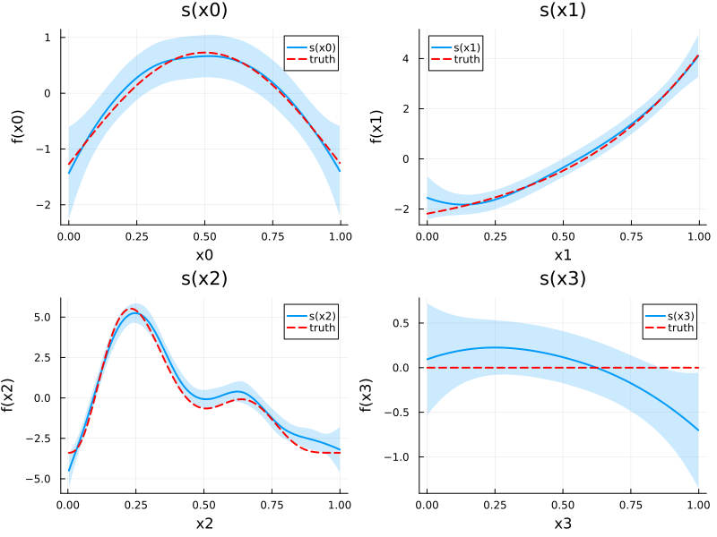

# Multiple Smooth Terms
Simon Frost

- [Overview](#overview)
- [Setup](#setup)
- [Simulating Gu–Wahba data](#simulating-guwahba-data)
- [Fitting the model](#fitting-the-model)
- [Model overview](#model-overview)
- [Plotting each smooth](#plotting-each-smooth)
- [Concurvity](#concurvity)
- [Comparing models with different
  k](#comparing-models-with-different-k)
- [Summary](#summary)

## Overview

One of the key strengths of GAMs is the ability to include **multiple
smooth terms** additively. The model:

$$y_i = \beta_0 + f_0(x_{0i}) + f_1(x_{1i}) + f_2(x_{2i}) + f_3(x_{3i}) + \varepsilon_i$$

estimates each smooth function $f_j$ simultaneously, with automatic
smoothness selection for each term.

This vignette uses the classic **Gu–Wahba** simulation (equivalent to
`gamSim(eg = 1)` in mgcv) with four smooth functions of varying
complexity.

## Setup

``` julia
using GAM
using CSV
using StatsAPI: r2
using Statistics: mean

using DataFrames
using Plots
```

## Simulating Gu–Wahba data

The four test functions are:

- $f_0(x) = 2\sin(\pi x)$ — a smooth sinusoid
- $f_1(x) = e^{2x}$ — an exponential
- $f_2(x) = 0.2 x^{11} (10(1-x))^6 + 10(10x)^3 (1-x)^{10}$ — a bumpy
  function
- $f_3(x) = 0$ — a null smooth (no effect)

``` julia
df = CSV.read("data.csv", DataFrame)
n = nrow(df)
x0 = df.x0; x1 = df.x1; x2 = df.x2; x3 = df.x3
y = df.y

f0(x) = 2 * sin(π * x)
f1(x) = exp(2 * x)
f2(x) = 0.2 * x^11 * (10 * (1 - x))^6 + 10 * (10 * x)^3 * (1 - x)^10
f3(x) = 0.0

# Center the true functions for identifiability
f0_vals = f0.(x0); f0_vals .-= mean(f0_vals)
f1_vals = f1.(x1); f1_vals .-= mean(f1_vals)
f2_vals = f2.(x2); f2_vals .-= mean(f2_vals)
f3_vals = f3.(x3)

first(df, 5)
```

<div><div style = "float: left;"><span>5×5 DataFrame</span></div><div style = "clear: both;"></div></div><div class = "data-frame" style = "overflow-x: scroll;">

| Row |        y |       x0 |       x1 |       x2 |       x3 |
|----:|---------:|---------:|---------:|---------:|---------:|
|     |  Float64 |  Float64 |  Float64 |  Float64 |  Float64 |
|   1 | -4.47425 | 0.914806 |   0.0227 | 0.909048 |  0.40188 |
|   2 | -2.76972 | 0.937075 |  0.51324 | 0.899925 | 0.432214 |
|   3 |  6.46889 |  0.28614 | 0.630726 | 0.192349 | 0.663604 |
|   4 | -1.75361 | 0.830448 | 0.418772 |  0.53229 | 0.182369 |
|   5 | 0.167177 | 0.641746 | 0.879266 | 0.522125 | 0.838339 |

</div>

## Fitting the model

``` julia
m = gam(@formulak(y ~ s(x0) + s(x1) + s(x2) + s(x3)), df)
```

    Generalized Additive Model

    Formula: y ~ 1

    Family: Normal
    Link:   IdentityLink
    Method: REML

    Parametric coefficients:
    ──────────────────────────────────────────────────
                     Coef.  Std. Error     t  Pr(>|t|)
    ──────────────────────────────────────────────────
    (Intercept)  0.0282443    0.105069  0.27    0.7882
    ──────────────────────────────────────────────────

    Approximate significance of smooth terms:
    ──────────────────────────────────────────────────
    Smooth                    edf   Ref.df
    ──────────────────────────────────────────────────
    s(x0,bs=tp)              3.43        9
    s(x1,bs=tp)              3.20        9
    s(x2,bs=tp)              7.83        9
    s(x3,bs=tp)              1.89        9
    ──────────────────────────────────────────────────

    R² (adj) = 0.685   Deviance explained = 69.8%
    Scale est. = 4.4158   n = 400

## Model overview

The `overview()` function summarizes all smooth terms:

``` julia
ov = overview(m)
println("Smooth          Type                  Dim    k    EDF   EDF/k")
println("─" ^ 65)
for i in eachindex(ov.label)
    println(
        rpad(ov.label[i], 16),
        rpad(ov.smooth_type[i], 22),
        lpad(string(ov.dimension[i]), 4),
        lpad(string(ov.basis_size[i]), 5),
        lpad(string(round(ov.edf[i]; digits = 2)), 7),
        lpad(string(round(ov.edf_ratio[i]; digits = 3)), 7)
    )
end
```

    Smooth          Type                  Dim    k    EDF   EDF/k
    ─────────────────────────────────────────────────────────────────
    s(x0,bs=tp)     GAM.ThinPlateSpline      1    9   3.43  0.381
    s(x1,bs=tp)     GAM.ThinPlateSpline      1    9    3.2  0.355
    s(x2,bs=tp)     GAM.ThinPlateSpline      1    9   7.83   0.87
    s(x3,bs=tp)     GAM.ThinPlateSpline      1    9   1.89   0.21

Per-smooth EDF:

``` julia
for (i, e) in enumerate(edf(m))
    sm = m.smooths[i]
    println("$(rpad(sm.spec.label, 12)) EDF = $(round(e; digits = 2))")
end
println("\nTotal model EDF: ", round(m.edf_total; digits = 2))
println("Deviance explained: ", round(r2(m) * 100; digits = 1), "%")
```

    s(x0,bs=tp)  EDF = 3.43
    s(x1,bs=tp)  EDF = 3.2
    s(x2,bs=tp)  EDF = 7.83
    s(x3,bs=tp)  EDF = 1.89

    Total model EDF: 17.35
    Deviance explained: 69.8%

## Plotting each smooth

We plot each smooth estimate alongside the corresponding true function:

``` julia
smooth_names = ["s(x0)", "s(x1)", "s(x2)", "s(x3)"]
true_fns = [f0, f1, f2, f3]
x_syms = [:x0, :x1, :x2, :x3]
x_data = [x0, x1, x2, x3]
f_centered = [f0_vals, f1_vals, f2_vals, f3_vals]

plots = []
for (i, sname) in enumerate(smooth_names)
    se = smooth_estimates(m; select = i, n = 200)
    x_grid = se.covariates[x_syms[i]]

    # True function on grid, centered
    f_grid = true_fns[i].(x_grid)
    f_grid .-= mean(f_grid)

    pi = plot(x_grid, se.estimate;
        ribbon = 2 .* se.se,
        fillalpha = 0.2,
        label = sname,
        linewidth = 2,
        title = sname,
        xlabel = string(x_syms[i]),
        ylabel = "f($(x_syms[i]))")
    plot!(pi, x_grid, f_grid;
        label = "truth",
        linestyle = :dash,
        linewidth = 2,
        color = :red)
    push!(plots, pi)
end
plot(plots...; layout = (2, 2), size = (800, 600))
```



Note that $f_3(x_3) = 0$ (the null smooth), and the model should
estimate it as approximately flat with an EDF close to 0–1.

## Concurvity

Concurvity is the smooth analogue of collinearity — it measures how well
each smooth can be approximated by the other smooth terms. Values close
to 1 indicate potential confounding.

``` julia
conc = concurvity(m; full = true)
println("Worst-case concurvity per smooth:")
for (i, sm) in enumerate(m.smooths)
    println("  $(rpad(sm.spec.label, 10)) $(round(conc[i]; digits = 3))")
end
```

    Worst-case concurvity per smooth:
      s(x0,bs=tp) 0.128
      s(x1,bs=tp) 0.139
      s(x2,bs=tp) 0.132
      s(x3,bs=tp) 0.168

Since our covariates are independent (uniform draws), concurvity should
be low.

Pairwise concurvity:

``` julia
conc_pw = concurvity(m; full = false)
println("Pairwise concurvity matrix:")
println(round.(conc_pw; digits = 3))
```

    Pairwise concurvity matrix:
    [1.0 0.066 0.086 0.051; 0.066 1.0 0.062 0.081; 0.086 0.062 1.0 0.083; 0.051 0.081 0.083 1.0]

## Comparing models with different k

Does the basis dimension `k` matter? Let us refit with smaller and
larger `k`:

``` julia
for k_val in [5, 10, 20, 30]
    mk = gam(GamFormula(:y, Symbol[], true, [s(:x0, k=k_val), s(:x1, k=k_val), s(:x2, k=k_val), s(:x3, k=k_val)]), df)
    edfs = round.(edf(mk); digits = 2)
    dev = round(r2(mk) * 100; digits = 1)
    println("k=$k_val  EDF=$(edfs)  Dev.Expl=$(dev)%")
end
```

    k=5  EDF=[3.01, 3.09, 3.98, 1.55]  Dev.Expl=67.5%
    k=10  EDF=[3.43, 3.2, 7.83, 1.89]  Dev.Expl=69.8%
    k=20  EDF=[3.45, 3.24, 9.72, 1.89]  Dev.Expl=70.1%
    k=30  EDF=[3.46, 3.25, 10.14, 1.87]  Dev.Expl=70.2%

As long as `k` is large enough to capture the true complexity, results
are similar — the penalty takes care of the rest.

## Summary

In this vignette we:

1.  Simulated Gu–Wahba data with four smooth functions of varying
    complexity
2.  Fitted a GAM with four additive smooth terms
3.  Examined per-smooth EDF via `overview()`
4.  Plotted each smooth estimate against the true function
5.  Assessed concurvity between smooth terms
6.  Demonstrated robustness to the choice of `k`

The next vignette covers non-Gaussian response distributions.
