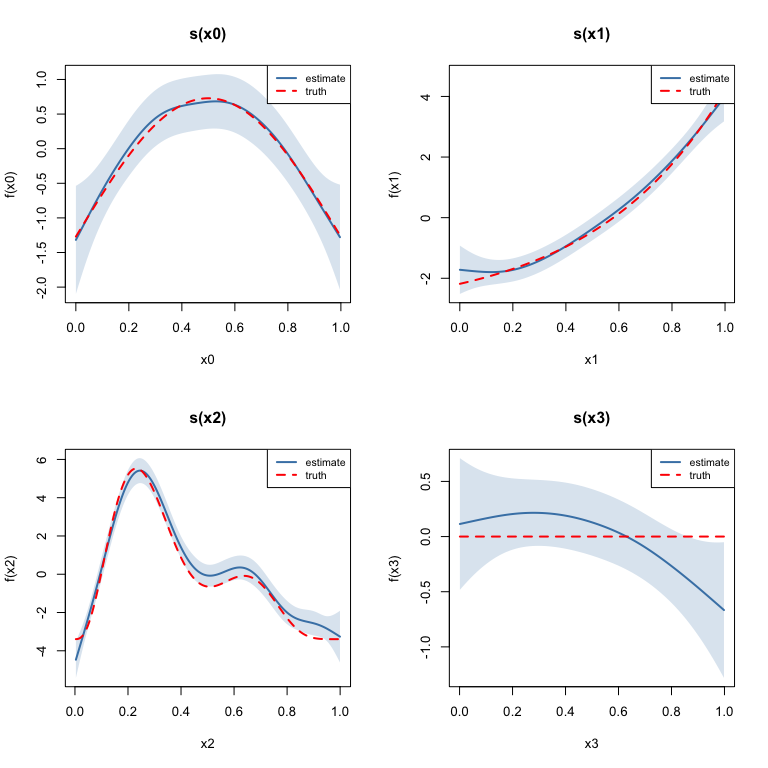

# Multiple Smooth Terms
Simon Frost

- [Overview](#overview)
- [Setup](#setup)
- [Loading Gu–Wahba data](#loading-guwahba-data)
- [Fitting the model](#fitting-the-model)
- [Model overview](#model-overview)
- [Plotting each smooth](#plotting-each-smooth)
- [Concurvity](#concurvity)
- [Comparing models with different
  k](#comparing-models-with-different-k)
- [Summary](#summary)

## Overview

One of the key strengths of GAMs is the ability to include **multiple
smooth terms** additively. The model:

$$y_i = \beta_0 + f_0(x_{0i}) + f_1(x_{1i}) + f_2(x_{2i}) + f_3(x_{3i}) + \varepsilon_i$$

estimates each smooth function $f_j$ simultaneously, with automatic
smoothness selection for each term.

This vignette uses the classic **Gu–Wahba** simulation (equivalent to
`gamSim(eg = 1)` in mgcv) with four smooth functions of varying
complexity.

## Setup

``` r
library(mgcv)
```

    Loading required package: nlme

    This is mgcv 1.9-3. For overview type 'help("mgcv-package")'.

``` r
library(gratia)
library(ggplot2)
```

## Loading Gu–Wahba data

The four test functions are:

- $f_0(x) = 2\sin(\pi x)$ — a smooth sinusoid
- $f_1(x) = e^{2x}$ — an exponential
- $f_2(x) = 0.2 x^{11} (10(1-x))^6 + 10(10x)^3 (1-x)^{10}$ — a bumpy
  function
- $f_3(x) = 0$ — a null smooth (no effect)

``` r
df <- read.csv("../data.csv")
n <- nrow(df)
x0 <- df$x0; x1 <- df$x1; x2 <- df$x2; x3 <- df$x3
y <- df$y

f0 <- function(x) 2 * sin(pi * x)
f1 <- function(x) exp(2 * x)
f2 <- function(x) 0.2 * x^11 * (10 * (1 - x))^6 + 10 * (10 * x)^3 * (1 - x)^10
f3 <- function(x) rep(0, length(x))

# Center the true functions for identifiability
f0_vals <- f0(x0); f0_vals <- f0_vals - mean(f0_vals)
f1_vals <- f1(x1); f1_vals <- f1_vals - mean(f1_vals)
f2_vals <- f2(x2); f2_vals <- f2_vals - mean(f2_vals)
f3_vals <- f3(x3)

head(df)
```

               y        x0         x1        x2        x3
    1 -4.4742515 0.9148060 0.02270001 0.9090475 0.4018804
    2 -2.7697245 0.9370754 0.51323953 0.8999248 0.4322142
    3  6.4688919 0.2861395 0.63072615 0.1923493 0.6636044
    4 -1.7536068 0.8304476 0.41877162 0.5322903 0.1823693
    5  0.1671775 0.6417455 0.87926595 0.5221247 0.8383388
    6  2.3332107 0.5190959 0.10798707 0.1603357 0.9173730

## Fitting the model

``` r
m <- gam(y ~ s(x0) + s(x1) + s(x2) + s(x3), data = df, method = "REML")
summary(m)
```


    Family: gaussian 
    Link function: identity 

    Formula:
    y ~ s(x0) + s(x1) + s(x2) + s(x3)

    Parametric coefficients:
                Estimate Std. Error t value Pr(>|t|)
    (Intercept)  0.02824    0.10505   0.269    0.788

    Approximate significance of smooth terms:
            edf Ref.df      F  p-value    
    s(x0) 3.425  4.244  8.828 8.78e-07 ***
    s(x1) 3.221  4.003 67.501  < 2e-16 ***
    s(x2) 7.905  8.685 67.766  < 2e-16 ***
    s(x3) 1.885  2.359  2.642   0.0636 .  
    ---
    Signif. codes:  0 '***' 0.001 '**' 0.01 '*' 0.05 '.' 0.1 ' ' 1

    R-sq.(adj) =  0.685   Deviance explained = 69.8%
    -REML = 886.93  Scale est. = 4.4144    n = 400

## Model overview

The `gratia::overview()` function summarizes all smooth terms:

``` r
overview(m)
```


    Generalized Additive Model with 4 terms

      term  type      k   edf statistic p.value 
      <chr> <chr> <dbl> <dbl>     <dbl> <chr>   
    1 s(x0) TPRS      9  3.42      8.83 < 0.001 
    2 s(x1) TPRS      9  3.22     67.5  < 0.001 
    3 s(x2) TPRS      9  7.90     67.8  < 0.001 
    4 s(x3) TPRS      9  1.88      2.64 0.063622

Per-smooth EDF:

``` r
cat("Per-smooth EDF:\n")
```

    Per-smooth EDF:

``` r
for (i in seq_along(m$smooth)) {
  cat(sprintf("  %-12s EDF = %.2f\n", m$smooth[[i]]$label, pen.edf(m)[i]))
}
```

      s(x0)        EDF = 3.42
      s(x1)        EDF = 3.22
      s(x2)        EDF = 7.90
      s(x3)        EDF = 1.88

``` r
cat(sprintf("\nTotal model EDF: %.2f\n", sum(m$edf)))
```


    Total model EDF: 17.44

``` r
cat(sprintf("Deviance explained: %.1f%%\n", summary(m)$dev.expl * 100))
```

    Deviance explained: 69.8%

## Plotting each smooth

We plot each smooth estimate alongside the corresponding true function:

``` r
true_fns <- list(f0, f1, f2, f3)
x_vars <- c("x0", "x1", "x2", "x3")
x_data <- list(x0, x1, x2, x3)
f_centered <- list(f0_vals, f1_vals, f2_vals, f3_vals)

par(mfrow = c(2, 2))
for (i in 1:4) {
  se <- smooth_estimates(m, smooth = paste0("s(", x_vars[i], ")"), n = 200)
  x_grid <- se[[x_vars[i]]]

  # True function on grid, centered
  f_grid <- true_fns[[i]](x_grid)
  f_grid <- f_grid - mean(f_grid)

  plot(x_grid, se[[".estimate"]], type = "l", lwd = 2, col = "steelblue",
       ylim = range(c(se[[".estimate"]] - 2 * se[[".se"]], se[[".estimate"]] + 2 * se[[".se"]], f_grid)),
       xlab = x_vars[i], ylab = paste0("f(", x_vars[i], ")"),
       main = paste0("s(", x_vars[i], ")"))
  polygon(c(x_grid, rev(x_grid)),
          c(se[[".estimate"]] - 2 * se[[".se"]], rev(se[[".estimate"]] + 2 * se[[".se"]])),
          col = adjustcolor("steelblue", alpha.f = 0.2), border = NA)
  lines(x_grid, f_grid, lty = 2, lwd = 2, col = "red")
  legend("topright", c("estimate", "truth"), lty = c(1, 2),
         col = c("steelblue", "red"), lwd = 2, cex = 0.8)
}
```

    Warning: The `smooth` argument of `smooth_estimates()` is deprecated as of gratia
    0.8.9.9.
    ℹ Please use the `select` argument instead.



``` r
par(mfrow = c(1, 1))
```

Note that $f_3(x_3) = 0$ (the null smooth), and the model should
estimate it as approximately flat with an EDF close to 0–1.

## Concurvity

Concurvity is the smooth analogue of collinearity — it measures how well
each smooth can be approximated by the other smooth terms. Values close
to 1 indicate potential confounding.

``` r
conc <- concurvity(m, full = TRUE)
print(round(conc, 3))
```

             para s(x0) s(x1) s(x2) s(x3)
    worst       0 0.127 0.130 0.131 0.169
    observed    0 0.042 0.053 0.052 0.065
    estimate    0 0.082 0.060 0.081 0.052

Since our covariates are independent (uniform draws), concurvity should
be low.

Pairwise concurvity:

``` r
conc_pw <- concurvity(m, full = FALSE)
print(lapply(conc_pw, function(x) round(x, 3)))
```

    $worst
          para s(x0) s(x1) s(x2) s(x3)
    para     1 0.000 0.000 0.000 0.000
    s(x0)    0 1.000 0.059 0.086 0.060
    s(x1)    0 0.059 1.000 0.056 0.076
    s(x2)    0 0.086 0.056 1.000 0.084
    s(x3)    0 0.060 0.076 0.084 1.000

    $observed
          para s(x0) s(x1) s(x2) s(x3)
    para     1 0.000 0.000 0.000 0.000
    s(x0)    0 1.000 0.023 0.021 0.010
    s(x1)    0 0.014 1.000 0.014 0.027
    s(x2)    0 0.014 0.012 1.000 0.027
    s(x3)    0 0.014 0.015 0.018 1.000

    $estimate
          para s(x0) s(x1) s(x2) s(x3)
    para     1 0.000 0.000 0.000 0.000
    s(x0)    0 1.000 0.029 0.019 0.006
    s(x1)    0 0.033 1.000 0.023 0.017
    s(x2)    0 0.040 0.011 1.000 0.027
    s(x3)    0 0.011 0.015 0.039 1.000

## Comparing models with different k

Does the basis dimension `k` matter? Let us refit with smaller and
larger `k`:

``` r
for (k_val in c(5, 10, 20, 30)) {
  mk <- gam(y ~ s(x0, k = k_val) + s(x1, k = k_val) +
                s(x2, k = k_val) + s(x3, k = k_val),
            data = df, method = "REML")
  edfs <- round(pen.edf(mk), 2)
  dev <- round(summary(mk)$dev.expl * 100, 1)
  cat(sprintf("k=%d  EDF=[%s]  Dev.Expl=%.1f%%\n",
              k_val, paste(edfs, collapse = ", "), dev))
}
```

    k=5  EDF=[2.98, 3.06, 3.97, 1.47]  Dev.Expl=66.0%
    k=10  EDF=[3.42, 3.22, 7.9, 1.88]  Dev.Expl=69.8%
    k=20  EDF=[3.45, 3.25, 9.99, 1.87]  Dev.Expl=70.2%
    k=30  EDF=[3.46, 3.25, 10.23, 1.87]  Dev.Expl=70.2%

As long as `k` is large enough to capture the true complexity, results
are similar — the penalty takes care of the rest.

## Summary

In this vignette we:

1.  Simulated Gu–Wahba data with four smooth functions of varying
    complexity
2.  Fitted a GAM with four additive smooth terms
3.  Examined per-smooth EDF via `overview()`
4.  Plotted each smooth estimate against the true function
5.  Assessed concurvity between smooth terms
6.  Demonstrated robustness to the choice of `k`

The next vignette covers non-Gaussian response distributions.
