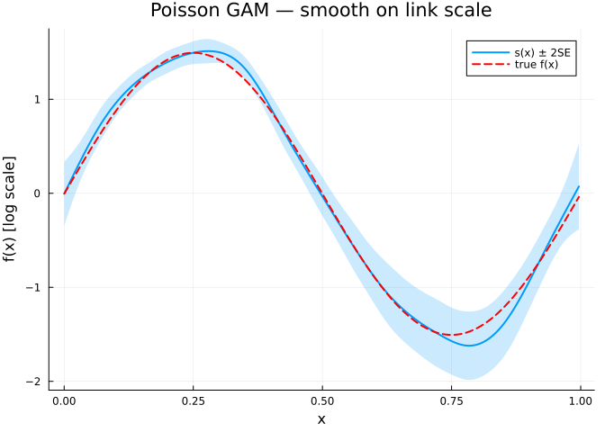
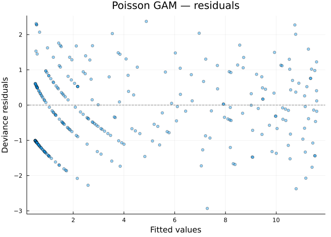
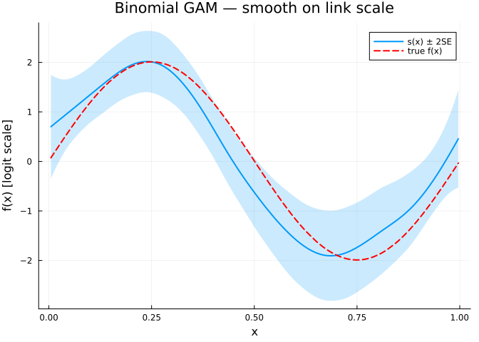
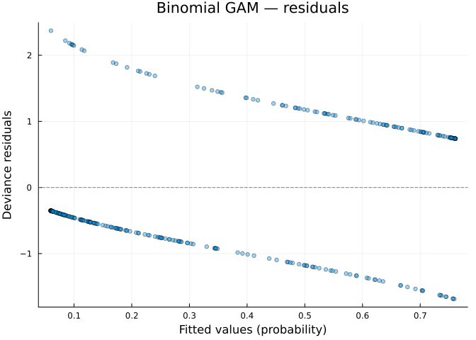
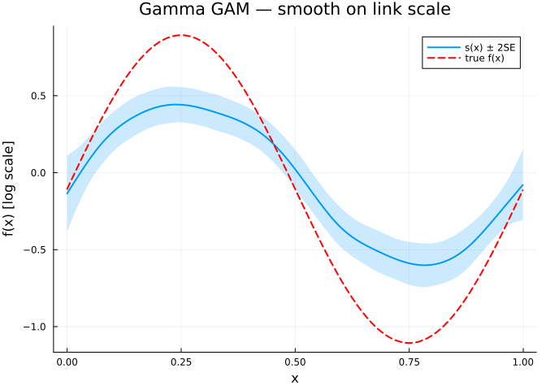
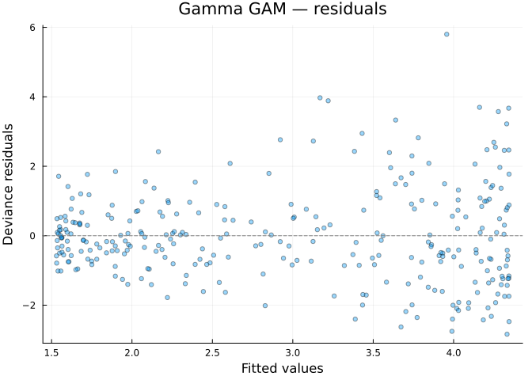
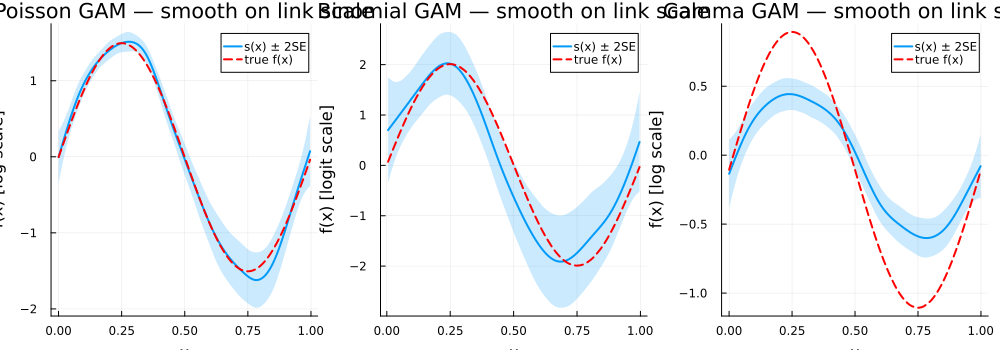

# Non-Gaussian Response Distributions
GAM.jl Contributors

- [Overview](#overview)
- [Setup](#setup)
- [Poisson GAM — count data](#poisson-gam--count-data)
  - [Simulating count data](#simulating-count-data)
  - [Fitting the model](#fitting-the-model)
  - [Smooth estimate](#smooth-estimate)
  - [Deviance residuals](#deviance-residuals)
- [Binomial GAM — binary data](#binomial-gam--binary-data)
  - [Simulating binary data](#simulating-binary-data)
  - [Fitting the model](#fitting-the-model-1)
  - [Smooth estimate](#smooth-estimate-1)
  - [Deviance residuals](#deviance-residuals-1)
- [Gamma GAM — positive continuous
  data](#gamma-gam--positive-continuous-data)
  - [Simulating positive continuous
    data](#simulating-positive-continuous-data)
  - [Fitting the model](#fitting-the-model-2)
  - [Smooth estimate](#smooth-estimate-2)
  - [Deviance residuals](#deviance-residuals-2)
- [Comparison](#comparison)
  - [All smooth estimates together](#all-smooth-estimates-together)
- [Summary](#summary)

## Overview

GAMs are not limited to Gaussian responses. By specifying a **family**
(distribution) and **link function**, we can model count data, binary
outcomes, positive continuous data, and more. The general model is:

$$g(\mu_i) = \beta_0 + f_1(x_{1i}) + \cdots + f_p(x_{pi}), \quad y_i \sim \text{Family}(\mu_i, \phi)$$

This vignette demonstrates three common non-Gaussian families:

| Family | Link | Response type | Example |
|----|----|----|----|
| Poisson | log | Counts | Species counts, event rates |
| Binomial | logit | Binary / proportions | Presence–absence, disease status |
| Gamma | inverse (or log) | Positive continuous | Waiting times, claim sizes |

## Setup

``` julia
using GAM
using CSV
using StatsAPI: residuals, fitted, r2, deviance
using Statistics: mean
using GLM: LogLink, LogitLink

using DataFrames
using Plots
using Distributions
```

## Poisson GAM — count data

### Simulating count data

We simulate counts from a Poisson distribution with a smooth log-rate:

$$y_i \sim \text{Poisson}(\mu_i), \quad \log(\mu_i) = 1 + 1.5 \sin(2\pi x_i)$$

``` julia
df_pois = CSV.read("data_poisson.csv", DataFrame)
x = df_pois.x
n = nrow(df_pois)
η = 1.0 .+ 1.5 .* sin.(2π .* x)
```

    300-element Vector{Float64}:
     1.0022515463804877
     1.013013980830874
     1.014801884538615
     1.0214214724578388
     1.037208399572455
     1.0690982444331225
     1.0742815178198883
     1.165054158814009
     1.1757202903086204
     1.2015521628982468
     ⋮
     0.6508219129798084
     0.69797588899615
     0.7278818802184517
     0.7517667995108033
     0.7954284540183503
     0.8368919812276477
     0.8383703243966152
     0.8953919908689525
     0.9675123075811386

### Fitting the model

``` julia
m_pois = gam(@gam_formula(y ~ s(x, k = 15, bs = :cr)), df_pois;
    family = Poisson(), link = LogLink())
m_pois
```

    Generalized Additive Model

    Formula: y ~ 1

    Family: Poisson
    Link:   LogLink
    Method: REML

    Parametric coefficients:
    ──────────────────────────────────────────────────
                    Coef.  Std. Error      z  Pr(>|z|)
    ──────────────────────────────────────────────────
    (Intercept)  0.939592   0.0468467  20.06    <1e-88
    ──────────────────────────────────────────────────

    Approximate significance of smooth terms:
    ──────────────────────────────────────────────────
    Smooth                    edf   Ref.df
    ──────────────────────────────────────────────────
    s(x,bs=cr)               8.00       14
    ──────────────────────────────────────────────────

    R² (adj) = 0.764   Deviance explained = 76.4%
    n = 300

### Smooth estimate

``` julia
se_pois = smooth_estimates(m_pois; n = 200)
x_grid = se_pois.covariates[:x]

p1 = plot(x_grid, se_pois.estimate;
    ribbon = 2 .* se_pois.se,
    fillalpha = 0.2,
    label = "s(x) ± 2SE",
    linewidth = 2,
    xlabel = "x",
    ylabel = "f(x) [log scale]",
    title = "Poisson GAM — smooth on link scale")
plot!(p1, x, η .- mean(η);
    label = "true f(x)",
    linestyle = :dash,
    linewidth = 2,
    color = :red)
p1
```



### Deviance residuals

``` julia
resid_pois = residuals(m_pois; type = :deviance)

p2 = scatter(fitted(m_pois), resid_pois;
    xlabel = "Fitted values",
    ylabel = "Deviance residuals",
    title = "Poisson GAM — residuals",
    alpha = 0.4,
    markersize = 3,
    label = false)
hline!(p2, [0]; linestyle = :dash, color = :gray, label = false)
p2
```



## Binomial GAM — binary data

### Simulating binary data

We simulate binary outcomes from a logistic model:

$$y_i \sim \text{Bernoulli}(p_i), \quad \text{logit}(p_i) = -0.5 + 2\sin(2\pi x_i)$$

``` julia
df_bin = CSV.read("data_binomial.csv", DataFrame)
x_bin = df_bin.x
η_bin = -0.5 .+ 2.0 .* sin.(2π .* x_bin)
```

    300-element Vector{Float64}:
     -0.4377380740427925
     -0.38854578391368955
     -0.373831674500529
     -0.3621071915006612
     -0.3019464421915505
     -0.268943862845824
     -0.2102686483145333
     -0.15644424465058399
     -0.15584096852217055
     -0.14604202493880453
      ⋮
     -0.7494849221391106
     -0.7443595705245496
     -0.7350585389053363
     -0.7139247353867896
     -0.7050111267006494
     -0.5752349322611175
     -0.5557362670383619
     -0.5496105296196276
     -0.5427940453659735

### Fitting the model

``` julia
m_bin = gam(@gam_formula(y ~ s(x, k = 15, bs = :cr)), df_bin;
    family = Binomial(), link = LogitLink())
m_bin
```

    Generalized Additive Model

    Formula: y ~ 1

    Family: Binomial
    Link:   LogitLink
    Method: REML

    Parametric coefficients:
    ───────────────────────────────────────────────────
                     Coef.  Std. Error      z  Pr(>|z|)
    ───────────────────────────────────────────────────
    (Intercept)  -0.858846    0.159901  -5.37    <1e-07
    ───────────────────────────────────────────────────

    Approximate significance of smooth terms:
    ──────────────────────────────────────────────────
    Smooth                    edf   Ref.df
    ──────────────────────────────────────────────────
    s(x,bs=cr)               5.03       14
    ──────────────────────────────────────────────────

    R² (adj) = 0.295   Deviance explained = 25.5%
    n = 300

### Smooth estimate

``` julia
se_bin = smooth_estimates(m_bin; n = 200)
x_grid_bin = se_bin.covariates[:x]

p3 = plot(x_grid_bin, se_bin.estimate;
    ribbon = 2 .* se_bin.se,
    fillalpha = 0.2,
    label = "s(x) ± 2SE",
    linewidth = 2,
    xlabel = "x",
    ylabel = "f(x) [logit scale]",
    title = "Binomial GAM — smooth on link scale")
plot!(p3, x_bin, η_bin .- mean(η_bin);
    label = "true f(x)",
    linestyle = :dash,
    linewidth = 2,
    color = :red)
p3
```



### Deviance residuals

``` julia
resid_bin = residuals(m_bin; type = :deviance)

p4 = scatter(fitted(m_bin), resid_bin;
    xlabel = "Fitted values (probability)",
    ylabel = "Deviance residuals",
    title = "Binomial GAM — residuals",
    alpha = 0.4,
    markersize = 3,
    label = false)
hline!(p4, [0]; linestyle = :dash, color = :gray, label = false)
p4
```



## Gamma GAM — positive continuous data

### Simulating positive continuous data

We simulate positive continuous data from a Gamma distribution with a
smooth log-mean:

$$y_i \sim \text{Gamma}(\text{shape}, \text{scale}_i), \quad \log(\mu_i) = 1 + \sin(2\pi x_i)$$

``` julia
df_gam = CSV.read("data_gamma.csv", DataFrame)
x_gam = df_gam.x
η_gam = 1.0 .+ sin.(2π .* x_gam)
```

    300-element Vector{Float64}:
     1.000850704315502
     1.0039634355393983
     1.0264783803611617
     1.0383131142818598
     1.0751167938723143
     1.0766376001001923
     1.08050888736706
     1.157843246765896
     1.20089524015795
     1.2452611220182526
     ⋮
     0.8188335469516427
     0.819999062363841
     0.8356988327736081
     0.8772715675927307
     0.8829807993731171
     0.9580649708004427
     0.9693231877198806
     0.9749523420975444
     0.9923732280689034

### Fitting the model

We use `Gamma()` with `LogLink()` (log link is more commonly used in
practice than the canonical inverse link):

``` julia
m_gam = gam(@gam_formula(y ~ s(x, k = 15, bs = :cr)), df_gam;
    family = Gamma(), link = LogLink())
m_gam
```

    Generalized Additive Model

    Formula: y ~ 1

    Family: Gamma
    Link:   LogLink
    Method: REML

    Parametric coefficients:
    ─────────────────────────────────────────────────
                   Coef.  Std. Error      t  Pr(>|t|)
    ─────────────────────────────────────────────────
    (Intercept)  1.02611    0.024569  41.76    <1e-99
    ─────────────────────────────────────────────────

    Approximate significance of smooth terms:
    ──────────────────────────────────────────────────
    Smooth                    edf   Ref.df
    ──────────────────────────────────────────────────
    s(x,bs=cr)               6.23       14
    ──────────────────────────────────────────────────

    R² (adj) = 0.362   Deviance explained = 41.6%
    Scale est. = 0.1811   n = 300

### Smooth estimate

``` julia
se_gam = smooth_estimates(m_gam; n = 200)
x_grid_gam = se_gam.covariates[:x]

p5 = plot(x_grid_gam, se_gam.estimate;
    ribbon = 2 .* se_gam.se,
    fillalpha = 0.2,
    label = "s(x) ± 2SE",
    linewidth = 2,
    xlabel = "x",
    ylabel = "f(x) [log scale]",
    title = "Gamma GAM — smooth on link scale")
plot!(p5, x_gam, η_gam .- mean(η_gam);
    label = "true f(x)",
    linestyle = :dash,
    linewidth = 2,
    color = :red)
p5
```



### Deviance residuals

``` julia
resid_gam = residuals(m_gam; type = :deviance)

p6 = scatter(fitted(m_gam), resid_gam;
    xlabel = "Fitted values",
    ylabel = "Deviance residuals",
    title = "Gamma GAM — residuals",
    alpha = 0.4,
    markersize = 3,
    label = false)
hline!(p6, [0]; linestyle = :dash, color = :gray, label = false)
p6
```



## Comparison

``` julia
println("Family        EDF      Dev.Expl(%)   Scale")
println("─" ^ 55)
for (name, m) in [("Poisson", m_pois), ("Binomial", m_bin), ("Gamma", m_gam)]
    e = round(edf(m)[1]; digits = 2)
    de = round(r2(m) * 100; digits = 1)
    sc = round(m.scale; digits = 4)
    println("$(rpad(name, 14))$(lpad(string(e), 6))  $(lpad(string(de), 12))  $(lpad(string(sc), 8))")
end
```

    Family        EDF      Dev.Expl(%)   Scale
    ───────────────────────────────────────────────────────
    Poisson          8.0          77.1       1.0
    Binomial        5.03          30.7       1.0
    Gamma           6.23          37.5    0.1811

### All smooth estimates together

``` julia
plot(p1, p3, p5; layout = (1, 3), size = (1000, 350))
```



## Summary

In this vignette we:

1.  Simulated count data and fitted a **Poisson GAM** with a log link
2.  Simulated binary data and fitted a **Binomial GAM** with a logit
    link
3.  Simulated positive continuous data and fitted a **Gamma GAM** with a
    log link
4.  Examined smooth estimates and deviance residuals for each family
5.  Compared EDF and deviance explained across families

Each family uses a different link function to map the linear predictor
to the mean of the response distribution, but the smooth estimation
machinery is the same.
