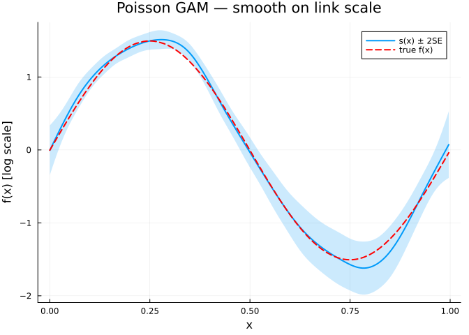
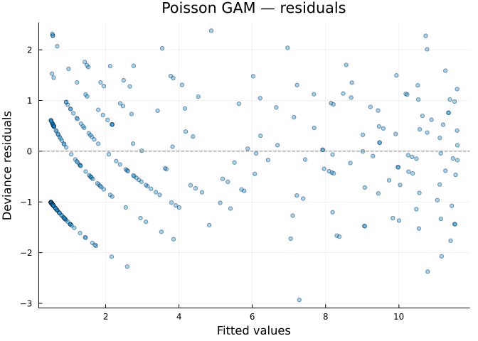
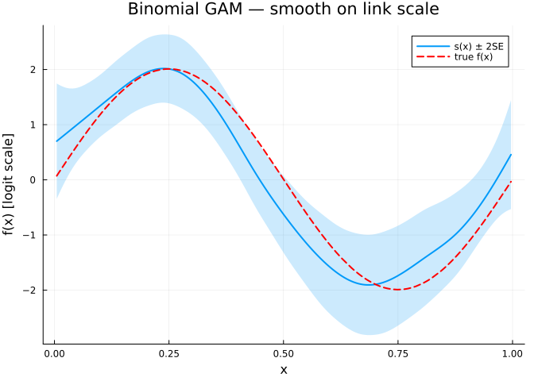
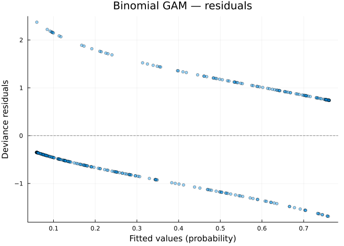
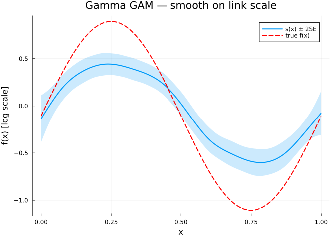
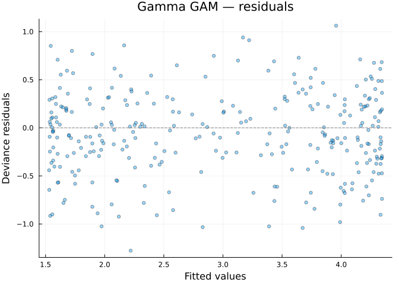
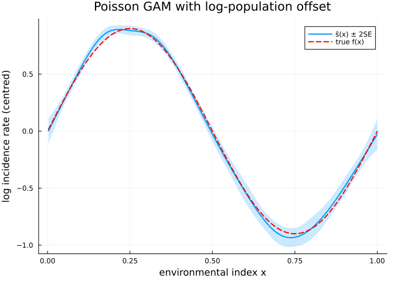
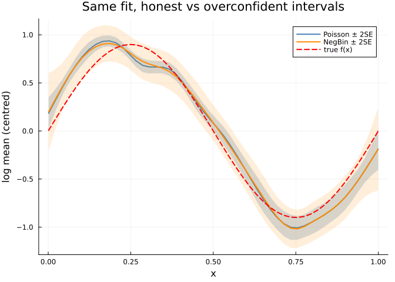
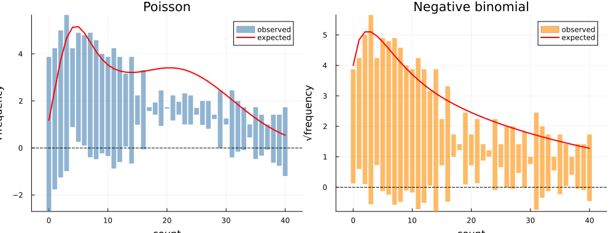
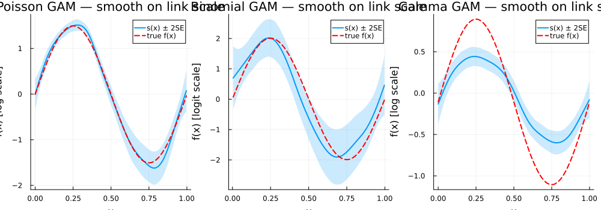

# Non-Gaussian Response Distributions
Simon Frost

- [Overview](#overview)
- [Setup](#setup)
- [Poisson GAM — count data](#poisson-gam--count-data)
  - [Simulating count data](#simulating-count-data)
  - [Fitting the model](#fitting-the-model)
  - [Smooth estimate](#smooth-estimate)
  - [Deviance residuals](#deviance-residuals)
- [Binomial GAM — binary data](#binomial-gam--binary-data)
  - [Simulating binary data](#simulating-binary-data)
  - [Fitting the model](#fitting-the-model-1)
  - [Smooth estimate](#smooth-estimate-1)
  - [Deviance residuals](#deviance-residuals-1)
- [Gamma GAM — positive continuous
  data](#gamma-gam--positive-continuous-data)
  - [Simulating positive continuous
    data](#simulating-positive-continuous-data)
  - [Fitting the model](#fitting-the-model-2)
  - [Smooth estimate](#smooth-estimate-2)
  - [Deviance residuals](#deviance-residuals-2)
- [Disease incidence — offsets and
  exposure](#disease-incidence--offsets-and-exposure)
  - [Simulated district-week counts](#simulated-district-week-counts)
  - [Fitting with an offset](#fitting-with-an-offset)
  - [Why not just model the rate
    directly?](#why-not-just-model-the-rate-directly)
  - [Recovering the rate curve](#recovering-the-rate-curve)
  - [Prediction requires the offset
    again](#prediction-requires-the-offset-again)
- [Overdispersion in count data](#overdispersion-in-count-data)
  - [Detecting overdispersion](#detecting-overdispersion)
  - [Three principled responses](#three-principled-responses)
  - [What overdispersion costs you](#what-overdispersion-costs-you)
- [Rootograms — do the predicted counts
  match?](#rootograms--do-the-predicted-counts-match)
- [Comparison](#comparison)
  - [All smooth estimates together](#all-smooth-estimates-together)
- [Summary](#summary)
- [References](#references)

## Overview

GAMs are not limited to Gaussian responses. By specifying a **family**
(distribution) and **link function**, we can model count data, binary
outcomes, positive continuous data, and more. The general model is:

$$g(\mu_i) = \beta_0 + f_1(x_{1i}) + \cdots + f_p(x_{pi}), \quad y_i \sim \text{Family}(\mu_i, \phi)$$

This vignette demonstrates three common non-Gaussian families:

| Family | Link | Response type | Example |
|----|----|----|----|
| Poisson | log | Counts | Species counts, event rates |
| Binomial | logit | Binary / proportions | Presence–absence, disease status |
| Gamma | inverse (or log) | Positive continuous | Waiting times, claim sizes |

The second half of the vignette turns to a setting where the choice of
family does real work: **disease incidence counts**. There we add an
*offset* to model rates rather than raw counts, and then deal with
**overdispersion** — count data more variable than the Poisson
distribution permits — using three further families:

| Family               | Variance             | Estimates              |
|----------------------|----------------------|------------------------|
| `NegBinFamily`       | $\mu + \mu^2/\theta$ | $\theta$               |
| `QuasiPoissonFamily` | $\phi\mu$            | $\phi$                 |
| `TweedieFamily`      | $\phi\mu^p$          | $\phi$, optionally $p$ |

## Setup

``` julia
using GAM
using CSV
using StatsAPI: residuals, fitted, r2, deviance, coef, coeftable, aic,
    predict, dof_residual
using Statistics: mean, var
using GLM: LogLink, LogitLink

using DataFrames
using Plots
using Distributions
```

## Poisson GAM — count data

### Simulating count data

We simulate counts from a Poisson distribution with a smooth log-rate:

$$y_i \sim \text{Poisson}(\mu_i), \quad \log(\mu_i) = 1 + 1.5 \sin(2\pi x_i)$$

``` julia
df_pois = CSV.read("data_poisson.csv", DataFrame)
x = df_pois.x
n = nrow(df_pois)
η = 1.0 .+ 1.5 .* sin.(2π .* x)
ord = sortperm(x)
```

    300-element Vector{Int64}:
       1
       2
       3
       4
       5
       6
       7
       8
       9
      10
       ⋮
     292
     293
     294
     295
     296
     297
     298
     299
     300

### Fitting the model

``` julia
m_pois = gam(@formula(y ~ s(x, k = 15, bs = :cr)), df_pois;
    family = Poisson(), link = LogLink())
m_pois
```

    Generalized Additive Model

    Formula: y ~ 1 + s(x,bs=cr)

    Family: Poisson
    Link:   LogLink
    Method: REML

    Parametric coefficients:
    ──────────────────────────────────────────────────
                    Coef.  Std. Error      z  Pr(>|z|)
    ──────────────────────────────────────────────────
    (Intercept)  0.939669   0.0468399  20.06    <1e-88
    ──────────────────────────────────────────────────

    Approximate significance of smooth terms:
    ──────────────────────────────────────────────────────────────────
    Smooth                    edf   Ref.df     Chi.sq    p-value     
    ──────────────────────────────────────────────────────────────────
    s(x,bs=cr)               7.98     9.60    667.413 7.395e-139 *** 
    ──────────────────────────────────────────────────────────────────
    Signif. codes:  0 '***' 0.001 '**' 0.01 '*' 0.05 '.' 0.1 ' ' 1

    R² (adj) = 0.764   Deviance explained = 76.4%
    -REML = 566.9   n = 300

### Smooth estimate

``` julia
se_pois = smooth_estimates(m_pois; n = 200)
x_grid = se_pois.covariates[:x]

p1 = plot(x_grid, se_pois.estimate;
    ribbon = 2 .* se_pois.se,
    fillalpha = 0.2,
    label = "s(x) ± 2SE",
    linewidth = 2,
    xlabel = "x",
    ylabel = "f(x) [log scale]",
    title = "Poisson GAM — smooth on link scale")
plot!(p1, x[ord], (η .- mean(η))[ord];
    label = "true f(x)",
    linestyle = :dash,
    linewidth = 2,
    color = :red)
p1
```



### Deviance residuals

``` julia
resid_pois = residuals(m_pois; type = :deviance)

p2 = scatter(fitted(m_pois), resid_pois;
    xlabel = "Fitted values",
    ylabel = "Deviance residuals",
    title = "Poisson GAM — residuals",
    alpha = 0.4,
    markersize = 3,
    label = false)
hline!(p2, [0]; linestyle = :dash, color = :gray, label = false)
p2
```



## Binomial GAM — binary data

### Simulating binary data

We simulate binary outcomes from a logistic model:

$$y_i \sim \text{Bernoulli}(p_i), \quad \text{logit}(p_i) = -0.5 + 2\sin(2\pi x_i)$$

``` julia
df_bin = CSV.read("data_binomial.csv", DataFrame)
x_bin = df_bin.x
η_bin = -0.5 .+ 2.0 .* sin.(2π .* x_bin)
ord_bin = sortperm(x_bin)
```

    300-element Vector{Int64}:
       1
       2
       3
       4
       5
       6
       7
       8
       9
      10
       ⋮
     292
     293
     294
     295
     296
     297
     298
     299
     300

### Fitting the model

``` julia
m_bin = gam(@formula(y ~ s(x, k = 15, bs = :cr)), df_bin;
    family = Binomial(), link = LogitLink())
m_bin
```

    Generalized Additive Model

    Formula: y ~ 1 + s(x,bs=cr)

    Family: Binomial
    Link:   LogitLink
    Method: REML

    Parametric coefficients:
    ───────────────────────────────────────────────────
                     Coef.  Std. Error      z  Pr(>|z|)
    ───────────────────────────────────────────────────
    (Intercept)  -0.857991    0.159647  -5.37    <1e-07
    ───────────────────────────────────────────────────

    Approximate significance of smooth terms:
    ──────────────────────────────────────────────────────────────────
    Smooth                    edf   Ref.df     Chi.sq    p-value     
    ──────────────────────────────────────────────────────────────────
    s(x,bs=cr)               4.98     6.15     68.652  1.955e-13 *** 
    ──────────────────────────────────────────────────────────────────
    Signif. codes:  0 '***' 0.001 '**' 0.01 '*' 0.05 '.' 0.1 ' ' 1

    R² (adj) = 0.295   Deviance explained = 25.5%
    -REML = 153   n = 300

### Smooth estimate

``` julia
se_bin = smooth_estimates(m_bin; n = 200)
x_grid_bin = se_bin.covariates[:x]

p3 = plot(x_grid_bin, se_bin.estimate;
    ribbon = 2 .* se_bin.se,
    fillalpha = 0.2,
    label = "s(x) ± 2SE",
    linewidth = 2,
    xlabel = "x",
    ylabel = "f(x) [logit scale]",
    title = "Binomial GAM — smooth on link scale")
plot!(p3, x_bin[ord_bin], (η_bin .- mean(η_bin))[ord_bin];
    label = "true f(x)",
    linestyle = :dash,
    linewidth = 2,
    color = :red)
p3
```



### Deviance residuals

``` julia
resid_bin = residuals(m_bin; type = :deviance)

p4 = scatter(fitted(m_bin), resid_bin;
    xlabel = "Fitted values (probability)",
    ylabel = "Deviance residuals",
    title = "Binomial GAM — residuals",
    alpha = 0.4,
    markersize = 3,
    label = false)
hline!(p4, [0]; linestyle = :dash, color = :gray, label = false)
p4
```



## Gamma GAM — positive continuous data

### Simulating positive continuous data

We simulate positive continuous data from a Gamma distribution with a
smooth log-mean:

$$y_i \sim \text{Gamma}(\text{shape}, \text{scale}_i), \quad \log(\mu_i) = 1 + \sin(2\pi x_i)$$

``` julia
df_gam = CSV.read("data_gamma.csv", DataFrame)
x_gam = df_gam.x
η_gam = 1.0 .+ sin.(2π .* x_gam)
ord_gam = sortperm(x_gam)
```

    300-element Vector{Int64}:
       1
       2
       3
       4
       5
       6
       7
       8
       9
      10
       ⋮
     292
     293
     294
     295
     296
     297
     298
     299
     300

### Fitting the model

We use `Gamma()` with `LogLink()` (log link is more commonly used in
practice than the canonical inverse link):

``` julia
m_gam = gam(@formula(y ~ s(x, k = 15, bs = :cr)), df_gam;
    family = Gamma(), link = LogLink())
m_gam
```

    Generalized Additive Model

    Formula: y ~ 1 + s(x,bs=cr)

    Family: Gamma
    Link:   LogLink
    Method: REML

    Parametric coefficients:
    ─────────────────────────────────────────────────
                   Coef.  Std. Error      t  Pr(>|t|)
    ─────────────────────────────────────────────────
    (Intercept)  1.02615   0.0245722  41.76    <1e-99
    ─────────────────────────────────────────────────

    Approximate significance of smooth terms:
    ──────────────────────────────────────────────────────────────────
    Smooth                    edf   Ref.df          F    p-value     
    ──────────────────────────────────────────────────────────────────
    s(x,bs=cr)               6.18     7.59     32.876  1.407e-33 *** 
    ──────────────────────────────────────────────────────────────────
    Signif. codes:  0 '***' 0.001 '**' 0.01 '*' 0.05 '.' 0.1 ' ' 1

    R² (adj) = 0.362   Deviance explained = 41.5%
    -REML = 474   Scale est. = 0.1811   n = 300

### Smooth estimate

``` julia
se_gam = smooth_estimates(m_gam; n = 200)
x_grid_gam = se_gam.covariates[:x]

p5 = plot(x_grid_gam, se_gam.estimate;
    ribbon = 2 .* se_gam.se,
    fillalpha = 0.2,
    label = "s(x) ± 2SE",
    linewidth = 2,
    xlabel = "x",
    ylabel = "f(x) [log scale]",
    title = "Gamma GAM — smooth on link scale")
plot!(p5, x_gam[ord_gam], (η_gam .- mean(η_gam))[ord_gam];
    label = "true f(x)",
    linestyle = :dash,
    linewidth = 2,
    color = :red)
p5
```



### Deviance residuals

``` julia
resid_gam = residuals(m_gam; type = :deviance)

p6 = scatter(fitted(m_gam), resid_gam;
    xlabel = "Fitted values",
    ylabel = "Deviance residuals",
    title = "Gamma GAM — residuals",
    alpha = 0.4,
    markersize = 3,
    label = false)
hline!(p6, [0]; linestyle = :dash, color = :gray, label = false)
p6
```



## Disease incidence — offsets and exposure

The Poisson model above treats every observation as equally “exposed”:
each row contributes one count drawn from a rate that depends only on
`x`. Epidemiological count data rarely look like that. A district with
40,000 residents will record more cases than one with 1,500 at the
*same* underlying risk, simply because more people are at risk. What we
want to model is the **rate**, not the raw count.

The standard device is an **offset**: a term added to the linear
predictor with a known coefficient fixed at 1. Writing $E_i$ for the
population at risk,

$$y_i \sim \text{Poisson}(\mu_i), \quad
\log(\mu_i) = \underbrace{\log(E_i)}_{\text{offset}} + \beta_0 + f(x_i)$$

Rearranging shows what the smooth now means:

$$\log\!\left(\frac{\mu_i}{E_i}\right) = \beta_0 + f(x_i)$$

so $\beta_0 + f(x)$ is the log **incidence rate**, and the count scale
is carried entirely by the offset.

### Simulated district-week counts

We simulate 400 district-weeks. Populations are lognormal, and the
log-rate varies smoothly with an environmental index $x$:

$$\log(\text{pop}_i) \sim N(9,\, 0.7^2), \qquad
\log(\mu_i) = \log(\text{pop}_i) - 6.0 + 0.9\sin(2\pi x_i)$$

The baseline rate $e^{-6} \approx 2.5$ cases per 1,000 is modulated by
$e^{\pm 0.9}$, so the rate at the seasonal peak is $e^{1.8} \approx 6$
times the rate at the trough.

``` julia
df_inc = CSV.read("data_incidence.csv", DataFrame)
first(df_inc, 4)
```

<div><div style = "float: left;"><span>4×3 DataFrame</span></div><div style = "clear: both;"></div></div><div class = "data-frame" style = "overflow-x: scroll;">

| Row |        x |     pop |       y |
|----:|---------:|--------:|--------:|
|     |  Float64 | Float64 | Float64 |
|   1 | 0.771154 |  6213.0 |     6.0 |
|   2 | 0.489192 | 11983.0 |    36.0 |
|   3 | 0.506597 |  5689.0 |    14.0 |
|   4 | 0.721246 |  5769.0 |     6.0 |

</div>

``` julia
extrema(df_inc.pop), extrema(df_inc.y)
```

    ((1283.0, 46255.0), (1.0, 198.0))

Populations span more than an order of magnitude, so the raw counts are
dominated by population size rather than by risk.

### Fitting with an offset

The offset is a **keyword argument**, not a formula term (see the
migration vignette — mgcv’s in-formula `offset(log(E))` has no
equivalent here):

``` julia
m_inc = gam(@formula(y ~ s(x, k = 12, bs = :cr)), df_inc;
    family = Poisson(), link = LogLink(),
    offset = log.(df_inc.pop))
m_inc
```

    Generalized Additive Model

    Formula: y ~ 1 + s(x,bs=cr)

    Family: Poisson
    Link:   LogLink
    Method: REML

    Parametric coefficients:
    ────────────────────────────────────────────────────
                    Coef.  Std. Error        z  Pr(>|z|)
    ────────────────────────────────────────────────────
    (Intercept)  -5.95213   0.0105925  -561.92    <1e-99
    ────────────────────────────────────────────────────

    Approximate significance of smooth terms:
    ──────────────────────────────────────────────────────────────────
    Smooth                    edf   Ref.df     Chi.sq    p-value     
    ──────────────────────────────────────────────────────────────────
    s(x,bs=cr)               9.11    10.24   3815.810          0 *** 
    ──────────────────────────────────────────────────────────────────
    Signif. codes:  0 '***' 0.001 '**' 0.01 '*' 0.05 '.' 0.1 ' ' 1

    R² (adj) = 0.974   Deviance explained = 92.4%
    -REML = 1188   n = 400

The intercept estimates the mean log-rate:

``` julia
println("intercept = ", round(coef(m_inc)[1], digits = 4), "   (simulated: -6.0)")
```

    intercept = -5.9521   (simulated: -6.0)

and the Pearson dispersion statistic, $X^2 / (n - \text{edf})$, is close
to 1 as it should be when a Poisson model is correctly specified:

``` julia
disp_inc = sum(residuals(m_inc; type = :pearson) .^ 2) / dof_residual(m_inc)
println("Pearson dispersion = ", round(disp_inc, digits = 3))
```

    Pearson dispersion = 0.949

### Why not just model the rate directly?

Two shortcuts suggest themselves, and both are worse than the offset.

**Shortcut 1: use $\log(\text{pop})$ as an ordinary covariate.** This
estimates the coefficient rather than fixing it at 1:

``` julia
df_inc.log_pop = log.(df_inc.pop)
m_cov = gam(@formula(y ~ log_pop + s(x, k = 12, bs = :cr)), df_inc;
    family = Poisson(), link = LogLink())

b_lp = coef(m_cov)[2]
se_lp = coeftable(m_cov).cols[2][2]
println("log(pop) coefficient = ", round(b_lp, digits = 4),
        "  (95% CI ", round(b_lp - 1.96se_lp, digits = 4), ", ",
        round(b_lp + 1.96se_lp, digits = 4), ")")
```

    log(pop) coefficient = 0.9946  (95% CI 0.9688, 1.0205)

Here the estimate is 0.995 with a confidence interval comfortably
covering 1, so the data are perfectly consistent with proportionality —
which is reassuring, but is not the point. The offset model *imposes*
the proportionality we know to hold by construction, spends no degree of
freedom estimating it, and yields an intercept and smooth that are
directly interpretable as a log-rate. The covariate model spends a
parameter re-learning a known constant, and if that estimate had drifted
from 1 the smooth would silently absorb the difference.

**Shortcut 2: model $y/\text{pop}$ as a Gaussian response.** This throws
away the count nature of the data entirely:

``` julia
df_inc.rate = df_inc.y ./ df_inc.pop
m_rate = gam(@formula(rate ~ s(x, k = 12, bs = :cr)), df_inc)
println("Gaussian-on-rate edf = ", round(sum(edf(m_rate)), digits = 3))
```

    Gaussian-on-rate edf = 9.386

The fit runs, but the variance model is wrong in a way that matters: a
rate computed from 1,500 residents is far noisier than one from 40,000,
and a Gaussian model with constant variance gives them equal weight.
Poisson-with-offset gets this right automatically, because the variance
of a count is its mean, which scales with exposure.

### Recovering the rate curve

``` julia
se_inc = smooth_estimates(m_inc; n = 200)
xg = se_inc.covariates[:x]
truth_inc = 0.9 .* sin.(2π .* xg)

p_inc = plot(xg, se_inc.estimate .- mean(se_inc.estimate);
    ribbon = 2 .* se_inc.se, fillalpha = 0.2,
    label = "ŝ(x) ± 2SE", linewidth = 2,
    xlabel = "environmental index x", ylabel = "log incidence rate (centred)",
    title = "Poisson GAM with log-population offset")
plot!(p_inc, xg, truth_inc .- mean(truth_inc);
    label = "true f(x)", linestyle = :dash, linewidth = 2, color = :red)
p_inc
```



### Prediction requires the offset again

An offset is part of the model, so predictions on new data need one.
GAM.jl takes it as a keyword to `predict`, exactly as mgcv requires
new-data offsets:

``` julia
nd = DataFrame(x = [0.25, 0.75])
pred_10k = predict(m_inc, nd; type = :response, offset = fill(log(10_000.0), 2))

println("expected weekly cases in a district of 10,000:")
println("  peak season  (x = 0.25): ", round(pred_10k[1], digits = 1))
println("  trough       (x = 0.75): ", round(pred_10k[2], digits = 1))
println("  ratio = ", round(pred_10k[1] / pred_10k[2], digits = 2),
        "   (simulated: ", round(exp(1.8), digits = 2), ")")
```

    expected weekly cases in a district of 10,000:
      peak season  (x = 0.25): 59.5
      trough       (x = 0.75): 9.7
      ratio = 6.13   (simulated: 6.05)

> [!WARNING]
>
> If you omit `offset=` at prediction time it is treated as zero — that
> is, a population of $e^0 = 1$ — and the predictions come back on a
> meaningless scale rather than raising an error. Always pass the
> new-data offset.

## Overdispersion in count data

Real count data are usually more variable than the Poisson distribution
allows. Poisson forces $\text{Var}(y) = \mu$; unmodelled heterogeneity,
clustering of cases within households, or a missing covariate all
inflate the variance beyond that. The consequence is not mainly bias in
$\hat{f}$ — it is badly understated uncertainty.

We simulate weekly counts at a single surveillance site (constant
population, so no offset is needed) with genuine extra-Poisson
variation:

$$y_i \sim \text{NegBin}(\mu_i, \theta), \quad
\log(\mu_i) = 2.5 + 0.9\sin(2\pi x_i), \quad \theta = 2,$$

for which $\text{Var}(y) = \mu + \mu^2/\theta$.

``` julia
df_od = CSV.read("data_incidence_od.csv", DataFrame)
println("mean = ", round(mean(df_od.y), digits = 2),
        "   variance = ", round(var(df_od.y), digits = 1),
        "   zeros = ", count(==(0), df_od.y))
```

    mean = 13.8   variance = 235.3   zeros = 15

### Detecting overdispersion

Fit the Poisson model and look at the dispersion statistic:

``` julia
f_od = @formula(y ~ s(x, k = 12, bs = :cr))
m_od_pois = gam(f_od, df_od; family = Poisson(), link = LogLink())

disp_od = sum(residuals(m_od_pois; type = :pearson) .^ 2) / dof_residual(m_od_pois)
println("Pearson dispersion = ", round(disp_od, digits = 2))
```

    Pearson dispersion = 8.66

A value near 1 is consistent with Poisson variation; 8.7 is not.
(Compare the 0.95 obtained for the correctly-specified offset model
above — that contrast is what the statistic is for.)

### Three principled responses

``` julia
m_od_nb = gam(f_od, df_od; family = NegBinFamily(), link = LogLink())
println("NegBin θ̂ = ", round(m_od_nb.family.theta, digits = 3), "   (simulated: 2.0)")
```

    NegBin θ̂ = 1.992   (simulated: 2.0)

``` julia
m_od_qp = gam(f_od, df_od; family = QuasiPoissonFamily(), link = LogLink())
println("quasi-Poisson scale = ", round(m_od_qp.scale, digits = 3))
```

    quasi-Poisson scale = 8.613

``` julia
m_od_tw = gam(f_od, df_od;
    family = TweedieFamily(; p = 1.5, estimate_p = true), link = LogLink())
println("Tweedie p̂ = ", round(m_od_tw.family.p, digits = 3),
        "   scale = ", round(m_od_tw.scale, digits = 3))
```

    Tweedie p̂ = 1.544   scale = 1.945

The negative binomial recovers $\theta$ essentially exactly, and the
quasi-Poisson dispersion lands on the same value as the Pearson
statistic — as it must, since that is how it is estimated.

| Family | Variance | Estimates | Use when |
|----|----|----|----|
| `NegBinFamily()` | $\mu + \mu^2/\theta$ | $\theta$ by profile likelihood | Overdispersion grows faster than $\mu$; you want a true likelihood (AIC, LRT) |
| `QuasiPoissonFamily()` | $\phi\mu$ | $\phi$ from Pearson residuals | Variance is proportional to the mean; you only need corrected standard errors |
| `TweedieFamily()` | $\phi\mu^p$, $1<p<2$ | $\phi$, optionally $p$ | Semicontinuous data with a point mass at zero (biomass, rainfall, cost); usable for counts, but it treats them as continuous |

Because quasi-likelihood is not a likelihood, quasi-Poisson has no AIC:

``` julia
println("Poisson AIC = ", round(aic(m_od_pois), digits = 1))
println("NegBin  AIC = ", round(aic(m_od_nb), digits = 1))
println("quasi-Poisson AIC = ", aic(m_od_qp), "  (undefined — no likelihood)")
```

    Poisson AIC = 4729.5
    NegBin  AIC = 2716.3
    quasi-Poisson AIC = NaN  (undefined — no likelihood)

### What overdispersion costs you

The reason this matters is uncertainty, not the point estimate:

``` julia
se_p  = smooth_estimates(m_od_pois; n = 50)
se_nb = smooth_estimates(m_od_nb;   n = 50)
se_qp = smooth_estimates(m_od_qp;   n = 50)

println("mean SE of ŝ(x):")
println("  Poisson       ", round(mean(se_p.se),  digits = 4))
println("  NegBin        ", round(mean(se_nb.se), digits = 4),
        "   (", round(mean(se_nb.se) / mean(se_p.se), digits = 2), "× Poisson)")
println("  quasi-Poisson ", round(mean(se_qp.se), digits = 4),
        "   (", round(mean(se_qp.se) / mean(se_p.se), digits = 2), "× Poisson)")
```

    mean SE of ŝ(x):
      Poisson       0.0501
      NegBin        0.1083   (2.16× Poisson)
      quasi-Poisson 0.131   (2.62× Poisson)

The Poisson model understates the standard error of the smooth by a
factor of more than two. Confidence intervals built from it are far too
narrow, and any test of “is this seasonal signal real?” is
correspondingly overconfident.

``` julia
p_od = plot(se_p.covariates[:x], se_p.estimate .- mean(se_p.estimate);
    ribbon = 2 .* se_p.se, fillalpha = 0.25, color = :steelblue,
    label = "Poisson ± 2SE", linewidth = 2,
    xlabel = "x", ylabel = "log mean (centred)",
    title = "Same fit, honest vs overconfident intervals")
plot!(p_od, se_nb.covariates[:x], se_nb.estimate .- mean(se_nb.estimate);
    ribbon = 2 .* se_nb.se, fillalpha = 0.15, color = :darkorange,
    label = "NegBin ± 2SE", linewidth = 2)
plot!(p_od, se_p.covariates[:x], 0.9 .* sin.(2π .* se_p.covariates[:x]);
    label = "true f(x)", linestyle = :dash, color = :red, linewidth = 2)
p_od
```



## Rootograms — do the predicted counts match?

Dispersion statistics summarise the misfit in a single number. A
**rootogram** (Kleiber & Zeileis, 2016) shows *where* in the count
distribution it lives: for each count $k$ it compares how many
observations equal $k$ with how many the fitted model expects, on a
square-root scale so small frequencies stay visible.

In a **hanging** rootogram each bar hangs from the expected curve down
by $\sqrt{\text{observed}}$. Bars that fail to reach zero mark counts
the model **over**-predicts; bars crossing below zero mark counts it
**under**-predicts.

``` julia
rg_p  = rootogram(m_od_pois; max_count = 40)
rg_nb = rootogram(m_od_nb;   max_count = 40)

bot_p  = rg_p.sqrt_expected  .- rg_p.sqrt_observed
bot_nb = rg_nb.sqrt_expected .- rg_nb.sqrt_observed

rg_plot_p = bar(rg_p.count, rg_p.sqrt_observed; fillto = bot_p,
    label = "observed", fillalpha = 0.6, color = :steelblue, linewidth = 0,
    xlabel = "count", ylabel = "√frequency", title = "Poisson")
plot!(rg_plot_p, rg_p.count, rg_p.sqrt_expected; label = "expected",
    linewidth = 2, color = :red)
hline!(rg_plot_p, [0]; color = :black, linestyle = :dash, label = false)

rg_plot_nb = bar(rg_nb.count, rg_nb.sqrt_observed; fillto = bot_nb,
    label = "observed", fillalpha = 0.6, color = :darkorange, linewidth = 0,
    xlabel = "count", ylabel = "√frequency", title = "Negative binomial")
plot!(rg_plot_nb, rg_nb.count, rg_nb.sqrt_expected; label = "expected",
    linewidth = 2, color = :red)
hline!(rg_plot_nb, [0]; color = :black, linestyle = :dash, label = false)

plot(rg_plot_p, rg_plot_nb; layout = (1, 2), size = (1000, 380))
```



The zero cell makes the diagnosis immediate:

``` julia
println("observations equal to 0:  ", Int(rg_p.observed[1]))
println("  expected under Poisson: ", round(rg_p.expected[1], digits = 1))
println("  expected under NegBin:  ", round(rg_nb.expected[1], digits = 1))
```

    observations equal to 0:  15
      expected under Poisson: 1.4
      expected under NegBin:  16.0

The Poisson model expects barely one zero and 15 occur; the negative
binomial expects 16. The Poisson rootogram shows the classic
overdispersion signature — too few predicted counts in both tails, too
many in the middle — while the negative binomial bars sit close to zero
throughout.

> [!NOTE]
>
> `rootogram` is defined for count families only (`Poisson`,
> `QuasiPoissonFamily`, `NegBinFamily`); calling it on a Tweedie or
> Gaussian fit raises an `ArgumentError`, since there is no probability
> mass function to compare against.

## Comparison

``` julia
println("Family        EDF      Dev.Expl(%)   Scale")
println("─" ^ 55)
for (name, m) in [("Poisson", m_pois), ("Binomial", m_bin), ("Gamma", m_gam)]
    e = round(edf(m)[1]; digits = 2)
    de = round(GAM.deviance_explained(m) * 100; digits = 1)
    sc = round(m.scale; digits = 4)
    println("$(rpad(name, 14))$(lpad(string(e), 6))  $(lpad(string(de), 12))  $(lpad(string(sc), 8))")
end
```

    Family        EDF      Dev.Expl(%)   Scale
    ───────────────────────────────────────────────────────
    Poisson         7.98          76.4       1.0
    Binomial        4.98          25.5       1.0
    Gamma           6.18          41.5    0.1811

### All smooth estimates together

``` julia
plot(p1, p3, p5; layout = (1, 3), size = (1000, 350))
```



## Summary

In this vignette we:

1.  Simulated count data and fitted a **Poisson GAM** with a log link
2.  Simulated binary data and fitted a **Binomial GAM** with a logit
    link
3.  Simulated positive continuous data and fitted a **Gamma GAM** with a
    log link
4.  Examined smooth estimates and deviance residuals for each family
5.  Compared EDF and deviance explained across families
6.  Used an **offset** (`offset = log.(pop)`) to model incidence *rates*
    rather than counts, and saw why that beats both a $\log(\text{pop})$
    covariate and a Gaussian model of $y/\text{pop}$
7.  Diagnosed **overdispersion** with the Pearson dispersion statistic
    and handled it with `NegBinFamily`, `QuasiPoissonFamily` and
    `TweedieFamily`, finding that the Poisson standard errors were more
    than 2× too small
8.  Used **rootograms** to see exactly which counts the Poisson model
    got wrong

Each family uses a different link function to map the linear predictor
to the mean of the response distribution, but the smooth estimation
machinery is the same.

## References

Kleiber, C. and Zeileis, A. (2016). Visualizing count data regressions
using rootograms. *The American Statistician* **70**(3), 296–303.
