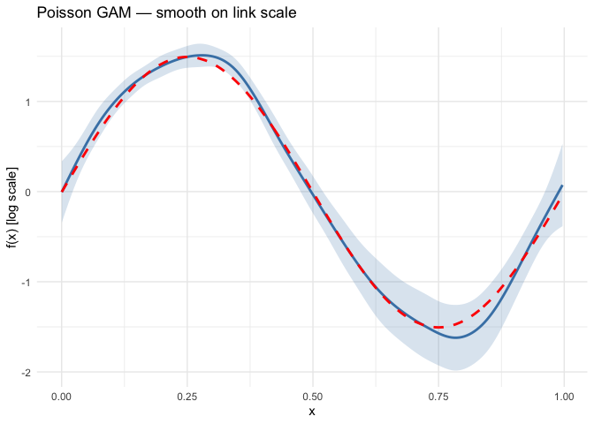
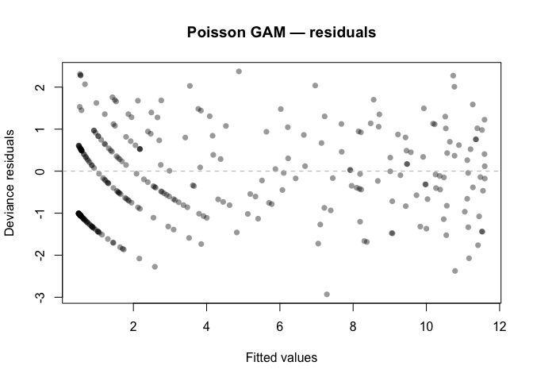
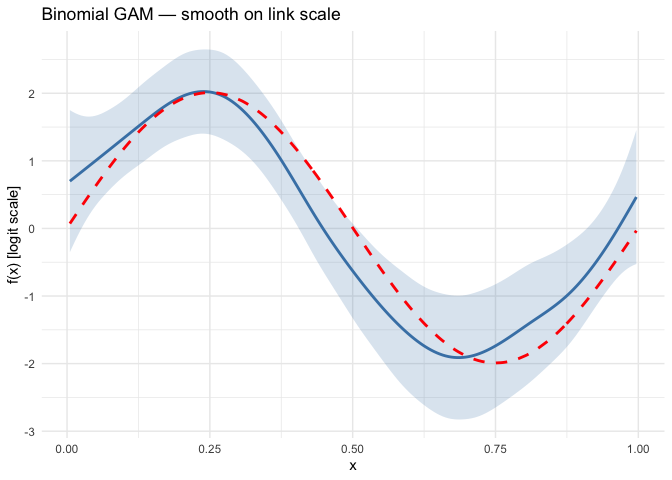
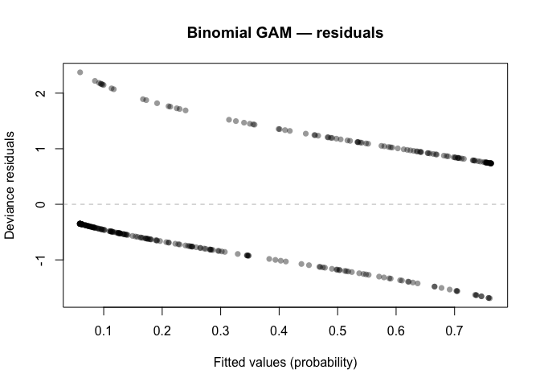
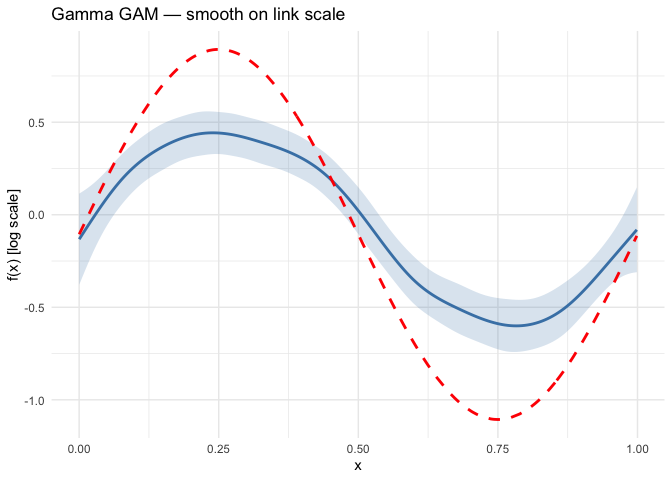
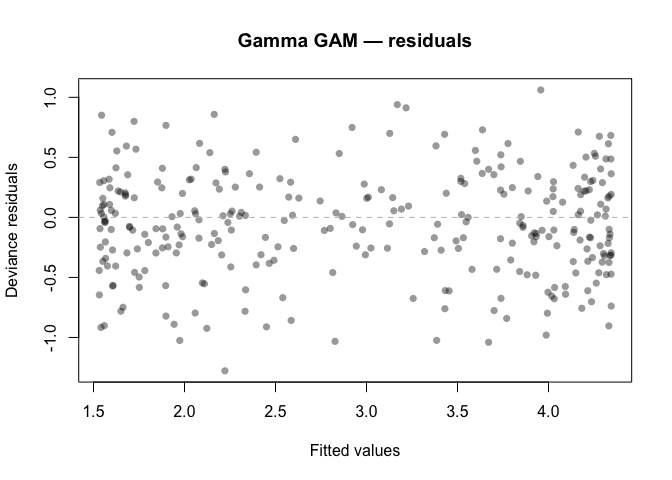

# Non-Gaussian Response Distributions
GAM.jl Contributors

- [Overview](#overview)
- [Setup](#setup)
- [Poisson GAM — count data](#poisson-gam--count-data)
  - [Loading count data](#loading-count-data)
  - [Fitting the model](#fitting-the-model)
  - [Smooth estimate](#smooth-estimate)
  - [Deviance residuals](#deviance-residuals)
- [Binomial GAM — binary data](#binomial-gam--binary-data)
  - [Loading binary data](#loading-binary-data)
  - [Fitting the model](#fitting-the-model-1)
  - [Smooth estimate](#smooth-estimate-1)
  - [Deviance residuals](#deviance-residuals-1)
- [Gamma GAM — positive continuous
  data](#gamma-gam--positive-continuous-data)
  - [Loading positive continuous
    data](#loading-positive-continuous-data)
  - [Fitting the model](#fitting-the-model-2)
  - [Smooth estimate](#smooth-estimate-2)
  - [Deviance residuals](#deviance-residuals-2)
- [Comparison](#comparison)
- [Summary](#summary)

## Overview

GAMs are not limited to Gaussian responses. By specifying a **family**
(distribution) and **link function**, we can model count data, binary
outcomes, positive continuous data, and more. The general model is:

$$g(\mu_i) = \beta_0 + f_1(x_{1i}) + \cdots + f_p(x_{pi}), \quad y_i \sim \text{Family}(\mu_i, \phi)$$

This vignette demonstrates three common non-Gaussian families:

| Family | Link | Response type | Example |
|----|----|----|----|
| Poisson | log | Counts | Species counts, event rates |
| Binomial | logit | Binary / proportions | Presence–absence, disease status |
| Gamma | inverse (or log) | Positive continuous | Waiting times, claim sizes |

## Setup

``` r
library(mgcv)
```

    Loading required package: nlme

    This is mgcv 1.9-3. For overview type 'help("mgcv-package")'.

``` r
library(gratia)
library(ggplot2)
```

## Poisson GAM — count data

### Loading count data

We load counts generated from a Poisson distribution with a smooth
log-rate:

$$y_i \sim \text{Poisson}(\mu_i), \quad \log(\mu_i) = 1 + 1.5 \sin(2\pi x_i)$$

``` r
dat_pois <- read.csv("../data_poisson.csv")
x <- dat_pois$x
y_pois <- dat_pois$y
n <- nrow(dat_pois)
eta <- 1.0 + 1.5 * sin(2 * pi * x)

df_pois <- data.frame(x = x, y = y_pois)
```

### Fitting the model

``` r
m_pois <- gam(y ~ s(x, k = 15, bs = "cr"), data = df_pois,
              family = poisson(link = "log"), method = "REML")
summary(m_pois)
```


    Family: poisson 
    Link function: log 

    Formula:
    y ~ s(x, k = 15, bs = "cr")

    Parametric coefficients:
                Estimate Std. Error z value Pr(>|z|)    
    (Intercept)  0.93959    0.04685   20.06   <2e-16 ***
    ---
    Signif. codes:  0 '***' 0.001 '**' 0.01 '*' 0.05 '.' 0.1 ' ' 1

    Approximate significance of smooth terms:
           edf Ref.df Chi.sq p-value    
    s(x) 7.995  9.613  719.9  <2e-16 ***
    ---
    Signif. codes:  0 '***' 0.001 '**' 0.01 '*' 0.05 '.' 0.1 ' ' 1

    R-sq.(adj) =  0.764   Deviance explained = 76.4%
    -REML = 566.91  Scale est. = 1         n = 300

### Smooth estimate

``` r
se_pois <- smooth_estimates(m_pois, n = 200)

ggplot(se_pois, aes(x = x, y = .estimate)) +
  geom_ribbon(aes(ymin = .estimate - 2 * .se, ymax = .estimate + 2 * .se),
              alpha = 0.2, fill = "steelblue") +
  geom_line(linewidth = 1, colour = "steelblue") +
  geom_line(data = data.frame(x = x, y = eta - mean(eta)),
            aes(x = x, y = y), linetype = "dashed", linewidth = 1, colour = "red") +
  labs(x = "x", y = "f(x) [log scale]", title = "Poisson GAM — smooth on link scale") +
  theme_minimal()
```



### Deviance residuals

``` r
resid_pois <- residuals(m_pois, type = "deviance")

plot(fitted(m_pois), resid_pois,
     xlab = "Fitted values", ylab = "Deviance residuals",
     main = "Poisson GAM — residuals", pch = 16, col = adjustcolor("black", 0.4))
abline(h = 0, lty = 2, col = "grey")
```



## Binomial GAM — binary data

### Loading binary data

We load binary outcomes generated from a logistic model:

$$y_i \sim \text{Bernoulli}(p_i), \quad \text{logit}(p_i) = -0.5 + 2\sin(2\pi x_i)$$

``` r
dat_binom <- read.csv("../data_binomial.csv")
x_bin <- dat_binom$x
y_bin <- dat_binom$y
eta_bin <- -0.5 + 2.0 * sin(2 * pi * x_bin)

df_bin <- data.frame(x = x_bin, y = y_bin)
```

### Fitting the model

``` r
m_bin <- gam(y ~ s(x, k = 15, bs = "cr"), data = df_bin,
             family = binomial(link = "logit"), method = "REML")
summary(m_bin)
```


    Family: binomial 
    Link function: logit 

    Formula:
    y ~ s(x, k = 15, bs = "cr")

    Parametric coefficients:
                Estimate Std. Error z value Pr(>|z|)    
    (Intercept)  -0.8588     0.1599  -5.371 7.83e-08 ***
    ---
    Signif. codes:  0 '***' 0.001 '**' 0.01 '*' 0.05 '.' 0.1 ' ' 1

    Approximate significance of smooth terms:
           edf Ref.df Chi.sq p-value    
    s(x) 5.034  6.217   69.7  <2e-16 ***
    ---
    Signif. codes:  0 '***' 0.001 '**' 0.01 '*' 0.05 '.' 0.1 ' ' 1

    R-sq.(adj) =  0.295   Deviance explained = 25.5%
    -REML = 153.02  Scale est. = 1         n = 300

### Smooth estimate

``` r
se_bin <- smooth_estimates(m_bin, n = 200)

ggplot(se_bin, aes(x = x, y = .estimate)) +
  geom_ribbon(aes(ymin = .estimate - 2 * .se, ymax = .estimate + 2 * .se),
              alpha = 0.2, fill = "steelblue") +
  geom_line(linewidth = 1, colour = "steelblue") +
  geom_line(data = data.frame(x = x_bin, y = eta_bin - mean(eta_bin)),
            aes(x = x, y = y), linetype = "dashed", linewidth = 1, colour = "red") +
  labs(x = "x", y = "f(x) [logit scale]", title = "Binomial GAM — smooth on link scale") +
  theme_minimal()
```



### Deviance residuals

``` r
resid_bin <- residuals(m_bin, type = "deviance")

plot(fitted(m_bin), resid_bin,
     xlab = "Fitted values (probability)", ylab = "Deviance residuals",
     main = "Binomial GAM — residuals", pch = 16, col = adjustcolor("black", 0.4))
abline(h = 0, lty = 2, col = "grey")
```



## Gamma GAM — positive continuous data

### Loading positive continuous data

We load positive continuous data generated from a Gamma distribution
with a smooth log-mean:

$$y_i \sim \text{Gamma}(\text{shape}, \text{scale}_i), \quad \log(\mu_i) = 1 + \sin(2\pi x_i)$$

``` r
dat_gamma <- read.csv("../data_gamma.csv")
x_gam <- dat_gamma$x
y_gam <- dat_gamma$y
eta_gam <- 1.0 + sin(2 * pi * x_gam)

df_gam <- data.frame(x = x_gam, y = y_gam)
```

### Fitting the model

We use `Gamma` with `log` link (more commonly used in practice than the
canonical inverse link):

``` r
m_gam <- gam(y ~ s(x, k = 15, bs = "cr"), data = df_gam,
             family = Gamma(link = "log"), method = "REML")
summary(m_gam)
```


    Family: Gamma 
    Link function: log 

    Formula:
    y ~ s(x, k = 15, bs = "cr")

    Parametric coefficients:
                Estimate Std. Error t value Pr(>|t|)    
    (Intercept)  1.02615    0.02457   41.76   <2e-16 ***
    ---
    Signif. codes:  0 '***' 0.001 '**' 0.01 '*' 0.05 '.' 0.1 ' ' 1

    Approximate significance of smooth terms:
           edf Ref.df     F p-value    
    s(x) 6.177  7.594 30.27  <2e-16 ***
    ---
    Signif. codes:  0 '***' 0.001 '**' 0.01 '*' 0.05 '.' 0.1 ' ' 1

    R-sq.(adj) =  0.362   Deviance explained = 41.5%
    -REML = 473.96  Scale est. = 0.18114   n = 300

### Smooth estimate

``` r
se_gam <- smooth_estimates(m_gam, n = 200)

ggplot(se_gam, aes(x = x, y = .estimate)) +
  geom_ribbon(aes(ymin = .estimate - 2 * .se, ymax = .estimate + 2 * .se),
              alpha = 0.2, fill = "steelblue") +
  geom_line(linewidth = 1, colour = "steelblue") +
  geom_line(data = data.frame(x = x_gam, y = eta_gam - mean(eta_gam)),
            aes(x = x, y = y), linetype = "dashed", linewidth = 1, colour = "red") +
  labs(x = "x", y = "f(x) [log scale]", title = "Gamma GAM — smooth on link scale") +
  theme_minimal()
```



### Deviance residuals

``` r
resid_gam <- residuals(m_gam, type = "deviance")

plot(fitted(m_gam), resid_gam,
     xlab = "Fitted values", ylab = "Deviance residuals",
     main = "Gamma GAM — residuals", pch = 16, col = adjustcolor("black", 0.4))
abline(h = 0, lty = 2, col = "grey")
```



## Comparison

``` r
results <- data.frame(
  Family = c("Poisson", "Binomial", "Gamma"),
  EDF = c(
    round(sum(pen.edf(m_pois)), 2),
    round(sum(pen.edf(m_bin)), 2),
    round(sum(pen.edf(m_gam)), 2)
  ),
  Dev_Explained = c(
    round(summary(m_pois)$dev.expl * 100, 1),
    round(summary(m_bin)$dev.expl * 100, 1),
    round(summary(m_gam)$dev.expl * 100, 1)
  ),
  Scale = c(
    round(summary(m_pois)$scale, 4),
    round(summary(m_bin)$scale, 4),
    round(summary(m_gam)$scale, 4)
  )
)
print(results)
```

        Family  EDF Dev_Explained  Scale
    1  Poisson 8.00          76.4 1.0000
    2 Binomial 5.03          25.5 1.0000
    3    Gamma 6.18          41.5 0.1811

## Summary

In this vignette we:

1.  Simulated count data and fitted a **Poisson GAM** with a log link
2.  Simulated binary data and fitted a **Binomial GAM** with a logit
    link
3.  Simulated positive continuous data and fitted a **Gamma GAM** with a
    log link
4.  Examined smooth estimates and deviance residuals for each family
5.  Compared EDF and deviance explained across families

Each family uses a different link function to map the linear predictor
to the mean of the response distribution, but the smooth estimation
machinery is the same.
