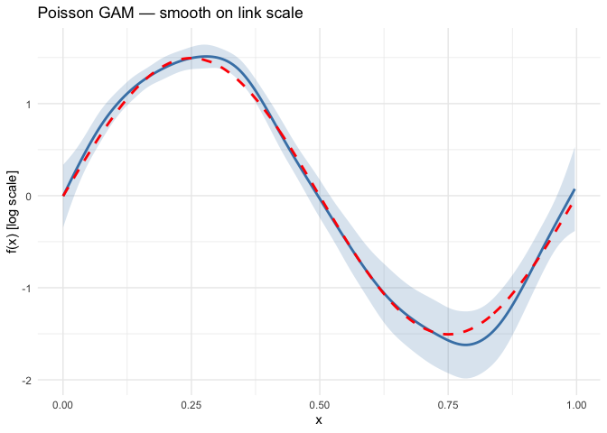
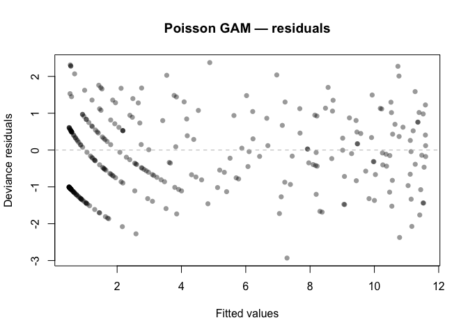
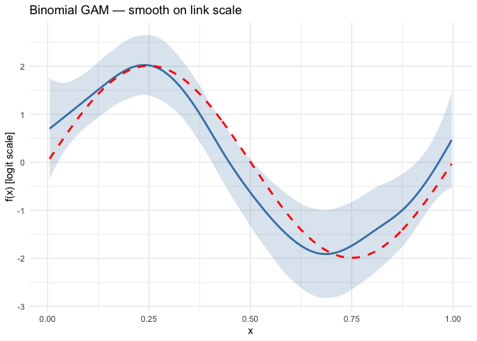
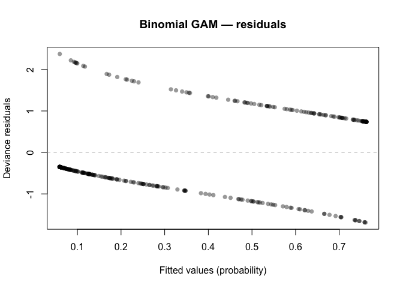
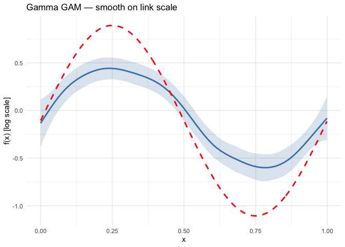
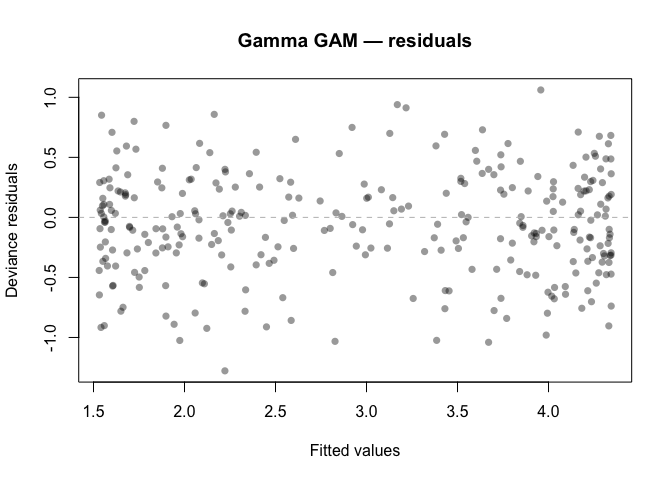
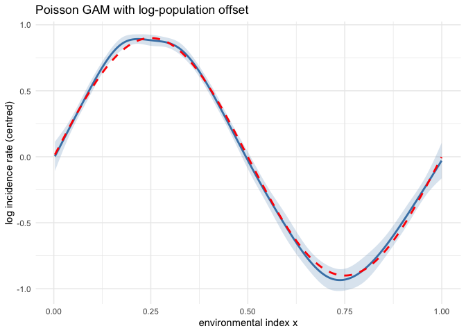
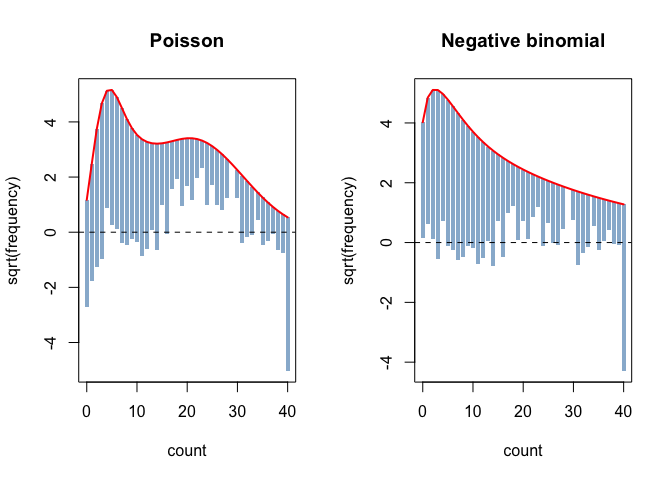

# Non-Gaussian Response Distributions
Simon Frost

- [Overview](#overview)
- [Setup](#setup)
- [Poisson GAM — count data](#poisson-gam--count-data)
  - [Loading count data](#loading-count-data)
  - [Fitting the model](#fitting-the-model)
  - [Smooth estimate](#smooth-estimate)
  - [Deviance residuals](#deviance-residuals)
- [Binomial GAM — binary data](#binomial-gam--binary-data)
  - [Loading binary data](#loading-binary-data)
  - [Fitting the model](#fitting-the-model-1)
  - [Smooth estimate](#smooth-estimate-1)
  - [Deviance residuals](#deviance-residuals-1)
- [Gamma GAM — positive continuous
  data](#gamma-gam--positive-continuous-data)
  - [Loading positive continuous
    data](#loading-positive-continuous-data)
  - [Fitting the model](#fitting-the-model-2)
  - [Smooth estimate](#smooth-estimate-2)
  - [Deviance residuals](#deviance-residuals-2)
- [Disease incidence — offsets and
  exposure](#disease-incidence--offsets-and-exposure)
  - [Fitting with an offset](#fitting-with-an-offset)
  - [Why not model the rate directly?](#why-not-model-the-rate-directly)
  - [Recovering the rate curve](#recovering-the-rate-curve)
  - [Prediction requires the offset
    again](#prediction-requires-the-offset-again)
- [Overdispersion in count data](#overdispersion-in-count-data)
  - [Detecting overdispersion](#detecting-overdispersion)
  - [Three principled responses](#three-principled-responses)
  - [What overdispersion costs you](#what-overdispersion-costs-you)
- [Rootograms](#rootograms)
- [Comparison](#comparison)
- [Summary](#summary)

## Overview

GAMs are not limited to Gaussian responses. By specifying a **family**
(distribution) and **link function**, we can model count data, binary
outcomes, positive continuous data, and more. The general model is:

$$g(\mu_i) = \beta_0 + f_1(x_{1i}) + \cdots + f_p(x_{pi}), \quad y_i \sim \text{Family}(\mu_i, \phi)$$

This vignette demonstrates three common non-Gaussian families:

| Family | Link | Response type | Example |
|----|----|----|----|
| Poisson | log | Counts | Species counts, event rates |
| Binomial | logit | Binary / proportions | Presence–absence, disease status |
| Gamma | inverse (or log) | Positive continuous | Waiting times, claim sizes |

The second half turns to **disease incidence counts**: an *offset* to
model rates rather than counts, and then **overdispersion** handled with
`nb()`, `quasipoisson()` and `tw()`.

## Setup

``` r
library(mgcv)
```

    Loading required package: nlme

    This is mgcv 1.9-4. For overview type '?mgcv'.

``` r
library(gratia)
library(ggplot2)
```

## Poisson GAM — count data

### Loading count data

We load counts generated from a Poisson distribution with a smooth
log-rate:

$$y_i \sim \text{Poisson}(\mu_i), \quad \log(\mu_i) = 1 + 1.5 \sin(2\pi x_i)$$

``` r
dat_pois <- read.csv("../data_poisson.csv")
x <- dat_pois$x
y_pois <- dat_pois$y
n <- nrow(dat_pois)
eta <- 1.0 + 1.5 * sin(2 * pi * x)

df_pois <- data.frame(x = x, y = y_pois)
```

### Fitting the model

``` r
m_pois <- gam(y ~ s(x, k = 15, bs = "cr"), data = df_pois,
              family = poisson(link = "log"), method = "REML")
summary(m_pois)
```


    Family: poisson 
    Link function: log 

    Formula:
    y ~ s(x, k = 15, bs = "cr")

    Parametric coefficients:
                Estimate Std. Error z value Pr(>|z|)    
    (Intercept)  0.93959    0.04685   20.06   <2e-16 ***
    ---
    Signif. codes:  0 '***' 0.001 '**' 0.01 '*' 0.05 '.' 0.1 ' ' 1

    Approximate significance of smooth terms:
           edf Ref.df Chi.sq p-value    
    s(x) 7.995  9.613  719.9  <2e-16 ***
    ---
    Signif. codes:  0 '***' 0.001 '**' 0.01 '*' 0.05 '.' 0.1 ' ' 1

    R-sq.(adj) =  0.764   Deviance explained = 76.4%
    -REML = 566.91  Scale est. = 1         n = 300

### Smooth estimate

``` r
se_pois <- smooth_estimates(m_pois, n = 200)

ggplot(se_pois, aes(x = x, y = .estimate)) +
  geom_ribbon(aes(ymin = .estimate - 2 * .se, ymax = .estimate + 2 * .se),
              alpha = 0.2, fill = "steelblue") +
  geom_line(linewidth = 1, colour = "steelblue") +
  geom_line(data = data.frame(x = x, y = eta - mean(eta)),
            aes(x = x, y = y), linetype = "dashed", linewidth = 1, colour = "red") +
  labs(x = "x", y = "f(x) [log scale]", title = "Poisson GAM — smooth on link scale") +
  theme_minimal()
```



### Deviance residuals

``` r
resid_pois <- residuals(m_pois, type = "deviance")

plot(fitted(m_pois), resid_pois,
     xlab = "Fitted values", ylab = "Deviance residuals",
     main = "Poisson GAM — residuals", pch = 16, col = adjustcolor("black", 0.4))
abline(h = 0, lty = 2, col = "grey")
```



## Binomial GAM — binary data

### Loading binary data

We load binary outcomes generated from a logistic model:

$$y_i \sim \text{Bernoulli}(p_i), \quad \text{logit}(p_i) = -0.5 + 2\sin(2\pi x_i)$$

``` r
dat_binom <- read.csv("../data_binomial.csv")
x_bin <- dat_binom$x
y_bin <- dat_binom$y
eta_bin <- -0.5 + 2.0 * sin(2 * pi * x_bin)

df_bin <- data.frame(x = x_bin, y = y_bin)
```

### Fitting the model

``` r
m_bin <- gam(y ~ s(x, k = 15, bs = "cr"), data = df_bin,
             family = binomial(link = "logit"), method = "REML")
summary(m_bin)
```


    Family: binomial 
    Link function: logit 

    Formula:
    y ~ s(x, k = 15, bs = "cr")

    Parametric coefficients:
                Estimate Std. Error z value Pr(>|z|)    
    (Intercept)  -0.8588     0.1599  -5.371 7.83e-08 ***
    ---
    Signif. codes:  0 '***' 0.001 '**' 0.01 '*' 0.05 '.' 0.1 ' ' 1

    Approximate significance of smooth terms:
           edf Ref.df Chi.sq p-value    
    s(x) 5.034  6.217   69.7  <2e-16 ***
    ---
    Signif. codes:  0 '***' 0.001 '**' 0.01 '*' 0.05 '.' 0.1 ' ' 1

    R-sq.(adj) =  0.295   Deviance explained = 25.5%
    -REML = 153.02  Scale est. = 1         n = 300

### Smooth estimate

``` r
se_bin <- smooth_estimates(m_bin, n = 200)

ggplot(se_bin, aes(x = x, y = .estimate)) +
  geom_ribbon(aes(ymin = .estimate - 2 * .se, ymax = .estimate + 2 * .se),
              alpha = 0.2, fill = "steelblue") +
  geom_line(linewidth = 1, colour = "steelblue") +
  geom_line(data = data.frame(x = x_bin, y = eta_bin - mean(eta_bin)),
            aes(x = x, y = y), linetype = "dashed", linewidth = 1, colour = "red") +
  labs(x = "x", y = "f(x) [logit scale]", title = "Binomial GAM — smooth on link scale") +
  theme_minimal()
```



### Deviance residuals

``` r
resid_bin <- residuals(m_bin, type = "deviance")

plot(fitted(m_bin), resid_bin,
     xlab = "Fitted values (probability)", ylab = "Deviance residuals",
     main = "Binomial GAM — residuals", pch = 16, col = adjustcolor("black", 0.4))
abline(h = 0, lty = 2, col = "grey")
```



## Gamma GAM — positive continuous data

### Loading positive continuous data

We load positive continuous data generated from a Gamma distribution
with a smooth log-mean:

$$y_i \sim \text{Gamma}(\text{shape}, \text{scale}_i), \quad \log(\mu_i) = 1 + \sin(2\pi x_i)$$

``` r
dat_gamma <- read.csv("../data_gamma.csv")
x_gam <- dat_gamma$x
y_gam <- dat_gamma$y
eta_gam <- 1.0 + sin(2 * pi * x_gam)

df_gam <- data.frame(x = x_gam, y = y_gam)
```

### Fitting the model

We use `Gamma` with `log` link (more commonly used in practice than the
canonical inverse link):

``` r
m_gam <- gam(y ~ s(x, k = 15, bs = "cr"), data = df_gam,
             family = Gamma(link = "log"), method = "REML")
summary(m_gam)
```


    Family: Gamma 
    Link function: log 

    Formula:
    y ~ s(x, k = 15, bs = "cr")

    Parametric coefficients:
                Estimate Std. Error t value Pr(>|t|)    
    (Intercept)  1.02615    0.02457   41.76   <2e-16 ***
    ---
    Signif. codes:  0 '***' 0.001 '**' 0.01 '*' 0.05 '.' 0.1 ' ' 1

    Approximate significance of smooth terms:
           edf Ref.df     F p-value    
    s(x) 6.177  7.594 30.27  <2e-16 ***
    ---
    Signif. codes:  0 '***' 0.001 '**' 0.01 '*' 0.05 '.' 0.1 ' ' 1

    R-sq.(adj) =  0.362   Deviance explained = 41.5%
    -REML = 473.96  Scale est. = 0.18114   n = 300

### Smooth estimate

``` r
se_gam <- smooth_estimates(m_gam, n = 200)

ggplot(se_gam, aes(x = x, y = .estimate)) +
  geom_ribbon(aes(ymin = .estimate - 2 * .se, ymax = .estimate + 2 * .se),
              alpha = 0.2, fill = "steelblue") +
  geom_line(linewidth = 1, colour = "steelblue") +
  geom_line(data = data.frame(x = x_gam, y = eta_gam - mean(eta_gam)),
            aes(x = x, y = y), linetype = "dashed", linewidth = 1, colour = "red") +
  labs(x = "x", y = "f(x) [log scale]", title = "Gamma GAM — smooth on link scale") +
  theme_minimal()
```



### Deviance residuals

``` r
resid_gam <- residuals(m_gam, type = "deviance")

plot(fitted(m_gam), resid_gam,
     xlab = "Fitted values", ylab = "Deviance residuals",
     main = "Gamma GAM — residuals", pch = 16, col = adjustcolor("black", 0.4))
abline(h = 0, lty = 2, col = "grey")
```



## Disease incidence — offsets and exposure

Epidemiological counts depend on how many people are at risk. To model
the **rate** rather than the count we add an **offset**: a term entering
the linear predictor with its coefficient fixed at 1.

$$y_i \sim \text{Poisson}(\mu_i), \quad
\log(\mu_i) = \log(E_i) + \beta_0 + f(x_i)$$

We load 400 simulated district-weeks with lognormal populations and a
smooth log-rate:

$$\log(\text{pop}_i) \sim N(9,\, 0.7^2), \qquad
\log(\mu_i) = \log(\text{pop}_i) - 6.0 + 0.9\sin(2\pi x_i)$$

``` r
dat_inc <- read.csv("../data_incidence.csv")
dat_inc$log_pop <- log(dat_inc$pop)
range(dat_inc$pop)
```

    [1]  1283 46255

### Fitting with an offset

In mgcv the offset may be given either in the formula as
`offset(log(pop))` or, as here, through the `offset` argument:

``` r
m_inc <- gam(y ~ s(x, k = 12, bs = "cr"), data = dat_inc,
             family = poisson(link = "log"), method = "REML",
             offset = log_pop)
summary(m_inc)
```


    Family: poisson 
    Link function: log 

    Formula:
    y ~ s(x, k = 12, bs = "cr")

    Parametric coefficients:
                Estimate Std. Error z value Pr(>|z|)    
    (Intercept) -5.95213    0.01059  -561.9   <2e-16 ***
    ---
    Signif. codes:  0 '***' 0.001 '**' 0.01 '*' 0.05 '.' 0.1 ' ' 1

    Approximate significance of smooth terms:
           edf Ref.df Chi.sq p-value    
    s(x) 9.106  10.24   3811  <2e-16 ***
    ---
    Signif. codes:  0 '***' 0.001 '**' 0.01 '*' 0.05 '.' 0.1 ' ' 1

    R-sq.(adj) =  0.974   Deviance explained = 92.4%
    -REML = 1188.3  Scale est. = 1         n = 400

``` r
cat("intercept =", round(coef(m_inc)[1], 4), " (simulated: -6.0)\n")
```

    intercept = -5.9521  (simulated: -6.0)

``` r
cat("Pearson dispersion =",
    round(sum(residuals(m_inc, type = "pearson")^2) / m_inc$df.residual, 3), "\n")
```

    Pearson dispersion = 0.949 

### Why not model the rate directly?

Estimating the log-population coefficient instead of fixing it at 1:

``` r
m_cov <- gam(y ~ log_pop + s(x, k = 12, bs = "cr"), data = dat_inc,
             family = poisson(link = "log"), method = "REML")
cat("log(pop) coefficient =", round(coef(m_cov)["log_pop"], 4), "\n")
```

    log(pop) coefficient = 0.9946 

The estimate sits close to 1, but the offset model imposes that
relationship rather than spending a degree of freedom rediscovering it.

### Recovering the rate curve

``` r
se_inc <- smooth_estimates(m_inc, n = 200)
xg <- se_inc$x
truth_inc <- 0.9 * sin(2 * pi * xg)

ggplot(se_inc, aes(x = x, y = .estimate - mean(.estimate))) +
  geom_ribbon(aes(ymin = .estimate - mean(.estimate) - 2 * .se,
                  ymax = .estimate - mean(.estimate) + 2 * .se),
              alpha = 0.2, fill = "steelblue") +
  geom_line(linewidth = 1, colour = "steelblue") +
  geom_line(data = data.frame(x = xg, y = truth_inc - mean(truth_inc)),
            aes(x = x, y = y), linetype = "dashed", linewidth = 1, colour = "red") +
  labs(x = "environmental index x", y = "log incidence rate (centred)",
       title = "Poisson GAM with log-population offset") +
  theme_minimal()
```



### Prediction requires the offset again

`predict.gam` does **not** add the offset for new data — it must be
supplied explicitly on the link scale:

``` r
nd <- data.frame(x = c(0.25, 0.75))
eta <- predict(m_inc, newdata = nd, type = "link")
pred_10k <- exp(eta + log(10000))

cat("expected weekly cases in a district of 10,000:\n")
```

    expected weekly cases in a district of 10,000:

``` r
cat("  peak season  (x = 0.25):", round(pred_10k[1], 1), "\n")
```

      peak season  (x = 0.25): 59.5 

``` r
cat("  trough       (x = 0.75):", round(pred_10k[2], 1), "\n")
```

      trough       (x = 0.75): 9.7 

``` r
cat("  ratio =", round(pred_10k[1] / pred_10k[2], 2),
    " (simulated:", round(exp(1.8), 2), ")\n")
```

      ratio = 6.13  (simulated: 6.05 )

## Overdispersion in count data

Weekly counts at a single surveillance site, simulated with genuine
extra-Poisson variation:

$$y_i \sim \text{NegBin}(\mu_i, \theta), \quad
\log(\mu_i) = 2.5 + 0.9\sin(2\pi x_i), \quad \theta = 2$$

``` r
dat_od <- read.csv("../data_incidence_od.csv")
cat("mean =", round(mean(dat_od$y), 2),
    " variance =", round(var(dat_od$y), 1),
    " zeros =", sum(dat_od$y == 0), "\n")
```

    mean = 13.8  variance = 235.3  zeros = 15 

### Detecting overdispersion

``` r
m_od_pois <- gam(y ~ s(x, k = 12, bs = "cr"), data = dat_od,
                 family = poisson(), method = "REML")
disp_od <- sum(residuals(m_od_pois, type = "pearson")^2) / m_od_pois$df.residual
cat("Pearson dispersion =", round(disp_od, 2), "\n")
```

    Pearson dispersion = 8.66 

### Three principled responses

``` r
m_od_nb <- gam(y ~ s(x, k = 12, bs = "cr"), data = dat_od,
               family = nb(), method = "REML")
cat("nb() theta =", round(m_od_nb$family$getTheta(TRUE), 3), " (simulated: 2.0)\n")
```

    nb() theta = 1.944  (simulated: 2.0)

``` r
m_od_qp <- gam(y ~ s(x, k = 12, bs = "cr"), data = dat_od,
               family = quasipoisson(), method = "REML")
cat("quasipoisson scale =", round(m_od_qp$scale, 3), "\n")
```

    quasipoisson scale = 8.735 

``` r
m_od_tw <- gam(y ~ s(x, k = 12, bs = "cr"), data = dat_od,
               family = tw(), method = "REML")
cat("tw() p =", round(m_od_tw$family$getTheta(TRUE), 3),
    " scale =", round(m_od_tw$scale, 3), "\n")
```

    tw() p = 1.547  scale = 1.811 

``` r
cat("Poisson AIC =", round(AIC(m_od_pois), 1), "\n")
```

    Poisson AIC = 4729.5 

``` r
cat("NegBin  AIC =", round(AIC(m_od_nb), 1), "\n")
```

    NegBin  AIC = 2717.4 

Quasi-likelihood has no likelihood, so `AIC()` is not meaningful for
`quasipoisson()`.

### What overdispersion costs you

``` r
se_p  <- smooth_estimates(m_od_pois, n = 50)
se_nb <- smooth_estimates(m_od_nb,   n = 50)
se_qp <- smooth_estimates(m_od_qp,   n = 50)

cat("mean SE of s(x):\n")
```

    mean SE of s(x):

``` r
cat("  Poisson       ", round(mean(se_p$.se), 4), "\n")
```

      Poisson        0.0501 

``` r
cat("  NegBin        ", round(mean(se_nb$.se), 4),
    " (", round(mean(se_nb$.se) / mean(se_p$.se), 2), "x Poisson)\n")
```

      NegBin         0.1029  ( 2.06 x Poisson)

``` r
cat("  quasi-Poisson ", round(mean(se_qp$.se), 4),
    " (", round(mean(se_qp$.se) / mean(se_p$.se), 2), "x Poisson)\n")
```

      quasi-Poisson  0.117  ( 2.34 x Poisson)

## Rootograms

The `countreg` package provides `rootogram()`, but it is not on CRAN and
may not be installed; the calculation is short enough to write directly.
For each count $k$ the expected frequency is
$\sum_i P(y = k \mid \hat{\mu}_i)$.

``` r
rootogram_data <- function(counts, mu, family = c("poisson", "nbinom"),
                           theta = NULL, max_count = 40) {
  family <- match.arg(family)
  ks <- 0:max_count
  observed <- as.numeric(table(factor(pmin(counts, max_count), levels = ks)))
  expected <- sapply(ks, function(k) {
    if (family == "poisson") sum(dpois(k, mu)) else sum(dnbinom(k, size = theta, mu = mu))
  })
  data.frame(count = ks, observed = observed, expected = expected,
             sqrt_observed = sqrt(observed), sqrt_expected = sqrt(expected))
}

rg_p  <- rootogram_data(dat_od$y, fitted(m_od_pois), "poisson", max_count = 40)
rg_nb <- rootogram_data(dat_od$y, fitted(m_od_nb), "nbinom",
                        theta = m_od_nb$family$getTheta(TRUE), max_count = 40)
```

In a hanging rootogram each bar hangs from the expected curve by
$\sqrt{\text{observed}}$; bars that miss zero mark counts the model gets
wrong.

``` r
hanging_plot <- function(rg, main) {
  top <- rg$sqrt_expected
  bottom <- rg$sqrt_expected - rg$sqrt_observed
  plot(range(rg$count), range(c(0, top, bottom)), type = "n",
       xlab = "count", ylab = "sqrt(frequency)", main = main)
  rect(rg$count - 0.4, bottom, rg$count + 0.4, top,
       col = adjustcolor("steelblue", 0.6), border = NA)
  lines(rg$count, rg$sqrt_expected, col = "red", lwd = 2)
  abline(h = 0, lty = 2)
}

op <- par(mfrow = c(1, 2))
hanging_plot(rg_p, "Poisson")
hanging_plot(rg_nb, "Negative binomial")
```



``` r
par(op)
```

``` r
cat("observations equal to 0: ", rg_p$observed[1], "\n")
```

    observations equal to 0:  15 

``` r
cat("  expected under Poisson:", round(rg_p$expected[1], 1), "\n")
```

      expected under Poisson: 1.4 

``` r
cat("  expected under NegBin: ", round(rg_nb$expected[1], 1), "\n")
```

      expected under NegBin:  16.2 

The Poisson model expects barely one zero where 15 occur; the negative
binomial expects 16.

## Comparison

``` r
results <- data.frame(
  Family = c("Poisson", "Binomial", "Gamma"),
  EDF = c(
    round(sum(pen.edf(m_pois)), 2),
    round(sum(pen.edf(m_bin)), 2),
    round(sum(pen.edf(m_gam)), 2)
  ),
  Dev_Explained = c(
    round(summary(m_pois)$dev.expl * 100, 1),
    round(summary(m_bin)$dev.expl * 100, 1),
    round(summary(m_gam)$dev.expl * 100, 1)
  ),
  Scale = c(
    round(summary(m_pois)$scale, 4),
    round(summary(m_bin)$scale, 4),
    round(summary(m_gam)$scale, 4)
  )
)
print(results)
```

        Family  EDF Dev_Explained  Scale
    1  Poisson 8.00          76.4 1.0000
    2 Binomial 5.03          25.5 1.0000
    3    Gamma 6.18          41.5 0.1811

## Summary

In this vignette we:

1.  Simulated count data and fitted a **Poisson GAM** with a log link
2.  Simulated binary data and fitted a **Binomial GAM** with a logit
    link
3.  Simulated positive continuous data and fitted a **Gamma GAM** with a
    log link
4.  Examined smooth estimates and deviance residuals for each family
5.  Compared EDF and deviance explained across families
6.  Used an **offset** to model incidence rates rather than counts
7.  Diagnosed **overdispersion** and handled it with `nb()`,
    `quasipoisson()` and `tw()`
8.  Built **rootograms** to see which counts the Poisson model got wrong

Each family uses a different link function to map the linear predictor
to the mean of the response distribution, but the smooth estimation
machinery is the same.
