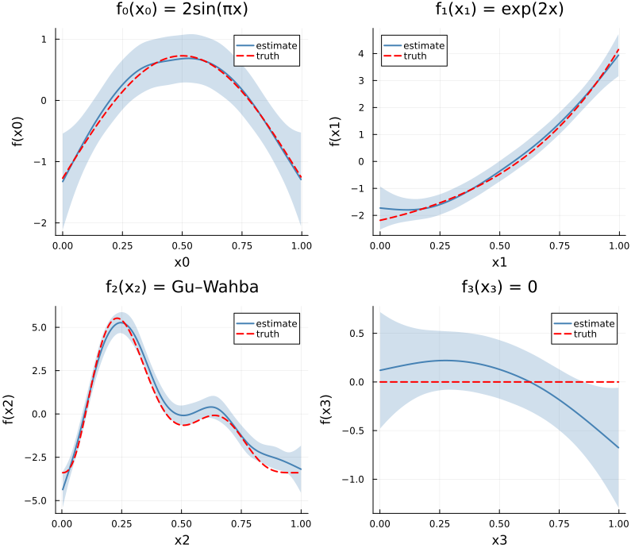
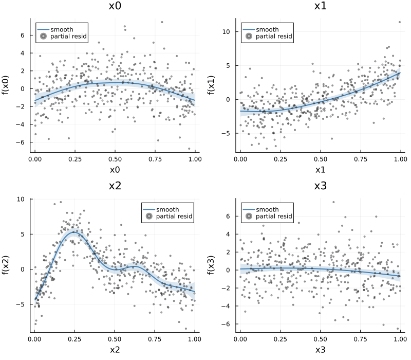
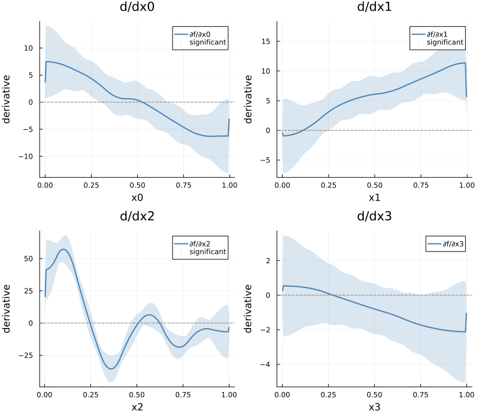
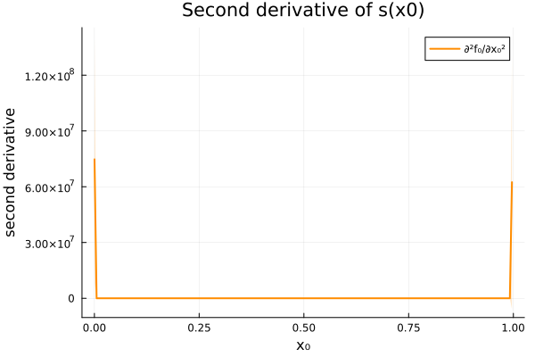
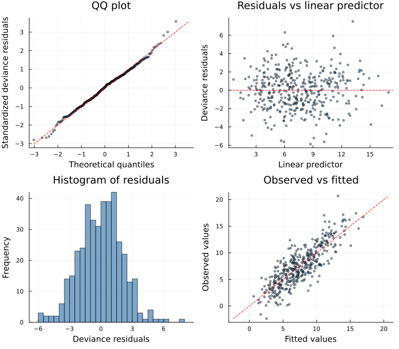
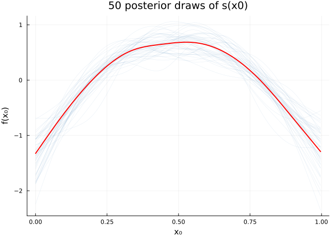

# Model Diagnostics and Visualization
GAM.jl Contributors

- [Introduction](#introduction)
- [Setup](#setup)
- [Simulate Gu–Wahba example data](#simulate-guwahba-example-data)
- [Fit the GAM](#fit-the-gam)
- [Model overview](#model-overview)
- [Smooth estimates](#smooth-estimates)
- [Partial residuals](#partial-residuals)
- [Derivatives](#derivatives)
- [Model diagnostics with `appraise`](#model-diagnostics-with-appraise)
- [Posterior simulation](#posterior-simulation)
  - [Smooth samples](#smooth-samples)
  - [Fitted samples](#fitted-samples)
- [Concurvity](#concurvity)
- [Basis dimension check](#basis-dimension-check)
- [Summary](#summary)

## Introduction

This vignette demonstrates **gratia**-style model diagnostics and
visualization tools available in GAM.jl. These functions mirror the R
[gratia](https://gavinsimpson.github.io/gratia/) package, providing tidy
interfaces for inspecting fitted GAMs.

We fit a GAM to the classic Gu & Wahba (1991) simulated example with
four smooth terms of varying complexity, then explore the full
diagnostic toolkit.

## Setup

``` julia
using GAM
using StatsAPI: fitted, predict, residuals
using DataFrames
using CSV
using Random
using Statistics
using Plots
```

## Simulate Gu–Wahba example data

The test functions are:

- $f_0(x) = 2\sin(\pi x)$
- $f_1(x) = \exp(2x)$
- $f_2(x) = 0.2 x^{11}(10(1-x))^6 + 10(10x)^3(1-x)^{10}$
- $f_3(x) = 0$ (null smooth)

``` julia
f0(x) = 2 * sin(π * x)
f1(x) = exp(2 * x)
f2(x) = 0.2 * x^11 * (10 * (1 - x))^6 + 10 * (10 * x)^3 * (1 - x)^10
f3(x) = 0.0

df = CSV.read("data.csv", DataFrame)
n = nrow(df)
x0 = df.x0; x1 = df.x1; x2 = df.x2; x3 = df.x3
y = df.y
first(df, 5)
```

<div><div style = "float: left;"><span>5×5 DataFrame</span></div><div style = "clear: both;"></div></div><div class = "data-frame" style = "overflow-x: scroll;">

| Row |       y |       x0 |       x1 |       x2 |       x3 |
|----:|--------:|---------:|---------:|---------:|---------:|
|     | Float64 |  Float64 |  Float64 |  Float64 |  Float64 |
|   1 | 2.99265 | 0.914806 |   0.0227 | 0.909048 |  0.40188 |
|   2 | 4.69717 | 0.937075 |  0.51324 | 0.899925 | 0.432214 |
|   3 | 13.9358 |  0.28614 | 0.630726 | 0.192349 | 0.663604 |
|   4 | 5.71329 | 0.830448 | 0.418772 |  0.53229 | 0.182369 |
|   5 | 7.63407 | 0.641746 | 0.879266 | 0.522125 | 0.838339 |

</div>

## Fit the GAM

``` julia
m = gam(@gam_formula(y ~ s(x0, k=10, bs=:cr) + s(x1, k=10, bs=:cr) +
                          s(x2, k=10, bs=:cr) + s(x3, k=10, bs=:cr)), df)
```

    Generalized Additive Model

    Formula: y ~ 1

    Family: Normal
    Link:   IdentityLink
    Method: REML

    Parametric coefficients:
    ─────────────────────────────────────────────────
                   Coef.  Std. Error      t  Pr(>|t|)
    ─────────────────────────────────────────────────
    (Intercept)  7.49514    0.105069  71.34    <1e-99
    ─────────────────────────────────────────────────

    Approximate significance of smooth terms:
    ──────────────────────────────────────────────────
    Smooth                    edf   Ref.df
    ──────────────────────────────────────────────────
    s(x0,bs=cr)              3.43        9
    s(x1,bs=cr)              3.20        9
    s(x2,bs=cr)              7.83        9
    s(x3,bs=cr)              1.89        9
    ──────────────────────────────────────────────────

    R² (adj) = 0.685   Deviance explained = 69.8%
    Scale est. = 4.4158   n = 400

## Model overview

The `overview` function provides a tidy summary of all smooth terms,
including basis type, dimension, basis size, effective degrees of
freedom (EDF), and EDF-to-k ratio.

``` julia
ov = overview(m)
```

    GAM Overview: 4 smooth term(s)
    ─────────────────────────────────────────────────────────────────
    Smooth               Type           Dim     k      EDF  k-ratio
    ─────────────────────────────────────────────────────────────────
    s(x0,bs=cr)          CubicSpline      1     9     3.43    0.381
    s(x1,bs=cr)          CubicSpline      1     9     3.20    0.355
    s(x2,bs=cr)          CubicSpline      1     9     7.83    0.870
    s(x3,bs=cr)          CubicSpline      1     9     1.89    0.210
    ─────────────────────────────────────────────────────────────────

## Smooth estimates

`smooth_estimates` evaluates each smooth function on a regular grid with
pointwise standard errors. This is the foundation for plotting smooth
effects.

``` julia
se = smooth_estimates(m; n=200)
```

    SmoothEstimates: 4 smooth(s), 800 evaluation points
      s(x0,bs=cr): 200 points
      s(x1,bs=cr): 200 points
      s(x2,bs=cr): 200 points
      s(x3,bs=cr): 200 points

We plot each estimated smooth with ±2 SE confidence bands, overlaying
the true function (centered to have zero mean, for identifiability):

``` julia
true_fns = [f0, f1, f2, f3]
x_vars = [:x0, :x1, :x2, :x3]
x_data = [x0, x1, x2, x3]
labels = ["f₀(x₀) = 2sin(πx)", "f₁(x₁) = exp(2x)", "f₂(x₂) = Gu–Wahba", "f₃(x₃) = 0"]

plots_se = []
for (i, xvar) in enumerate(x_vars)
    se_i = smooth_estimates(m; select=string(xvar), n=200)
    xgrid = se_i.covariates[xvar]
    est = se_i.estimate
    se_vals = se_i.se

    # True function on grid, centered
    f_grid = true_fns[i].(xgrid)
    f_grid = f_grid .- mean(f_grid)

    p = plot(xgrid, est;
        ribbon=2 .* se_vals, fillalpha=0.25, color=:steelblue,
        linewidth=2, label="estimate",
        xlabel=string(xvar), ylabel="f($(xvar))",
        title=labels[i])
    plot!(p, xgrid, f_grid;
        linestyle=:dash, linewidth=2, color=:red, label="truth")
    push!(plots_se, p)
end
plot(plots_se...; layout=(2, 2), size=(800, 700))
```



Select a specific smooth:

``` julia
se_x0 = smooth_estimates(m; select="s(x0)")
println("Grid points: $(length(se_x0.estimate)), SE range: [$(round(minimum(se_x0.se), digits=3)), $(round(maximum(se_x0.se), digits=3))]")
```

    Grid points: 100, SE range: [0.195, 0.392]

## Partial residuals

`partial_residuals` computes $\hat{f}_j(x_{ij}) + \hat{\varepsilon}_i$
for each smooth, useful for assessing fit quality by overlaying partial
residuals on smooth estimates.

``` julia
pr = partial_residuals(m)

plots_pr = []
for (i, xvar) in enumerate(x_vars)
    se_i = smooth_estimates(m; select=string(xvar), n=200)
    xgrid = se_i.covariates[xvar]
    est = se_i.estimate
    se_vals = se_i.se

    label_key = m.smooths[i].spec.label
    xvals, resids = pr[label_key]

    p = plot(xgrid, est;
        ribbon=2 .* se_vals, fillalpha=0.2, color=:steelblue,
        linewidth=2, label="smooth",
        xlabel=string(xvar), ylabel="f($(xvar))",
        title=string(xvar))
    scatter!(p, xvals, resids;
        markersize=1.5, alpha=0.4, color=:grey40, label="partial resid")
    push!(plots_pr, p)
end
plot(plots_pr...; layout=(2, 2), size=(800, 700))
```



## Derivatives

`derivatives` computes finite-difference derivatives of smooth terms
with confidence intervals, useful for identifying regions of significant
change.

``` julia
d = derivatives(m; order=1, type=:central, n=200, level=0.95)
```

    DerivativeEstimates (order=1, type=central): 4 smooth(s)

We highlight regions where the confidence interval excludes zero (i.e.,
statistically significant change):

``` julia
plots_d = []
for (i, xvar) in enumerate(x_vars)
    d_i = derivatives(m; select=string(xvar), order=1, type=:central, n=200)
    xgrid = d_i.x
    deriv = d_i.derivative
    lower = d_i.lower
    upper = d_i.upper

    # Color significant regions
    sig = (lower .> 0) .| (upper .< 0)

    p = plot(xgrid, deriv;
        ribbon=(deriv .- lower, upper .- deriv),
        fillalpha=0.2, color=:steelblue, linewidth=2,
        label="∂f/∂$(xvar)",
        xlabel=string(xvar), ylabel="derivative",
        title="d/d$(xvar)")
    hline!(p, [0.0]; linestyle=:dash, color=:grey50, label="")

    # Mark significant regions with rug marks at bottom
    if any(sig)
        sig_x = xgrid[sig]
        scatter!(p, sig_x, zeros(length(sig_x));
            markersize=2, markerstrokewidth=0, color=:red,
            alpha=0.5, label="significant",
            markershape=:vline)
    end
    push!(plots_d, p)
end
plot(plots_d...; layout=(2, 2), size=(800, 700))
```



Second-order derivatives:

``` julia
d2 = derivatives(m; order=2, select="x0", n=200)
plot(d2.x, d2.derivative;
    ribbon=(d2.derivative .- d2.lower, d2.upper .- d2.derivative),
    fillalpha=0.2, color=:darkorange, linewidth=2,
    label="∂²f₀/∂x₀²", xlabel="x₀", ylabel="second derivative",
    title="Second derivative of s(x0)", size=(600, 400))
```



## Model diagnostics with `appraise`

`appraise` returns diagnostic data for the four standard residual plots:
QQ plot, residuals vs linear predictor, histogram of residuals, and
observed vs fitted values.

``` julia
diag_data = appraise(m)
```

    AppraiseData: 400 observations
      Deviance residuals: min=-5.875, max=7.510

``` julia
p1 = scatter(diag_data.qq_theoretical, diag_data.qq_sample;
    xlabel="Theoretical quantiles", ylabel="Standardized deviance residuals",
    title="QQ plot", label="", markersize=2, alpha=0.5, color=:steelblue)
lims = extrema(vcat(diag_data.qq_theoretical, diag_data.qq_sample))
plot!(p1, [lims[1], lims[2]], [lims[1], lims[2]];
    linestyle=:dash, color=:red, label="")

p2 = scatter(diag_data.linear_predictor, diag_data.residuals_deviance;
    xlabel="Linear predictor", ylabel="Deviance residuals",
    title="Residuals vs linear predictor", label="",
    markersize=2, alpha=0.5, color=:steelblue)
hline!(p2, [0.0]; linestyle=:dash, color=:red, label="")

p3 = histogram(diag_data.residuals_deviance;
    xlabel="Deviance residuals", ylabel="Frequency",
    title="Histogram of residuals", label="",
    bins=30, color=:steelblue, alpha=0.7)

p4 = scatter(diag_data.fitted, diag_data.observed;
    xlabel="Fitted values", ylabel="Observed values",
    title="Observed vs fitted", label="",
    markersize=2, alpha=0.5, color=:steelblue)
lims4 = extrema(vcat(diag_data.fitted, diag_data.observed))
plot!(p4, [lims4[1], lims4[2]], [lims4[1], lims4[2]];
    linestyle=:dash, color=:red, label="")

plot(p1, p2, p3, p4; layout=(2, 2), size=(800, 700))
```



## Posterior simulation

### Smooth samples

`smooth_samples` draws posterior realizations of individual smooth
functions on an evaluation grid—useful for visualizing uncertainty in
smooth shapes.

``` julia
ss = smooth_samples(m; n=50, n_grid=100, seed=42)
```

    Dict{String, Tuple{Vector{Float64}, Matrix{Float64}}} with 4 entries:
      "s(x3,bs=cr)" => ([0.00127253, 0.0113417, 0.0214109, 0.03148, 0.0415492, 0.05…
      "s(x2,bs=cr)" => ([0.00359141, 0.0136499, 0.0237083, 0.0337668, 0.0438252, 0.…
      "s(x1,bs=cr)" => ([0.000405043, 0.0104615, 0.0205179, 0.0305744, 0.0406308, 0…
      "s(x0,bs=cr)" => ([0.000238897, 0.0103027, 0.0203664, 0.0304302, 0.040494, 0.…

We show a “spaghetti plot” of posterior draws for `s(x0)`:

``` julia
label_x0 = m.smooths[1].spec.label
xgrid_ss, smat_ss = ss[label_x0]

p_ss = plot(xlabel="x₀", ylabel="f(x₀)",
    title="50 posterior draws of s(x0)", legend=false)
for j in 1:size(smat_ss, 2)
    plot!(p_ss, xgrid_ss, smat_ss[:, j];
        color=:steelblue, alpha=0.15, linewidth=0.5)
end
# Overlay the point estimate
se_x0 = smooth_estimates(m; select="x0", n=100)
plot!(p_ss, se_x0.covariates[:x0], se_x0.estimate;
    color=:red, linewidth=2)
p_ss
```



### Fitted samples

`fitted_samples` draws posterior samples of fitted values
$\mathbf{X}\tilde{\boldsymbol{\beta}}$, providing pointwise uncertainty
in the mean response.

``` julia
fs = fitted_samples(m; n=200, seed=42)
println("Fitted samples matrix size: ", size(fs))

lower95 = [quantile(fs[i, :], 0.025) for i in 1:size(fs, 1)]
upper95 = [quantile(fs[i, :], 0.975) for i in 1:size(fs, 1)]
println("Median 95% CI width: ", round(median(upper95 .- lower95), digits=3))
```

    Fitted samples matrix size: (400, 200)
    Median 95% CI width: 1.606

## Concurvity

`concurvity` measures collinearity between smooth terms (the smooth
analogue of multicollinearity). Values near 1 indicate high concurvity.

``` julia
conc_full = concurvity(m; full=true)
```

    4-element Vector{Float64}:
     0.12771464477604377
     0.13917946213220714
     0.1316305905556416
     0.16780562169356655

Pairwise concurvity matrix:

``` julia
conc_pair = concurvity(m; full=false)
```

    4×4 Matrix{Float64}:
     1.0        0.0660113  0.0855278  0.0507636
     0.0660113  1.0        0.062428   0.0807672
     0.0855278  0.062428   1.0        0.083151
     0.0507636  0.0807672  0.083151   1.0

## Basis dimension check

`k_check` assesses whether the basis dimension $k$ is adequate for each
smooth. A high EDF-to-$k'$ ratio suggests the basis may be too small.

``` julia
kc = k_check(m)
for item in kc
    println("$(item.label): k' = $(item.k), edf = $(round(item.edf, digits=2)), ratio = $(round(item.k_ratio, digits=3))")
end
```

    s(x0,bs=cr): k' = 9, edf = 3.43, ratio = 0.381
    s(x1,bs=cr): k' = 9, edf = 3.2, ratio = 0.355
    s(x2,bs=cr): k' = 9, edf = 7.83, ratio = 0.87
    s(x3,bs=cr): k' = 9, edf = 1.89, ratio = 0.21

## Summary

GAM.jl provides a comprehensive set of gratia-style diagnostics:

| Function            | Purpose                                |
|---------------------|----------------------------------------|
| `overview`          | Tidy summary of smooth terms           |
| `smooth_estimates`  | Evaluate smooths on grids with SEs     |
| `derivatives`       | Finite-difference derivatives with CIs |
| `appraise`          | Residual diagnostic data               |
| `posterior_samples` | Posterior draws of coefficients        |
| `fitted_samples`    | Posterior draws of fitted values       |
| `smooth_samples`    | Posterior draws of smooth functions    |
| `partial_residuals` | Partial residuals per smooth           |
| `concurvity`        | Smooth collinearity measures           |
| `k_check`           | Basis dimension adequacy               |
