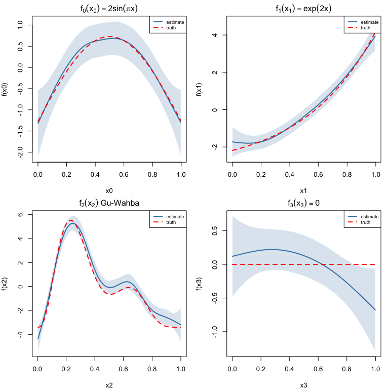
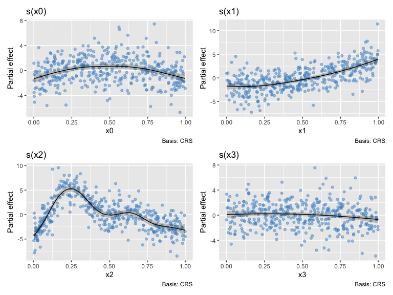
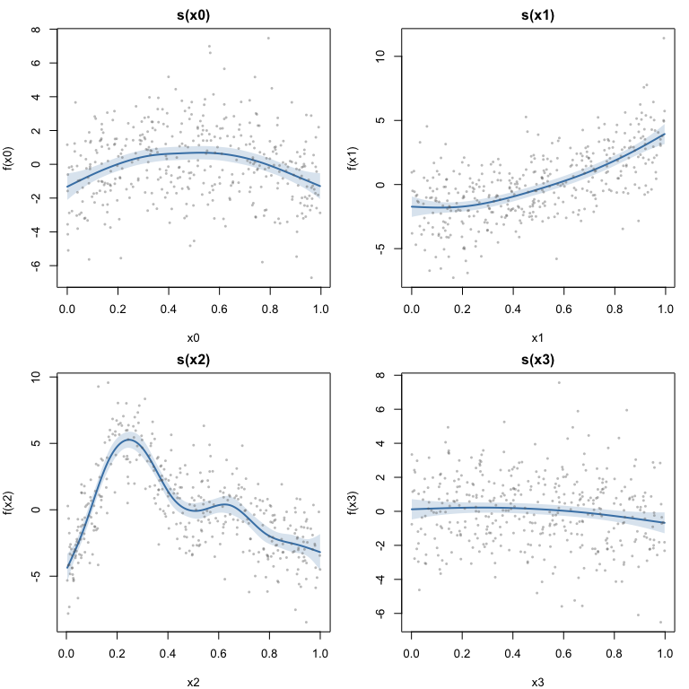
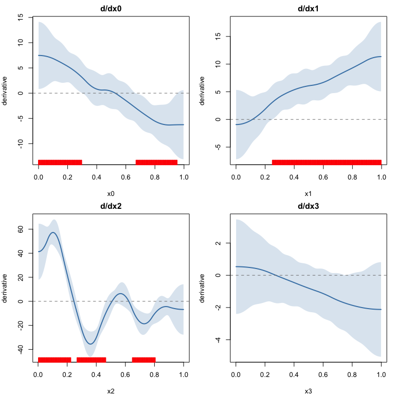
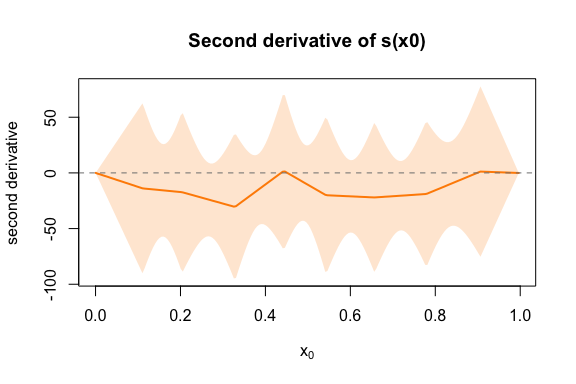
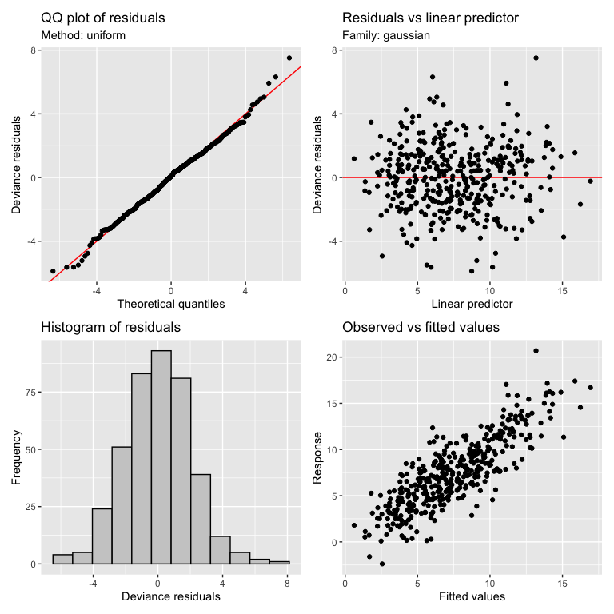
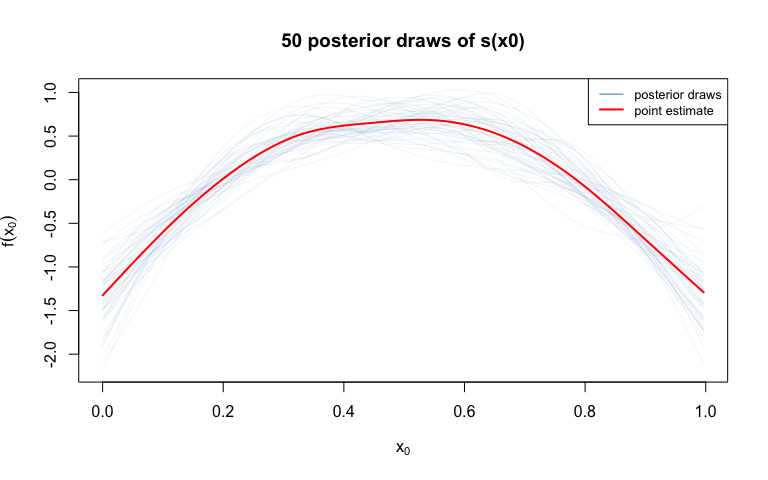

# Model Diagnostics and Visualization
Simon Frost

- [Introduction](#introduction)
- [Setup](#setup)
- [Load Gu–Wahba example data](#load-guwahba-example-data)
- [Fit the GAM](#fit-the-gam)
- [Model overview](#model-overview)
- [Smooth estimates](#smooth-estimates)
  - [Plotting smooth estimates with true
    functions](#plotting-smooth-estimates-with-true-functions)
  - [gratia’s built-in `draw`](#gratias-built-in-draw)
- [Partial residuals](#partial-residuals)
- [Derivatives](#derivatives)
  - [Plotting derivatives](#plotting-derivatives)
- [Model diagnostics with `appraise`](#model-diagnostics-with-appraise)
- [Posterior simulation](#posterior-simulation)
  - [Smooth samples (spaghetti plot)](#smooth-samples-spaghetti-plot)
  - [Fitted samples](#fitted-samples)
- [Concurvity](#concurvity)
- [Basis dimension check](#basis-dimension-check)
- [Summary](#summary)

## Introduction

This vignette demonstrates model diagnostics and visualization using
**mgcv** and **gratia** in R. We fit the same Gu & Wahba (1991) example
as the Julia vignette and compare diagnostic outputs.

## Setup

``` r
library(mgcv)
```

    Loading required package: nlme

    This is mgcv 1.9-3. For overview type 'help("mgcv-package")'.

``` r
library(gratia)
```

## Load Gu–Wahba example data

``` r
dat <- read.csv("../data.csv")
n <- nrow(dat)
x0 <- dat$x0; x1 <- dat$x1; x2 <- dat$x2; x3 <- dat$x3
y <- dat$y

f0 <- function(x) 2 * sin(pi * x)
f1 <- function(x) exp(2 * x)
f2 <- function(x) 0.2 * x^11 * (10 * (1 - x))^6 + 10 * (10 * x)^3 * (1 - x)^10
f3 <- function(x) rep(0, length(x))

head(dat)
```

              y        x0         x1        x2        x3
    1  2.992645 0.9148060 0.02270001 0.9090475 0.4018804
    2  4.697172 0.9370754 0.51323953 0.8999248 0.4322142
    3 13.935789 0.2861395 0.63072615 0.1923493 0.6636044
    4  5.713290 0.8304476 0.41877162 0.5322903 0.1823693
    5  7.634074 0.6417455 0.87926595 0.5221247 0.8383388
    6  9.800107 0.5190959 0.10798707 0.1603357 0.9173730

## Fit the GAM

``` r
m <- gam(y ~ s(x0, k = 10, bs = "cr") + s(x1, k = 10, bs = "cr") +
             s(x2, k = 10, bs = "cr") + s(x3, k = 10, bs = "cr"),
         data = dat, method = "REML")
summary(m)
```


    Family: gaussian 
    Link function: identity 

    Formula:
    y ~ s(x0, k = 10, bs = "cr") + s(x1, k = 10, bs = "cr") + s(x2, 
        k = 10, bs = "cr") + s(x3, k = 10, bs = "cr")

    Parametric coefficients:
                Estimate Std. Error t value Pr(>|t|)    
    (Intercept)   7.4951     0.1051   71.34   <2e-16 ***
    ---
    Signif. codes:  0 '***' 0.001 '**' 0.01 '*' 0.05 '.' 0.1 ' ' 1

    Approximate significance of smooth terms:
            edf Ref.df      F  p-value    
    s(x0) 3.426  4.236  8.946 7.47e-07 ***
    s(x1) 3.199  3.968 67.745  < 2e-16 ***
    s(x2) 7.834  8.631 68.148  < 2e-16 ***
    s(x3) 1.887  2.360  2.711   0.0578 .  
    ---
    Signif. codes:  0 '***' 0.001 '**' 0.01 '*' 0.05 '.' 0.1 ' ' 1

    R-sq.(adj) =  0.685   Deviance explained = 69.8%
    -REML = 881.96  Scale est. = 4.4158    n = 400

## Model overview

gratia’s `overview` provides a tidy summary of all smooth terms.

``` r
overview(m)
```


    Generalized Additive Model with 4 terms

      term  type      k   edf statistic p.value 
      <chr> <chr> <dbl> <dbl>     <dbl> <chr>   
    1 s(x0) CRS       9  3.43      8.95 < 0.001 
    2 s(x1) CRS       9  3.20     67.7  < 0.001 
    3 s(x2) CRS       9  7.83     68.1  < 0.001 
    4 s(x3) CRS       9  1.89      2.71 0.057796

## Smooth estimates

`smooth_estimates` evaluates each smooth on a regular grid with
pointwise standard errors.

``` r
se <- smooth_estimates(m, n = 200)
head(se)
```

    # A tibble: 6 × 9
      .smooth .type .by   .estimate   .se       x0    x1    x2    x3
      <chr>   <chr> <chr>     <dbl> <dbl>    <dbl> <dbl> <dbl> <dbl>
    1 s(x0)   CRS   <NA>      -1.32 0.392 0.000239    NA    NA    NA
    2 s(x0)   CRS   <NA>      -1.29 0.379 0.00525     NA    NA    NA
    3 s(x0)   CRS   <NA>      -1.25 0.366 0.0103      NA    NA    NA
    4 s(x0)   CRS   <NA>      -1.21 0.353 0.0153      NA    NA    NA
    5 s(x0)   CRS   <NA>      -1.18 0.341 0.0203      NA    NA    NA
    6 s(x0)   CRS   <NA>      -1.14 0.329 0.0253      NA    NA    NA

### Plotting smooth estimates with true functions

``` r
true_fns <- list(f0, f1, f2, f3)
x_vars <- c("x0", "x1", "x2", "x3")
fn_labels <- c(
  expression(f[0](x[0]) == 2*sin(pi*x)),
  expression(f[1](x[1]) == exp(2*x)),
  expression(f[2](x[2]) ~ "Gu-Wahba"),
  expression(f[3](x[3]) == 0)
)

par(mfrow = c(2, 2), mar = c(4, 4, 2, 1))
for (i in 1:4) {
  se_i <- smooth_estimates(m, select = paste0("s(", x_vars[i], ")"), n = 200)
  x_grid <- se_i[[x_vars[i]]]
  est <- se_i[[".estimate"]]
  se_vals <- se_i[[".se"]]

  f_grid <- true_fns[[i]](x_grid)
  f_grid <- f_grid - mean(f_grid)

  ylims <- range(c(est - 2 * se_vals, est + 2 * se_vals, f_grid))
  plot(x_grid, est, type = "l", lwd = 2, col = "steelblue",
       ylim = ylims, xlab = x_vars[i], ylab = paste0("f(", x_vars[i], ")"),
       main = fn_labels[i])
  polygon(c(x_grid, rev(x_grid)),
          c(est - 2 * se_vals, rev(est + 2 * se_vals)),
          col = adjustcolor("steelblue", alpha.f = 0.2), border = NA)
  lines(x_grid, f_grid, lty = 2, lwd = 2, col = "red")
  legend("topright", c("estimate", "truth"), lty = c(1, 2),
         col = c("steelblue", "red"), lwd = 2, cex = 0.7, bg = "white")
}
```



### gratia’s built-in `draw`

``` r
draw(m, residuals = TRUE, rug = FALSE)
```



## Partial residuals

Partial residuals overlaid on smooth estimates show how well the smooth
captures the data pattern.

``` r
par(mfrow = c(2, 2), mar = c(4, 4, 2, 1))
x_data <- list(x0, x1, x2, x3)
pr <- partial_residuals(m)

for (i in 1:4) {
  se_i <- smooth_estimates(m, select = paste0("s(", x_vars[i], ")"), n = 200)
  x_grid <- se_i[[x_vars[i]]]
  est <- se_i[[".estimate"]]
  se_vals <- se_i[[".se"]]

  plot(x_grid, est, type = "l", lwd = 2, col = "steelblue",
       xlab = x_vars[i], ylab = paste0("f(", x_vars[i], ")"),
       main = paste0("s(", x_vars[i], ")"),
       ylim = range(c(est - 2 * se_vals, est + 2 * se_vals, pr[[i]])))
  polygon(c(x_grid, rev(x_grid)),
          c(est - 2 * se_vals, rev(est + 2 * se_vals)),
          col = adjustcolor("steelblue", alpha.f = 0.2), border = NA)
  points(x_data[[i]], pr[[i]], pch = 16, cex = 0.5, col = adjustcolor("grey40", 0.4))
}
```



## Derivatives

`derivatives` computes finite-difference derivatives with confidence
intervals.

``` r
d <- derivatives(m, type = "central", n = 200)
head(d)
```

    # A tibble: 6 × 12
      .smooth .by   .fs   .derivative   .se .crit .lower_ci .upper_ci       x0    x1
      <chr>   <chr> <chr>       <dbl> <dbl> <dbl>     <dbl>     <dbl>    <dbl> <dbl>
    1 s(x0)   <NA>  <NA>         7.48  3.39  1.96     0.833      14.1 0.000239    NA
    2 s(x0)   <NA>  <NA>         7.47  3.39  1.96     0.838      14.1 0.00525     NA
    3 s(x0)   <NA>  <NA>         7.47  3.38  1.96     0.853      14.1 0.0103      NA
    4 s(x0)   <NA>  <NA>         7.46  3.36  1.96     0.879      14.0 0.0153      NA
    5 s(x0)   <NA>  <NA>         7.45  3.34  1.96     0.914      14.0 0.0203      NA
    6 s(x0)   <NA>  <NA>         7.44  3.31  1.96     0.959      13.9 0.0253      NA
    # ℹ 2 more variables: x2 <dbl>, x3 <dbl>

### Plotting derivatives

``` r
par(mfrow = c(2, 2), mar = c(4, 4, 2, 1))
for (i in 1:4) {
  d_i <- derivatives(m, select = paste0("s(", x_vars[i], ")"),
                     type = "central", n = 200)
  x_grid <- d_i[[x_vars[i]]]
  deriv <- d_i[[".derivative"]]
  lower <- d_i[[".lower_ci"]]
  upper <- d_i[[".upper_ci"]]
  sig <- (lower > 0) | (upper < 0)

  ylims <- range(c(lower, upper))
  plot(x_grid, deriv, type = "l", lwd = 2, col = "steelblue",
       ylim = ylims, xlab = x_vars[i], ylab = "derivative",
       main = paste0("d/d", x_vars[i]))
  polygon(c(x_grid, rev(x_grid)),
          c(lower, rev(upper)),
          col = adjustcolor("steelblue", alpha.f = 0.2), border = NA)
  abline(h = 0, lty = 2, col = "grey50")

  if (any(sig)) {
    rug(x_grid[sig], col = "red", lwd = 2, side = 1)
  }
}
```



Second-order derivatives:

``` r
d2 <- derivatives(m, select = "s(x0)", order = 2, n = 200)
x_grid <- d2[["x0"]]
deriv <- d2[[".derivative"]]
lower <- d2[[".lower_ci"]]
upper <- d2[[".upper_ci"]]

plot(x_grid, deriv, type = "l", lwd = 2, col = "darkorange",
     ylim = range(c(lower, upper)),
     xlab = expression(x[0]), ylab = "second derivative",
     main = "Second derivative of s(x0)")
polygon(c(x_grid, rev(x_grid)),
        c(lower, rev(upper)),
        col = adjustcolor("darkorange", alpha.f = 0.2), border = NA)
abline(h = 0, lty = 2, col = "grey50")
```



## Model diagnostics with `appraise`

`appraise` produces the four standard diagnostic plots: QQ, residuals vs
linear predictor, histogram, and observed vs fitted.

``` r
appraise(m)
```



## Posterior simulation

### Smooth samples (spaghetti plot)

`smooth_samples` draws posterior realizations of individual smooth
functions.

``` r
ss <- smooth_samples(m, select = "s(x0)", n = 50, seed = 42)

se_x0 <- smooth_estimates(m, select = "s(x0)", n = 100)
x_grid <- se_x0[["x0"]]
est <- se_x0[[".estimate"]]

draws <- unique(ss[[".draw"]])
ylims <- range(ss[[".value"]])

plot(NULL, xlim = range(x_grid), ylim = ylims,
     xlab = expression(x[0]), ylab = expression(f(x[0])),
     main = "50 posterior draws of s(x0)")
for (dr in draws) {
  idx <- ss[[".draw"]] == dr
  lines(ss[["x0"]][idx], ss[[".value"]][idx],
        col = adjustcolor("steelblue", 0.15), lwd = 0.5)
}
lines(x_grid, est, col = "red", lwd = 2)
legend("topright", c("posterior draws", "point estimate"),
       col = c("steelblue", "red"), lwd = c(1, 2), cex = 0.8)
```



### Fitted samples

`fitted_samples` draws posterior samples of fitted values.

``` r
fs <- fitted_samples(m, n = 200, seed = 42)
cat("Fitted samples: ", nrow(fs), "rows x", length(unique(fs[[".draw"]])), "draws\n")
```

    Fitted samples:  80000 rows x 200 draws

## Concurvity

``` r
model_concurvity(m)
```

    # A tibble: 15 × 3
       .type    .term .concurvity
       <chr>    <chr>       <dbl>
     1 worst    para     2.37e-30
     2 worst    s(x0)    1.28e- 1
     3 worst    s(x1)    1.39e- 1
     4 worst    s(x2)    1.32e- 1
     5 worst    s(x3)    1.68e- 1
     6 observed para     2.37e-30
     7 observed s(x0)    4.14e- 2
     8 observed s(x1)    5.32e- 2
     9 observed s(x2)    5.35e- 2
    10 observed s(x3)    5.79e- 2
    11 estimate para     2.37e-30
    12 estimate s(x0)    6.57e- 2
    13 estimate s(x1)    7.44e- 2
    14 estimate s(x2)    6.23e- 2
    15 estimate s(x3)    7.25e- 2

Pairwise concurvity:

``` r
model_concurvity(m, pairwise = TRUE)
```

    # A tibble: 75 × 4
       .type .term .with .concurvity
       <chr> <chr> <chr>       <dbl>
     1 worst para  para     1   e+ 0
     2 worst para  s(x0)    4.28e-31
     3 worst para  s(x1)    3.05e-31
     4 worst para  s(x2)    2.95e-31
     5 worst para  s(x3)    4.67e-31
     6 worst s(x0) para     3.45e-31
     7 worst s(x0) s(x0)    1   e+ 0
     8 worst s(x0) s(x1)    6.60e- 2
     9 worst s(x0) s(x2)    8.55e- 2
    10 worst s(x0) s(x3)    5.08e- 2
    # ℹ 65 more rows

## Basis dimension check

``` r
k.check(m)
```

          k'      edf   k-index p-value
    s(x0)  9 3.426140 1.0475474  0.8000
    s(x1)  9 3.199210 1.0197537  0.6525
    s(x2)  9 7.833919 1.0422706  0.7900
    s(x3)  9 1.886556 0.9756429  0.2925

## Summary

Both GAM.jl and gratia provide equivalent diagnostic interfaces:

| gratia (R)            | GAM.jl (Julia)        |
|-----------------------|-----------------------|
| `overview()`          | `overview()`          |
| `smooth_estimates()`  | `smooth_estimates()`  |
| `derivatives()`       | `derivatives()`       |
| `appraise()`          | `appraise()`          |
| `posterior_samples()` | `posterior_samples()` |
| `fitted_samples()`    | `fitted_samples()`    |
| `smooth_samples()`    | `smooth_samples()`    |
| `partial_residuals()` | `partial_residuals()` |
| `model_concurvity()`  | `concurvity()`        |
| `k.check()`           | `k_check()`           |
