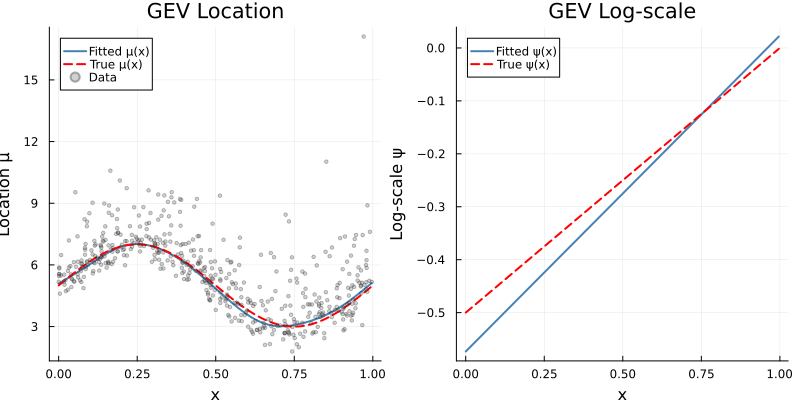
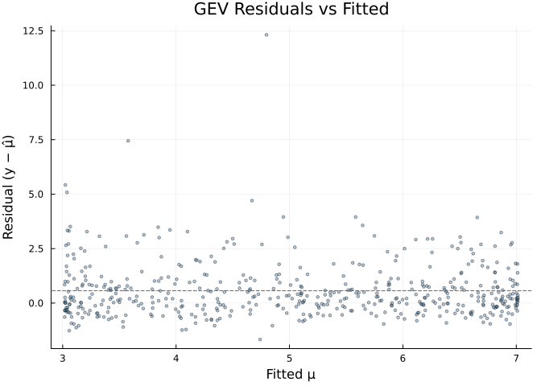
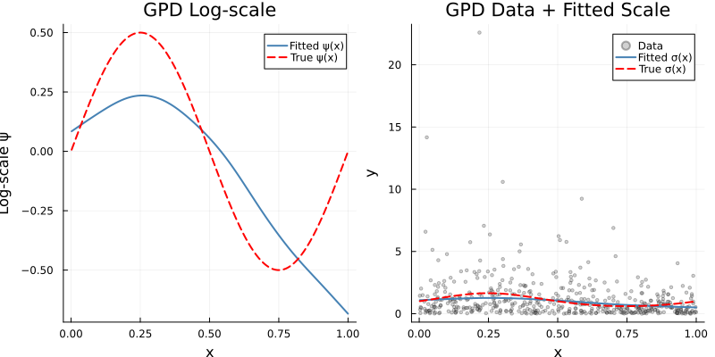
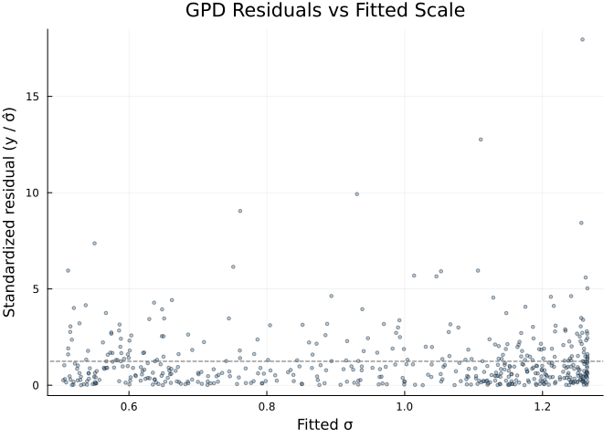

# Extreme Value GAMs
Simon Frost

- [Introduction](#introduction)
- [Setup](#setup)
- [GEV model](#gev-model)
  - [Simulate GEV data](#simulate-gev-data)
  - [Fit the GEV model](#fit-the-gev-model)
  - [Examine parameter estimates](#examine-parameter-estimates)
  - [Compare fitted vs true
    functions](#compare-fitted-vs-true-functions)
  - [GEV fitted vs true plots](#gev-fitted-vs-true-plots)
  - [GEV residual diagnostics](#gev-residual-diagnostics)
- [GPD model](#gpd-model)
  - [Simulate GPD data](#simulate-gpd-data)
  - [Fit the GPD model](#fit-the-gpd-model)
  - [Examine GPD estimates](#examine-gpd-estimates)
  - [GPD fitted vs true plots](#gpd-fitted-vs-true-plots)
  - [GPD residual diagnostics](#gpd-residual-diagnostics)
- [Model structure](#model-structure)
- [Summary](#summary)

## Introduction

Extreme value theory (EVT) provides a principled framework for modeling
the tails of distributions. Two key models are:

- **Generalized Extreme Value (GEV)** distribution for block maxima:
  $Y \sim \text{GEV}(\mu, \sigma, \xi)$ with CDF
  $$F(y) = \exp\left\{-\left[1 + \xi\left(\frac{y-\mu}{\sigma}\right)\right]^{-1/\xi}\right\}$$

- **Generalized Pareto Distribution (GPD)** for threshold exceedances:
  $Y \mid Y > u \sim \text{GPD}(\sigma, \xi)$ with survival function
  $$\bar{F}(y) = \left[1 + \xi\left(\frac{y-u}{\sigma}\right)\right]^{-1/\xi}$$

GAM.jl’s `evgam` function fits **multi-parameter GAMs** where each
distribution parameter can depend on covariates through smooth
functions, following the approach of the R
[evgam](https://cran.r-project.org/package=evgam) package.

## Setup

``` julia
using GAM
using StatsAPI: fitted
using LinearAlgebra: diag
using DataFrames
using CSV
using Random
using Statistics
using Plots
```

## GEV model

### Simulate GEV data

We generate block maxima where the location and scale vary smoothly with
a covariate $x$:

- Location: $\mu(x) = 5 + 2\sin(2\pi x)$
- Log-scale: $\log\sigma(x) = -0.5 + 0.5x$, so
  $\sigma(x) = \exp(-0.5 + 0.5x)$
- Shape: $\xi = 0.1$ (constant; $\xi > 0$ puts us in the heavy-tailed
  Fréchet domain, though a shape this small gives only a mildly heavy
  upper tail)

Note the support condition: the GEV density is positive only where
$1 + \xi(y-\mu)/\sigma > 0$ (and similarly $1 + \xi(y-u)/\sigma > 0$ for
the GPD below).

The dataset is a checked-in CSV generated by
`vignettes/generate_data.jl` from exactly this process, so the data and
the description above cannot drift apart.

``` julia
df_gev = CSV.read("data_gev.csv", DataFrame)
n = nrow(df_gev)
x = df_gev.x
y_gev = df_gev.y

mu_true = 5.0 .+ 2.0 .* sin.(2π .* x)
logsigma_true = -0.5 .+ 0.5 .* x
sigma_true = exp.(logsigma_true)
xi_true = 0.1

println("GEV data: n = $(nrow(df_gev)), y range = [$(round(minimum(y_gev), digits=2)), $(round(maximum(y_gev), digits=2))]")
```

    GEV data: n = 500, y range = [1.48, 13.16]

### Fit the GEV model

We specify one formula per distribution parameter. The GEV has three
parameters: location $\mu$, log-scale $\psi = \log\sigma$, and shape
$\xi$.

``` julia
m_gev = evgam(
    [@formula(y ~ s(x, k=10, bs=:cr)),   # location μ(x)
     @formula(y ~ s(x, k=8, bs=:cr)),    # log-scale ψ(x)
     @formula(y ~ 1)],                    # shape ξ (constant)
    df_gev,
    GEVFamily()
);
```

### Examine parameter estimates

``` julia
println("Number of parameters: ", nparams(m_gev))
println("Converged: ", m_gev.converged)
println("Negative log-likelihood: ", round(m_gev.nll, digits=2))
println("REML score: ", round(m_gev.reml, digits=2))
```

    Number of parameters: 3
    Converged: true
    Negative log-likelihood: 671.12
    REML score: 697.4

Location parameter coefficients and fitted values:

``` julia
mu_coefs = param_coef(m_gev, 1)
mu_hat = param_eta(m_gev, 1)
println("Location coefficients (first 5): ", round.(mu_coefs[1:min(5, length(mu_coefs))], digits=3))
println("Location fitted range: [$(round(minimum(mu_hat), digits=2)), $(round(maximum(mu_hat), digits=2))]")
println("Location true range: [$(round(minimum(mu_true), digits=2)), $(round(maximum(mu_true), digits=2))]")
```

    Location coefficients (first 5): [4.883, 1.383, 1.958, 1.557, 0.484]
    Location fitted range: [2.75, 6.9]
    Location true range: [3.0, 7.0]

Log-scale parameter:

``` julia
psi_coefs = param_coef(m_gev, 2)
psi_hat = param_eta(m_gev, 2)
println("Log-scale coefficients (first 5): ", round.(psi_coefs[1:min(5, length(psi_coefs))], digits=3))
println("Log-scale fitted range: [$(round(minimum(psi_hat), digits=2)), $(round(maximum(psi_hat), digits=2))]")
println("Log-scale true range: [$(round(minimum(logsigma_true), digits=2)), $(round(maximum(logsigma_true), digits=2))]")
```

    Log-scale coefficients (first 5): [-0.305, -0.118, -0.084, -0.041, 0.058]
    Log-scale fitted range: [-0.51, 0.09]
    Log-scale true range: [-0.5, -0.0]

Shape parameter (constant):

``` julia
xi_coefs = param_coef(m_gev, 3)
println("Shape coefficient: ", round(xi_coefs[1], digits=4))
println("True shape: ", xi_true)
```

    Shape coefficient: 0.121
    True shape: 0.1

### Compare fitted vs true functions

``` julia
ord = sortperm(x)
x_sorted = x[ord]

cor_mu = cor(mu_hat, mu_true)
cor_psi = cor(psi_hat, logsigma_true)
println("Correlation (fitted vs true location): ", round(cor_mu, digits=4))
println("Correlation (fitted vs true log-scale): ", round(cor_psi, digits=4))
println("RMSE (location): ", round(sqrt(mean((mu_hat .- mu_true).^2)), digits=3))
println("RMSE (log-scale): ", round(sqrt(mean((psi_hat .- logsigma_true).^2)), digits=3))
```

    Correlation (fitted vs true location): 0.9977
    Correlation (fitted vs true log-scale): 0.9554
    RMSE (location): 0.109
    RMSE (log-scale): 0.089

### GEV fitted vs true plots

``` julia
p1 = plot(x_sorted, mu_hat[ord], label="Fitted μ(x)", color=:steelblue, lw=2,
          xlabel="x", ylabel="Location μ", title="GEV Location")
plot!(p1, x_sorted, mu_true[ord], label="True μ(x)", color=:red, ls=:dash, lw=2)
scatter!(p1, x, y_gev, label="Data", color=:grey40, markersize=2, alpha=0.3)

p2 = plot(x_sorted, psi_hat[ord], label="Fitted ψ(x)", color=:steelblue, lw=2,
          xlabel="x", ylabel="Log-scale ψ", title="GEV Log-scale")
plot!(p2, x_sorted, logsigma_true[ord], label="True ψ(x)", color=:red, ls=:dash, lw=2)

plot(p1, p2; layout=(1, 2), size=(800, 400))
```



### GEV residual diagnostics

``` julia
resid_gev = y_gev .- mu_hat
# Under a GEV, y − μ has mean σ(Γ(1−ξ) − 1)/ξ > 0, so the residual cloud is
# centred above zero by construction; the dashed line marks that expectation.
using Distributions: GeneralizedExtremeValue
ξ̂ = param_coef(m_gev, 3)[1]
gev_resid_mean = mean(mean(GeneralizedExtremeValue(0.0, s, ξ̂)) for s in exp.(psi_hat))
scatter(mu_hat, resid_gev, xlabel="Fitted μ", ylabel="Residual (y − μ̂)",
        title="GEV Residuals vs Fitted", color=:steelblue, markersize=2, alpha=0.4,
        legend=false)
hline!([gev_resid_mean], color=:grey40, ls=:dash)
```



## GPD model

### Simulate GPD data

For threshold exceedances, we simulate GPD data with covariate-dependent
scale:

- Log-scale: $\log\sigma(x) = 0.5\sin(2\pi x)$
- Shape: $\xi = 0.15$ (constant)

As with the GEV data, this dataset is generated by
`vignettes/generate_data.jl` from exactly this process.

``` julia
df_gpd = CSV.read("data_gpd.csv", DataFrame)
n_gpd = nrow(df_gpd)
x_gpd = df_gpd.x
y_gpd = df_gpd.y

logsigma_gpd_true = 0.5 .* sin.(2π .* x_gpd)
sigma_gpd_true = exp.(logsigma_gpd_true)
xi_gpd_true = 0.15

println("GPD data: n = $(nrow(df_gpd)), y range = [$(round(minimum(y_gpd), digits=2)), $(round(maximum(y_gpd), digits=2))]")
```

    GPD data: n = 500, y range = [0.0, 22.59]

### Fit the GPD model

The GPD has two parameters: log-scale $\psi = \log\sigma$ and shape
$\xi$.

``` julia
m_gpd = evgam(
    [@formula(y ~ s(x, k=10, bs=:cr)),   # log-scale ψ(x)
     @formula(y ~ 1)],                    # shape ξ (constant)
    df_gpd,
    GPDFamily()
);
```

### Examine GPD estimates

``` julia
println("Converged: ", m_gpd.converged)
println("Negative log-likelihood: ", round(m_gpd.nll, digits=2))

psi_gpd_hat = param_eta(m_gpd, 1)
xi_gpd_hat = param_coef(m_gpd, 2)

println("Log-scale fitted range: [$(round(minimum(psi_gpd_hat), digits=2)), $(round(maximum(psi_gpd_hat), digits=2))]")
println("Log-scale true range: [$(round(minimum(logsigma_gpd_true), digits=2)), $(round(maximum(logsigma_gpd_true), digits=2))]")
println("Shape estimate: ", round(xi_gpd_hat[1], digits=4))
println("True shape: ", xi_gpd_true)

cor_gpd = cor(psi_gpd_hat, logsigma_gpd_true)
println("Correlation (fitted vs true log-scale): ", round(cor_gpd, digits=4))
```

    Converged: true
    Negative log-likelihood: 551.9
    Log-scale fitted range: [-0.68, 0.24]
    Log-scale true range: [-0.5, 0.5]
    Shape estimate: 0.1949
    True shape: 0.15
    Correlation (fitted vs true log-scale): 0.8032

### GPD fitted vs true plots

``` julia
ord_gpd = sortperm(x_gpd)
x_gpd_sorted = x_gpd[ord_gpd]

p3 = plot(x_gpd_sorted, psi_gpd_hat[ord_gpd], label="Fitted ψ(x)", color=:steelblue, lw=2,
          xlabel="x", ylabel="Log-scale ψ", title="GPD Log-scale")
plot!(p3, x_gpd_sorted, logsigma_gpd_true[ord_gpd], label="True ψ(x)", color=:red, ls=:dash, lw=2)

p4 = scatter(x_gpd, y_gpd, label="Data", color=:grey40, markersize=2, alpha=0.3,
             xlabel="x", ylabel="y", title="GPD Data + Fitted Scale")
plot!(p4, x_gpd_sorted, exp.(psi_gpd_hat[ord_gpd]), label="Fitted σ(x)", color=:steelblue, lw=2)
plot!(p4, x_gpd_sorted, sigma_gpd_true[ord_gpd], label="True σ(x)", color=:red, ls=:dash, lw=2)

plot(p3, p4; layout=(1, 2), size=(800, 400))
```



### GPD residual diagnostics

``` julia
sigma_gpd_hat = exp.(psi_gpd_hat)
resid_gpd = y_gpd ./ sigma_gpd_hat
# E[y/σ] = 1/(1 − ξ) for a GPD, so the reference line sits at that value,
# not at 1.
ξ̂_gpd = xi_gpd_hat[1]
scatter(sigma_gpd_hat, resid_gpd, xlabel="Fitted σ", ylabel="Standardized residual (y / σ̂)",
        title="GPD Residuals vs Fitted Scale", color=:steelblue, markersize=2, alpha=0.4,
        legend=false)
hline!([1.0 / (1.0 - ξ̂_gpd)], color=:grey40, ls=:dash)
```



## Model structure

The `MultiParameterModel` returned by `evgam` stores:

``` julia
println("Type: ", typeof(m_gev))
println("Total coefficients: ", length(m_gev.coefficients))
println("EDFs: ", round.(m_gev.edf, digits=2))
println("Log smoothing parameters: ", round.(m_gev.sp, digits=2))
println("Covariance matrix size: ", size(m_gev.Vp))
```

    Type: MultiParameterModel{GEVFamily}
    Total coefficients: 19
    EDFs: [1.0, 0.89, 0.94, 0.85, 0.87, 0.84, 0.79, 0.83, 0.81, 0.83, 1.0, 0.14, 0.24, 0.24, 0.28, 0.26, 0.5, 0.34, 1.0]
    Log smoothing parameters: [3.24, 8.34]
    Covariance matrix size: (19, 19)

Standard errors via the posterior covariance:

``` julia
se_all = sqrt.(diag(m_gev.Vp))
println("Standard errors (first 5): ", round.(se_all[1:min(5, length(se_all))], digits=4))
```

    Standard errors (first 5): [0.039, 0.1014, 0.0852, 0.0932, 0.0926]

## Summary

GAM.jl’s `evgam` provides:

| Feature                 | Description                                  |
|-------------------------|----------------------------------------------|
| `GEVFamily()`           | GEV distribution (3 parameters: μ, log σ, ξ) |
| `GPDFamily()`           | GPD distribution (2 parameters: log σ, ξ)    |
| Multi-formula interface | One formula per distribution parameter       |
| REML smoothing          | Automatic smoothing parameter estimation     |
| `param_coef(m, k)`      | Coefficients for parameter k                 |
| `param_eta(m, k)`       | Fitted linear predictor for parameter k      |
