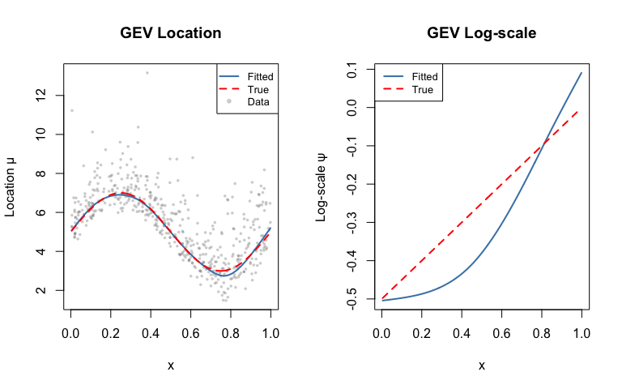
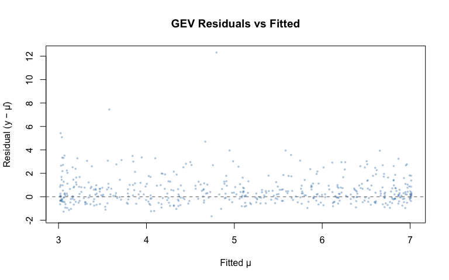
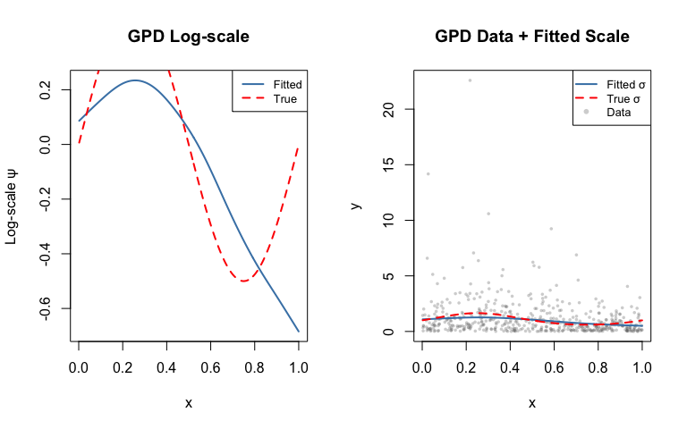
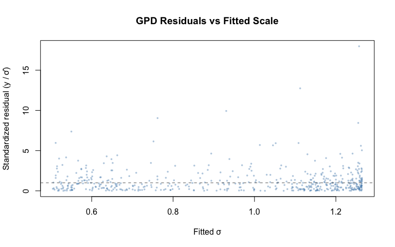

# Extreme Value GAMs
Simon Frost

- [Introduction](#introduction)
- [Setup](#setup)
- [GEV model](#gev-model)
  - [Load GEV data](#load-gev-data)
  - [Fit the GEV model](#fit-the-gev-model)
  - [Examine parameter estimates](#examine-parameter-estimates)
  - [Compare fitted vs true](#compare-fitted-vs-true)
  - [GEV fitted vs true plots](#gev-fitted-vs-true-plots)
  - [GEV residual diagnostics](#gev-residual-diagnostics)
- [GPD model](#gpd-model)
  - [Load GPD data](#load-gpd-data)
  - [Fit the GPD model](#fit-the-gpd-model)
  - [Examine GPD estimates](#examine-gpd-estimates)
  - [GPD fitted vs true plots](#gpd-fitted-vs-true-plots)
  - [GPD residual diagnostics](#gpd-residual-diagnostics)
- [Comparison with Julia](#comparison-with-julia)

## Introduction

This vignette demonstrates extreme value GAMs using the R **evgam**
package, fitting the same simulated data as the Julia vignette for
comparison.

## Setup

``` r
library(evgam)
library(mgcv)
```

    Loading required package: nlme

    This is mgcv 1.9-4. For overview type '?mgcv'.

## GEV model

### Load GEV data

We load the same data as the Julia vignette: block maxima with
covariate-dependent location and scale.

``` r
dat_gev <- read.csv("../data_gev.csv")
n <- nrow(dat_gev)
x <- dat_gev$x
y_gev <- dat_gev$y

mu_true <- 5 + 2 * sin(2 * pi * x)
logsigma_true <- -0.5 + 0.5 * x
sigma_true <- exp(logsigma_true)
xi_true <- 0.1

summary(dat_gev)
```

           y                x           
     Min.   : 1.478   Min.   :0.004638  
     1st Qu.: 3.939   1st Qu.:0.283245  
     Median : 5.620   Median :0.518871  
     Mean   : 5.413   Mean   :0.511419  
     3rd Qu.: 6.661   3rd Qu.:0.754566  
     Max.   :13.157   Max.   :0.997954  

### Fit the GEV model

In R evgam, we specify a list of formulas—one per distribution
parameter.

``` r
m_gev <- evgam(
  list(y ~ s(x, k = 10, bs = "cr"),   # location μ(x)
       ~ s(x, k = 8, bs = "cr"),       # log-scale ψ(x)
       ~ 1),                            # shape ξ (constant)
  data = dat_gev,
  family = "gev"
)
summary(m_gev)
```


    ** Parametric terms **

    location
                Estimate Std. Error t value Pr(>|t|)
    (Intercept)     4.88       0.04  125.34   <2e-16

    logscale
                Estimate Std. Error t value Pr(>|t|)
    (Intercept)    -0.31       0.04   -7.76 4.14e-15

    shape
                Estimate Std. Error t value Pr(>|t|)
    (Intercept)     0.12       0.04    3.26 0.000548

    ** Smooth terms **

    location
          edf max.df  Chi.sq Pr(>|t|)
    s(x) 7.65      9 1794.21   <2e-16

    logscale
          edf max.df Chi.sq Pr(>|t|)
    s(x) 2.02      7  24.01 6.33e-06

### Examine parameter estimates

``` r
mu_hat <- predict(m_gev)$location
psi_hat <- predict(m_gev)$logscale
xi_hat <- coef(m_gev)

cat("Location fitted range:", range(mu_hat), "\n")
```

    Location fitted range: 2.746228 6.901044 

``` r
cat("Location true range:", range(mu_true), "\n")
```

    Location true range: 3.000042 7 

``` r
cat("Correlation (location):", cor(mu_hat, mu_true), "\n")
```

    Correlation (location): 0.9977496 

``` r
cat("Log-scale fitted range:", range(psi_hat), "\n")
```

    Log-scale fitted range: -0.5041728 0.09042698 

``` r
cat("Log-scale true range:", range(logsigma_true), "\n")
```

    Log-scale true range: -0.497681 -0.001022947 

``` r
cat("Correlation (log-scale):", cor(psi_hat, logsigma_true), "\n")
```

    Correlation (log-scale): 0.9542529 

### Compare fitted vs true

``` r
rmse_mu <- sqrt(mean((mu_hat - mu_true)^2))
rmse_psi <- sqrt(mean((psi_hat - logsigma_true)^2))
cat("RMSE (location):", round(rmse_mu, 3), "\n")
```

    RMSE (location): 0.109 

``` r
cat("RMSE (log-scale):", round(rmse_psi, 3), "\n")
```

    RMSE (log-scale): 0.089 

### GEV fitted vs true plots

``` r
ord <- order(x)
x_sorted <- x[ord]

par(mfrow = c(1, 2))

plot(x, y_gev, col = adjustcolor("grey40", alpha.f = 0.3), pch = 16, cex = 0.5,
     xlab = "x", ylab = "Location μ", main = "GEV Location")
lines(x_sorted, mu_hat[ord], col = "steelblue", lwd = 2)
lines(x_sorted, mu_true[ord], col = "red", lty = 2, lwd = 2)
legend("topright", legend = c("Fitted", "True", "Data"),
       col = c("steelblue", "red", adjustcolor("grey40", 0.3)),
       lty = c(1, 2, NA), pch = c(NA, NA, 16), lwd = c(2, 2, NA), cex = 0.8)

plot(x_sorted, psi_hat[ord], type = "l", col = "steelblue", lwd = 2,
     xlab = "x", ylab = "Log-scale ψ", main = "GEV Log-scale")
lines(x_sorted, logsigma_true[ord], col = "red", lty = 2, lwd = 2)
legend("topleft", legend = c("Fitted", "True"),
       col = c("steelblue", "red"), lty = c(1, 2), lwd = 2, cex = 0.8)
```



### GEV residual diagnostics

``` r
par(mfrow = c(1, 1))
resid_gev <- y_gev - mu_hat
plot(mu_hat, resid_gev, col = adjustcolor("steelblue", alpha.f = 0.4), pch = 16, cex = 0.5,
     xlab = "Fitted μ", ylab = "Residual (y − μ̂)", main = "GEV Residuals vs Fitted")
abline(h = 0, col = "grey40", lty = 2)
```



## GPD model

### Load GPD data

``` r
dat_gpd <- read.csv("../data_gpd.csv")
n_gpd <- nrow(dat_gpd)
x_gpd <- dat_gpd$x
y_gpd <- dat_gpd$y

logsigma_gpd_true <- 0.5 * sin(2 * pi * x_gpd)
sigma_gpd_true <- exp(logsigma_gpd_true)
xi_gpd_true <- 0.15

summary(dat_gpd)
```

           y                   x           
     Min.   :2.818e-04   Min.   :0.002145  
     1st Qu.:2.376e-01   1st Qu.:0.254509  
     Median :7.053e-01   Median :0.513022  
     Mean   :1.198e+00   Mean   :0.505560  
     3rd Qu.:1.551e+00   3rd Qu.:0.780828  
     Max.   :2.259e+01   Max.   :0.999740  

### Fit the GPD model

``` r
m_gpd <- evgam(
  list(y ~ s(x, k = 10, bs = "cr"),   # log-scale ψ(x)
       ~ 1),                            # shape ξ (constant)
  data = dat_gpd,
  family = "gpd"
)
summary(m_gpd)
```


    ** Parametric terms **

    logscale
                Estimate Std. Error t value Pr(>|t|)
    (Intercept)    -0.09       0.07   -1.33   0.0924

    shape
                Estimate Std. Error t value Pr(>|t|)
    (Intercept)     0.19       0.05    3.69 0.000114

    ** Smooth terms **

    logscale
          edf max.df Chi.sq Pr(>|t|)
    s(x) 2.64      9  38.07 3.01e-07

### Examine GPD estimates

``` r
psi_gpd_hat <- predict(m_gpd)$logscale
cat("Log-scale fitted range:", range(psi_gpd_hat), "\n")
```

    Log-scale fitted range: -0.6840861 0.2342756 

``` r
cat("Log-scale true range:", range(logsigma_gpd_true), "\n")
```

    Log-scale true range: -0.4999779 0.4999539 

``` r
cat("Correlation (log-scale):", cor(psi_gpd_hat, logsigma_gpd_true), "\n")
```

    Correlation (log-scale): 0.8024528 

### GPD fitted vs true plots

``` r
ord_gpd <- order(x_gpd)
x_gpd_sorted <- x_gpd[ord_gpd]

par(mfrow = c(1, 2))

plot(x_gpd_sorted, psi_gpd_hat[ord_gpd], type = "l", col = "steelblue", lwd = 2,
     xlab = "x", ylab = "Log-scale ψ", main = "GPD Log-scale")
lines(x_gpd_sorted, logsigma_gpd_true[ord_gpd], col = "red", lty = 2, lwd = 2)
legend("topright", legend = c("Fitted", "True"),
       col = c("steelblue", "red"), lty = c(1, 2), lwd = 2, cex = 0.8)

sigma_gpd_hat <- exp(psi_gpd_hat)
plot(x_gpd, y_gpd, col = adjustcolor("grey40", alpha.f = 0.3), pch = 16, cex = 0.5,
     xlab = "x", ylab = "y", main = "GPD Data + Fitted Scale")
lines(x_gpd_sorted, sigma_gpd_hat[ord_gpd], col = "steelblue", lwd = 2)
lines(x_gpd_sorted, sigma_gpd_true[ord_gpd], col = "red", lty = 2, lwd = 2)
legend("topright", legend = c("Fitted σ", "True σ", "Data"),
       col = c("steelblue", "red", adjustcolor("grey40", 0.3)),
       lty = c(1, 2, NA), pch = c(NA, NA, 16), lwd = c(2, 2, NA), cex = 0.8)
```



### GPD residual diagnostics

``` r
par(mfrow = c(1, 1))
resid_gpd <- y_gpd / sigma_gpd_hat
plot(sigma_gpd_hat, resid_gpd, col = adjustcolor("steelblue", alpha.f = 0.4), pch = 16, cex = 0.5,
     xlab = "Fitted σ", ylab = "Standardized residual (y / σ̂)",
     main = "GPD Residuals vs Fitted Scale")
abline(h = 1, col = "grey40", lty = 2)
```



## Comparison with Julia

The R evgam and Julia GAM.jl `evgam` functions share the same interface
structure:

| R evgam | Julia GAM.jl |
|----|----|
| `evgam(list(y ~ s(x), ~ s(x), ~ 1), family="gev")` | `evgam([@formula(y ~ s(x)), @formula(y ~ s(x)), @formula(y ~ 1)], GEVFamily())` |
| `predict(m)$location` | `param_eta(m, 1)` |
| `predict(m)$logscale` | `param_eta(m, 2)` |
| `family = "gev"` | `GEVFamily()` |
| `family = "gpd"` | `GPDFamily()` |
