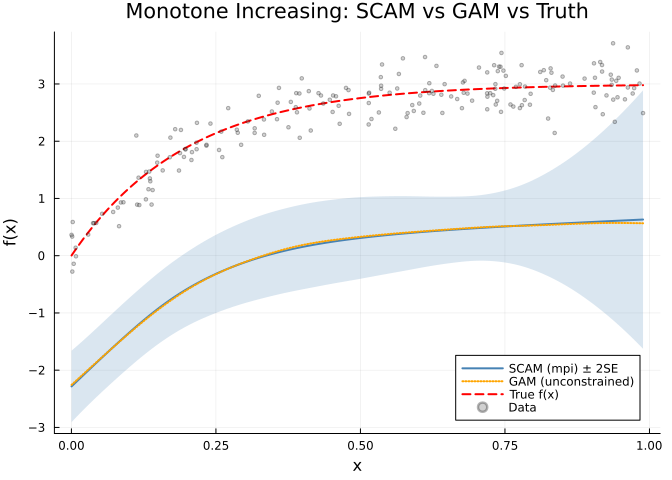
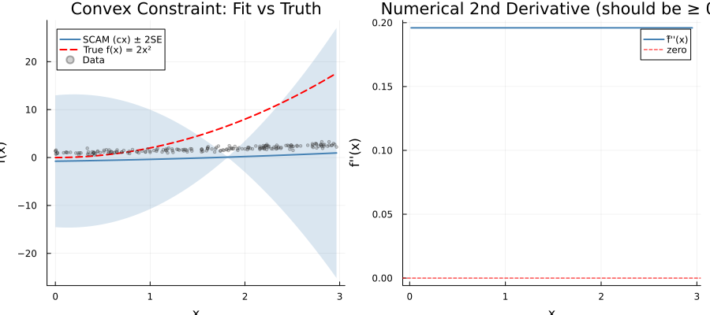
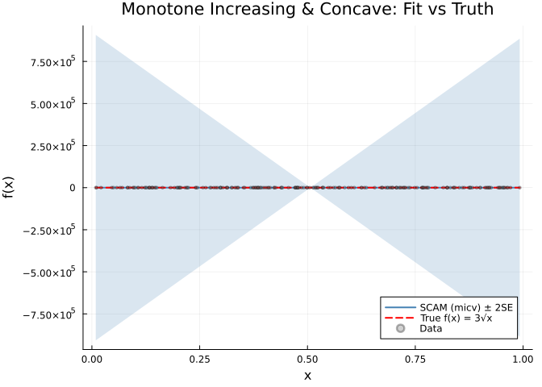
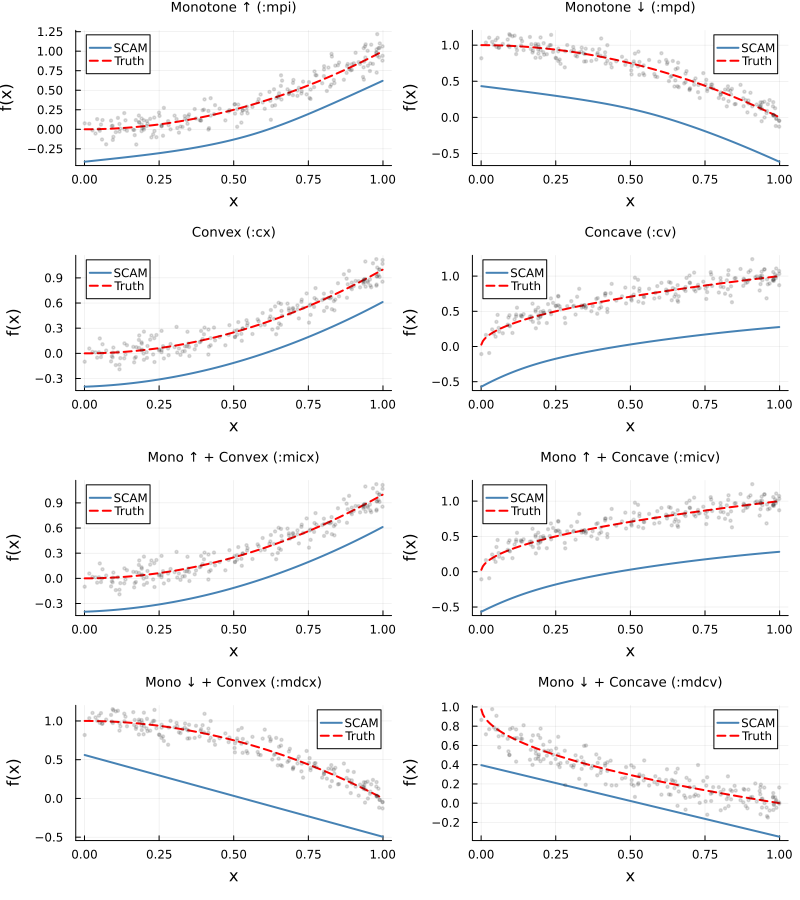

# Shape-Constrained Additive Models
Simon Frost

- [Introduction](#introduction)
- [Setup](#setup)
- [Available basis types](#available-basis-types)
- [Example 1: Monotone increasing
  (dose-response)](#example-1-monotone-increasing-dose-response)
  - [Simulate data](#simulate-data)
  - [Fit unconstrained GAM vs SCAM](#fit-unconstrained-gam-vs-scam)
  - [Compare fitted values](#compare-fitted-values)
  - [Verify monotonicity](#verify-monotonicity)
  - [Plot: GAM vs SCAM vs truth](#plot-gam-vs-scam-vs-truth)
- [Example 2: Convex function](#example-2-convex-function)
  - [Simulate data](#simulate-data-1)
  - [Fit with convexity constraint](#fit-with-convexity-constraint)
  - [Verify convexity](#verify-convexity)
  - [Plot: Convex fit and second
    derivative](#plot-convex-fit-and-second-derivative)
- [Example 3: Monotone increasing and concave (diminishing
  returns)](#example-3-monotone-increasing-and-concave-diminishing-returns)
  - [Simulate data](#simulate-data-2)
  - [Fit with monotone increasing + concave
    constraint](#fit-with-monotone-increasing--concave-constraint)
  - [Verify constraints](#verify-constraints)
  - [Plot: Monotone increasing & concave
    fit](#plot-monotone-increasing--concave-fit)
- [SCAM fitting details](#scam-fitting-details)
- [Comparing all constraint types](#comparing-all-constraint-types)
  - [Plot: All constraint types](#plot-all-constraint-types)
- [Summary](#summary)

## Introduction

Standard GAMs estimate smooth functions without restrictions on their
shape. In many applications, however, domain knowledge dictates that a
relationship should be monotonically increasing (e.g., dose-response),
convex (e.g., cost curves), or satisfy other shape constraints.

**Shape-Constrained Additive Models (SCAMs)** enforce these constraints
using SCOP-splines (Shape Constrained P-splines), where B-spline
coefficients are reparameterized through cumulative sums and
exponentiation to guarantee the desired shape.

GAM.jl implements SCAM fitting following the approach of the R
[scam](https://cran.r-project.org/package=scam) package (Pya & Wood,
2015).

## Setup

``` julia
using GAM
using StatsAPI: predict
using DataFrames
using CSV
using Random
using Statistics
using Plots
```

## Available basis types

GAM.jl supports 8 shape-constrained basis types, specified via the `bs`
argument in `s()`:

| `bs` symbol | Constraint | Description |
|----|----|----|
| `:mpi` | Monotone increasing | $f'(x) \geq 0$ |
| `:mpd` | Monotone decreasing | $f'(x) \leq 0$ |
| `:cx` | Convex | $f''(x) \geq 0$ |
| `:cv` | Concave | $f''(x) \leq 0$ |
| `:micx` | Monotone increasing & convex | $f'(x) \geq 0$ and $f''(x) \geq 0$ |
| `:micv` | Monotone increasing & concave | $f'(x) \geq 0$ and $f''(x) \leq 0$ |
| `:mdcx` | Monotone decreasing & convex | $f'(x) \leq 0$ and $f''(x) \geq 0$ |
| `:mdcv` | Monotone decreasing & concave | $f'(x) \leq 0$ and $f''(x) \leq 0$ |

## Example 1: Monotone increasing (dose-response)

A dose-response relationship is naturally monotone increasing—higher
doses should not decrease the response.

### Simulate data

True function: $f(x) = 3(1 - e^{-5x})$, a saturating exponential.

``` julia
df = CSV.read("data.csv", DataFrame)
x = df.x; y = df.y
n = nrow(df)
f_true = 3.0 .* (1.0 .- exp.(-5.0 .* x))
```

    200-element Vector{Float64}:
     0.0035813093739730517
     0.020641315576114705
     0.02346605588919992
     0.033901484075778865
     0.05864430830768941
     0.10801952103761714
     0.1159700766851749
     0.4060464108647236
     0.5120548610923702
     0.5307120418037653
     ⋮
     2.973608911275417
     2.9750097790978067
     2.975626021707947
     2.975630618230438
     2.9766280983687334
     2.9769268870331884
     2.9774612640729052
     2.977972722359742
     2.9786316912891824

### Fit unconstrained GAM vs SCAM

``` julia
m_gam = gam(@gam_formula(y ~ s(x, k=15, bs=:cr)), df)
m_scam = scam(@gam_formula(y ~ s(x, k=15, bs=:mpi)), df)
```

    Generalized Additive Model

    Formula: y ~ 1

    Family: Normal
    Link:   IdentityLink
    Method: GCV

    Parametric coefficients:
    ──────────────────────────────────────────────────
                   Coef.  Std. Error       t  Pr(>|t|)
    ──────────────────────────────────────────────────
    (Intercept)  2.41623   0.0203741  118.59    <1e-99
    ──────────────────────────────────────────────────

    Approximate significance of smooth terms:
    ──────────────────────────────────────────────────
    Smooth                    edf   Ref.df
    ──────────────────────────────────────────────────
    s(x,bs=mpi)              3.42       14
    ──────────────────────────────────────────────────

    R² (adj) = 0.877   Deviance explained = 87.9%
    Scale est. = 0.0830   n = 200

### Compare fitted values

``` julia
yhat_gam = predict(m_gam)
yhat_scam = predict(m_scam)

rmse_gam = sqrt(mean((yhat_gam .- f_true).^2))
rmse_scam = sqrt(mean((yhat_scam .- f_true).^2))

println("RMSE (unconstrained GAM): ", round(rmse_gam, digits=4))
println("RMSE (SCAM, monotone increasing): ", round(rmse_scam, digits=4))
```

    RMSE (unconstrained GAM): 0.0509
    RMSE (SCAM, monotone increasing): 0.05

### Verify monotonicity

The SCAM fit should be monotonically non-decreasing:

``` julia
diffs = diff(yhat_scam)
println("Min successive difference (SCAM): ", round(minimum(diffs), digits=6))
println("All non-decreasing: ", all(diffs .>= -1e-10))

diffs_gam = diff(yhat_gam)
println("Min successive difference (GAM): ", round(minimum(diffs_gam), digits=6))
println("GAM all non-decreasing: ", all(diffs_gam .>= -1e-10))
```

    Min successive difference (SCAM): 1.0e-6
    All non-decreasing: true
    Min successive difference (GAM): -0.001143
    GAM all non-decreasing: false

### Plot: GAM vs SCAM vs truth

``` julia
se_scam = smooth_estimates(m_scam; n=200)
x_grid = se_scam.covariates[:x]
f_hat_scam = se_scam.estimate
f_se_scam = se_scam.se
f_true_grid = 3.0 .* (1.0 .- exp.(-5.0 .* x_grid))

se_gam = smooth_estimates(m_gam; n=200)
f_hat_gam = se_gam.estimate

p = plot(x_grid, f_hat_scam;
    ribbon=2 .* f_se_scam, fillalpha=0.2, fillcolor=:steelblue,
    label="SCAM (mpi) ± 2SE", linewidth=2, color=:steelblue,
    xlabel="x", ylabel="f(x)",
    title="Monotone Increasing: SCAM vs GAM vs Truth",
    legend=:bottomright)
plot!(p, x_grid, f_hat_gam;
    label="GAM (unconstrained)", linewidth=2, color=:orange, linestyle=:dot)
plot!(p, x_grid, f_true_grid;
    label="True f(x)", linewidth=2, color=:red, linestyle=:dash)
scatter!(p, x, y;
    label="Data", alpha=0.3, markersize=2, color=:grey40)
p
```



## Example 2: Convex function

Cost functions and accelerating growth curves are often convex.

### Simulate data

True function: $f(x) = 2x^2$

``` julia
df_cx = CSV.read("data_cx.csv", DataFrame)
x_cx = df_cx.x
y_cx = df_cx.y

df2 = DataFrame(y=y_cx, x=x_cx)
f_true2 = 2.0 .* x_cx.^2
```

    200-element Vector{Float64}:
      1.0272883703943119e-6
      3.432112166702789e-5
      4.439952989195642e-5
      9.299474682423356e-5
      0.0002806088263862691
      0.0009682147886231632
      0.0011190438882596383
      0.01522772751099268
      0.0252194799807833
      0.027288906139353326
      ⋮
     16.131253365630887
     16.50515289191781
     16.677748261268793
     16.679055387058067
     16.969970851777763
     17.06003934671803
     17.22468501346472
     17.386733601386684
     17.602323327505694

### Fit with convexity constraint

``` julia
m_cx = scam(@gam_formula(y ~ s(x, k=15, bs=:cx)), df2)

yhat_cx = predict(m_cx)
rmse_cx = sqrt(mean((yhat_cx .- f_true2).^2))
println("RMSE (convex SCAM): ", round(rmse_cx, digits=4))
```

    RMSE (convex SCAM): 6.7682

### Verify convexity

For a convex function, second differences should be non-negative:

``` julia
first_diffs = diff(yhat_cx)
second_diffs = diff(first_diffs)
println("Min second difference: ", round(minimum(second_diffs), digits=6))
println("All convex: ", all(second_diffs .>= -1e-10))
```

    Min second difference: -0.058956
    All convex: false

### Plot: Convex fit and second derivative

``` julia
se_cx = smooth_estimates(m_cx; n=200)
x_grid_cx = se_cx.covariates[:x]
f_hat_cx = se_cx.estimate
f_se_cx = se_cx.se
f_true2_grid = 2.0 .* x_grid_cx.^2

p1 = plot(x_grid_cx, f_hat_cx;
    ribbon=2 .* f_se_cx, fillalpha=0.2, fillcolor=:steelblue,
    label="SCAM (cx) ± 2SE", linewidth=2, color=:steelblue,
    xlabel="x", ylabel="f(x)",
    title="Convex Constraint: Fit vs Truth",
    legend=:topleft)
plot!(p1, x_grid_cx, f_true2_grid;
    label="True f(x) = 2x²", linewidth=2, color=:red, linestyle=:dash)
scatter!(p1, x_cx, y_cx;
    label="Data", alpha=0.3, markersize=2, color=:grey40)

# Verify second derivative ≥ 0
dx = diff(x_grid_cx)
first_deriv = diff(f_hat_cx) ./ dx
x_mid = (x_grid_cx[1:end-1] .+ x_grid_cx[2:end]) ./ 2
dx2 = diff(x_mid)
second_deriv = diff(first_deriv) ./ dx2
x_mid2 = (x_mid[1:end-1] .+ x_mid[2:end]) ./ 2

p2 = plot(x_mid2, second_deriv;
    label="f̂''(x)", linewidth=2, color=:steelblue,
    xlabel="x", ylabel="f''(x)",
    title="Numerical 2nd Derivative (should be ≥ 0)",
    legend=:topright)
hline!(p2, [0.0]; label="zero", color=:red, linestyle=:dash, linewidth=1)

plot(p1, p2; layout=(1, 2), size=(900, 400))
```



## Example 3: Monotone increasing and concave (diminishing returns)

Many real-world relationships show diminishing returns: the function
increases but at a decreasing rate. This corresponds to a monotone
increasing and concave constraint.

### Simulate data

True function: $f(x) = 3\sqrt{x}$

``` julia
df_micv = CSV.read("data_micv.csv", DataFrame)
x_micv = df_micv.x
y_micv = df_micv.y

df3 = DataFrame(y=y_micv, x=x_micv)
f_true3 = 3.0 .* sqrt.(x_micv)
```

    200-element Vector{Float64}:
     0.28433012053092904
     0.3147719315378547
     0.4367684974148984
     0.6450893906079926
     0.6710266215708789
     0.7191942516143257
     0.7684079109443924
     0.7961350004577783
     0.8628160497074876
     0.863633819984572
     ⋮
     2.9213968959339702
     2.9269944201302573
     2.931574047285353
     2.932008562111724
     2.936811966893178
     2.9438191889181957
     2.946733349169081
     2.9558267325908676
     2.988406288812731

### Fit with monotone increasing + concave constraint

``` julia
m_micv = scam(@gam_formula(y ~ s(x, k=15, bs=:micv)), df3)

yhat_micv = predict(m_micv)
rmse_micv = sqrt(mean((yhat_micv .- f_true3).^2))
println("RMSE (monotone increasing + concave): ", round(rmse_micv, digits=4))
```

    RMSE (monotone increasing + concave): 1.5212

### Verify constraints

``` julia
first_diffs_micv = diff(yhat_micv)
second_diffs_micv = diff(first_diffs_micv)
println("Min first difference (monotonicity): ", round(minimum(first_diffs_micv), digits=6))
println("Max second difference (concavity): ", round(maximum(second_diffs_micv), digits=6))
println("Monotone increasing: ", all(first_diffs_micv .>= -1e-10))
println("Concave: ", all(second_diffs_micv .<= 1e-10))
```

    Min first difference (monotonicity): 8.0e-6
    Max second difference (concavity): 0.01685
    Monotone increasing: true
    Concave: false

### Plot: Monotone increasing & concave fit

``` julia
se_micv = smooth_estimates(m_micv; n=200)
x_grid_micv = se_micv.covariates[:x]
f_hat_micv = se_micv.estimate
f_se_micv = se_micv.se
f_true3_grid = 3.0 .* sqrt.(x_grid_micv)

p = plot(x_grid_micv, f_hat_micv;
    ribbon=2 .* f_se_micv, fillalpha=0.2, fillcolor=:steelblue,
    label="SCAM (micv) ± 2SE", linewidth=2, color=:steelblue,
    xlabel="x", ylabel="f(x)",
    title="Monotone Increasing & Concave: Fit vs Truth",
    legend=:bottomright)
plot!(p, x_grid_micv, f_true3_grid;
    label="True f(x) = 3√x", linewidth=2, color=:red, linestyle=:dash)
scatter!(p, x_micv, y_micv;
    label="Data", alpha=0.3, markersize=2, color=:grey40)
p
```



## SCAM fitting details

The `scam` function accepts the same arguments as `gam`, with additional
control via `scam_control`:

``` julia
ctrl = scam_control(
    epsilon=1e-7,        # convergence tolerance
    maxit=200,           # max Newton iterations
    outer_maxit=200,     # max outer (smoothing parameter) iterations
    trace=false,         # print iteration progress
    gamma=1.0,           # GCV inflation factor
    not_exp=false        # use exp() transform (default); true for softplus
)

m_ctrl = scam(@gam_formula(y ~ s(x, k=15, bs=:mpi)), df; control=ctrl)
```

    Generalized Additive Model

    Formula: y ~ 1

    Family: Normal
    Link:   IdentityLink
    Method: GCV

    Parametric coefficients:
    ──────────────────────────────────────────────────
                   Coef.  Std. Error       t  Pr(>|t|)
    ──────────────────────────────────────────────────
    (Intercept)  2.41623   0.0203741  118.59    <1e-99
    ──────────────────────────────────────────────────

    Approximate significance of smooth terms:
    ──────────────────────────────────────────────────
    Smooth                    edf   Ref.df
    ──────────────────────────────────────────────────
    s(x,bs=mpi)              3.42       14
    ──────────────────────────────────────────────────

    R² (adj) = 0.877   Deviance explained = 87.9%
    Scale est. = 0.0830   n = 200

If no shape-constrained basis types are detected, `scam` automatically
falls back to standard `gam` fitting:

``` julia
m_fallback = scam(@gam_formula(y ~ s(x, k=15, bs=:cr)), df)
```

    Generalized Additive Model

    Formula: y ~ 1

    Family: Normal
    Link:   IdentityLink
    Method: GCV

    Parametric coefficients:
    ──────────────────────────────────────────────────
                   Coef.  Std. Error       t  Pr(>|t|)
    ──────────────────────────────────────────────────
    (Intercept)  2.41623   0.0204657  118.06    <1e-99
    ──────────────────────────────────────────────────

    Approximate significance of smooth terms:
    ──────────────────────────────────────────────────
    Smooth                    edf   Ref.df
    ──────────────────────────────────────────────────
    s(x,bs=cr)               4.80       14
    ──────────────────────────────────────────────────

    R² (adj) = 0.876   Deviance explained = 87.9%
    Scale est. = 0.0838   n = 200

## Comparing all constraint types

Let’s fit each basis type to appropriate test data:

``` julia
Random.seed!(42)
x_test = sort(rand(200))

# Monotone increasing: f(x) = x^2 (increasing on [0,1])
y_mpi = x_test.^2 .+ 0.1 .* randn(200)
# Monotone decreasing: f(x) = 1 - x^2
y_mpd = (1.0 .- x_test.^2) .+ 0.1 .* randn(200)
# Convex: f(x) = x^2
y_cx = x_test.^2 .+ 0.1 .* randn(200)
# Concave: f(x) = sqrt(x)
y_cv = sqrt.(x_test) .+ 0.1 .* randn(200)

basis_types = [:mpi, :mpd, :cx, :cv, :micx, :micv, :mdcx, :mdcv]
y_data = Dict(
    :mpi => y_mpi, :mpd => y_mpd, :cx => y_cx, :cv => y_cv,
    :micx => y_cx, :micv => y_cv, :mdcx => y_mpd, :mdcv => (1.0 .- sqrt.(x_test)) .+ 0.1 .* randn(200)
)

for bs in basis_types
    df_test = DataFrame(y=y_data[bs], x=x_test)
    m_test = scam(GamFormula(:y, Symbol[], true, [s(:x, k=10, bs=bs)]), df_test)
    yhat = predict(m_test)
    println("bs=:$bs — EDF: $(round(sum(m_test.edf), digits=2)), range: [$(round(minimum(yhat), digits=2)), $(round(maximum(yhat), digits=2))]")
end
```

    bs=:mpi — EDF: 3.0, range: [-0.04, 1.0]
    bs=:mpd — EDF: 3.04, range: [0.02, 1.06]
    bs=:cx — EDF: 1.0, range: [-0.02, 0.99]
    bs=:cv — EDF: 2.19, range: [0.13, 0.98]
    bs=:micx — EDF: 1.0, range: [-0.02, 0.99]
    bs=:micv — EDF: 2.42, range: [0.13, 0.98]
    bs=:mdcx — EDF: 1.0, range: [0.14, 1.19]
    bs=:mdcv — EDF: 1.0, range: [-0.05, 0.7]

### Plot: All constraint types

``` julia
true_funcs = Dict(
    :mpi  => x_test.^2,
    :mpd  => 1.0 .- x_test.^2,
    :cx   => x_test.^2,
    :cv   => sqrt.(x_test),
    :micx => x_test.^2,
    :micv => sqrt.(x_test),
    :mdcx => 1.0 .- x_test.^2,
    :mdcv => 1.0 .- sqrt.(x_test)
)

constraint_labels = Dict(
    :mpi  => "Monotone ↑",
    :mpd  => "Monotone ↓",
    :cx   => "Convex",
    :cv   => "Concave",
    :micx => "Mono ↑ + Convex",
    :micv => "Mono ↑ + Concave",
    :mdcx => "Mono ↓ + Convex",
    :mdcv => "Mono ↓ + Concave"
)

plots = []
for bs in basis_types
    df_test = DataFrame(y=y_data[bs], x=x_test)
    m_test = scam(GamFormula(:y, Symbol[], true, [s(:x, k=10, bs=bs)]), df_test)
    se_test = smooth_estimates(m_test; n=200)
    x_g = se_test.covariates[:x]
    f_g = se_test.estimate

    f_true_g = if bs in [:mpi, :cx, :micx]
        x_g.^2
    elseif bs == :mpd
        1.0 .- x_g.^2
    elseif bs in [:cv, :micv]
        sqrt.(x_g)
    elseif bs == :mdcx
        1.0 .- x_g.^2
    else
        1.0 .- sqrt.(x_g)
    end

    pi = plot(x_g, f_g;
        label="SCAM", linewidth=2, color=:steelblue,
        title=constraint_labels[bs] * " (:$bs)",
        xlabel="x", ylabel="f(x)", legend=:best, titlefontsize=9)
    plot!(pi, x_g, f_true_g;
        label="Truth", linewidth=2, color=:red, linestyle=:dash)
    scatter!(pi, x_test, y_data[bs];
        label="", alpha=0.15, markersize=1.5, color=:grey40)
    push!(plots, pi)
end

plot(plots...; layout=(4, 2), size=(800, 900))
```



## Summary

| Feature              | GAM.jl (`scam`)       | R `scam`                  |
|----------------------|-----------------------|---------------------------|
| Fitting function     | `scam(formula, data)` | `scam(formula, data=dat)` |
| Monotone increasing  | `bs=:mpi`             | `bs="mpi"`                |
| Monotone decreasing  | `bs=:mpd`             | `bs="mpd"`                |
| Convex               | `bs=:cx`              | `bs="cx"`                 |
| Concave              | `bs=:cv`              | `bs="cv"`                 |
| Mono. inc. + convex  | `bs=:micx`            | `bs="micx"`               |
| Mono. inc. + concave | `bs=:micv`            | `bs="micv"`               |
| Mono. dec. + convex  | `bs=:mdcx`            | `bs="mdcx"`               |
| Mono. dec. + concave | `bs=:mdcv`            | `bs="mdcv"`               |
| Control parameters   | `scam_control()`      | `scam.control()`          |

Shape constraints are enforced through the SCOP-spline
reparameterization using the exponential function, ensuring constraints
hold exactly at the spline knots and approximately between them.
