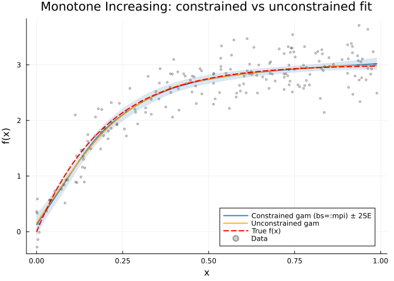
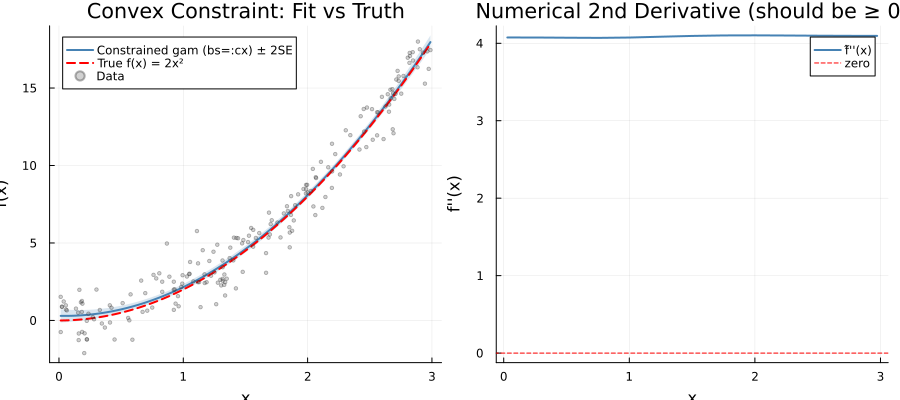
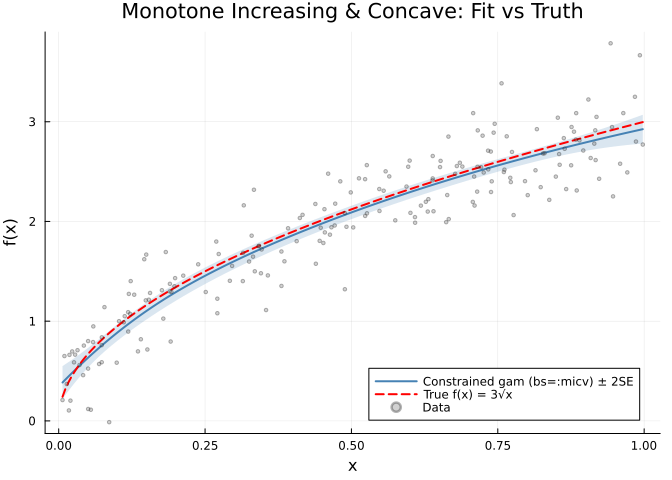
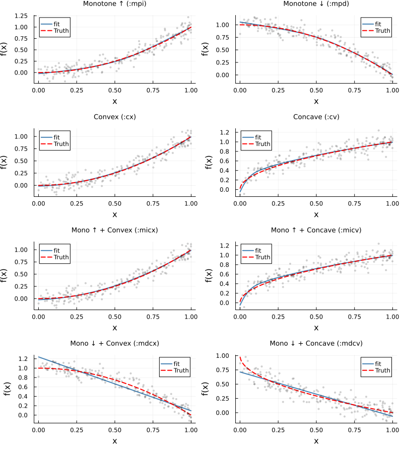

# Shape-Constrained Additive Models
Simon Frost

- [Introduction](#introduction)
- [Setup](#setup)
- [Available basis types](#available-basis-types)
- [Example 1: Monotone increasing
  (dose-response)](#example-1-monotone-increasing-dose-response)
  - [Simulate data](#simulate-data)
  - [Fit unconstrained and shape-constrained
    GAMs](#fit-unconstrained-and-shape-constrained-gams)
  - [Compare fitted values](#compare-fitted-values)
  - [Verify monotonicity](#verify-monotonicity)
  - [Plot: GAM vs SCAM vs truth](#plot-gam-vs-scam-vs-truth)
- [Example 2: Convex function](#example-2-convex-function)
  - [Simulate data](#simulate-data-1)
  - [Fit with convexity constraint](#fit-with-convexity-constraint)
  - [Verify convexity](#verify-convexity)
  - [Plot: Convex fit and second
    derivative](#plot-convex-fit-and-second-derivative)
- [Example 3: Monotone increasing and concave (diminishing
  returns)](#example-3-monotone-increasing-and-concave-diminishing-returns)
  - [Simulate data](#simulate-data-2)
  - [Fit with monotone increasing + concave
    constraint](#fit-with-monotone-increasing--concave-constraint)
  - [Verify constraints](#verify-constraints)
  - [Plot: Monotone increasing & concave
    fit](#plot-monotone-increasing--concave-fit)
- [SCAM fitting details](#scam-fitting-details)
- [Comparing all constraint types](#comparing-all-constraint-types)
  - [Plot: All constraint types](#plot-all-constraint-types)
- [Summary](#summary)

## Introduction

Standard GAMs estimate smooth functions without restrictions on their
shape. In many applications, however, domain knowledge dictates that a
relationship should be monotonically increasing (e.g., dose-response),
convex (e.g., cost curves), or satisfy other shape constraints.

**Shape-Constrained Additive Models (SCAMs)** enforce these constraints
using SCOP-splines (Shape Constrained P-splines), where B-spline
coefficients are reparameterized through cumulative sums and
exponentiation to guarantee the desired shape.

GAM.jl implements SCAM fitting following the approach of the R
[scam](https://cran.r-project.org/package=scam) package (Pya & Wood,
2015).

## Setup

``` julia
using GAM
using StatsAPI: predict
using DataFrames
using CSV
using Random
using Statistics
using Plots
```

## Available basis types

GAM.jl supports 8 shape-constrained basis types, specified via the `bs`
argument in `s()`:

| `bs` symbol | Constraint | Description |
|----|----|----|
| `:mpi` | Monotone increasing | $f'(x) \geq 0$ |
| `:mpd` | Monotone decreasing | $f'(x) \leq 0$ |
| `:cx` | Convex | $f''(x) \geq 0$ |
| `:cv` | Concave | $f''(x) \leq 0$ |
| `:micx` | Monotone increasing & convex | $f'(x) \geq 0$ and $f''(x) \geq 0$ |
| `:micv` | Monotone increasing & concave | $f'(x) \geq 0$ and $f''(x) \leq 0$ |
| `:mdcx` | Monotone decreasing & convex | $f'(x) \leq 0$ and $f''(x) \geq 0$ |
| `:mdcv` | Monotone decreasing & concave | $f'(x) \leq 0$ and $f''(x) \leq 0$ |

## Example 1: Monotone increasing (dose-response)

A dose-response relationship is naturally monotone increasing—higher
doses should not decrease the response.

### Simulate data

True function: $f(x) = 3(1 - e^{-5x})$, a saturating exponential.

``` julia
df = CSV.read("data.csv", DataFrame)
x = df.x; y = df.y
n = nrow(df)
f_true = 3.0 .* (1.0 .- exp.(-5.0 .* x))
```

    200-element Vector{Float64}:
     0.0035813093739730517
     0.020641315576114705
     0.02346605588919992
     0.033901484075778865
     0.05864430830768941
     0.10801952103761714
     0.1159700766851749
     0.4060464108647236
     0.5120548610923702
     0.5307120418037653
     ⋮
     2.973608911275417
     2.9750097790978067
     2.975626021707947
     2.975630618230438
     2.9766280983687334
     2.9769268870331884
     2.9774612640729052
     2.977972722359742
     2.9786316912891824

### Fit unconstrained and shape-constrained GAMs

``` julia
m_gam = gam(@formula(y ~ s(x, k=15, bs=:cr)), df)
m_scam = gam(@formula(y ~ s(x, k=15, bs=:mpi)), df)
```

    Generalized Additive Model

    Formula: y ~ 1 + s(x,bs=mpi)

    Family: Normal
    Link:   IdentityLink
    Method: REML

    Parametric coefficients:
    ──────────────────────────────────────────────────
                   Coef.  Std. Error       t  Pr(>|t|)
    ──────────────────────────────────────────────────
    (Intercept)  2.41623   0.0203655  118.64    <1e-99
    ──────────────────────────────────────────────────

    Approximate significance of smooth terms:
    ──────────────────────────────────────────────────────────────────
    Smooth                    edf   Ref.df          F    p-value
    ──────────────────────────────────────────────────────────────────
    s(x,bs=mpi)              4.42     5.00    285.026  1.753e-87
    ──────────────────────────────────────────────────────────────────

    R² (adj) = 0.877   Deviance explained = 88.0%
    Scale est. = 0.0830   n = 200

### Compare fitted values

``` julia
yhat_gam = predict(m_gam)
yhat_scam = predict(m_scam)

rmse_gam = sqrt(mean((yhat_gam .- f_true).^2))
rmse_scam = sqrt(mean((yhat_scam .- f_true).^2))

println("RMSE (unconstrained GAM): ", round(rmse_gam, digits=4))
println("RMSE (SCAM, monotone increasing): ", round(rmse_scam, digits=4))
```

    RMSE (unconstrained GAM): 0.0509
    RMSE (SCAM, monotone increasing): 0.0457

### Verify monotonicity

The SCAM fit should be monotonically non-decreasing:

``` julia
diffs = diff(yhat_scam)
println("Min successive difference (SCAM): ", round(minimum(diffs), digits=6))
println("All non-decreasing: ", all(diffs .>= -1e-10))

diffs_gam = diff(yhat_gam)
println("Min successive difference (GAM): ", round(minimum(diffs_gam), digits=6))
println("GAM all non-decreasing: ", all(diffs_gam .>= -1e-10))
```

    Min successive difference (SCAM): 1.0e-6
    All non-decreasing: true
    Min successive difference (GAM): -0.001143
    GAM all non-decreasing: false

### Plot: GAM vs SCAM vs truth

``` julia
x_grid = collect(range(minimum(x), maximum(x); length=200))
grid_df = DataFrame(x=x_grid)
f_hat_scam, f_se_scam = predict(m_scam, grid_df; se=true)
f_true_grid = 3.0 .* (1.0 .- exp.(-5.0 .* x_grid))

f_hat_gam = predict(m_gam, grid_df)

p = plot(x_grid, f_hat_scam;
    ribbon=2 .* f_se_scam, fillalpha=0.2, fillcolor=:steelblue,
    label="Constrained gam (bs=:mpi) ± 2SE", linewidth=2, color=:steelblue,
    xlabel="x", ylabel="f(x)",
    title="Monotone Increasing: constrained vs unconstrained fit",
    legend=:bottomright)
plot!(p, x_grid, f_hat_gam;
    label="Unconstrained gam", linewidth=2, color=:orange, linestyle=:dot)
plot!(p, x_grid, f_true_grid;
    label="True f(x)", linewidth=2, color=:red, linestyle=:dash)
scatter!(p, x, y;
    label="Data", alpha=0.3, markersize=2, color=:grey40)
p
```



## Example 2: Convex function

Cost functions and accelerating growth curves are often convex.

### Simulate data

True function: $f(x) = 2x^2$ (generated with Gaussian noise by
`vignettes/generate_data.jl`).

``` julia
df_cx = CSV.read("data_cx.csv", DataFrame)
x_cx = df_cx.x
y_cx = df_cx.y

df2 = DataFrame(y=y_cx, x=x_cx)
f_true2 = 2.0 .* x_cx.^2
```

    200-element Vector{Float64}:
      0.00038556938055170814
      0.00040305440921251996
      0.0011274758348149556
      0.0012116360236365518
      0.00289835112388538
      0.006167992041356164
      0.0063426629151671025
      0.007994918225616347
      0.03740591457588815
      0.047623835594500716
      ⋮
     16.22180028719647
     16.636402256232078
     16.673987966242183
     16.848503032201037
     17.144807874384373
     17.32932707941544
     17.56357140639953
     17.68937214815672
     17.85670428505587

### Fit with convexity constraint

``` julia
m_cx = gam(@formula(y ~ s(x, k=15, bs=:cx)), df2)

yhat_cx = predict(m_cx)
rmse_cx = sqrt(mean((yhat_cx .- f_true2).^2))
println("RMSE (convex SCAM): ", round(rmse_cx, digits=4))
```

    RMSE (convex SCAM): 0.1526

### Verify convexity

For a convex function, second differences on an *evenly spaced* grid
should be non-negative. (Raw second differences of the fitted values at
the observed, unevenly spaced $x$ do not have the sign of $f''$, so we
evaluate the fit on a uniform grid first.)

``` julia
x_even = collect(range(minimum(x_cx), maximum(x_cx); length=200))
f_even = predict(m_cx, DataFrame(x=x_even))
second_diffs = diff(diff(f_even))
println("Min second difference (even grid): ", round(minimum(second_diffs), digits=6))
println("All convex: ", all(second_diffs .>= -1e-8))
```

    Min second difference (even grid): 0.000909
    All convex: true

### Plot: Convex fit and second derivative

``` julia
x_grid_cx = collect(range(minimum(x_cx), maximum(x_cx); length=200))
grid_df_cx = DataFrame(x=x_grid_cx)
f_hat_cx, f_se_cx = predict(m_cx, grid_df_cx; se=true)
f_true2_grid = 2.0 .* x_grid_cx.^2

p1 = plot(x_grid_cx, f_hat_cx;
    ribbon=2 .* f_se_cx, fillalpha=0.2, fillcolor=:steelblue,
    label="Constrained gam (bs=:cx) ± 2SE", linewidth=2, color=:steelblue,
    xlabel="x", ylabel="f(x)",
    title="Convex Constraint: Fit vs Truth",
    legend=:topleft)
plot!(p1, x_grid_cx, f_true2_grid;
    label="True f(x) = 2x²", linewidth=2, color=:red, linestyle=:dash)
scatter!(p1, x_cx, y_cx;
    label="Data", alpha=0.3, markersize=2, color=:grey40)

# Verify second derivative ≥ 0
dx = diff(x_grid_cx)
first_deriv = diff(f_hat_cx) ./ dx
x_mid = (x_grid_cx[1:end-1] .+ x_grid_cx[2:end]) ./ 2
dx2 = diff(x_mid)
second_deriv = diff(first_deriv) ./ dx2
x_mid2 = (x_mid[1:end-1] .+ x_mid[2:end]) ./ 2

p2 = plot(x_mid2, second_deriv;
    label="f̂''(x)", linewidth=2, color=:steelblue,
    xlabel="x", ylabel="f''(x)",
    title="Numerical 2nd Derivative (should be ≥ 0)",
    legend=:topright)
hline!(p2, [0.0]; label="zero", color=:red, linestyle=:dash, linewidth=1)

plot(p1, p2; layout=(1, 2), size=(900, 400))
```



## Example 3: Monotone increasing and concave (diminishing returns)

Many real-world relationships show diminishing returns: the function
increases but at a decreasing rate. This corresponds to a monotone
increasing and concave constraint.

### Simulate data

True function: $f(x) = 3\sqrt{x}$ (generated with Gaussian noise by
`vignettes/generate_data.jl`).

``` julia
df_micv = CSV.read("data_micv.csv", DataFrame)
x_micv = df_micv.x
y_micv = df_micv.y

df3 = DataFrame(y=y_micv, x=x_micv)
f_true3 = 3.0 .* sqrt.(x_micv)
```

    200-element Vector{Float64}:
     0.2419579636711581
     0.29688940752242676
     0.3518323656765271
     0.39568067606781415
     0.4067719855838105
     0.4249692349063111
     0.4553186819555042
     0.48506371468005405
     0.502409822920923
     0.537749291544685
     ⋮
     2.916528853686833
     2.919205366399404
     2.937837685628374
     2.946153495939143
     2.9565282090509575
     2.9763119569346275
     2.9789577956914517
     2.9890504233525133
     2.996495540929529

### Fit with monotone increasing + concave constraint

``` julia
m_micv = gam(@formula(y ~ s(x, k=15, bs=:micv)), df3)

yhat_micv = predict(m_micv)
rmse_micv = sqrt(mean((yhat_micv .- f_true3).^2))
println("RMSE (monotone increasing + concave): ", round(rmse_micv, digits=4))
```

    RMSE (monotone increasing + concave): 0.0456

### Verify constraints

Both checks are done on an evenly spaced grid: monotonicity needs only
sorted $x$, but the sign of second differences is meaningful only under
even spacing.

``` julia
x_even_micv = collect(range(minimum(x_micv), maximum(x_micv); length=200))
f_even_micv = predict(m_micv, DataFrame(x=x_even_micv))
first_diffs_micv = diff(f_even_micv)
second_diffs_micv = diff(first_diffs_micv)
println("Min first difference (monotonicity): ", round(minimum(first_diffs_micv), digits=6))
println("Max second difference (concavity): ", round(maximum(second_diffs_micv), digits=6))
println("Monotone increasing: ", all(first_diffs_micv .>= -1e-8))
println("Concave: ", all(second_diffs_micv .<= 1e-8))
```

    Min first difference (monotonicity): 0.006464
    Max second difference (concavity): -3.4e-5
    Monotone increasing: true
    Concave: true

### Plot: Monotone increasing & concave fit

``` julia
x_grid_micv = collect(range(minimum(x_micv), maximum(x_micv); length=200))
grid_df_micv = DataFrame(x=x_grid_micv)
f_hat_micv, f_se_micv = predict(m_micv, grid_df_micv; se=true)
f_true3_grid = 3.0 .* sqrt.(x_grid_micv)

p = plot(x_grid_micv, f_hat_micv;
    ribbon=2 .* f_se_micv, fillalpha=0.2, fillcolor=:steelblue,
    label="Constrained gam (bs=:micv) ± 2SE", linewidth=2, color=:steelblue,
    xlabel="x", ylabel="f(x)",
    title="Monotone Increasing & Concave: Fit vs Truth",
    legend=:bottomright)
plot!(p, x_grid_micv, f_true3_grid;
    label="True f(x) = 3√x", linewidth=2, color=:red, linestyle=:dash)
scatter!(p, x_micv, y_micv;
    label="Data", alpha=0.3, markersize=2, color=:grey40)
p
```



## SCAM fitting details

The preferred interface is `gam(...)` with a shape-constrained basis and
the usual `gam_control(...)` options:

``` julia
ctrl = gam_control(
    epsilon=1e-7,        # convergence tolerance
    maxit=200,           # max iterations
    trace=false,         # print iteration progress
)

m_ctrl = gam(@formula(y ~ s(x, k=15, bs=:mpi)), df; control=ctrl)
```

    Generalized Additive Model

    Formula: y ~ 1 + s(x,bs=mpi)

    Family: Normal
    Link:   IdentityLink
    Method: REML

    Parametric coefficients:
    ──────────────────────────────────────────────────
                   Coef.  Std. Error       t  Pr(>|t|)
    ──────────────────────────────────────────────────
    (Intercept)  2.41623   0.0203655  118.64    <1e-99
    ──────────────────────────────────────────────────

    Approximate significance of smooth terms:
    ──────────────────────────────────────────────────────────────────
    Smooth                    edf   Ref.df          F    p-value
    ──────────────────────────────────────────────────────────────────
    s(x,bs=mpi)              4.42     5.00    285.026  1.753e-87
    ──────────────────────────────────────────────────────────────────

    R² (adj) = 0.877   Deviance explained = 88.0%
    Scale est. = 0.0830   n = 200

The compatibility wrapper `scam(...)` still exists for SCAM-specific
options such as `scam_control(not_exp=true)`, but most users can stay on
`gam(...)`.

Ordinary unconstrained bases continue to use the same `gam(...)`
interface:

``` julia
m_fallback = gam(@formula(y ~ s(x, k=15, bs=:cr)), df)
```

    Generalized Additive Model

    Formula: y ~ 1 + s(x,bs=cr)

    Family: Normal
    Link:   IdentityLink
    Method: REML

    Parametric coefficients:
    ──────────────────────────────────────────────────
                   Coef.  Std. Error       t  Pr(>|t|)
    ──────────────────────────────────────────────────
    (Intercept)  2.41623   0.0204512  118.15    <1e-99
    ──────────────────────────────────────────────────

    Approximate significance of smooth terms:
    ──────────────────────────────────────────────────────────────────
    Smooth                    edf   Ref.df          F    p-value
    ──────────────────────────────────────────────────────────────────
    s(x,bs=cr)               5.90     6.00    234.159  9.027e-86
    ──────────────────────────────────────────────────────────────────

    R² (adj) = 0.876   Deviance explained = 88.0%
    Scale est. = 0.0836   n = 200

## Comparing all constraint types

Let’s fit each basis type to appropriate test data:

``` julia
Random.seed!(42)
x_test = sort(rand(200))

# Monotone increasing: f(x) = x^2 (increasing on [0,1])
y_mpi = x_test.^2 .+ 0.1 .* randn(200)
# Monotone decreasing: f(x) = 1 - x^2
y_mpd = (1.0 .- x_test.^2) .+ 0.1 .* randn(200)
# Convex: f(x) = x^2
y_cx = x_test.^2 .+ 0.1 .* randn(200)
# Concave: f(x) = sqrt(x)
y_cv = sqrt.(x_test) .+ 0.1 .* randn(200)

basis_types = [:mpi, :mpd, :cx, :cv, :micx, :micv, :mdcx, :mdcv]
y_data = Dict(
    :mpi => y_mpi, :mpd => y_mpd, :cx => y_cx, :cv => y_cv,
    :micx => y_cx, :micv => y_cv, :mdcx => y_mpd, :mdcv => (1.0 .- sqrt.(x_test)) .+ 0.1 .* randn(200)
)
constraint_formulas = Dict(
    :mpi => @formula(y ~ s(x, k=10, bs=:mpi)),
    :mpd => @formula(y ~ s(x, k=10, bs=:mpd)),
    :cx => @formula(y ~ s(x, k=10, bs=:cx)),
    :cv => @formula(y ~ s(x, k=10, bs=:cv)),
    :micx => @formula(y ~ s(x, k=10, bs=:micx)),
    :micv => @formula(y ~ s(x, k=10, bs=:micv)),
    :mdcx => @formula(y ~ s(x, k=10, bs=:mdcx)),
    :mdcv => @formula(y ~ s(x, k=10, bs=:mdcv)),
)
constraint_models = Dict{Symbol, Any}()

for bs in basis_types
    df_test = DataFrame(y=y_data[bs], x=x_test)
    m_test = gam(constraint_formulas[bs], df_test)
    constraint_models[bs] = m_test
    yhat = predict(m_test)
    println("bs=:$bs — EDF: $(round(sum(m_test.edf), digits=2)), range: [$(round(minimum(yhat), digits=2)), $(round(maximum(yhat), digits=2))]")
end
```

    bs=:mpi — EDF: 3.63, range: [-0.02, 1.0]
    bs=:mpd — EDF: 3.68, range: [0.01, 1.05]
    bs=:cx — EDF: 2.0, range: [-0.02, 0.99]
    bs=:cv — EDF: 3.97, range: [-0.05, 0.99]
    bs=:micx — EDF: 1.0, range: [-0.02, 0.99]
    bs=:micv — EDF: 3.96, range: [-0.05, 0.99]
    bs=:mdcx — EDF: 0.93, range: [0.09, 1.24]
    bs=:mdcv — EDF: 0.96, range: [-0.06, 0.71]

### Plot: All constraint types

``` julia
true_funcs = Dict(
    :mpi  => x_test.^2,
    :mpd  => 1.0 .- x_test.^2,
    :cx   => x_test.^2,
    :cv   => sqrt.(x_test),
    :micx => x_test.^2,
    :micv => sqrt.(x_test),
    :mdcx => 1.0 .- x_test.^2,
    :mdcv => 1.0 .- sqrt.(x_test)
)

constraint_labels = Dict(
    :mpi  => "Monotone ↑",
    :mpd  => "Monotone ↓",
    :cx   => "Convex",
    :cv   => "Concave",
    :micx => "Mono ↑ + Convex",
    :micv => "Mono ↑ + Concave",
    :mdcx => "Mono ↓ + Convex",
    :mdcv => "Mono ↓ + Concave"
)

plots = []
x_g = collect(range(minimum(x_test), maximum(x_test); length=200))
pred_df = DataFrame(x=x_g)
for bs in basis_types
    m_test = constraint_models[bs]
    f_g = predict(m_test, pred_df)

    f_true_g = if bs in [:mpi, :cx, :micx]
        x_g.^2
    elseif bs == :mpd
        1.0 .- x_g.^2
    elseif bs in [:cv, :micv]
        sqrt.(x_g)
    elseif bs == :mdcx
        1.0 .- x_g.^2
    else
        1.0 .- sqrt.(x_g)
    end

    pi = plot(x_g, f_g;
        label="fit", linewidth=2, color=:steelblue,
        title=constraint_labels[bs] * " (:$bs)",
        xlabel="x", ylabel="f(x)", legend=:best, titlefontsize=9)
    plot!(pi, x_g, f_true_g;
        label="Truth", linewidth=2, color=:red, linestyle=:dash)
    scatter!(pi, x_test, y_data[bs];
        label="", alpha=0.15, markersize=1.5, color=:grey40)
    push!(plots, pi)
end

plot(plots...; layout=(4, 2), size=(800, 900))
```



## Summary

| Feature | GAM.jl | R `scam` |
|----|----|----|
| Fitting function | `gam(@formula(y ~ s(x, bs=:mpi)), data)` | `scam(y ~ s(x, bs="mpi"), data=dat)` |
| Monotone increasing | `bs=:mpi` | `bs="mpi"` |
| Monotone decreasing | `bs=:mpd` | `bs="mpd"` |
| Convex | `bs=:cx` | `bs="cx"` |
| Concave | `bs=:cv` | `bs="cv"` |
| Mono. inc. + convex | `bs=:micx` | `bs="micx"` |
| Mono. inc. + concave | `bs=:micv` | `bs="micv"` |
| Mono. dec. + convex | `bs=:mdcx` | `bs="mdcx"` |
| Mono. dec. + concave | `bs=:mdcv` | `bs="mdcv"` |
| Control parameters | `gam_control()` | `scam.control()` |

Shape constraints are enforced through the SCOP-spline
reparameterization using the exponential function. Because the
constraint is imposed on the B-spline coefficients themselves, the
fitted function satisfies the shape constraint *everywhere*, not just at
the knots. The legacy `scam()` and `scam_control()` helpers remain
available for compatibility.
