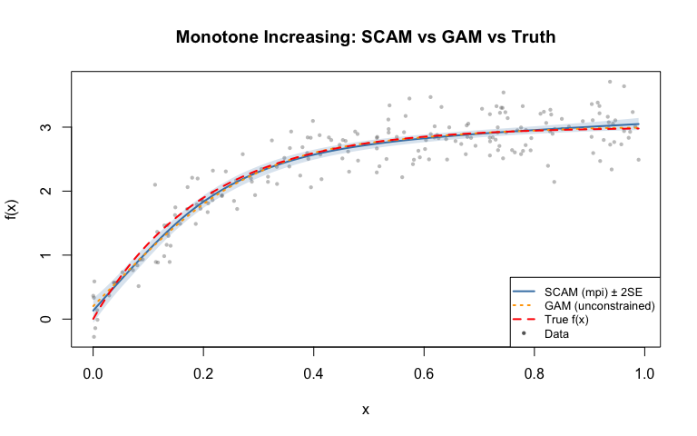
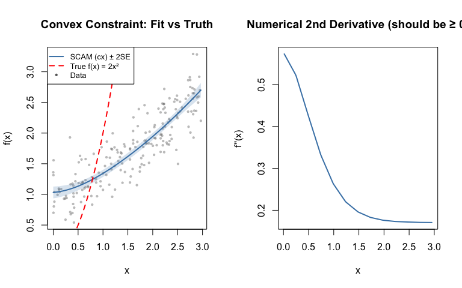
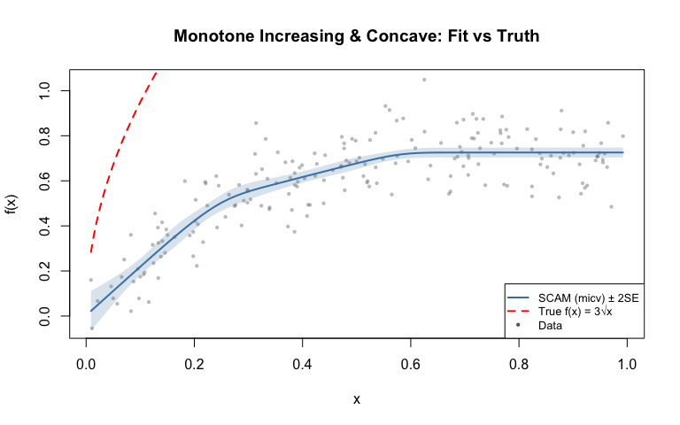

# Shape-Constrained Additive Models
Simon Frost

- [Introduction](#introduction)
- [Setup](#setup)
- [Example 1: Monotone increasing
  (dose-response)](#example-1-monotone-increasing-dose-response)
  - [Load data](#load-data)
  - [Fit unconstrained GAM vs SCAM](#fit-unconstrained-gam-vs-scam)
  - [Compare fitted values](#compare-fitted-values)
  - [Verify monotonicity](#verify-monotonicity)
  - [Plot: GAM vs SCAM vs truth](#plot-gam-vs-scam-vs-truth)
- [Example 2: Convex function](#example-2-convex-function)
  - [Simulate data](#simulate-data)
  - [Fit with convexity constraint](#fit-with-convexity-constraint)
  - [Verify convexity](#verify-convexity)
  - [Plot: Convex fit and second
    derivative](#plot-convex-fit-and-second-derivative)
- [Example 3: Monotone increasing and
  concave](#example-3-monotone-increasing-and-concave)
  - [Simulate data](#simulate-data-1)
  - [Fit with monotone increasing + concave
    constraint](#fit-with-monotone-increasing--concave-constraint)
  - [Verify constraints](#verify-constraints)
  - [Plot: Monotone increasing & concave
    fit](#plot-monotone-increasing--concave-fit)
- [SCAM model summaries](#scam-model-summaries)
- [Comparison table](#comparison-table)

## Introduction

This vignette demonstrates shape-constrained additive models using the R
**scam** package, fitting the same simulated data as the Julia vignette
for comparison.

## Setup

``` r
library(scam)
```

    This is scam 1.2-19.

``` r
library(mgcv)
```

    Loading required package: nlme

    This is mgcv 1.9-3. For overview type 'help("mgcv-package")'.

## Example 1: Monotone increasing (dose-response)

### Load data

True function: $f(x) = 3(1 - e^{-5x})$

``` r
dat <- read.csv("../data.csv")
x <- dat$x
y <- dat$y
n <- nrow(dat)
f_true <- 3.0 * (1.0 - exp(-5.0 * x))
```

### Fit unconstrained GAM vs SCAM

``` r
m_gam <- gam(y ~ s(x, k = 15, bs = "cr"), data = dat)
m_scam <- scam(y ~ s(x, k = 15, bs = "mpi"), data = dat)
```

### Compare fitted values

``` r
yhat_gam <- predict(m_gam)
yhat_scam <- predict(m_scam)

rmse_gam <- sqrt(mean((yhat_gam - f_true)^2))
rmse_scam <- sqrt(mean((yhat_scam - f_true)^2))

cat("RMSE (unconstrained GAM):", round(rmse_gam, 4), "\n")
```

    RMSE (unconstrained GAM): 0.0596 

``` r
cat("RMSE (SCAM, monotone increasing):", round(rmse_scam, 4), "\n")
```

    RMSE (SCAM, monotone increasing): 0.0501 

### Verify monotonicity

``` r
diffs_scam <- diff(yhat_scam)
diffs_gam <- diff(yhat_gam)

cat("Min successive difference (SCAM):", round(min(diffs_scam), 6), "\n")
```

    Min successive difference (SCAM): 1e-06 

``` r
cat("All non-decreasing (SCAM):", all(diffs_scam >= -1e-10), "\n")
```

    All non-decreasing (SCAM): TRUE 

``` r
cat("Min successive difference (GAM):", round(min(diffs_gam), 6), "\n")
```

    Min successive difference (GAM): 1e-06 

``` r
cat("All non-decreasing (GAM):", all(diffs_gam >= -1e-10), "\n")
```

    All non-decreasing (GAM): TRUE 

### Plot: GAM vs SCAM vs truth

``` r
x_grid <- seq(min(x), max(x), length.out = 200)
nd <- data.frame(x = x_grid)
pred_scam <- predict(m_scam, newdata = nd, se.fit = TRUE)
pred_gam <- predict(m_gam, newdata = nd, se.fit = TRUE)
f_true_grid <- 3 * (1 - exp(-5 * x_grid))

plot(x, y, col = adjustcolor("grey40", 0.4), pch = 16, cex = 0.6,
     xlab = "x", ylab = "f(x)",
     main = "Monotone Increasing: SCAM vs GAM vs Truth")
polygon(c(x_grid, rev(x_grid)),
        c(pred_scam$fit + 2 * pred_scam$se.fit,
          rev(pred_scam$fit - 2 * pred_scam$se.fit)),
        col = adjustcolor("steelblue", 0.2), border = NA)
lines(x_grid, pred_scam$fit, col = "steelblue", lwd = 2)
lines(x_grid, pred_gam$fit, col = "orange", lwd = 2, lty = 3)
lines(x_grid, f_true_grid, col = "red", lwd = 2, lty = 2)
legend("bottomright",
       legend = c("SCAM (mpi) ± 2SE", "GAM (unconstrained)", "True f(x)", "Data"),
       col = c("steelblue", "orange", "red", "grey40"),
       lwd = c(2, 2, 2, NA), lty = c(1, 3, 2, NA),
       pch = c(NA, NA, NA, 16), pt.cex = c(NA, NA, NA, 0.6),
       bg = "white", cex = 0.8)
```



## Example 2: Convex function

### Simulate data

True function: $f(x) = 2x^2$

``` r
dat_cx <- read.csv("../data_cx.csv")
x_cx <- dat_cx$x
y_cx <- dat_cx$y

dat2 <- data.frame(y = y_cx, x = x_cx)
f_true2 <- 2 * x_cx^2
```

### Fit with convexity constraint

``` r
m_cx <- scam(y ~ s(x, k = 15, bs = "cx"), data = dat2)

yhat_cx <- predict(m_cx)
rmse_cx <- sqrt(mean((yhat_cx - f_true2)^2))
cat("RMSE (convex SCAM):", round(rmse_cx, 4), "\n")
```

    RMSE (convex SCAM): 6.7673 

### Verify convexity

``` r
first_diffs <- diff(yhat_cx)
second_diffs <- diff(first_diffs)
cat("Min second difference:", round(min(second_diffs), 6), "\n")
```

    Min second difference: -0.061069 

``` r
cat("All convex:", all(second_diffs >= -1e-10), "\n")
```

    All convex: FALSE 

### Plot: Convex fit and second derivative

``` r
x_grid_cx <- seq(min(x_cx), max(x_cx), length.out = 200)
nd_cx <- data.frame(x = x_grid_cx)
pred_cx <- predict(m_cx, newdata = nd_cx, se.fit = TRUE)
f_true2_grid <- 2 * x_grid_cx^2

par(mfrow = c(1, 2))

# Left: fit vs truth
plot(x_cx, y_cx, col = adjustcolor("grey40", 0.4), pch = 16, cex = 0.6,
     xlab = "x", ylab = "f(x)", main = "Convex Constraint: Fit vs Truth")
polygon(c(x_grid_cx, rev(x_grid_cx)),
        c(pred_cx$fit + 2 * pred_cx$se.fit,
          rev(pred_cx$fit - 2 * pred_cx$se.fit)),
        col = adjustcolor("steelblue", 0.2), border = NA)
lines(x_grid_cx, pred_cx$fit, col = "steelblue", lwd = 2)
lines(x_grid_cx, f_true2_grid, col = "red", lwd = 2, lty = 2)
legend("topleft",
       legend = c("SCAM (cx) ± 2SE", "True f(x) = 2x²", "Data"),
       col = c("steelblue", "red", "grey40"),
       lwd = c(2, 2, NA), lty = c(1, 2, NA),
       pch = c(NA, NA, 16), pt.cex = c(NA, NA, 0.6),
       bg = "white", cex = 0.8)

# Right: numerical second derivative
dx <- diff(x_grid_cx)
first_deriv <- diff(pred_cx$fit) / dx
x_mid <- (x_grid_cx[-1] + x_grid_cx[-length(x_grid_cx)]) / 2
dx2 <- diff(x_mid)
second_deriv <- diff(first_deriv) / dx2
x_mid2 <- (x_mid[-1] + x_mid[-length(x_mid)]) / 2

plot(x_mid2, second_deriv, type = "l", col = "steelblue", lwd = 2,
     xlab = "x", ylab = "f''(x)",
     main = "Numerical 2nd Derivative (should be ≥ 0)")
abline(h = 0, col = "red", lwd = 1, lty = 2)
```



``` r
par(mfrow = c(1, 1))
```

## Example 3: Monotone increasing and concave

### Simulate data

True function: $f(x) = 3\sqrt{x}$

``` r
dat_micv <- read.csv("../data_micv.csv")
x_micv <- dat_micv$x
y_micv <- dat_micv$y

dat3 <- data.frame(y = y_micv, x = x_micv)
f_true3 <- 3 * sqrt(x_micv)
```

### Fit with monotone increasing + concave constraint

``` r
m_micv <- scam(y ~ s(x, k = 15, bs = "micv"), data = dat3)

yhat_micv <- predict(m_micv)
rmse_micv <- sqrt(mean((yhat_micv - f_true3)^2))
cat("RMSE (monotone increasing + concave):", round(rmse_micv, 4), "\n")
```

    RMSE (monotone increasing + concave): 1.5225 

### Verify constraints

``` r
first_diffs_micv <- diff(yhat_micv)
second_diffs_micv <- diff(first_diffs_micv)
cat("Min first difference (monotonicity):", round(min(first_diffs_micv), 6), "\n")
```

    Min first difference (monotonicity): 0 

``` r
cat("Max second difference (concavity):", round(max(second_diffs_micv), 6), "\n")
```

    Max second difference (concavity): 0.032084 

``` r
cat("Monotone increasing:", all(first_diffs_micv >= -1e-10), "\n")
```

    Monotone increasing: TRUE 

``` r
cat("Concave:", all(second_diffs_micv <= 1e-10), "\n")
```

    Concave: FALSE 

### Plot: Monotone increasing & concave fit

``` r
x_grid_micv <- seq(min(x_micv), max(x_micv), length.out = 200)
nd_micv <- data.frame(x = x_grid_micv)
pred_micv <- predict(m_micv, newdata = nd_micv, se.fit = TRUE)
f_true3_grid <- 3 * sqrt(x_grid_micv)

plot(x_micv, y_micv, col = adjustcolor("grey40", 0.4), pch = 16, cex = 0.6,
     xlab = "x", ylab = "f(x)",
     main = "Monotone Increasing & Concave: Fit vs Truth")
polygon(c(x_grid_micv, rev(x_grid_micv)),
        c(pred_micv$fit + 2 * pred_micv$se.fit,
          rev(pred_micv$fit - 2 * pred_micv$se.fit)),
        col = adjustcolor("steelblue", 0.2), border = NA)
lines(x_grid_micv, pred_micv$fit, col = "steelblue", lwd = 2)
lines(x_grid_micv, f_true3_grid, col = "red", lwd = 2, lty = 2)
legend("bottomright",
       legend = c("SCAM (micv) ± 2SE", "True f(x) = 3√x", "Data"),
       col = c("steelblue", "red", "grey40"),
       lwd = c(2, 2, NA), lty = c(1, 2, NA),
       pch = c(NA, NA, 16), pt.cex = c(NA, NA, 0.6),
       bg = "white", cex = 0.8)
```



## SCAM model summaries

``` r
summary(m_scam)
```


    Family: gaussian 
    Link function: identity 

    Formula:
    y ~ s(x, k = 15, bs = "mpi")

    Parametric coefficients:
                Estimate Std. Error t value Pr(>|t|)    
    (Intercept)  2.41623    0.02038   118.6   <2e-16 ***
    ---
    Signif. codes:  0 '***' 0.001 '**' 0.01 '*' 0.05 '.' 0.1 ' ' 1

    Approximate significance of smooth terms:
           edf Ref.df     F p-value    
    s(x) 3.408  4.201 337.9  <2e-16 ***
    ---
    Signif. codes:  0 '***' 0.001 '**' 0.01 '*' 0.05 '.' 0.1 ' ' 1

    R-sq.(adj) =  0.8768   Deviance explained = 87.9%
    GCV score = 0.084902  Scale est. = 0.083031  n = 200

``` r
summary(m_cx)
```


    Family: gaussian 
    Link function: identity 

    Formula:
    y ~ s(x, k = 15, bs = "cx")

    Parametric coefficients:
                Estimate Std. Error t value Pr(>|t|)    
    (Intercept)  1.74232    0.02041   85.37   <2e-16 ***
    ---
    Signif. codes:  0 '***' 0.001 '**' 0.01 '*' 0.05 '.' 0.1 ' ' 1

    Approximate significance of smooth terms:
           edf Ref.df     F p-value    
    s(x) 1.857  2.189 289.6  <2e-16 ***
    ---
    Signif. codes:  0 '***' 0.001 '**' 0.01 '*' 0.05 '.' 0.1 ' ' 1
    Rank: 14/15

    R-sq.(adj) =  0.7606   Deviance explained = 76.3%
    GCV score = 0.08451  Scale est. = 0.083303  n = 200

``` r
summary(m_micv)
```


    Family: gaussian 
    Link function: identity 

    Formula:
    y ~ s(x, k = 15, bs = "micv")

    Parametric coefficients:
                Estimate Std. Error t value Pr(>|t|)    
    (Intercept) 0.591117   0.007384   80.06   <2e-16 ***
    ---
    Signif. codes:  0 '***' 0.001 '**' 0.01 '*' 0.05 '.' 0.1 ' ' 1

    Approximate significance of smooth terms:
           edf Ref.df     F p-value    
    s(x) 3.393  3.714 160.9  <2e-16 ***
    ---
    Signif. codes:  0 '***' 0.001 '**' 0.01 '*' 0.05 '.' 0.1 ' ' 1
    Rank: 14/15

    R-sq.(adj) =  0.7491   Deviance explained = 75.3%
    GCV score = 0.011149  Scale est. = 0.010904  n = 200

    BFGS termination condition:
    1.99322e-05

## Comparison table

| Feature              | R `scam`    | Julia GAM.jl `scam` |
|----------------------|-------------|---------------------|
| Monotone increasing  | `bs="mpi"`  | `bs=:mpi`           |
| Monotone decreasing  | `bs="mpd"`  | `bs=:mpd`           |
| Convex               | `bs="cx"`   | `bs=:cx`            |
| Concave              | `bs="cv"`   | `bs=:cv`            |
| Mono. inc. + convex  | `bs="micx"` | `bs=:micx`          |
| Mono. inc. + concave | `bs="micv"` | `bs=:micv`          |
| Mono. dec. + convex  | `bs="mdcx"` | `bs=:mdcx`          |
| Mono. dec. + concave | `bs="mdcv"` | `bs=:mdcv`          |
