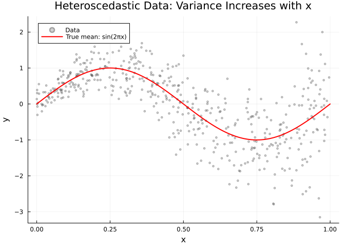
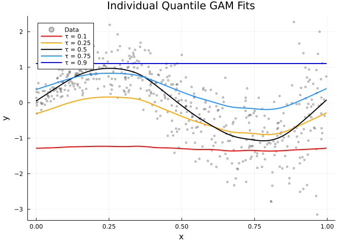
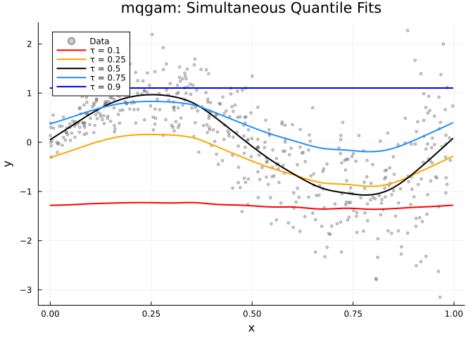
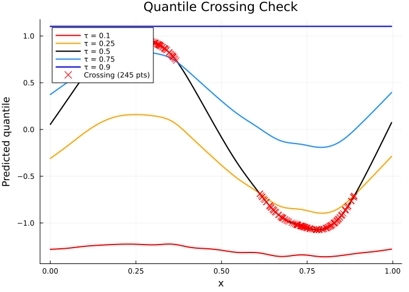
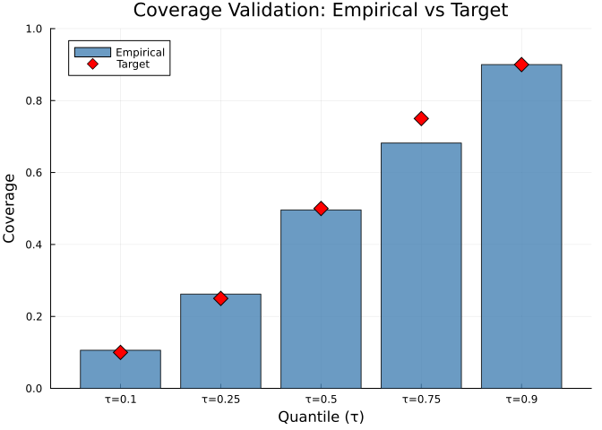
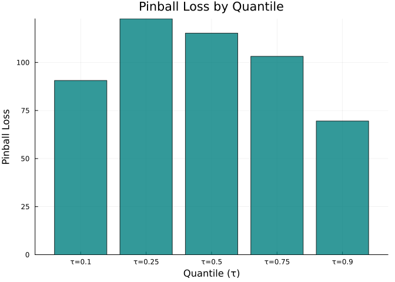

# Quantile GAM Regression
Simon Frost

- [Introduction](#introduction)
- [Setup](#setup)
- [Simulate heteroscedastic data](#simulate-heteroscedastic-data)
- [Fit a single quantile GAM](#fit-a-single-quantile-gam)
  - [Median regression (τ = 0.5)](#median-regression-τ--05)
  - [Compare with mean regression](#compare-with-mean-regression)
- [Fit multiple quantiles](#fit-multiple-quantiles)
  - [Individual quantile fits](#individual-quantile-fits)
  - [Using `mqgam` for simultaneous
    fitting](#using-mqgam-for-simultaneous-fitting)
- [Quantile crossing check](#quantile-crossing-check)
- [Verify quantile coverage](#verify-quantile-coverage)
- [The ELF family](#the-elf-family)
- [Summary](#summary)

## Introduction

Standard GAMs model the **conditional mean** $E[Y \mid X]$. **Quantile
regression** instead models conditional quantiles $Q_\tau(Y \mid X)$,
providing a more complete picture of the response
distribution—especially useful when:

- The variance changes with covariates (heteroscedasticity)
- Interest lies in tail behavior (e.g., 90th percentile)
- The distribution is skewed

GAM.jl implements quantile GAMs following the **qgam** approach (Fasiolo
et al., 2021), using the **Extended Log-F (ELF)** loss as a smooth
approximation to the pinball (check) loss:

$$\rho_\tau(u) = u(\tau - \mathbb{1}_{u < 0})$$

The ELF family provides a smooth, twice-differentiable loss that
converges to the pinball loss, enabling standard penalized likelihood
fitting with automatic smoothing parameter selection.

## Setup

``` julia
using GAM
using StatsAPI: predict, fitted, residuals
using DataFrames
using CSV
using Random
using Statistics
using Plots
```

## Simulate heteroscedastic data

We create data where the conditional variance increases with $x$:

$$y = \sin(2\pi x) + (0.2 + 0.8x)\varepsilon, \quad \varepsilon \sim N(0,1)$$

``` julia
df = CSV.read("data.csv", DataFrame)
x = df.x; y = df.y
n = nrow(df)
println("Data: n = $n")
println("y range: [$(round(minimum(y), digits=2)), $(round(maximum(y), digits=2))]")
println("Mean y: $(round(mean(y), digits=3))")
```

    Data: n = 500
    y range: [-3.15, 2.27]
    Mean y: -0.002

``` julia
scatter(x, y, color=:grey40, markersize=2, alpha=0.3,
    xlabel="x", ylabel="y",
    title="Heteroscedastic Data: Variance Increases with x",
    label="Data", legend=:topleft)
x_grid = range(0, 1, length=200)
plot!(x_grid, sin.(2π .* x_grid), color=:red, linewidth=2, label="True mean: sin(2πx)")
```



## Fit a single quantile GAM

The `qgam` function fits a GAM for a single quantile $\tau$. Internally
it:

1.  Fits a preliminary Gaussian GAM to estimate variance
2.  Computes the smoothness constant
3.  Tunes the learning rate via grid search
4.  Fits the final model with the ELF family

### Median regression (τ = 0.5)

``` julia
m_50 = qgam(@gam_formula(y ~ s(x, k=20, bs=:cr)), df, 0.5)
```

    Generalized Additive Model

    Formula: y ~ 1

    Family: ELF
    Link:   IdentityLink
    Method: REML

    Parametric coefficients:
    ─────────────────────────────────────────────────────
                       Coef.  Std. Error      z  Pr(>|z|)
    ─────────────────────────────────────────────────────
    (Intercept)  -0.00166205    0.135095  -0.01    0.9902
    ─────────────────────────────────────────────────────

    Approximate significance of smooth terms:
    ──────────────────────────────────────────────────
    Smooth                    edf   Ref.df
    ──────────────────────────────────────────────────
    s(x,bs=cr)               4.11       19
    ──────────────────────────────────────────────────

    R² (adj) = 0.554   Deviance explained = 53.9%
    n = 500

``` julia
yhat_50 = predict(m_50)
println("Median regression fitted range: [$(round(minimum(yhat_50), digits=3)), $(round(maximum(yhat_50), digits=3))]")
```

    Median regression fitted range: [-1.072, 0.967]

### Compare with mean regression

``` julia
m_mean = gam(@gam_formula(y ~ s(x, k=20, bs=:cr)), df)
yhat_mean = predict(m_mean)

println("Mean regression fitted range: [$(round(minimum(yhat_mean), digits=3)), $(round(maximum(yhat_mean), digits=3))]")
println("Correlation (mean vs median): $(round(cor(yhat_mean, yhat_50), digits=4))")
```

    Mean regression fitted range: [-1.069, 0.968]
    Correlation (mean vs median): 1.0

For symmetric errors, mean and median regression give similar results.
With heteroscedastic or skewed data, they can diverge.

## Fit multiple quantiles

### Individual quantile fits

``` julia
quantiles = [0.1, 0.25, 0.5, 0.75, 0.9]

fits = Dict{Float64, Any}()
for qu in quantiles
    fits[qu] = qgam(@gam_formula(y ~ s(x, k=20, bs=:cr)), df, qu)
end
```

Examine fitted ranges for each quantile:

``` julia
ord = sortperm(x)
for qu in quantiles
    yhat = predict(fits[qu])
    println("τ = $qu: fitted range [$(round(minimum(yhat), digits=3)), $(round(maximum(yhat), digits=3))]")
end
```

    τ = 0.1: fitted range [-1.362, -1.225]
    τ = 0.25: fitted range [-0.895, 0.159]
    τ = 0.5: fitted range [-1.072, 0.967]
    τ = 0.75: fitted range [-0.191, 0.831]
    τ = 0.9: fitted range [1.103, 1.103]

``` julia
qcolors = Dict(0.1 => :red, 0.25 => :orange, 0.5 => :black, 0.75 => :dodgerblue, 0.9 => :blue)
scatter(x, y, color=:grey40, markersize=2, alpha=0.3,
    xlabel="x", ylabel="y", title="Individual Quantile GAM Fits",
    label="Data", legend=:topleft)
for qu in quantiles
    yhat = predict(fits[qu])[ord]
    plot!(x[ord], yhat, color=qcolors[qu], linewidth=2, label="τ = $qu")
end
current()
```



### Using `mqgam` for simultaneous fitting

`mqgam` fits all quantiles simultaneously, sharing the preliminary
variance estimate for efficiency:

``` julia
mq = mqgam(@gam_formula(y ~ s(x, k=20, bs=:cr)), df, quantiles)
```

    (fits = Dict{Float64, Any}(0.5 => GamModel(n_smooth=1, edf=5.1, deviance=8.75), 0.9 => GamModel(n_smooth=1, edf=2.7, deviance=1694.55), 0.1 => GamModel(n_smooth=1, edf=8.2, deviance=1585.97), 0.25 => GamModel(n_smooth=1, edf=5.2, deviance=31.3), 0.75 => GamModel(n_smooth=1, edf=4.8, deviance=22.31)), quantiles = [0.1, 0.25, 0.5, 0.75, 0.9])

``` julia
println("Quantiles fitted: ", mq.quantiles)
println("Number of models: ", length(mq.fits))
```

    Quantiles fitted: [0.1, 0.25, 0.5, 0.75, 0.9]
    Number of models: 5

Access individual model fits:

``` julia
for qu in quantiles
    yhat = predict(mq.fits[qu])
    println("τ = $qu: fitted range [$(round(minimum(yhat), digits=3)), $(round(maximum(yhat), digits=3))]")
end
```

    τ = 0.1: fitted range [-1.362, -1.225]
    τ = 0.25: fitted range [-0.895, 0.159]
    τ = 0.5: fitted range [-1.072, 0.967]
    τ = 0.75: fitted range [-0.191, 0.831]
    τ = 0.9: fitted range [1.103, 1.103]

``` julia
qcolors = Dict(0.1 => :red, 0.25 => :orange, 0.5 => :black, 0.75 => :dodgerblue, 0.9 => :blue)
scatter(x, y, color=:grey40, markersize=2, alpha=0.3,
    xlabel="x", ylabel="y", title="mqgam: Simultaneous Quantile Fits",
    label="Data", legend=:topleft)
for qu in quantiles
    yhat = predict(mq.fits[qu])[ord]
    plot!(x[ord], yhat, color=qcolors[qu], linewidth=2, label="τ = $qu")
end
current()
```



## Quantile crossing check

A known issue with independent quantile fits is **quantile crossing**,
where estimated quantile curves cross each other. Let’s check:

``` julia
x_sorted = x[ord]
predictions = Dict(qu => predict(mq.fits[qu])[ord] for qu in quantiles)

n_crossings = 0
for i in 1:n
    vals = [predictions[qu][i] for qu in quantiles]
    if !issorted(vals)
        n_crossings += 1
    end
end
println("Quantile crossings: $n_crossings out of $n observations ($(round(100*n_crossings/n, digits=1))%)")
```

    Quantile crossings: 245 out of 500 observations (49.0%)

``` julia
qcolors = Dict(0.1 => :red, 0.25 => :orange, 0.5 => :black, 0.75 => :dodgerblue, 0.9 => :blue)
p = plot(xlabel="x", ylabel="Predicted quantile", title="Quantile Crossing Check",
    legend=:topleft)
for qu in quantiles
    plot!(x_sorted, predictions[qu], color=qcolors[qu], linewidth=2, label="τ = $qu")
end
crossing_flags = [!issorted([predictions[qu][i] for qu in quantiles]) for i in eachindex(x_sorted)]
if any(crossing_flags)
    idx = findall(crossing_flags)
    scatter!(x_sorted[idx], [predictions[0.5][i] for i in idx],
        color=:red, markersize=5, markershape=:xcross,
        label="Crossing ($(length(idx)) pts)")
end
p
```



## Verify quantile coverage

For well-calibrated quantile estimates, approximately
$\tau \times 100\%$ of observations should fall below the $\tau$-th
quantile curve:

``` julia
for qu in quantiles
    yhat = predict(mq.fits[qu])
    coverage = mean(y .< yhat)
    println("τ = $qu: empirical coverage = $(round(coverage, digits=3)) (target = $qu)")
end
```

    τ = 0.1: empirical coverage = 0.106 (target = 0.1)
    τ = 0.25: empirical coverage = 0.262 (target = 0.25)
    τ = 0.5: empirical coverage = 0.496 (target = 0.5)
    τ = 0.75: empirical coverage = 0.682 (target = 0.75)
    τ = 0.9: empirical coverage = 0.9 (target = 0.9)

``` julia
coverages = [mean(y .< predict(mq.fits[qu])) for qu in quantiles]
xs = 1:length(quantiles)
qlabels = ["τ=$(qu)" for qu in quantiles]
bar(xs, coverages, label="Empirical", color=:steelblue, alpha=0.8,
    xlabel="Quantile (τ)", ylabel="Coverage",
    title="Coverage Validation: Empirical vs Target",
    xticks=(xs, qlabels), ylim=(0, 1), legend=:topleft)
scatter!(xs, collect(quantiles), label="Target", color=:red,
    markersize=8, markershape=:diamond)
```



## The ELF family

The Extended Log-F family used internally can be accessed directly:

``` julia
elf = ELFFamily(qu=0.5, co=0.1)
println("ELF family for median: quantile = ", elf.qu)
```

    ELF family for median: quantile = 0.5

The pinball loss for a given quantile $\tau$:

``` julia
pl = pinball_loss(y, predict(mq.fits[0.5]), 0.5)
println("Pinball loss (τ=0.5): ", round(pl, digits=3))

for qu in quantiles
    pl = pinball_loss(y, predict(mq.fits[qu]), qu)
    println("Pinball loss (τ=$qu): $(round(pl, digits=3))")
end
```

    Pinball loss (τ=0.5): 115.234
    Pinball loss (τ=0.1): 90.617
    Pinball loss (τ=0.25): 122.715
    Pinball loss (τ=0.5): 115.234
    Pinball loss (τ=0.75): 103.175
    Pinball loss (τ=0.9): 69.533

``` julia
losses = [pinball_loss(y, predict(mq.fits[qu]), qu) for qu in quantiles]
xs = 1:length(quantiles)
qlabels = ["τ=$(qu)" for qu in quantiles]
bar(xs, losses, color=:teal, alpha=0.8, legend=false,
    xlabel="Quantile (τ)", ylabel="Pinball Loss",
    title="Pinball Loss by Quantile",
    xticks=(xs, qlabels))
```



## Summary

| Feature | GAM.jl | R qgam |
|----|----|----|
| Single quantile | `qgam(formula, data, τ)` | `qgam(formula, data=dat, qu=τ)` |
| Multiple quantiles | `mqgam(formula, data, [τ₁, τ₂, ...])` | `mqgam(formula, data=dat, qu=c(...))` |
| Loss function | ELF (Extended Log-F) | ELF |
| Smoothing | Automatic (REML-based) | Automatic |
| Pinball loss | `pinball_loss(r, τ)` | `pinLoss(...)` |
| Formula syntax | `@gam_formula(y ~ s(x, k=20))` | `y ~ s(x, k=20)` |

Quantile GAMs extend the GAM framework to model the full conditional
distribution, making them especially valuable for heteroscedastic data
where the spread changes with covariates.
