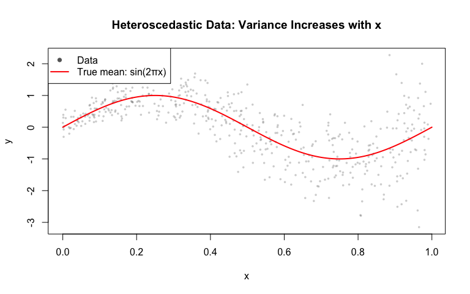
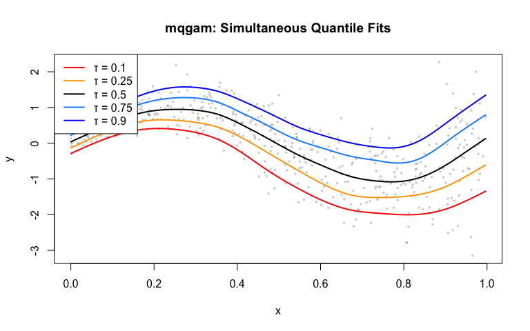
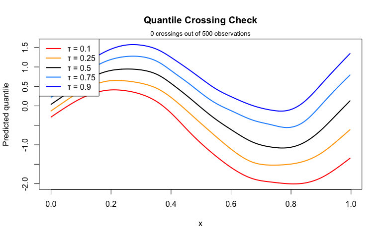
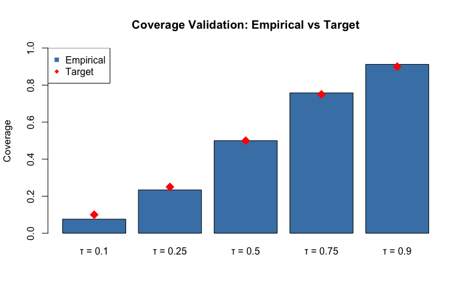
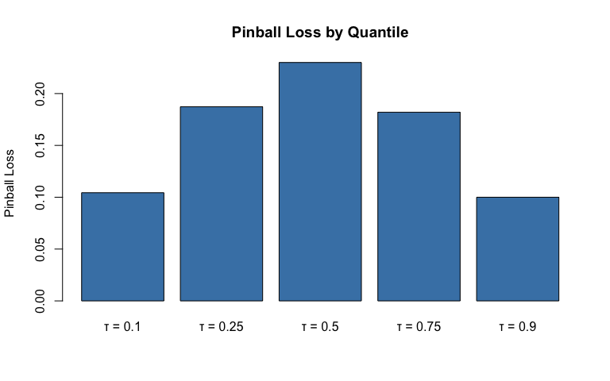

# Quantile GAM Regression
Simon Frost

- [Introduction](#introduction)
- [Setup](#setup)
- [Load heteroscedastic data](#load-heteroscedastic-data)
- [Fit a single quantile GAM](#fit-a-single-quantile-gam)
  - [Median regression (τ = 0.5)](#median-regression-τ--05)
  - [Compare with mean regression](#compare-with-mean-regression)
- [Fit multiple quantiles with
  `mqgam`](#fit-multiple-quantiles-with-mqgam)
- [Quantile crossing check](#quantile-crossing-check)
- [Verify quantile coverage](#verify-quantile-coverage)
- [Individual quantile model
  summaries](#individual-quantile-model-summaries)
- [Comparison table](#comparison-table)

## Introduction

This vignette demonstrates quantile GAM regression using the R **qgam**
package, fitting the same heteroscedastic data as the Julia vignette for
comparison.

## Setup

``` r
library(qgam)
```

    Loading required package: mgcv

    Loading required package: nlme

    This is mgcv 1.9-3. For overview type 'help("mgcv-package")'.

``` r
library(mgcv)
```

## Load heteroscedastic data

$$y = \sin(2\pi x) + (0.2 + 0.8x)\varepsilon, \quad \varepsilon \sim N(0,1)$$

``` r
dat <- read.csv("../data.csv")
x <- dat$x
y <- dat$y
n <- nrow(dat)
cat("Data: n =", n, "\n")
```

    Data: n = 500 

``` r
cat("y range:", range(y), "\n")
```

    y range: -3.150623 2.272297 

``` r
plot(x, y, col = adjustcolor("grey40", alpha.f = 0.3), pch = 16, cex = 0.5,
     xlab = "x", ylab = "y", main = "Heteroscedastic Data: Variance Increases with x")
x_grid <- seq(0, 1, length.out = 200)
lines(x_grid, sin(2 * pi * x_grid), col = "red", lwd = 2)
legend("topleft", legend = c("Data", "True mean: sin(2πx)"),
       col = c("grey40", "red"), pch = c(16, NA), lty = c(NA, 1), lwd = c(NA, 2))
```



## Fit a single quantile GAM

### Median regression (τ = 0.5)

``` r
m_50 <- qgam(y ~ s(x, k = 20, bs = "cr"), data = dat, qu = 0.5)
```

    Estimating learning rate. Each dot corresponds to a loss evaluation. 
    qu = 0.5........done 

``` r
summary(m_50)
```


    Family: elf 
    Link function: identity 

    Formula:
    y ~ s(x, k = 20, bs = "cr")

    Parametric coefficients:
                Estimate Std. Error z value Pr(>|z|)
    (Intercept) 0.005622   0.026322   0.214    0.831

    Approximate significance of smooth terms:
           edf Ref.df Chi.sq p-value    
    s(x) 7.648  9.445  729.6  <2e-16 ***
    ---
    Signif. codes:  0 '***' 0.001 '**' 0.01 '*' 0.05 '.' 0.1 ' ' 1

    R-sq.(adj) =   0.55   Deviance explained =   48%
    -REML =  475.6  Scale est. = 1         n = 500

``` r
yhat_50 <- predict(m_50)
cat("Median regression fitted range:", range(yhat_50), "\n")
```

    Median regression fitted range: -1.081852 0.946946 

### Compare with mean regression

``` r
m_mean <- gam(y ~ s(x, k = 20, bs = "cr"), data = dat)
yhat_mean <- predict(m_mean)

cat("Mean regression fitted range:", range(yhat_mean), "\n")
```

    Mean regression fitted range: -1.048656 0.9559633 

``` r
cat("Correlation (mean vs median):", cor(yhat_mean, yhat_50), "\n")
```

    Correlation (mean vs median): 0.9988322 

## Fit multiple quantiles with `mqgam`

``` r
quantiles <- c(0.1, 0.25, 0.5, 0.75, 0.9)

mq <- mqgam(y ~ s(x, k = 20, bs = "cr"), data = dat, qu = quantiles)
```

    Estimating learning rate. Each dot corresponds to a loss evaluation. 
    qu = 0.5........done 
    qu = 0.25........done 
    qu = 0.75........done 
    qu = 0.1...........done 
    qu = 0.9...............done 

Examine fitted ranges for each quantile:

``` r
for (qu in quantiles) {
  yhat <- qdo(mq, qu, predict, newdata = dat)
  cat(sprintf("τ = %s: fitted range [%.3f, %.3f]\n", qu, min(yhat), max(yhat)))
}
```

    τ = 0.1: fitted range [-2.004, 0.412]
    τ = 0.25: fitted range [-1.522, 0.654]
    τ = 0.5: fitted range [-1.082, 0.947]
    τ = 0.75: fitted range [-0.556, 1.277]
    τ = 0.9: fitted range [-0.134, 1.575]

``` r
qcolors <- c("0.1" = "red", "0.25" = "orange", "0.5" = "black",
             "0.75" = "dodgerblue", "0.9" = "blue")
plot(x, y, col = adjustcolor("grey40", alpha.f = 0.3), pch = 16, cex = 0.5,
     xlab = "x", ylab = "y", main = "mqgam: Simultaneous Quantile Fits")
for (qu in quantiles) {
  yhat <- qdo(mq, qu, predict, newdata = dat)
  ord_tmp <- order(x)
  lines(x[ord_tmp], yhat[ord_tmp], col = qcolors[as.character(qu)], lwd = 2)
}
legend("topleft", legend = paste("τ =", quantiles), col = qcolors, lwd = 2)
```



## Quantile crossing check

``` r
ord <- order(x)
predictions <- sapply(quantiles, function(qu) {
  qdo(mq, qu, predict, newdata = dat)[ord]
})

n_crossings <- sum(apply(predictions, 1, is.unsorted))
cat(sprintf("Quantile crossings: %d out of %d observations (%.1f%%)\n",
            n_crossings, n, 100 * n_crossings / n))
```

    Quantile crossings: 0 out of 500 observations (0.0%)

``` r
qcolors <- c("red", "orange", "black", "dodgerblue", "blue")
matplot(x[ord], predictions, type = "l", lty = 1, lwd = 2, col = qcolors,
        xlab = "x", ylab = "Predicted quantile", main = "Quantile Crossing Check")
crossing_flags <- apply(predictions, 1, is.unsorted)
if (any(crossing_flags)) {
  rug(x[ord][crossing_flags], col = "red", lwd = 2)
}
legend("topleft", legend = paste("τ =", quantiles), col = qcolors, lwd = 2)
mtext(paste0(sum(crossing_flags), " crossings out of ", n, " observations"), side = 3, line = 0.2, cex = 0.8)
```



## Verify quantile coverage

``` r
for (qu in quantiles) {
  yhat <- qdo(mq, qu, predict, newdata = dat)
  coverage <- mean(y < yhat)
  cat(sprintf("τ = %s: empirical coverage = %.3f (target = %.2f)\n", qu, coverage, qu))
}
```

    τ = 0.1: empirical coverage = 0.076 (target = 0.10)
    τ = 0.25: empirical coverage = 0.234 (target = 0.25)
    τ = 0.5: empirical coverage = 0.500 (target = 0.50)
    τ = 0.75: empirical coverage = 0.758 (target = 0.75)
    τ = 0.9: empirical coverage = 0.912 (target = 0.90)

``` r
coverages <- sapply(quantiles, function(qu) {
  yhat <- qdo(mq, qu, predict, newdata = dat)
  mean(y < yhat)
})
bp <- barplot(coverages, names.arg = paste("τ =", quantiles), col = "steelblue",
              ylim = c(0, 1), ylab = "Coverage",
              main = "Coverage Validation: Empirical vs Target")
points(bp, quantiles, col = "red", pch = 18, cex = 2)
legend("topleft", legend = c("Empirical", "Target"),
       col = c("steelblue", "red"), pch = c(15, 18))
```



## Individual quantile model summaries

``` r
for (qu in quantiles) {
  cat(sprintf("\n--- Quantile τ = %s ---\n", qu))
  print(summary(qdo(mq, qu)))
}
```


    --- Quantile τ = 0.1 ---

    Family: elf 
    Link function: identity 

    Formula:
    y ~ s(x, k = 20, bs = "cr")

    Parametric coefficients:
                Estimate Std. Error z value Pr(>|z|)    
    (Intercept)  -0.8010     0.0404  -19.83   <2e-16 ***
    ---
    Signif. codes:  0 '***' 0.001 '**' 0.01 '*' 0.05 '.' 0.1 ' ' 1

    Approximate significance of smooth terms:
           edf Ref.df Chi.sq p-value    
    s(x) 6.361  7.888  631.2  <2e-16 ***
    ---
    Signif. codes:  0 '***' 0.001 '**' 0.01 '*' 0.05 '.' 0.1 ' ' 1

    R-sq.(adj) =  0.456   Deviance explained = 78.7%
    -REML = 677.54  Scale est. = 1         n = 500

    --- Quantile τ = 0.25 ---

    Family: elf 
    Link function: identity 

    Formula:
    y ~ s(x, k = 20, bs = "cr")

    Parametric coefficients:
                Estimate Std. Error z value Pr(>|z|)    
    (Intercept) -0.39329    0.03368  -11.68   <2e-16 ***
    ---
    Signif. codes:  0 '***' 0.001 '**' 0.01 '*' 0.05 '.' 0.1 ' ' 1

    Approximate significance of smooth terms:
           edf Ref.df Chi.sq p-value    
    s(x) 6.954  8.598  632.5  <2e-16 ***
    ---
    Signif. codes:  0 '***' 0.001 '**' 0.01 '*' 0.05 '.' 0.1 ' ' 1

    R-sq.(adj) =  0.529   Deviance explained =   57%
    -REML = 547.66  Scale est. = 1         n = 500

    --- Quantile τ = 0.5 ---

    Family: elf 
    Link function: identity 

    Formula:
    y ~ s(x, k = 20, bs = "cr")

    Parametric coefficients:
                Estimate Std. Error z value Pr(>|z|)
    (Intercept) 0.005622   0.026322   0.214    0.831

    Approximate significance of smooth terms:
           edf Ref.df Chi.sq p-value    
    s(x) 7.648  9.445  729.6  <2e-16 ***
    ---
    Signif. codes:  0 '***' 0.001 '**' 0.01 '*' 0.05 '.' 0.1 ' ' 1

    R-sq.(adj) =   0.55   Deviance explained =   48%
    -REML =  475.6  Scale est. = 1         n = 500

    --- Quantile τ = 0.75 ---

    Family: elf 
    Link function: identity 

    Formula:
    y ~ s(x, k = 20, bs = "cr")

    Parametric coefficients:
                Estimate Std. Error z value Pr(>|z|)    
    (Intercept)   0.4141     0.0295   14.04   <2e-16 ***
    ---
    Signif. codes:  0 '***' 0.001 '**' 0.01 '*' 0.05 '.' 0.1 ' ' 1

    Approximate significance of smooth terms:
           edf Ref.df Chi.sq p-value    
    s(x) 7.889  9.706  409.2  <2e-16 ***
    ---
    Signif. codes:  0 '***' 0.001 '**' 0.01 '*' 0.05 '.' 0.1 ' ' 1

    R-sq.(adj) =  0.522   Deviance explained = 58.5%
    -REML = 516.67  Scale est. = 1         n = 500

    --- Quantile τ = 0.9 ---

    Family: elf 
    Link function: identity 

    Formula:
    y ~ s(x, k = 20, bs = "cr")

    Parametric coefficients:
                Estimate Std. Error z value Pr(>|z|)    
    (Intercept)  0.76904    0.03258   23.61   <2e-16 ***
    ---
    Signif. codes:  0 '***' 0.001 '**' 0.01 '*' 0.05 '.' 0.1 ' ' 1

    Approximate significance of smooth terms:
           edf Ref.df Chi.sq p-value    
    s(x) 7.309  8.993  313.8  <2e-16 ***
    ---
    Signif. codes:  0 '***' 0.001 '**' 0.01 '*' 0.05 '.' 0.1 ' ' 1

    R-sq.(adj) =  0.474   Deviance explained = 79.9%
    -REML = 617.69  Scale est. = 1         n = 500

``` r
pinball <- function(y, yhat, qu) {
  r <- y - yhat
  mean(ifelse(r > 0, qu * r, (qu - 1) * r))
}
losses <- sapply(quantiles, function(qu) {
  yhat <- qdo(mq, qu, predict, newdata = dat)
  pinball(y, yhat, qu)
})
barplot(losses, names.arg = paste("τ =", quantiles), col = "steelblue",
        ylab = "Pinball Loss", main = "Pinball Loss by Quantile")
```



## Comparison table

| Feature | R qgam | Julia GAM.jl |
|----|----|----|
| Single quantile | `qgam(formula, data=dat, qu=τ)` | `qgam(formula, data; qu=τ)` |
| Multiple quantiles | `mqgam(formula, data=dat, qu=c(...))` | `mqgam(formula, data; qu=[...])` |
| Access fits | `mq$fit[["0.5"]]` | `mq.fits[0.5]` |
| Loss function | ELF | ELF |
| Smoothing | Automatic | Automatic |
