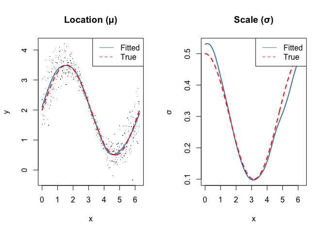
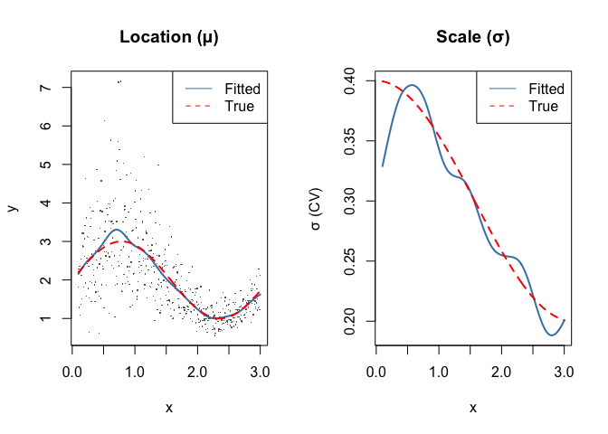
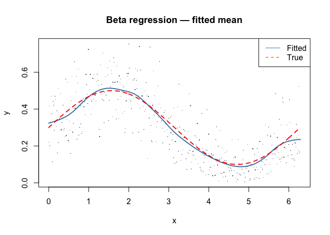

# GAMLSS: R Comparison
Simon Frost

- [Overview](#overview)
- [Setup](#setup)
- [Normal Location-Scale](#normal-location-scale)
  - [Fit](#fit)
  - [Results](#results)
  - [Plot](#plot)
- [Gamma Location-Scale](#gamma-location-scale)
  - [Fit](#fit-1)
  - [Results](#results-1)
  - [Plot](#plot-1)
- [Beta Regression](#beta-regression)
  - [Fit](#fit-2)
  - [Results](#results-2)
  - [Plot](#plot-2)
- [Comparison with mgcv::gaulss](#comparison-with-mgcvgaulss)

## Overview

This vignette shows the R equivalent of the GAMLSS models fit in
`09_gamlss.qmd`, using the `gamlss` package with `gamlss.add` for smooth
terms via `ga()`.

## Setup

``` r
library(gamlss)
```

    Loading required package: splines

    Loading required package: gamlss.data


    Attaching package: 'gamlss.data'

    The following object is masked from 'package:datasets':

        sleep

    Loading required package: gamlss.dist

    Loading required package: nlme

    Loading required package: parallel

     **********   GAMLSS Version 5.5-0  ********** 

    For more on GAMLSS look at https://www.gamlss.com/

    Type gamlssNews() to see new features/changes/bug fixes.

``` r
library(gamlss.add)
```

    Loading required package: mgcv

    This is mgcv 1.9-3. For overview type 'help("mgcv-package")'.


    Attaching package: 'mgcv'

    The following object is masked from 'package:gamlss':

        lp

    Loading required package: nnet


    Attaching package: 'nnet'

    The following object is masked from 'package:mgcv':

        multinom

    Loading required package: rpart

``` r
library(mgcv)
```

## Normal Location-Scale

``` r
df <- read.csv("../data_normal_ls.csv")
cat(sprintf("n = %d, y range: [%.2f, %.2f]\n", nrow(df), min(df$y), max(df$y)))
```

    n = 500, y range: [-0.33, 4.21]

### Fit

Using `pb()` (P-spline basis from gamlss) for smooth terms:

``` r
m <- gamlss(y ~ pb(x, df = 10),
            sigma.formula = ~ pb(x, df = 6),
            family = NO(), data = df, trace = FALSE,
            control = gamlss.control(n.cyc = 100, trace = FALSE))
summary(m)
```

    ******************************************************************
    Family:  c("NO", "Normal") 

    Call:  gamlss(formula = y ~ pb(x, df = 10), sigma.formula = ~pb(x,  
        df = 6), family = NO(), data = df, control = gamlss.control(n.cyc = 100,  
        trace = FALSE), trace = FALSE) 

    Fitting method: RS() 

    ------------------------------------------------------------------
    Mu link function:  identity
    Mu Coefficients:
                    Estimate Std. Error t value Pr(>|t|)    
    (Intercept)     3.503352   0.028999  120.81   <2e-16 ***
    pb(x, df = 10) -0.472456   0.008714  -54.22   <2e-16 ***
    ---
    Signif. codes:  0 '***' 0.001 '**' 0.01 '*' 0.05 '.' 0.1 ' ' 1

    ------------------------------------------------------------------
    Sigma link function:  log
    Sigma Coefficients:
                  Estimate Std. Error t value Pr(>|t|)    
    (Intercept)   -1.28135    0.06315 -20.292   <2e-16 ***
    pb(x, df = 6) -0.02816    0.01740  -1.619    0.106    
    ---
    Signif. codes:  0 '***' 0.001 '**' 0.01 '*' 0.05 '.' 0.1 ' ' 1

    ------------------------------------------------------------------
    NOTE: Additive smoothing terms exist in the formulas: 
     i) Std. Error for smoothers are for the linear effect only. 
    ii) Std. Error for the linear terms maybe are not accurate. 
    ------------------------------------------------------------------
    No. of observations in the fit:  500 
    Degrees of Freedom for the fit:  20.00004
          Residual Deg. of Freedom:  480 
                          at cycle:  4 
     
    Global Deviance:     49.10912 
                AIC:     89.10921 
                SBC:     173.4016 
    ******************************************************************

### Results

``` r
mu_fit <- fitted(m, "mu")
sigma_fit <- fitted(m, "sigma")
cat(sprintf("μ: cor with truth = %.5f\n", cor(mu_fit, df$mu_true)))
```

    μ: cor with truth = 0.99864

``` r
cat(sprintf("σ: cor with truth = %.5f\n", cor(sigma_fit, df$sigma_true)))
```

    σ: cor with truth = 0.98638

### Plot

``` r
par(mfrow = c(1, 2))
plot(df$x, df$y, pch = ".", col = "grey40", main = "Location (μ)",
     xlab = "x", ylab = "y")
lines(df$x, mu_fit, col = "steelblue", lwd = 2)
lines(df$x, df$mu_true, col = "red", lty = 2, lwd = 2)
legend("topright", c("Fitted", "True"), col = c("steelblue", "red"), lty = c(1, 2))

plot(df$x, sigma_fit, type = "l", col = "steelblue", lwd = 2,
     main = "Scale (σ)", xlab = "x", ylab = "σ",
     ylim = range(c(sigma_fit, df$sigma_true)))
lines(df$x, df$sigma_true, col = "red", lty = 2, lwd = 2)
legend("topright", c("Fitted", "True"), col = c("steelblue", "red"), lty = c(1, 2))
```



## Gamma Location-Scale

``` r
df_g <- read.csv("../data_gamma_ls.csv")
```

### Fit

The R `gamlss` Gamma family `GA()` uses the same (μ, σ) parameterization
as GAM.jl’s `GammaLocationScale()`:

``` r
m_g <- gamlss(y ~ pb(x, df = 10),
              sigma.formula = ~ pb(x, df = 6),
              family = GA(), data = df_g, trace = FALSE,
              control = gamlss.control(n.cyc = 100, trace = FALSE))
```

### Results

``` r
mu_g <- fitted(m_g, "mu")
sigma_g <- fitted(m_g, "sigma")
cat(sprintf("μ: cor with truth = %.5f\n", cor(mu_g, df_g$mu_true)))
```

    μ: cor with truth = 0.99363

``` r
cat(sprintf("σ: cor with truth = %.5f\n", cor(sigma_g, df_g$sigma_true)))
```

    σ: cor with truth = 0.97411

### Plot

``` r
par(mfrow = c(1, 2))
idx <- order(df_g$x)
plot(df_g$x, df_g$y, pch = ".", col = "grey40", main = "Location (μ)",
     xlab = "x", ylab = "y")
lines(df_g$x[idx], mu_g[idx], col = "steelblue", lwd = 2)
lines(df_g$x[idx], df_g$mu_true[idx], col = "red", lty = 2, lwd = 2)
legend("topright", c("Fitted", "True"), col = c("steelblue", "red"), lty = c(1, 2))

plot(df_g$x[idx], sigma_g[idx], type = "l", col = "steelblue", lwd = 2,
     main = "Scale (σ)", xlab = "x", ylab = "σ (CV)",
     ylim = range(c(sigma_g, df_g$sigma_true)))
lines(df_g$x[idx], df_g$sigma_true[idx], col = "red", lty = 2, lwd = 2)
legend("topright", c("Fitted", "True"), col = c("steelblue", "red"), lty = c(1, 2))
```



## Beta Regression

``` r
df_b <- read.csv("../data_beta_reg.csv")
```

### Fit

The R `gamlss` Beta family `BE()` uses (μ, σ) where σ = 1/(1+φ). We use
`BEINF0` or `BE` depending on boundary handling:

``` r
m_b <- gamlss(y ~ pb(x, df = 10),
              sigma.formula = ~ 1,
              family = BE(), data = df_b, trace = FALSE,
              control = gamlss.control(n.cyc = 100, trace = FALSE))
```

### Results

``` r
mu_b <- fitted(m_b, "mu")
cat(sprintf("μ: cor with truth = %.5f\n", cor(mu_b, df_b$mu_true)))
```

    μ: cor with truth = 0.99577

### Plot

``` r
idx <- order(df_b$x)
plot(df_b$x, df_b$y, pch = ".", col = "grey40",
     main = "Beta regression — fitted mean",
     xlab = "x", ylab = "y")
lines(df_b$x[idx], mu_b[idx], col = "steelblue", lwd = 2)
lines(df_b$x[idx], df_b$mu_true[idx], col = "red", lty = 2, lwd = 2)
legend("topright", c("Fitted", "True"), col = c("steelblue", "red"), lty = c(1, 2))
```



## Comparison with mgcv::gaulss

The `mgcv` package also supports some location-scale families via
`gaulss()`, `gammals()`, etc.:

``` r
m_mgcv <- gam(list(y ~ s(x, k = 15, bs = "cr"),
                    ~ s(x, k = 10, bs = "cr")),
              family = gaulss(), data = df)

mu_mgcv <- fitted(m_mgcv)[, 1]
# mgcv gaulss returns 1/σ in the second component
sigma_mgcv <- 1 / fitted(m_mgcv)[, 2]

cat(sprintf("mgcv μ: cor with truth = %.5f\n", cor(mu_mgcv, df$mu_true)))
```

    mgcv μ: cor with truth = 0.99861

``` r
cat(sprintf("mgcv σ: cor with truth = %.5f\n", cor(sigma_mgcv, df$sigma_true)))
```

    mgcv σ: cor with truth = 0.98642
