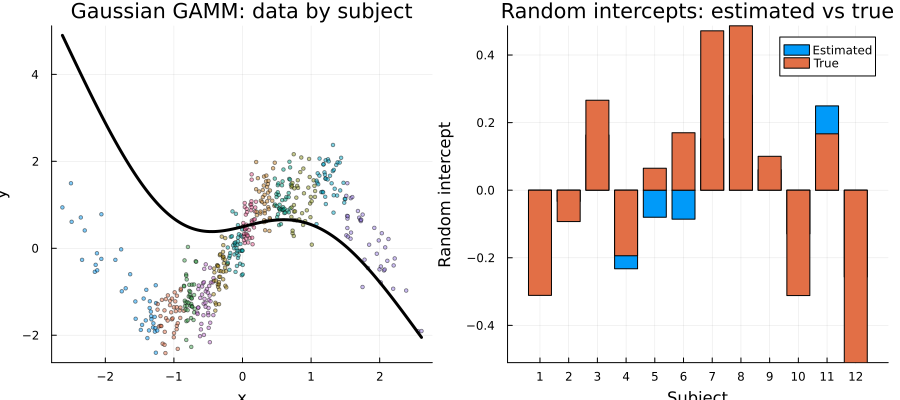
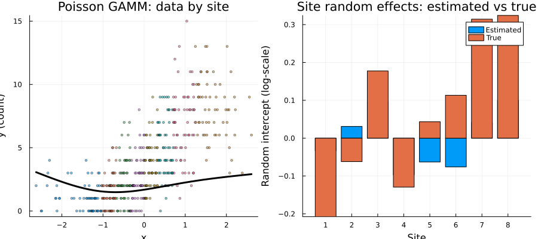

# GAMM: Generalized Additive Mixed Models
Simon Frost

- [Introduction](#introduction)
  - [Model specification](#model-specification)
- [Setup](#setup)
- [Example 1: Gaussian GAMM with Random
  Intercepts](#example-1-gaussian-gamm-with-random-intercepts)
  - [Data](#data)
  - [Fitting with `gamm()`](#fitting-with-gamm)
  - [Random effects](#random-effects)
  - [Variance components](#variance-components)
  - [Comparison with true values](#comparison-with-true-values)
  - [Visualizing the Gaussian GAMM](#visualizing-the-gaussian-gamm)
  - [Equivalence with
    `s(subject, bs=:re)`](#equivalence-with-ssubject-bsre)
- [Example 2: Poisson GAMM for Count
  Data](#example-2-poisson-gamm-for-count-data)
  - [Fitting](#fitting)
  - [Random effects](#random-effects-1)
  - [Visualizing the Poisson GAMM](#visualizing-the-poisson-gamm)
- [Example 3: Alternative Formula
  Interfaces](#example-3-alternative-formula-interfaces)
  - [Using `@formula` with `(1|group)`](#using-formula-with-1group)
  - [Using `@formula` with `re(group)`](#using-formula-with-regroup)
  - [Consistency](#consistency)
- [Prediction](#prediction)
- [Summary](#summary)

## Introduction

A **Generalized Additive Mixed Model** (GAMM) combines the smooth,
nonlinear covariate effects of a GAM with **grouped random effects** —
random intercepts and slopes that vary across levels of a grouping
factor (e.g., subjects, sites, or time series). GAMMs are essential
when:

- Observations are **clustered** (repeated measures on subjects, spatial
  replicates at sites)
- Between-cluster variability needs to be **explicitly modeled** (not
  just absorbed by smooth terms)
- You want to separate **population-level smooth trends** from
  **cluster-specific deviations**

In penalized regression terms, a random intercept
$b_j \sim N(0, \sigma^2_b)$ is equivalent to adding a ridge penalty on
the group indicator columns — which is precisely what `s(group, bs=:re)`
already does in a standard GAM. GAM.jl’s `gamm()` provides the familiar
mixed-model syntax `(1|group)` as a convenient front-end to this same
machinery.

### Model specification

For a response $y_{ij}$ (observation $i$ in group $j$):

$$g(\mu_{ij}) = \mathbf{x}_i^\top \boldsymbol{\beta} + \sum_k f_k(x_{ik}) + b_j, \qquad b_j \sim N(0, \sigma^2_b)$$

where $g$ is the link function, $f_k$ are smooth functions estimated via
penalized regression splines, and $b_j$ are random intercepts.

## Setup

``` julia
using GAM
using CSV
using DataFrames
using Distributions
using GLM: LogLink, IdentityLink
using Statistics: mean, std, var, cor
using StatsAPI: fitted, deviance, nobs, coef, predict
using Plots
using Printf
```

## Example 1: Gaussian GAMM with Random Intercepts

### Data

Simulated data with 12 subjects, each observed 40 times. The
population-level signal is $\mu(x) = 1.5\sin(1.5x)$, with
subject-specific random intercepts ($\sigma_b = 0.6$) and residual noise
($\sigma_\varepsilon = 0.4$).

``` julia
dat = CSV.read("data_gaussian_gamm.csv", DataFrame)
println("n = $(nrow(dat)), subjects = $(length(unique(dat.subject)))")
println("y range: [$(round(minimum(dat.y); digits=2)), $(round(maximum(dat.y); digits=2))]")
```

    n = 480, subjects = 12
    y range: [-2.41, 2.38]

### Fitting with `gamm()`

The `(1 | subject)` syntax specifies a random intercept for each subject
level:

``` julia
m = gamm(@gamm_formula(y ~ s(x, k=15) + (1 | subject)), dat)
println(m)
```

    Generalized Additive Mixed Model

    Family: Normal
    Link:   IdentityLink

    Fixed Effects Coefficients:
      β[1] =   0.025752

    Smooth Terms:
      s(x,bs=tp)            edf =   7.82

    Random Effects:
      (1 | subject)         σ =   0.2206  (n_levels = 12)

    Deviance:          78.5108
    REML:             282.9764
    Scale est.:       0.169240
    n = 480

### Random effects

Extract per-subject random intercept estimates (BLUPs) using `ranef()`:

``` julia
re = ranef(m)
est = vec(re.subject.effects)
levels = re.subject.levels
for (lev, eff) in zip(levels, est)
    @printf("  Subject %2s: b̂ = %+.3f\n", lev, eff)
end
```

      Subject  1: b̂ = -0.090
      Subject  2: b̂ = -0.033
      Subject  3: b̂ = +0.163
      Subject  4: b̂ = -0.233
      Subject  5: b̂ = -0.080
      Subject  6: b̂ = -0.086
      Subject  7: b̂ = +0.152
      Subject  8: b̂ = +0.281
      Subject  9: b̂ = +0.060
      Subject 10: b̂ = -0.129
      Subject 11: b̂ = +0.249
      Subject 12: b̂ = -0.257

### Variance components

`VarCorr()` returns the estimated random effect standard deviation:

``` julia
vc = VarCorr(m)
for v in vc
    @printf("  %s: σ = %.4f  (n_levels = %d)\n", v.label, v.std, v.n_levels)
end
residual_scale = m isa GAM.GammModel ? m.gam_model.scale : m.scale
@printf("  Residual: σ = %.4f\n", sqrt(residual_scale))
```

      (1 | subject): σ = 0.2206  (n_levels = 12)
      Residual: σ = 0.4114

### Comparison with true values

``` julia
true_re = [dat.re_true[findfirst(dat.subject .== s)] for s in sort(unique(dat.subject))]
@printf("Correlation of estimated vs true RE: %.4f\n", cor(est, true_re))
```

    Correlation of estimated vs true RE: 0.8471

### Visualizing the Gaussian GAMM

``` julia
# Population smooth on a prediction grid (unknown subject → zero RE)
x_grid = range(minimum(dat.x), maximum(dat.x); length=200)
pop_pred = predict(m, DataFrame(x=x_grid, subject=fill(999, 200)))

p1 = scatter(dat.x, dat.y; group=dat.subject, markersize=2, alpha=0.5,
    xlabel="x", ylabel="y", title="Gaussian GAMM: data by subject",
    legend=:none)
plot!(p1, x_grid, pop_pred; color=:black, linewidth=3, label="population smooth")

n_groups = length(levels)
p2 = bar(1:n_groups, [est true_re]; label=["Estimated" "True"], legend=:topright,
    xlabel="Subject", ylabel="Random intercept",
    title="Random intercepts: estimated vs true",
    xticks=(1:n_groups, string.(levels)))

plot(p1, p2; layout=(1, 2), size=(900, 400))
```



### Equivalence with `s(subject, bs=:re)`

In GAM.jl, `gamm(@gamm_formula(y ~ s(x) + (1|subject)), ...)` is
mathematically equivalent to
`gam(@gam_formula(y ~ s(x) + s(subject, bs=:re)), ...)`. Both treat the
random intercept as a smooth with identity penalty:

``` julia
m_gam = gam(@gam_formula(y ~ s(x, k=15) + s(subject, bs=:re)), dat)
@printf("Fitted values correlation: %.6f\n", cor(fitted(m), fitted(m_gam)))
@printf("Scale (gamm): %.6f\n", m.gam_model.scale)
@printf("Scale (gam):  %.6f\n", m_gam.scale)
```

    Fitted values correlation: 0.999995
    Scale (gamm): 0.169240
    Scale (gam):  0.169392

## Example 2: Poisson GAMM for Count Data

Count data with 8 sites, each observed 60 times. The true log-rate has a
smooth trend plus site-specific random intercepts ($\sigma_b = 0.4$):

$$\log(\lambda_{ij}) = 1 + 0.8\sin(x_i) + b_j, \qquad b_j \sim N(0, 0.16)$$

``` julia
dat2 = CSV.read("data_poisson_gamm.csv", DataFrame)
println("n = $(nrow(dat2)), sites = $(length(unique(dat2.site)))")
println("y range: [$(minimum(dat2.y)), $(maximum(dat2.y))]")
```

    n = 480, sites = 8
    y range: [0.0, 15.0]

### Fitting

Pass `Poisson()` as the family — the canonical `LogLink` is used
automatically:

``` julia
m2 = gamm(@gamm_formula(y ~ s(x, k=15) + (1 | site)), dat2, Poisson())
println(m2)
```

    Generalized Additive Mixed Model

    Family: Poisson
    Link:   LogLink

    Fixed Effects Coefficients:
      β[1] =   1.139613

    Smooth Terms:
      s(x,bs=tp)            edf =   5.31

    Random Effects:
      (1 | site)            σ =   0.1150  (n_levels = 8)

    Deviance:         553.9613
    REML:             942.2983
    Scale est.:       1.000000
    n = 480

### Random effects

``` julia
re2 = ranef(m2)
est2 = vec(re2.site.effects)
true_re2 = [dat2.re_true[findfirst(dat2.site .== s)] for s in sort(unique(dat2.site))]
@printf("RE correlation with truth: %.4f\n", cor(est2, true_re2))

vc2 = VarCorr(m2)
@printf("Estimated σ_RE: %.4f (true: 0.4)\n", vc2[1].std)
```

    RE correlation with truth: 0.6420
    Estimated σ_RE: 0.1150 (true: 0.4)

### Visualizing the Poisson GAMM

``` julia
# Population smooth on prediction grid
x_grid2 = range(minimum(dat2.x), maximum(dat2.x); length=200)
pop_pred2 = predict(m2, DataFrame(x=x_grid2, site=fill(999, 200)))

site_levels = sort(unique(dat2.site))
p1 = scatter(dat2.x, dat2.y; group=dat2.site, markersize=2, alpha=0.5,
    xlabel="x", ylabel="y (count)", title="Poisson GAMM: data by site",
    legend=:none)
plot!(p1, x_grid2, pop_pred2; color=:black, linewidth=3, label="population mean")

n_sites = length(site_levels)
p2 = bar(1:n_sites, [est2 true_re2]; label=["Estimated" "True"], legend=:topright,
    xlabel="Site", ylabel="Random intercept (log-scale)",
    title="Site random effects: estimated vs true",
    xticks=(1:n_sites, string.(site_levels)))

plot(p1, p2; layout=(1, 2), size=(900, 400))
```



## Example 3: Alternative Formula Interfaces

GAM.jl supports multiple ways to specify random effects:

### Using `@formula` with `(1|group)`

StatsModels.jl parses `(1|group)` as a `FunctionTerm{typeof(|)}`, which
`gamm()` detects automatically:

``` julia
_scale(m) = m isa GAM.GammModel ? m.gam_model.scale : m.scale
m3a = gamm(@formula(y ~ cr(x, 15) + (1|subject)), dat)
@printf("@formula path: scale = %.6f\n", _scale(m3a))
```

    @formula path: scale = 0.169240

### Using `@formula` with `re(group)`

The `re()` convenience function provides an alternative syntax:

``` julia
m3b = gamm(@formula(y ~ cr(x, 15) + re(subject)), dat)
@printf("re() path: scale = %.6f\n", _scale(m3b))
```

    re() path: scale = 0.175579

### Consistency

All three formula interfaces produce the same fit:

``` julia
m3c = gamm(@gamm_formula(y ~ s(x, k=15) + (1|subject)), dat)
@printf("cor(@gamm_formula, @formula(|)):  %.6f\n", cor(fitted(m3c), fitted(m3a)))
@printf("cor(@gamm_formula, @formula(re)): %.6f\n", cor(fitted(m3c), fitted(m3b)))
```

    cor(@gamm_formula, @formula(|)):  1.000000
    cor(@gamm_formula, @formula(re)): 0.997444

## Prediction

Predict on new data — unknown group levels get zero random effect
contribution:

``` julia
# Known subjects
df_known = DataFrame(x=[0.0, 0.5, 1.0], subject=[1, 2, 3])
pred_known = predict(m, df_known)
@printf("Predictions (known subjects): [%.3f, %.3f, %.3f]\n", pred_known...)

# New subject (never seen)
df_new = DataFrame(x=[0.0, 0.5, 1.0], subject=[999, 999, 999])
pred_new = predict(m, df_new)
@printf("Predictions (new subject):    [%.3f, %.3f, %.3f]\n", pred_new...)
```

    Predictions (known subjects): [0.393, 0.801, 0.495]
    Predictions (new subject):    [0.495, 0.650, 0.544]

## Summary

| Feature             | Syntax                                                |
|---------------------|-------------------------------------------------------|
| Random intercept    | `(1 \| group)` or `re(group)`                         |
| Gaussian family     | `gamm(formula, data)`                                 |
| Non-Gaussian        | `gamm(formula, data, Poisson())`                      |
| Equivalent GAM      | `gam(@gam_formula(y ~ s(x) + s(group, bs=:re)), ...)` |
| Random effects      | `ranef(m)`                                            |
| Variance components | `VarCorr(m)`                                          |
| Prediction          | `predict(m, newdata)`                                 |

GAM.jl’s `gamm()` delegates to the same proven PIRLS+REML machinery used
by `gam()`, treating random effects as smooth terms with identity
penalty matrices. This means GAMM results are numerically equivalent to
the corresponding `s(group, bs=:re)` formulation, but with the
convenience of mixed-model notation.
