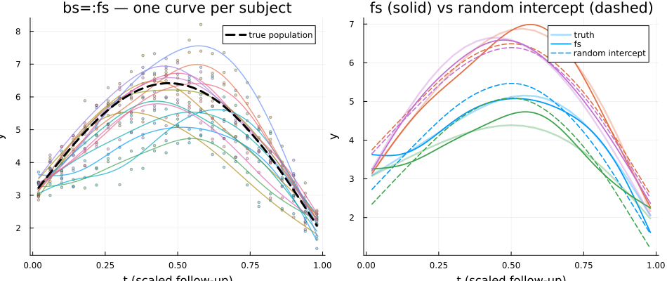

# GAMM: Generalized Additive Mixed Models
Simon Frost

- [Introduction](#introduction)
  - [Model specification](#model-specification)
- [Setup](#setup)
- [Example 1: Gaussian GAMM with Random
  Intercepts](#example-1-gaussian-gamm-with-random-intercepts)
  - [Data](#data)
  - [Fitting with `gamm()`](#fitting-with-gamm)
  - [Random effects](#random-effects)
  - [Variance components](#variance-components)
  - [Comparison with true values](#comparison-with-true-values)
  - [Visualizing the Gaussian GAMM](#visualizing-the-gaussian-gamm)
  - [Equivalence with
    `s(subject, bs=:re)`](#equivalence-with-ssubject-bsre)
- [Example 2: Poisson GAMM for Count
  Data](#example-2-poisson-gamm-for-count-data)
  - [Fitting](#fitting)
  - [Random effects](#random-effects-1)
  - [Visualizing the Poisson GAMM](#visualizing-the-poisson-gamm)
- [Example 3: Factor-Smooth Interactions
  (`bs=:fs`)](#example-3-factor-smooth-interactions-bsfs)
  - [Data](#data-1)
  - [Fitting](#fitting-1)
  - [Why three smoothing parameters, not
    fifteen?](#why-three-smoothing-parameters-not-fifteen)
  - [What a random intercept cannot
    do](#what-a-random-intercept-cannot-do)
  - [Prediction for an unseen
    subject](#prediction-for-an-unseen-subject)
  - [Comparison with mgcv](#comparison-with-mgcv)
- [Example 4: Equivalent Formula
  Interfaces](#example-4-equivalent-formula-interfaces)
  - [Using `@formula` with `(1|group)`](#using-formula-with-1group)
  - [Using `@formula` with `re(group)`](#using-formula-with-regroup)
  - [Consistency with `re(group)` and
    `s(group, bs=:re)`](#consistency-with-regroup-and-sgroup-bsre)
- [Prediction](#prediction)
- [Summary](#summary)

## Introduction

A **Generalized Additive Mixed Model** (GAMM) combines the smooth,
nonlinear covariate effects of a GAM with **grouped random effects** —
random intercepts and slopes that vary across levels of a grouping
factor (e.g., subjects, sites, or time series). GAMMs are essential
when:

- Observations are **clustered** (repeated measures on subjects, spatial
  replicates at sites)
- Between-cluster variability needs to be **explicitly modeled** (not
  just absorbed by smooth terms)
- You want to separate **population-level smooth trends** from
  **cluster-specific deviations**

In penalized regression terms, a random intercept
$b_j \sim N(0, \sigma^2_b)$ is equivalent to adding a ridge penalty on
the group indicator columns — which is precisely what `s(group, bs=:re)`
already does in a standard GAM. GAM.jl’s `gamm()` provides the familiar
mixed-model syntax `(1|group)` as a convenient front-end to this same
machinery.

### Model specification

For a response $y_{ij}$ (observation $i$ in group $j$):

$$g(\mu_{ij}) = \mathbf{x}_i^\top \boldsymbol{\beta} + \sum_k f_k(x_{ik}) + b_j, \qquad b_j \sim N(0, \sigma^2_b)$$

where $g$ is the link function, $f_k$ are smooth functions estimated via
penalized regression splines, and $b_j$ are random intercepts.

## Setup

``` julia
using GAM
using CSV
using DataFrames
using Distributions
using GLM: LogLink, IdentityLink
using LinearAlgebra: rank
using Statistics: mean, std, var, cor
using StatsAPI: fitted, deviance, nobs, coef, predict
using Plots
using Printf
```

## Example 1: Gaussian GAMM with Random Intercepts

### Data

Simulated data with 12 subjects, each observed 40 times. The
population-level signal is $\mu(x) = 1.5\sin(1.5x)$, with
subject-specific random intercepts ($\sigma_b = 0.6$) and residual noise
($\sigma_\varepsilon = 0.4$). The dataset is produced by
`vignettes/generate_data.jl` from exactly this process with a fixed
seed. (With only 12 subjects, the *sample* standard deviation of the
drawn intercepts differs noticeably from $\sigma_b$ — estimates should
be compared to the drawn effects in `re_true`, not to the population
value.)

``` julia
dat = CSV.read("data_gaussian_gamm.csv", DataFrame)
# `s(g, bs=:re)` needs a *factor*. A numeric column enters as a linear
# (random-slope) term on its values instead — matching mgcv, which treats
# non-factors as numeric. `gamm`'s `(1 | subject)` groups by level either way,
# so only the explicit `s(..., bs=:re)` comparisons below need this column.
dat.subject_f = string.(dat.subject)
println("n = $(nrow(dat)), subjects = $(length(unique(dat.subject)))")
println("y range: [$(round(minimum(dat.y); digits=2)), $(round(maximum(dat.y); digits=2))]")
```

    n = 480, subjects = 12
    y range: [-2.47, 3.06]

### Fitting with `gamm()`

The `(1 | subject)` syntax specifies a random intercept for each subject
level:

``` julia
m = gamm(@formula(y ~ s(x, k=15) + (1 | subject)), dat)
println(m)
```

    ┌ Warning: Random effect grouping variable :subject is numeric (Float64). This will be treated as a categorical grouping variable. If this is intentional, convert to CategoricalArray or String first.
    └ @ GAM ~/Projects/gam/GAM.jl/src/validation.jl:291
    Generalized Additive Mixed Model

    Family: Normal
    Link:   IdentityLink

    Fixed Effects Coefficients:
      β[1] =   0.184662

    Smooth Terms:
      s(x,bs=tp)            edf =  11.70

    Variance Components:
     Group                 Term                      Variance      Std.Dev.    Levels
     ──────────────────────────────────────────────────────────────────────────────
     subject               Intercept                 0.215958      0.464713        12
     Residual                                        0.147477      0.384028          

    Deviance:          67.3213
    REML:             269.4643
    Scale est.:       0.147477
    n = 480

### Random effects

Extract per-subject random intercept estimates (BLUPs) using `ranef()`:

``` julia
re = ranef(m)
est = vec(re.subject.effects)
levels = re.subject.levels
for (lev, eff) in zip(levels, est)
    @printf("  Subject %2s: b̂ = %+.3f\n", lev, eff)
end
```

      Subject 1.0: b̂ = +0.365
      Subject 2.0: b̂ = -0.504
      Subject 3.0: b̂ = -0.609
      Subject 4.0: b̂ = +0.405
      Subject 5.0: b̂ = +0.418
      Subject 6.0: b̂ = -0.363
      Subject 7.0: b̂ = +0.339
      Subject 8.0: b̂ = -0.178
      Subject 9.0: b̂ = -0.199
      Subject 10.0: b̂ = -0.442
      Subject 11.0: b̂ = -0.081
      Subject 12.0: b̂ = +0.848

### Variance components

`VarCorr()` returns the estimated random effect standard deviation:

``` julia
vc = VarCorr(m)
for v in vc
    @printf("  %s: σ = %.4f  (n_levels = %d)\n", v.label, v.std, v.n_levels)
end
residual_scale = m isa GAM.GammModel ? m.gam_model.scale : m.scale
@printf("  Residual: σ = %.4f\n", sqrt(residual_scale))
```

      Intercept: σ = 0.4647  (n_levels = 12)
      Residual: σ = 0.3840  (n_levels = 480)
      Residual: σ = 0.3840

### Comparison with true values

``` julia
true_re = [dat.re_true[findfirst(dat.subject .== s)] for s in sort(unique(dat.subject))]
@printf("Correlation of estimated vs true RE: %.4f\n", cor(est, true_re))
```

    Correlation of estimated vs true RE: 0.9874

### Visualizing the Gaussian GAMM

``` julia
# Population smooth on a prediction grid (unknown subject → zero RE)
x_grid = collect(range(minimum(dat.x), maximum(dat.x); length=200))
pop_pred = predict(m, DataFrame(x=x_grid, subject=fill(999, length(x_grid))))
mu_true_grid = 1.5 .* sin.(1.5 .* x_grid)
subject_levels = sort(unique(dat.subject))

p1 = scatter(dat.x, dat.y; group=dat.subject, markersize=2, alpha=0.45,
    xlabel="x", ylabel="y", title="Gaussian GAMM: data by subject",
    label="")
for (i, subj) in enumerate(subject_levels)
    subj_pred = predict(m, DataFrame(x=x_grid, subject=fill(subj, length(x_grid))))
    plot!(p1, x_grid, subj_pred; color=i, alpha=0.35, linewidth=1.25,
        label=i == 1 ? "subject-specific fits" : "")
end
plot!(p1, x_grid, pop_pred; color=:black, linewidth=3, linestyle=:dash, label="population mean")
plot!(p1, x_grid, mu_true_grid; color=:red, linewidth=2, linestyle=:dot, label="true population mean")

n_groups = length(levels)
p2 = bar(1:n_groups, [est true_re]; label=["Estimated" "True"], legend=:topright,
    xlabel="Subject", ylabel="Random intercept",
    title="Random intercepts: estimated vs true",
    xticks=(1:n_groups, string.(levels)))

plot(p1, p2; layout=(1, 2), size=(900, 400))
```


### Equivalence with `s(subject, bs=:re)`

In GAM.jl, `gamm(@formula(y ~ s(x) + (1|subject)), ...)` is
mathematically equivalent to
`gam(@formula(y ~ s(x) + s(subject, bs=:re)), ...)`. Both treat the
random intercept as a smooth with identity penalty. Note the grouping
variable must be a **factor** (`subject_f` here): given a numeric
column, `bs=:re` fits a random *slope* on those values, exactly as mgcv
does.

``` julia
m_gam = gam(@formula(y ~ s(x, k=15) + s(subject_f, bs=:re)), dat)
@printf("Fitted values correlation: %.6f\n", cor(fitted(m), fitted(m_gam)))
@printf("Scale (gamm): %.6f\n", m.gam_model.scale)
@printf("Scale (gam):  %.6f\n", m_gam.scale)
```

    Fitted values correlation: 1.000000
    Scale (gamm): 0.147477
    Scale (gam):  0.147477

## Example 2: Poisson GAMM for Count Data

Count data with 8 sites, each observed 60 times. The true log-rate has a
smooth trend plus site-specific random intercepts ($\sigma_b = 0.4$;
again generated by `vignettes/generate_data.jl`, and with only 8 sites
the sample spread of the drawn $b_j$ can differ substantially from
$\sigma_b$):

$$\log(\lambda_{ij}) = 1 + 0.8\sin(x_i) + b_j, \qquad b_j \sim N(0, 0.16)$$

``` julia
dat2 = CSV.read("data_poisson_gamm.csv", DataFrame)
println("n = $(nrow(dat2)), sites = $(length(unique(dat2.site)))")
println("y range: [$(minimum(dat2.y)), $(maximum(dat2.y))]")
```

    n = 480, sites = 8
    y range: [0.0, 13.0]

### Fitting

Pass `Poisson()` as the family — the canonical `LogLink` is used
automatically:

``` julia
m2 = gamm(@formula(y ~ s(x, k=15) + (1 | site)), dat2, Poisson())
println(m2)
```

    ┌ Warning: Random effect grouping variable :site is numeric (Float64). This will be treated as a categorical grouping variable. If this is intentional, convert to CategoricalArray or String first.
    └ @ GAM ~/Projects/gam/GAM.jl/src/validation.jl:291
    Generalized Additive Mixed Model

    Family: Poisson
    Link:   LogLink

    Fixed Effects Coefficients:
      β[1] =   0.980357

    Smooth Terms:
      s(x,bs=tp)            edf =   6.72

    Variance Components:
     Group                 Term                      Variance      Std.Dev.    Levels
     ──────────────────────────────────────────────────────────────────────────────
     site                  Intercept                 0.136510      0.369472         8
     Residual                                        1.057981      1.028582          

    Deviance:         538.8796
    REML:             482.9459
    Scale est.:       1.057981
    n = 480

### Random effects

``` julia
re2 = ranef(m2)
est2 = vec(re2.site.effects)
true_re2 = [dat2.re_true[findfirst(dat2.site .== s)] for s in sort(unique(dat2.site))]
@printf("RE correlation with truth: %.4f\n", cor(est2, true_re2))

vc2 = VarCorr(m2)
sd_drawn = std([dat2.re_true[findfirst(dat2.site .== s)] for s in sort(unique(dat2.site))])
@printf("Estimated σ_RE: %.4f (population σ_b: 0.4; sd of the 8 drawn effects: %.4f)\n",
    vc2[1].std, sd_drawn)
```

    RE correlation with truth: 0.9743
    Estimated σ_RE: 0.3695 (population σ_b: 0.4; sd of the 8 drawn effects: 0.3575)

### Visualizing the Poisson GAMM

``` julia
# Population smooth on prediction grid
x_grid2 = collect(range(minimum(dat2.x), maximum(dat2.x); length=200))
pop_pred2 = predict(m2, DataFrame(x=x_grid2, site=fill(999, length(x_grid2))))
lambda_true_grid = exp.(1 .+ 0.8 .* sin.(x_grid2))

site_levels = sort(unique(dat2.site))
p1 = scatter(dat2.x, dat2.y; group=dat2.site, markersize=2, alpha=0.45,
    xlabel="x", ylabel="y (count)", title="Poisson GAMM: data by site",
    label="")
for (i, site) in enumerate(site_levels)
    site_pred = predict(m2, DataFrame(x=x_grid2, site=fill(site, length(x_grid2))))
    plot!(p1, x_grid2, site_pred; color=i, alpha=0.35, linewidth=1.25,
        label=i == 1 ? "site-specific fits" : "")
end
plot!(p1, x_grid2, pop_pred2; color=:black, linewidth=3, linestyle=:dash, label="population mean")
plot!(p1, x_grid2, lambda_true_grid; color=:red, linewidth=2, linestyle=:dot, label="true population mean")

n_sites = length(site_levels)
p2 = bar(1:n_sites, [est2 true_re2]; label=["Estimated" "True"], legend=:topright,
    xlabel="Site", ylabel="Random intercept (log-scale)",
    title="Site random effects: estimated vs true",
    xticks=(1:n_sites, string.(site_levels)))

plot(p1, p2; layout=(1, 2), size=(900, 400))
```


## Example 3: Factor-Smooth Interactions (`bs=:fs`)

A random intercept lets each subject sit **higher or lower**, but every
subject still follows the same curve. That is often too rigid: in
longitudinal data subjects frequently differ in the *shape* of their
trajectory — when they peak, how fast they decline — not merely in
level.

A **factor-smooth interaction**, `s(x, group, bs=:fs)`, gives every
level of the grouping factor its own smooth curve, while treating those
curves as exchangeable draws from a common distribution. It is the
smooth analogue of a random effect: instead of one random *number* per
subject, you get one random *function* per subject.

### Data

375 observations: 15 subjects, each measured at the same 25 scaled
follow-up times $t \in [0.02, 0.98]$. Subjects differ in trajectory
shape:

$$y_{ij} = \underbrace{3 + 4\sin(\pi t_i) - 1.2 t_i}_{f(t)\ \text{population}} +
\underbrace{a_j \sin(\pi t_i) + b_j \sin(2\pi t_i)}_{g_j(t)\ \text{subject deviation}} + \varepsilon_{ij}$$

with $a_j \sim N(0, 0.7^2)$, $b_j \sim N(0, 0.5^2)$ and
$\varepsilon \sim N(0, 0.35^2)$. Because the deviations multiply
*functions of $t$* rather than adding constants, the subject curves
genuinely differ in shape — a random intercept cannot represent them.
The file is produced by `vignettes/generate_data.jl` from exactly this
process.

``` julia
traj = CSV.read("data_fs_trajectories.csv", DataFrame)
traj.subject_f = string.(Int.(traj.subject))
println("n = $(nrow(traj)), subjects = $(length(unique(traj.subject_f)))")
```

    n = 375, subjects = 15

### Fitting

``` julia
m_fs = gam(@formula(y ~ s(t, subject_f, bs=:fs, k=8)), traj)
@printf("converged = %s,  edf = %.2f,  deviance explained = %.4f\n",
        m_fs.converged, m_fs.edf_total, GAM.deviance_explained(m_fs))
@printf("smoothing parameters: %d\n", length(m_fs.sp))
```

    converged = true,  edf = 89.69,  deviance explained = 0.9546
    smoothing parameters: 3

### Why three smoothing parameters, not fifteen?

This is the defining property of `bs=:fs`, and the usual source of
confusion. The 15 subject curves do **not** get 15 smoothing parameters.
They share a small fixed set, one per *component* of the marginal basis.
Each penalty is block-diagonal across subjects, so its rank tells us how
many per-subject components that single $\lambda$ controls:

``` julia
sm = m_fs.smooths[1]
nlev = length(unique(traj.subject_f))
for (i, S) in enumerate(GAM.penalty_matrices(sm))
    r = rank(S)
    @printf("  λ%d: penalty rank %3d = %d subjects × %d component(s)\n",
            i, r, nlev, Int(r / nlev))
end
```

      λ1: penalty rank  90 = 15 subjects × 6 component(s)
      λ2: penalty rank  15 = 15 subjects × 1 component(s)
      λ3: penalty rank  15 = 15 subjects × 1 component(s)

The decomposition is exactly the mixed-model one. One $\lambda$ controls
the per-subject **intercepts**, one the per-subject **linear slopes**,
and one the per-subject **wiggliness** — three variance components, each
shared across all subjects. This is why `fs` belongs in a vignette about
mixed models: it *is* a random-effects model, with the random effect
being a whole function.

The practical consequence is that the count does not grow with the
number of levels, whereas a factor-`by` smooth gives each level its own
$\lambda$:

``` julia
for ns in (5, 10, 15)
    sub = traj[in.(traj.subject, Ref(1.0:ns)), :]
    m_a = gam(@formula(y ~ s(t, subject_f, bs=:fs, k=8)), sub)
    m_b = gam(@formula(y ~ s(t, by=subject_f, k=8) + subject_f), sub)
    @printf("  %2d subjects → fs: %d smoothing parameters,  factor-by: %2d\n",
            ns, length(m_a.sp), length(m_b.sp))
end
```

       5 subjects → fs: 3 smoothing parameters,  factor-by:  5
      10 subjects → fs: 3 smoothing parameters,  factor-by: 10
      15 subjects → fs: 3 smoothing parameters,  factor-by: 15

**`fs` vs factor-`by`** is therefore a modelling choice, not a syntax
preference:

|  | `s(x, g, bs=:fs)` | `s(x, by=g)` |
|----|----|----|
| Smoothing parameters | fixed, independent of levels | one per level |
| Levels are | exchangeable — shrunk toward a common smoothness | independent — each smoothed on its own |
| Suits | many levels, few points each | few levels, plenty of data each |
| Analogy | random effect | separate fixed effects |

With 15 subjects × 25 visits, `fs` is the right choice: it borrows
strength across subjects, so a subject with a noisy series is stabilised
by the others. Factor-`by` treats each subject as an unrelated curve.
(Factor-`by` smooths are covered in the [seasonality
vignette](../16_seasonality/16_seasonality.md).)

### What a random intercept cannot do

The point of `fs` is shape variation, so compare it against the
random-intercept model from Example 1, scoring both against the *known*
subject curves $f(t) + g_j(t)$:

``` julia
truth = traj.f_pop .+ traj.dev_true
m_ri  = gam(@formula(y ~ s(t, k=10) + s(subject_f, bs=:re)), traj)
for (lab, mm) in (("fs (per-subject curves)", m_fs), ("population + random intercept", m_ri))
    @printf("  %-30s edf %6.2f   RMSE vs true curves %.4f   dev.expl %.4f\n",
            lab, mm.edf_total, sqrt(mean((fitted(mm) .- truth).^2)),
            GAM.deviance_explained(mm))
end
```

      fs (per-subject curves)        edf  89.69   RMSE vs true curves 0.1672   dev.expl 0.9546
      population + random intercept  edf  20.73   RMSE vs true curves 0.4250   dev.expl 0.8484

The random-intercept model is **2.5× worse** at recovering the subject
trajectories. It is not underfitting the population trend — it simply
has no way to let one subject peak earlier than another.

``` julia
tg = collect(range(0.02, 0.98; length = 150))
subj_levels = sort(unique(traj.subject_f), by = x -> parse(Int, x))

p1 = scatter(traj.t, traj.y; group = traj.subject_f, markersize = 2, alpha = 0.35,
    label = "", xlabel = "t (scaled follow-up)", ylabel = "y",
    title = "bs=:fs — one curve per subject")
for (i, lev) in enumerate(subj_levels)
    plot!(p1, tg, predict(m_fs, DataFrame(t = tg, subject_f = fill(lev, length(tg))));
        color = i, alpha = 0.7, linewidth = 1.4, label = "")
end
plot!(p1, tg, 3.0 .+ 4.0 .* sin.(π .* tg) .- 1.2 .* tg;
    color = :black, linewidth = 3, linestyle = :dash, label = "true population")

p2 = plot(; xlabel = "t (scaled follow-up)", ylabel = "y",
    title = "fs (solid) vs random intercept (dashed)")
for (i, lev) in enumerate(subj_levels[1:4])
    tr = traj[traj.subject_f .== lev, :]
    plot!(p2, tr.t, tr.f_pop .+ tr.dev_true; color = i, linewidth = 2.5,
        alpha = 0.35, label = i == 1 ? "truth" : "")
    plot!(p2, tg, predict(m_fs, DataFrame(t = tg, subject_f = fill(lev, length(tg))));
        color = i, linewidth = 1.8, label = i == 1 ? "fs" : "")
    plot!(p2, tg, predict(m_ri, DataFrame(t = tg, subject_f = fill(lev, length(tg))));
        color = i, linewidth = 1.6, linestyle = :dash, label = i == 1 ? "random intercept" : "")
end

plot(p1, p2; layout = (1, 2), size = (950, 400))
```



The right panel shows four subjects. The `fs` fits track each subject’s
own peak; the random-intercept fits are the same curve shifted up or
down.

### Prediction for an unseen subject

A new subject has no estimated curve, so their deviation is set to zero
and a warning is issued — the same warn-and-zero convention used by
`bs=:re` and factor-`by` smooths:

``` julia
newdat = DataFrame(t = [0.2, 0.5, 0.8], subject_f = fill("new-subject", 3))
pred_unseen = predict(m_fs, newdat)
@printf("Prediction for an unseen subject: [%.3f, %.3f, %.3f]\n", pred_unseen...)
```

    ┌ Warning: Factor smooth s(t,subject_f,bs=fs): level(s) not seen during fitting get zero contribution.
    │   unseen_levels =
    │    1-element Vector{String}:
    │     "new-subject"
    └ @ GAM ~/Projects/gam/GAM.jl/src/basis_extra.jl:840
    Prediction for an unseen subject: [4.636, 4.636, 4.636]

Because this model contains *only* the `fs` term, zeroing the subject
deviation leaves just the intercept, so the three values are identical.
Adding a population smooth — `y ~ s(t) + s(t, subject_f, bs=:fs)` —
gives an unseen subject the fitted population trajectory instead, which
is usually what you want for prediction.

### Comparison with mgcv

`s(t, subject, bs="fs")` in mgcv fits the same model, and the two agree
closely on this data: `edf` 89.69 (GAM.jl) against 89.64 (mgcv),
identical deviance explained (0.9546), and fitted values correlating at
0.9999971 — a maximum difference of 0.16% of the fitted range.

The **smoothing parameters themselves do not transfer**, however. GAM.jl
and mgcv both report three, and the wiggliness parameter agrees closely
(0.01096 against 0.01098), but the two null-space parameters are
expressed in a different parameterisation — mgcv applies
`nat.param(type=1)` — so they do not correspond elementwise. Feeding
mgcv’s `sp` values into GAM.jl actually makes the fits agree *less* well
(0.52% of range, against 0.16% when each package selects its own).
Compare `fs` fits at freely selected smoothing parameters, and compare
fitted values and EDF rather than raw `sp`. This is a documented
limitation; smoothing parameters *do* transfer for `cr`, `ps`, `tp`,
`sos`, `ad`, `t2` and factor-`by` smooths.

## Example 4: Equivalent Formula Interfaces

GAM.jl supports multiple ways to specify random effects:

### Using `@formula` with `(1|group)`

StatsModels.jl parses `(1|group)` as a `FunctionTerm{typeof(|)}`, which
`gamm()` detects automatically:

``` julia
_scale(m) = m isa GAM.GammModel ? m.gam_model.scale : m.scale
m3a = gamm(@formula(y ~ cr(x, 15) + (1|subject)), dat)
@printf("@formula path: scale = %.6f\n", _scale(m3a))
```

    ┌ Warning: Random effect grouping variable :subject is numeric (Float64). This will be treated as a categorical grouping variable. If this is intentional, convert to CategoricalArray or String first.
    └ @ GAM ~/Projects/gam/GAM.jl/src/validation.jl:291
    @formula path: scale = 0.147337

### Using `@formula` with `re(group)`

The `re()` convenience function provides an alternative syntax:

``` julia
m3b = gamm(@formula(y ~ cr(x, 15) + re(subject)), dat)
@printf("re() path: scale = %.6f\n", _scale(m3b))
```

    ┌ Warning: Random effect grouping variable :subject is numeric (Float64). This will be treated as a categorical grouping variable. If this is intentional, convert to CategoricalArray or String first.
    └ @ GAM ~/Projects/gam/GAM.jl/src/validation.jl:291
    re() path: scale = 0.147337

### Consistency with `re(group)` and `s(group, bs=:re)`

These formula forms produce equivalent fits (agreeing up to convergence
tolerance, so fitted-value correlations are ≈ 1 and scales agree
closely):

``` julia
m3c = gam(@formula(y ~ s(x, k=15) + s(subject_f, bs=:re)), dat)
@printf("cor((1|subject), re(subject)): %.6f\n", cor(fitted(m3a), fitted(m3b)))
@printf("cor((1|subject), s(subject_f, bs=:re)): %.6f\n", cor(fitted(m3a), fitted(m3c)))
```

    cor((1|subject), re(subject)): 1.000000
    cor((1|subject), s(subject_f, bs=:re)): 0.999977

## Prediction

Predict on new data — unknown group levels get zero random effect
contribution:

``` julia
# Known subjects
df_known = DataFrame(x=[0.0, 0.5, 1.0], subject=[1, 2, 3])
pred_known = predict(m, df_known)
@printf("Predictions (known subjects): [%.3f, %.3f, %.3f]\n", pred_known...)

# New subject (never seen)
df_new = DataFrame(x=[0.0, 0.5, 1.0], subject=[999, 999, 999])
pred_new = predict(m, df_new)
@printf("Predictions (new subject):    [%.3f, %.3f, %.3f]\n", pred_new...)
```

    Predictions (known subjects): [0.513, 0.698, 1.082]
    Predictions (new subject):    [0.149, 1.202, 1.690]

## Summary

| Feature | Syntax |
|----|----|
| Random intercept | `(1 \| group)` or `re(group)` |
| Gaussian family | `gamm(formula, data)` |
| Non-Gaussian | `gamm(formula, data, Poisson())` |
| Equivalent GAM | `gam(@formula(y ~ s(x) + s(group, bs=:re)), ...)` |
| Random *curve* per level | `s(x, group, bs=:fs)` |
| Separate curve per level | `s(x, by=group)` (one `sp` each) |
| Random effects | `ranef(m)` |
| Variance components | `VarCorr(m)` |
| Prediction | `predict(m, newdata)` |

GAM.jl’s `gamm()` delegates to the same proven PIRLS+REML machinery used
by `gam()`, treating random effects as smooth terms with identity
penalty matrices. This means GAMM results are numerically equivalent to
the corresponding `s(group, bs=:re)` formulation, but with the
convenience of mixed-model notation.

Factor-smooth interactions extend the same idea from random *numbers* to
random *functions*: `s(x, group, bs=:fs)` gives every level its own
curve while sharing a fixed set of variance components across levels, so
the model stays estimable as the number of levels grows. Reach for it
when subjects differ in the shape of their response, and for
`s(x, by=group)` when a handful of well-observed groups deserve
genuinely independent smooths.
