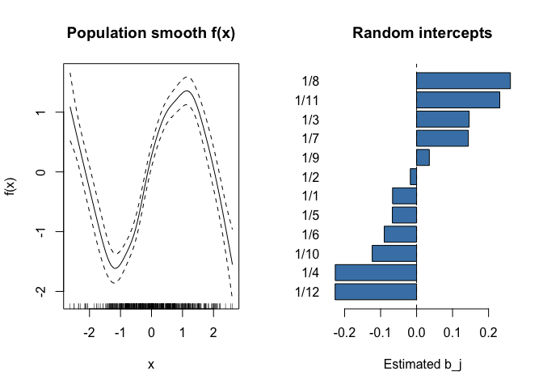
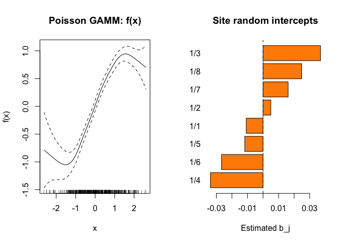

# GAMM: R Comparison
GAM.jl Contributors

- [Overview](#overview)
- [Setup](#setup)
- [Example 1: Gaussian GAMM with Random
  Intercepts](#example-1-gaussian-gamm-with-random-intercepts)
  - [Fitting with `gamm()`](#fitting-with-gamm)
  - [Random effects](#random-effects)
  - [Variance components](#variance-components)
  - [Comparison with true values](#comparison-with-true-values)
  - [Equivalence with
    `s(subject, bs="re")`](#equivalence-with-ssubject-bsre)
  - [Plot: Smooth Effect](#plot-smooth-effect)
- [Example 2: Poisson GAMM for Count
  Data](#example-2-poisson-gamm-for-count-data)
  - [Fitting](#fitting)
  - [Random effects](#random-effects-1)
  - [Plot](#plot)
- [Syntax Comparison](#syntax-comparison)
  - [Key differences](#key-differences)

## Overview

This vignette shows the R equivalent of the GAMM models fit in
`10_gamm.qmd`, using `mgcv::gamm()` which internally delegates to
`nlme::lme()` for Gaussian models and penalized quasi-likelihood (PQL)
for non-Gaussian models.

## Setup

``` r
library(mgcv)
```

    Loading required package: nlme

    This is mgcv 1.9-3. For overview type 'help("mgcv-package")'.

``` r
library(nlme)
```

## Example 1: Gaussian GAMM with Random Intercepts

``` r
dat <- read.csv("../data_gaussian_gamm.csv")
cat(sprintf("n = %d, subjects = %d\n", nrow(dat), length(unique(dat$subject))))
```

    n = 480, subjects = 12

``` r
cat(sprintf("y range: [%.2f, %.2f]\n", min(dat$y), max(dat$y)))
```

    y range: [-2.41, 2.38]

### Fitting with `gamm()`

In mgcv, random effects are specified via the `random=` argument, not in
the formula:

``` r
dat$subject <- factor(dat$subject)
m <- gamm(y ~ s(x, k = 15), random = list(subject = ~1), data = dat)
summary(m$gam)
```


    Family: gaussian 
    Link function: identity 

    Formula:
    y ~ s(x, k = 15)

    Parametric coefficients:
                Estimate Std. Error t value Pr(>|t|)
    (Intercept)  0.02575    0.05950   0.433    0.665

    Approximate significance of smooth terms:
           edf Ref.df    F p-value    
    s(x) 9.044  9.044 62.6  <2e-16 ***
    ---
    Signif. codes:  0 '***' 0.001 '**' 0.01 '*' 0.05 '.' 0.1 ' ' 1

    R-sq.(adj) =  0.854   
      Scale est. = 0.16874   n = 480

### Random effects

``` r
re <- ranef(m$lme)$subject
cat("Random intercept estimates:\n")
```

    Random intercept estimates:

``` r
for (lev in rownames(re)) {
  cat(sprintf("  Subject %2s: b = %+.3f\n", lev, re[lev, 1]))
}
```

      Subject 1/1: b = -0.067
      Subject 1/2: b = -0.017
      Subject 1/3: b = +0.146
      Subject 1/4: b = -0.226
      Subject 1/5: b = -0.067
      Subject 1/6: b = -0.090
      Subject 1/7: b = +0.144
      Subject 1/8: b = +0.261
      Subject 1/9: b = +0.035
      Subject 1/10: b = -0.123
      Subject 1/11: b = +0.231
      Subject 1/12: b = -0.226

### Variance components

``` r
vc <- VarCorr(m$lme)
print(vc)
```

                Variance        StdDev   
    g =         pdIdnot(Xr - 1)          
    Xr1         12.30976447     3.5085274
    Xr2         12.30976447     3.5085274
    Xr3         12.30976447     3.5085274
    Xr4         12.30976447     3.5085274
    Xr5         12.30976447     3.5085274
    Xr6         12.30976447     3.5085274
    Xr7         12.30976447     3.5085274
    Xr8         12.30976447     3.5085274
    Xr9         12.30976447     3.5085274
    Xr10        12.30976447     3.5085274
    Xr11        12.30976447     3.5085274
    Xr12        12.30976447     3.5085274
    Xr13        12.30976447     3.5085274
    subject =   pdLogChol(1)             
    (Intercept)  0.03817131     0.1953748
    Residual     0.16873619     0.4107751

``` r
sigma_re <- as.numeric(vc[rownames(vc) == "(Intercept)", "StdDev"])
sigma_res <- as.numeric(vc[rownames(vc) == "Residual", "StdDev"])
cat(sprintf("RE σ: %.4f (true: 0.6)\n", sigma_re))
```

    RE σ: 0.1954 (true: 0.6)

``` r
cat(sprintf("Residual σ: %.4f (true: 0.4)\n", sigma_res))
```

    Residual σ: 0.4108 (true: 0.4)

### Comparison with true values

``` r
true_re <- tapply(dat$re_true, dat$subject, function(x) x[1])
cat(sprintf("Correlation of estimated vs true RE: %.4f\n",
            cor(re[, 1], true_re)))
```

    Correlation of estimated vs true RE: 0.8319

### Equivalence with `s(subject, bs="re")`

In mgcv, `s(subject, bs="re")` is the smooth-term equivalent of a random
intercept:

``` r
m_gam <- gam(y ~ s(x, k = 15) + s(subject, bs = "re"),
             data = dat, method = "REML")
cat(sprintf("Fitted values correlation (gamm vs gam+re): %.6f\n",
            cor(fitted(m$lme), fitted(m_gam))))
```

    Fitted values correlation (gamm vs gam+re): 0.999996

``` r
cat(sprintf("Scale (gamm): %.6f\n", m$gam$scale))
```

    Scale (gamm): 1.000000

``` r
cat(sprintf("Scale (gam):  %.6f\n", m_gam$scale))
```

    Scale (gam):  0.168889

### Plot: Smooth Effect

``` r
par(mfrow = c(1, 2))

# Smooth effect
plot(m$gam, shade = TRUE, main = "Population smooth f(x)",
     xlab = "x", ylab = "f(x)")

# Random effects
re_est <- re[, 1]
names(re_est) <- rownames(re)
barplot(sort(re_est), horiz = TRUE, las = 1,
        main = "Random intercepts", xlab = "Estimated b_j",
        col = "steelblue")
abline(v = 0, lty = 2)
```



## Example 2: Poisson GAMM for Count Data

``` r
dat2 <- read.csv("../data_poisson_gamm.csv")
dat2$site <- factor(dat2$site)
cat(sprintf("n = %d, sites = %d\n", nrow(dat2), length(unique(dat2$site))))
```

    n = 480, sites = 8

### Fitting

For non-Gaussian families, `gamm()` uses PQL (penalized
quasi-likelihood):

``` r
m2 <- gamm(y ~ s(x, k = 15), random = list(site = ~1),
           family = poisson(), data = dat2)
```


     Maximum number of PQL iterations:  20 

    iteration 1

    iteration 2

    iteration 3

    iteration 4

    iteration 5

``` r
summary(m2$gam)
```


    Family: poisson 
    Link function: log 

    Formula:
    y ~ s(x, k = 15)

    Parametric coefficients:
                Estimate Std. Error t value Pr(>|t|)    
    (Intercept)  1.14153    0.03389   33.68   <2e-16 ***
    ---
    Signif. codes:  0 '***' 0.001 '**' 0.01 '*' 0.05 '.' 0.1 ' ' 1

    Approximate significance of smooth terms:
           edf Ref.df     F p-value    
    s(x) 5.516  5.516 69.32  <2e-16 ***
    ---
    Signif. codes:  0 '***' 0.001 '**' 0.01 '*' 0.05 '.' 0.1 ' ' 1

    R-sq.(adj) =  0.584   
      Scale est. = 1         n = 480

### Random effects

``` r
re2 <- ranef(m2$lme)$site
true_re2 <- tapply(dat2$re_true, dat2$site, function(x) x[1])
cat(sprintf("RE correlation with truth: %.4f\n",
            cor(re2[, 1], true_re2)))
```

    RE correlation with truth: 0.6505

### Plot

``` r
par(mfrow = c(1, 2))
plot(m2$gam, shade = TRUE, main = "Poisson GAMM: f(x)",
     xlab = "x", ylab = "f(x)")

re2_est <- re2[, 1]
names(re2_est) <- rownames(re2)
barplot(sort(re2_est), horiz = TRUE, las = 1,
        main = "Site random intercepts", xlab = "Estimated b_j",
        col = "darkorange")
abline(v = 0, lty = 2)
```



## Syntax Comparison

| Feature | Julia (GAM.jl) | R (mgcv) |
|----|----|----|
| Random intercept | `gamm(@gamm_formula(y ~ s(x) + (1\|g)), df)` | `gamm(y ~ s(x), random=list(g=~1), data=df)` |
| `@formula` path | `gamm(@formula(y ~ cr(x, 10) + (1\|g)), df)` | — |
| `re()` shorthand | `gamm(@formula(y ~ cr(x, 10) + re(g)), df)` | — |
| Equivalent GAM | `gam(@gam_formula(y ~ s(x) + s(g, bs=:re)), df)` | `gam(y ~ s(x) + s(g, bs="re"), data=df)` |
| Non-Gaussian | `gamm(..., Poisson())` | `gamm(..., family=poisson())` |
| Extract RE | `ranef(m)` | `ranef(m$lme)` |
| Variance components | `VarCorr(m)` | `VarCorr(m$lme)` |
| Prediction | `predict(m, newdata)` | `predict(m$gam, newdata)` |

### Key differences

1.  **Formula syntax**: Julia puts random effects *in the formula* with
    `(1|group)`, matching lme4/MixedModels.jl conventions. R mgcv uses a
    separate `random=` argument.

2.  **Fitting algorithm**: GAM.jl treats random effects as smooth terms
    with identity penalty (via PIRLS+REML). R’s `gamm()` converts
    smooths to mixed-model form and delegates to `nlme::lme()`
    (Gaussian) or uses PQL (non-Gaussian).

3.  **Result structure**: Julia returns a `GammModel` with direct
    access. R returns a list with `$gam` (the GAM component) and `$lme`
    (the mixed model component).

4.  **Interface**: Julia `gamm()` returns a single model object. R
    requires navigating `m$gam` vs `m$lme` for different aspects of the
    fit.
