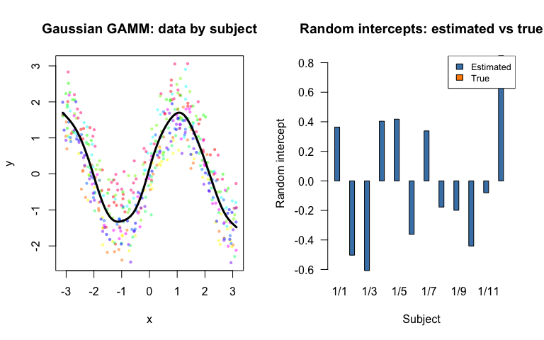
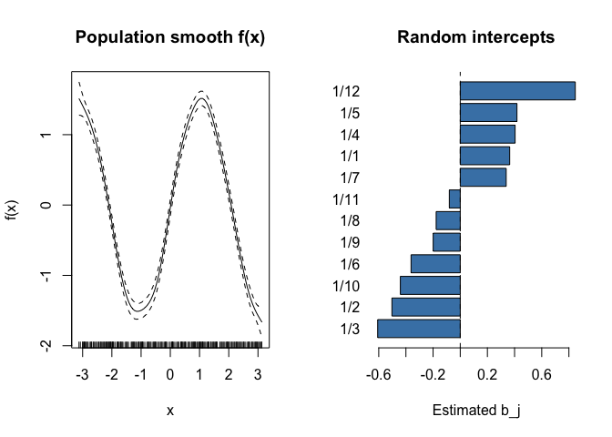
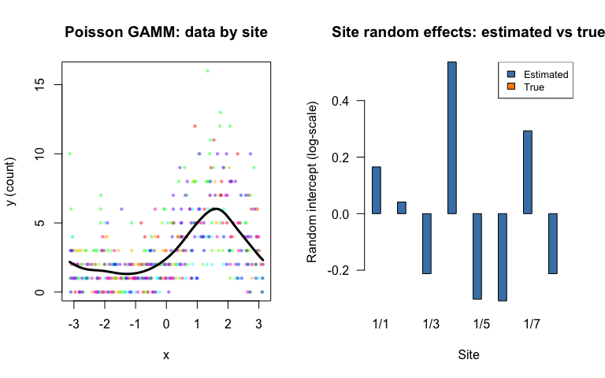
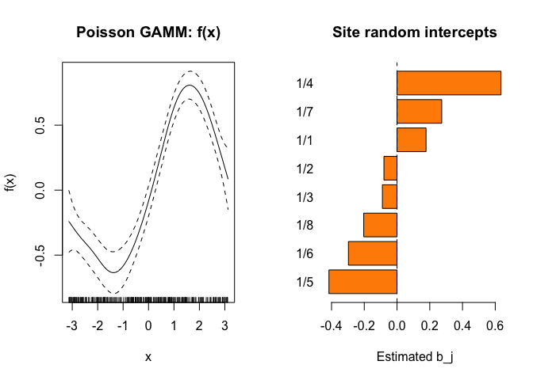

# GAMM: R Comparison
Simon Frost

- [Overview](#overview)
- [Setup](#setup)
- [Example 1: Gaussian GAMM with Random
  Intercepts](#example-1-gaussian-gamm-with-random-intercepts)
  - [Fitting with `gamm()`](#fitting-with-gamm)
  - [Random effects](#random-effects)
  - [Variance components](#variance-components)
  - [Comparison with true values](#comparison-with-true-values)
  - [Equivalence with
    `s(subject, bs="re")`](#equivalence-with-ssubject-bsre)
  - [Plot: Data by Subject with Population
    Smooth](#plot-data-by-subject-with-population-smooth)
  - [Plot: Smooth Effect](#plot-smooth-effect)
- [Example 2: Poisson GAMM for Count
  Data](#example-2-poisson-gamm-for-count-data)
  - [Fitting](#fitting)
  - [Random effects](#random-effects-1)
  - [Plot: Data by Site with Population
    Smooth](#plot-data-by-site-with-population-smooth)
  - [Plot: Smooth Effect](#plot-smooth-effect-1)
- [Syntax Comparison](#syntax-comparison)
  - [Key differences](#key-differences)

## Overview

This vignette shows the R equivalent of the GAMM models fit in
`10_gamm.qmd`, using `mgcv::gamm()` which internally delegates to
`nlme::lme()` for Gaussian models and penalized quasi-likelihood (PQL)
for non-Gaussian models.

## Setup

``` r
library(mgcv)
```

    Loading required package: nlme

    This is mgcv 1.9-4. For overview type '?mgcv'.

``` r
library(nlme)
```

## Example 1: Gaussian GAMM with Random Intercepts

``` r
dat <- read.csv("../data_gaussian_gamm.csv")
cat(sprintf("n = %d, subjects = %d\n", nrow(dat), length(unique(dat$subject))))
```

    n = 480, subjects = 12

``` r
cat(sprintf("y range: [%.2f, %.2f]\n", min(dat$y), max(dat$y)))
```

    y range: [-2.47, 3.06]

### Fitting with `gamm()`

In mgcv, random effects are specified via the `random=` argument, not in
the formula:

``` r
dat$subject <- factor(dat$subject)
m <- gamm(y ~ s(x, k = 15), random = list(subject = ~1), data = dat)
summary(m$gam)
```


    Family: gaussian 
    Link function: identity 

    Formula:
    y ~ s(x, k = 15)

    Parametric coefficients:
                Estimate Std. Error t value Pr(>|t|)
    (Intercept)   0.1847     0.1297   1.424    0.155

    Approximate significance of smooth terms:
           edf Ref.df     F p-value    
    s(x) 11.67  11.67 328.8  <2e-16 ***
    ---
    Signif. codes:  0 '***' 0.001 '**' 0.01 '*' 0.05 '.' 0.1 ' ' 1

    R-sq.(adj) =  0.769   
      Scale est. = 0.14724   n = 480

### Random effects

``` r
re <- ranef(m$lme)$subject
cat("Random intercept estimates:\n")
```

    Random intercept estimates:

``` r
for (lev in rownames(re)) {
  cat(sprintf("  Subject %2s: b = %+.3f\n", lev, re[lev, 1]))
}
```

      Subject 1/1: b = +0.364
      Subject 1/2: b = -0.503
      Subject 1/3: b = -0.608
      Subject 1/4: b = +0.404
      Subject 1/5: b = +0.418
      Subject 1/6: b = -0.362
      Subject 1/7: b = +0.338
      Subject 1/8: b = -0.177
      Subject 1/9: b = -0.199
      Subject 1/10: b = -0.441
      Subject 1/11: b = -0.081
      Subject 1/12: b = +0.847

### Variance components

``` r
vc <- VarCorr(m$lme)
print(vc)
```

                Variance        StdDev   
    g =         pdIdnot(Xr - 1)          
    Xr1         52.9494478      7.2766371
    Xr2         52.9494478      7.2766371
    Xr3         52.9494478      7.2766371
    Xr4         52.9494478      7.2766371
    Xr5         52.9494478      7.2766371
    Xr6         52.9494478      7.2766371
    Xr7         52.9494478      7.2766371
    Xr8         52.9494478      7.2766371
    Xr9         52.9494478      7.2766371
    Xr10        52.9494478      7.2766371
    Xr11        52.9494478      7.2766371
    Xr12        52.9494478      7.2766371
    Xr13        52.9494478      7.2766371
    subject =   pdLogChol(1)             
    (Intercept)  0.1976426      0.4445702
    Residual     0.1472440      0.3837238

``` r
sigma_re <- as.numeric(vc[rownames(vc) == "(Intercept)", "StdDev"])
sigma_res <- as.numeric(vc[rownames(vc) == "Residual", "StdDev"])
cat(sprintf("RE σ: %.4f (true: 0.6)\n", sigma_re))
```

    RE σ: 0.4446 (true: 0.6)

``` r
cat(sprintf("Residual σ: %.4f (true: 0.4)\n", sigma_res))
```

    Residual σ: 0.3837 (true: 0.4)

### Comparison with true values

``` r
true_re <- tapply(dat$re_true, dat$subject, function(x) x[1])
cat(sprintf("Correlation of estimated vs true RE: %.4f\n",
            cor(re[, 1], true_re)))
```

    Correlation of estimated vs true RE: 0.9874

### Equivalence with `s(subject, bs="re")`

In mgcv, `s(subject, bs="re")` is the smooth-term equivalent of a random
intercept:

``` r
m_gam <- gam(y ~ s(x, k = 15) + s(subject, bs = "re"),
             data = dat, method = "REML")
cat(sprintf("Fitted values correlation (gamm vs gam+re): %.6f\n",
            cor(fitted(m$lme), fitted(m_gam))))
```

    Fitted values correlation (gamm vs gam+re): 1.000000

``` r
cat(sprintf("Scale (gamm): %.6f\n", m$gam$scale))
```

    Scale (gamm): 1.000000

``` r
cat(sprintf("Scale (gam):  %.6f\n", m_gam$scale))
```

    Scale (gam):  0.147477

### Plot: Data by Subject with Population Smooth

``` r
par(mfrow = c(1, 2))

# Scatter colored by subject with population smooth
subject_ids <- sort(unique(dat$subject))
n_subj <- length(subject_ids)
cols <- rainbow(n_subj, alpha = 0.5)
plot(dat$x, dat$y, col = cols[match(dat$subject, subject_ids)],
     pch = 16, cex = 0.6, xlab = "x", ylab = "y",
     main = "Gaussian GAMM: data by subject")
x_grid <- seq(min(dat$x), max(dat$x), length.out = 200)
pop_pred <- predict(m$gam, newdata = data.frame(x = x_grid))
lines(x_grid, pop_pred, col = "black", lwd = 3)

# Grouped bar: estimated vs true random intercepts
re_mat <- rbind(Estimated = re[, 1], True = true_re[rownames(re)])
barplot(re_mat, beside = TRUE, names.arg = rownames(re),
        col = c("steelblue", "darkorange"), las = 1,
        main = "Random intercepts: estimated vs true",
        xlab = "Subject", ylab = "Random intercept")
legend("topright", c("Estimated", "True"),
       fill = c("steelblue", "darkorange"), cex = 0.8)
```



### Plot: Smooth Effect

``` r
par(mfrow = c(1, 2))

# Smooth effect
plot(m$gam, shade = TRUE, main = "Population smooth f(x)",
     xlab = "x", ylab = "f(x)")

# Random effects
re_est <- re[, 1]
names(re_est) <- rownames(re)
barplot(sort(re_est), horiz = TRUE, las = 1,
        main = "Random intercepts", xlab = "Estimated b_j",
        col = "steelblue")
abline(v = 0, lty = 2)
```



## Example 2: Poisson GAMM for Count Data

``` r
dat2 <- read.csv("../data_poisson_gamm.csv")
dat2$site <- factor(dat2$site)
cat(sprintf("n = %d, sites = %d\n", nrow(dat2), length(unique(dat2$site))))
```

    n = 480, sites = 8

### Fitting

For non-Gaussian families, `gamm()` uses PQL (penalized
quasi-likelihood):

``` r
m2 <- gamm(y ~ s(x, k = 15), random = list(site = ~1),
           family = poisson(), data = dat2)
```


     Maximum number of PQL iterations:  20 

    iteration 1

    iteration 2

    iteration 3

    iteration 4

``` r
summary(m2$gam)
```


    Family: poisson 
    Link function: log 

    Formula:
    y ~ s(x, k = 15)

    Parametric coefficients:
                Estimate Std. Error t value Pr(>|t|)    
    (Intercept)   0.9314     0.1110   8.391 5.62e-16 ***
    ---
    Signif. codes:  0 '***' 0.001 '**' 0.01 '*' 0.05 '.' 0.1 ' ' 1

    Approximate significance of smooth terms:
           edf Ref.df     F p-value    
    s(x) 6.704  6.704 56.61  <2e-16 ***
    ---
    Signif. codes:  0 '***' 0.001 '**' 0.01 '*' 0.05 '.' 0.1 ' ' 1

    R-sq.(adj) =  0.398   
      Scale est. = 1         n = 480

### Random effects

``` r
re2 <- ranef(m2$lme)$site
true_re2 <- tapply(dat2$re_true, dat2$site, function(x) x[1])
cat(sprintf("RE correlation with truth: %.4f\n",
            cor(re2[, 1], true_re2)))
```

    RE correlation with truth: 0.9202

### Plot: Data by Site with Population Smooth

``` r
par(mfrow = c(1, 2))

# Scatter colored by site with population smooth
site_ids <- sort(unique(dat2$site))
n_sites <- length(site_ids)
cols2 <- rainbow(n_sites, alpha = 0.5)
plot(dat2$x, dat2$y, col = cols2[match(dat2$site, site_ids)],
     pch = 16, cex = 0.6, xlab = "x", ylab = "y (count)",
     main = "Poisson GAMM: data by site")
x_grid2 <- seq(min(dat2$x), max(dat2$x), length.out = 200)
pop_pred2 <- predict(m2$gam, newdata = data.frame(x = x_grid2), type = "response")
lines(x_grid2, pop_pred2, col = "black", lwd = 3)

# Grouped bar: estimated vs true random effects
re2_mat <- rbind(Estimated = re2[, 1], True = true_re2[rownames(re2)])
barplot(re2_mat, beside = TRUE, names.arg = rownames(re2),
        col = c("steelblue", "darkorange"), las = 1,
        main = "Site random effects: estimated vs true",
        xlab = "Site", ylab = "Random intercept (log-scale)")
legend("topright", c("Estimated", "True"),
       fill = c("steelblue", "darkorange"), cex = 0.8)
```



### Plot: Smooth Effect

``` r
par(mfrow = c(1, 2))
plot(m2$gam, shade = TRUE, main = "Poisson GAMM: f(x)",
     xlab = "x", ylab = "f(x)")

re2_est <- re2[, 1]
names(re2_est) <- rownames(re2)
barplot(sort(re2_est), horiz = TRUE, las = 1,
        main = "Site random intercepts", xlab = "Estimated b_j",
        col = "darkorange")
abline(v = 0, lty = 2)
```



## Syntax Comparison

| Feature | Julia (GAM.jl) | R (mgcv) |
|----|----|----|
| Random intercept | `gamm(@formula(y ~ s(x) + (1\|g)), df)` | `gamm(y ~ s(x), random=list(g=~1), data=df)` |
| `@formula` path | `gamm(@formula(y ~ cr(x, 10) + (1\|g)), df)` | — |
| `re()` shorthand | `gamm(@formula(y ~ cr(x, 10) + re(g)), df)` | — |
| Equivalent GAM | `gam(@formula(y ~ s(x) + s(g, bs=:re)), df)` | `gam(y ~ s(x) + s(g, bs="re"), data=df)` |
| Non-Gaussian | `gamm(..., Poisson())` | `gamm(..., family=poisson())` |
| Extract RE | `ranef(m)` | `ranef(m$lme)` |
| Variance components | `VarCorr(m)` | `VarCorr(m$lme)` |
| Prediction | `predict(m, newdata)` | `predict(m$gam, newdata)` |

### Key differences

1.  **Formula syntax**: Julia puts random effects *in the formula* with
    `(1|group)`, matching lme4/MixedModels.jl conventions. R mgcv uses a
    separate `random=` argument.

2.  **Fitting algorithm**: GAM.jl treats random effects as smooth terms
    with identity penalty (via PIRLS+REML). R’s `gamm()` converts
    smooths to mixed-model form and delegates to `nlme::lme()`
    (Gaussian) or uses PQL (non-Gaussian).

3.  **Result structure**: Julia returns a `GammModel` with direct
    access. R returns a list with `$gam` (the GAM component) and `$lme`
    (the mixed model component).

4.  **Interface**: Julia `gamm()` returns a single model object. R
    requires navigating `m$gam` vs `m$lme` for different aspects of the
    fit.
