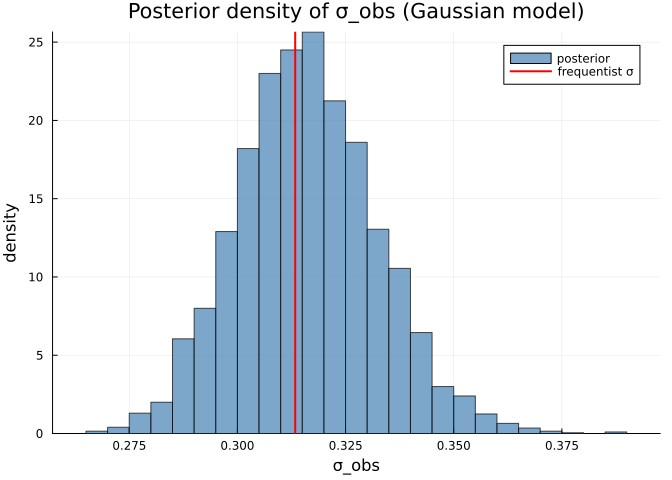
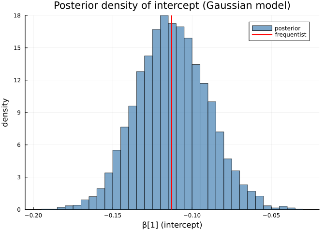
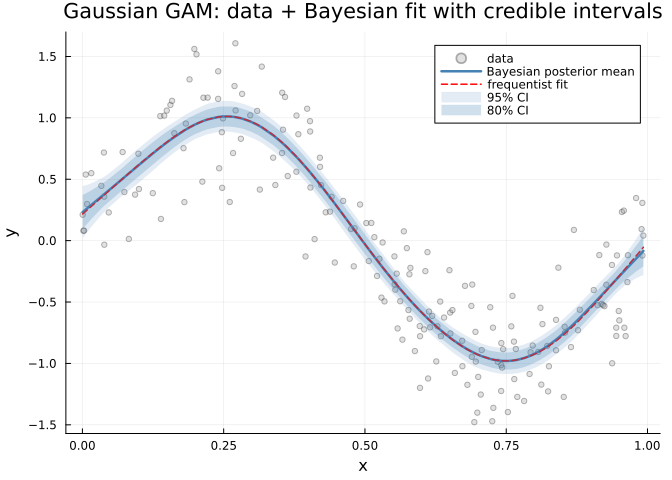
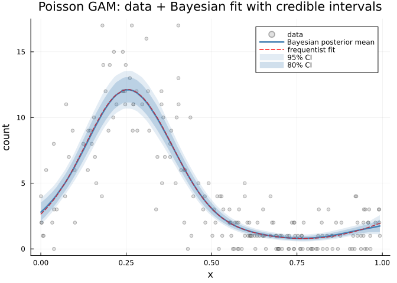
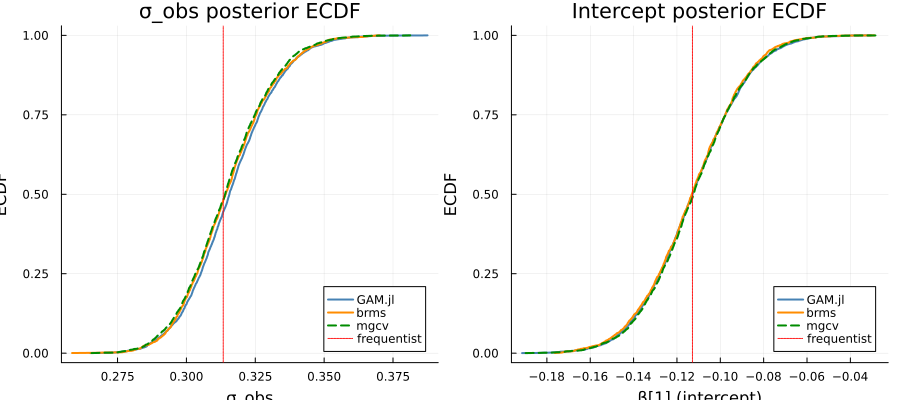
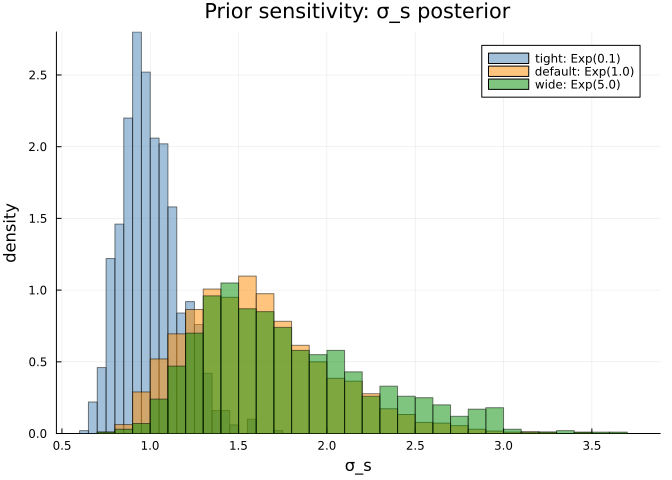
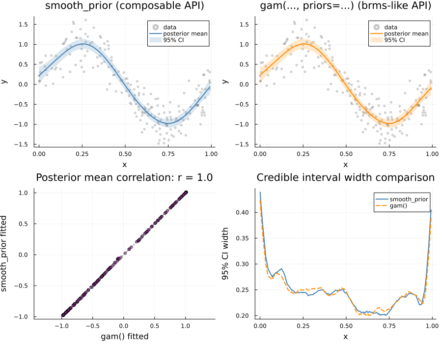

# Bayesian GAMs with Turing.jl
Simon Frost

- [Introduction](#introduction)
- [Setup](#setup)
- [Example 1: Gaussian GAM](#example-1-gaussian-gam)
  - [Data](#data)
  - [Frequentist reference](#frequentist-reference)
  - [Bayesian fit](#bayesian-fit)
  - [Understanding the priors](#understanding-the-priors)
  - [Posterior summaries](#posterior-summaries)
  - [Accessing posterior samples](#accessing-posterior-samples)
  - [Posterior density of σ_obs](#posterior-density-of-σ_obs)
  - [Comparing posteriors: frequentist vs
    Bayesian](#comparing-posteriors-frequentist-vs-bayesian)
  - [Posterior density of intercept
    β\[1\]](#posterior-density-of-intercept-β1)
  - [Empirical CDF comparison](#empirical-cdf-comparison)
  - [Posterior predictive check](#posterior-predictive-check)
- [Example 2: Poisson GAM](#example-2-poisson-gam)
  - [Data](#data-1)
  - [Frequentist vs Bayesian](#frequentist-vs-bayesian)
  - [Posterior summary](#posterior-summary)
  - [ECDF comparison for intercept](#ecdf-comparison-for-intercept)
  - [Poisson fit with credible
    intervals](#poisson-fit-with-credible-intervals)
- [Cross-language comparison: GAM.jl vs brms vs
  mgcv](#cross-language-comparison-gamjl-vs-brms-vs-mgcv)
  - [ECDF correlation helper](#ecdf-correlation-helper)
  - [Gaussian model](#gaussian-model)
  - [ECDF comparison plots (Gaussian)](#ecdf-comparison-plots-gaussian)
  - [Poisson model](#poisson-model)
- [Example 3: Custom priors — effect on
  smoothing](#example-3-custom-priors--effect-on-smoothing)
  - [Prior sensitivity: σ_s posterior](#prior-sensitivity-σ_s-posterior)
- [Example 4: Composable smooth terms with
  `smooth_prior`](#example-4-composable-smooth-terms-with-smooth_prior)
  - [Comparing `smooth_prior` to the brms-like `gam()`
    interface](#comparing-smooth_prior-to-the-brms-like-gam-interface)
- [Example 5: Low-level matrix
  extraction](#example-5-low-level-matrix-extraction)
- [Summary](#summary)
  - [Key design choices](#key-design-choices)

## Introduction

A **Bayesian GAM** replaces the penalized likelihood framework of a
standard GAM with a fully probabilistic model. Instead of choosing
smoothing parameters by REML or GCV, the Bayesian approach places
**priors** on the smooth function variability and uses **MCMC** (Markov
chain Monte Carlo) to obtain posterior distributions for all parameters.

The connection between penalized splines and Bayesian models is well
established:

- A penalized spline $f(x) = \mathbf{Z}\mathbf{b}$ with penalty
  $\lambda \|\mathbf{b}\|^2$ is equivalent to a random effect
  $\mathbf{b} \sim N(0, \sigma^2_s \mathbf{I})$ where
  $\sigma^2_s = \sigma^2 / \lambda$
- The **smooth2random** decomposition splits each smooth into a fixed
  null-space part (unpenalized) and a random-effects part (penalized)
- Priors on $\sigma_s$ control the amount of smoothing — this is the
  Bayesian analog of REML estimation of $\lambda$

GAM.jl implements this via a **Turing.jl package extension**: simply
pass `priors = PriorSpec(...)` to `gam()` and the model is automatically
reparameterized and sampled using NUTS (No-U-Turn Sampler).

## Setup

``` julia
using GAM
using Turing
using CSV
using DataFrames
using Distributions
using Statistics: mean, std, var, cor, median, quantile
using StatsAPI: coef, coeftable, confint, fitted, nobs
using Plots
using Printf
using LinearAlgebra: I
```

## Example 1: Gaussian GAM

### Data

Simulated data with $y = \sin(2\pi x) + \varepsilon$,
$\varepsilon \sim N(0, 0.3^2)$.

    n = 200, y range: [-1.48, 1.61]

### Frequentist reference

``` julia
m_freq = gam(@gam_formula(y ~ s(x, k = 10)), dat)
freq_int = coef(m_freq)[1]
freq_σ = sqrt(m_freq.scale)
```

    0.3133626090202822

    Frequentist: intercept = -0.1129, σ = 0.3134, edf = 7.8

### Bayesian fit

To trigger Bayesian fitting, pass a `PriorSpec` to `gam()`. The same
formula syntax is used — the dispatch is automatic:

``` julia
m_bayes = gam(@gam_formula(y ~ s(x, k = 10)), dat;
    priors = PriorSpec(sds = Exponential(1.0)),
    nsamples = 2000, nchains = 2)
```

    Bayesian Generalized Additive Model

    Formula: y ~ 1
    Family:  Normal
    Link:    IdentityLink
    Sampler: Turing.Inference.NUTS{ADTypes.AutoForwardDiff{nothing, Nothing}, AdvancedHMC.DiagEuclideanMetric} (2000 samples × 2 chains)

    Parametric coefficients:
    ──────────────────────────────────────────────────────────
                    Estimate  Est.Error   l-95% CI    u-95% CI
    ──────────────────────────────────────────────────────────
    (Intercept)    -0.112528  0.0224331  -0.155103  -0.0672135
    s(x,bs=tp)_f1  -3.45313   1.02418    -5.38689   -1.40442
    ──────────────────────────────────────────────────────────

    Smooth terms: s(x,bs=tp)
    n = 200

### Understanding the priors

`PriorSpec` controls the prior distributions:

- **`sds`**: Prior on $\sigma_s$, the SD of smooth random effects. An
  `Exponential(1.0)` prior is weakly informative, allowing the data to
  determine smoothness.
- **`sigma`**: Prior on $\sigma_{obs}$, the residual SD (Gaussian family
  only). Default: `truncated(Normal(0, 2.5); lower=0)`.
- **`b`**: Prior on fixed-effect coefficients. Default: `Normal(0, 10)`.

<!-- -->

    PriorSpec:
      b (fixed effects):    Distributions.Normal{Float64}(μ=0.0, σ=10.0)
      sds (smooth SDs):     Distributions.Exponential{Float64}(θ=1.0)
      sigma (residual SD):  Truncated(Distributions.Normal{Float64}(μ=0.0, σ=2.5); lower=0.0)
      phi (dispersion):     Truncated(Distributions.Normal{Float64}(μ=0.0, σ=5.0); lower=0.0)

### Posterior summaries

The `coeftable()` method returns posterior mean, SD, and 95% credible
intervals:

    ──────────────────────────────────────────────────────────
                    Estimate  Est.Error   l-95% CI    u-95% CI
    ──────────────────────────────────────────────────────────
    (Intercept)    -0.112528  0.0224331  -0.155103  -0.0672135
    s(x,bs=tp)_f1  -3.45313   1.02418    -5.38689   -1.40442
    ──────────────────────────────────────────────────────────

Credible intervals at different levels:


    Intercept CIs:
      90%: [-0.1484, -0.0753]
      95%: [-0.1551, -0.0672]

### Accessing posterior samples

The full MCMC chains are accessible via `m_bayes.chains`:

    σ_obs posterior: mean = 0.3162, sd = 0.0162, median = 0.3156
      95% CI: [0.2859, 0.3500]
      Frequentist σ: 0.3134

    σ_s[1] posterior: mean = 1.6055, sd = 0.4114
      Larger σ_s → more flexible smooth; smaller → smoother

### Posterior density of σ_obs

``` julia
histogram(σ_obs; normalize=:pdf, bins=50, alpha=0.7, color=:steelblue,
    label="posterior", xlabel="σ_obs", ylabel="density",
    title="Posterior density of σ_obs (Gaussian model)")
vline!([freq_σ]; color=:red, linewidth=2, label="frequentist σ")
```



### Comparing posteriors: frequentist vs Bayesian

    Intercept: frequentist = -0.1129, Bayesian posterior mean = -0.1125
    σ: frequentist = 0.3134, Bayesian posterior mean = 0.3162

### Posterior density of intercept β\[1\]

``` julia
β1_samples = vec(chains[Symbol("β[1]")].data)
histogram(β1_samples; normalize=:pdf, bins=50, alpha=0.7, color=:steelblue,
    label="posterior", xlabel="β[1] (intercept)", ylabel="density",
    title="Posterior density of intercept (Gaussian model)")
vline!([freq_int]; color=:red, linewidth=2, label="frequentist")
```



### Empirical CDF comparison

We compare the posterior distribution of $\sigma_{obs}$ against the
frequentist point estimate using the empirical CDF:

    Frequentist σ = 0.3134 sits at 44.5% of the posterior ECDF
      (values near 50% indicate good agreement)
      ECDF 2.5%: σ_obs = 0.2859
      ECDF 25.0%: σ_obs = 0.3052
      ECDF 50.0%: σ_obs = 0.3156
      ECDF 75.0%: σ_obs = 0.3265
      ECDF 97.5%: σ_obs = 0.3500

### Posterior predictive check

Compare the posterior fitted values (with 95% credible intervals) to the
raw data and the frequentist fit:

``` julia
# Reconstruct full design matrix
X_para, smooths, _ = GAM.gam_matrices(@gam_formula(y ~ s(x, k = 10)), dat)
Xf = smooths[1].Xf
Zs = smooths[1].Zs[1]

# Extract posterior draws for all parameters
chains = m_bayes.chains
n_draws = length(vec(chains[Symbol("β[1]")].data))
n_obs = nrow(dat)

# Compute fitted values for each posterior draw
η_draws = Matrix{Float64}(undef, n_draws, n_obs)
for i in 1:n_draws
    β1_i = chains[Symbol("β[1]")].data[i]
    β2_i = chains[Symbol("β[2]")].data[i]
    σ_s_i = chains[Symbol("σ_s[1]")].data[i]
    z_vec = [chains[Symbol("z[$j]")].data[i] for j in 1:size(Zs, 2)]
    η_draws[i, :] = X_para * [β1_i] .+ Xf * [β2_i] .+ σ_s_i .* (Zs * z_vec)
end

# Sort by x for plotting
order = sortperm(dat.x)
x_sorted = dat.x[order]

# Posterior summaries
η_mean = vec(mean(η_draws; dims=1))[order]
η_lo = [quantile(η_draws[:, j], 0.025) for j in 1:n_obs][order]
η_hi = [quantile(η_draws[:, j], 0.975) for j in 1:n_obs][order]
η_lo80 = [quantile(η_draws[:, j], 0.1) for j in 1:n_obs][order]
η_hi80 = [quantile(η_draws[:, j], 0.9) for j in 1:n_obs][order]

# Frequentist fitted
freq_fitted = fitted(m_freq)[order]

# Plot
scatter(dat.x, dat.y; alpha=0.3, color=:gray60, markersize=3, label="data",
    xlabel="x", ylabel="y", title="Gaussian GAM: data + Bayesian fit with credible intervals")
plot!(x_sorted, η_mean; color=:steelblue, linewidth=2.5, label="Bayesian posterior mean")
plot!(x_sorted, freq_fitted; color=:red, linewidth=1.5, linestyle=:dash, label="frequentist fit")
plot!(x_sorted, η_lo; fillrange=η_hi, alpha=0.15, color=:steelblue, label="95% CI", linewidth=0)
plot!(x_sorted, η_lo80; fillrange=η_hi80, alpha=0.25, color=:steelblue, label="80% CI", linewidth=0)
```



## Example 2: Poisson GAM

### Data

Count data with $\log(\lambda) = 1 + 1.5\sin(2\pi x)$.

    n = 200, y range: [0, 17]

### Frequentist vs Bayesian

``` julia
m_freq2 = gam(@gam_formula(y ~ s(x, k = 10)), dat2;
    family = Poisson(), link = LogLink())

m_bayes2 = gam(@gam_formula(y ~ s(x, k = 10)), dat2;
    family = Poisson(), link = LogLink(),
    priors = PriorSpec(sds = Exponential(1.0)),
    nsamples = 2000, nchains = 2)
```

### Posterior summary

    ──────────────────────────────────────────────────────────
                    Estimate  Est.Error   l-95% CI    u-95% CI
    ──────────────────────────────────────────────────────────
    (Intercept)     0.907036  0.0529497   0.802883   1.00678
    s(x,bs=tp)_f1  -3.57651   1.68626    -6.6733    -0.0790281
    ──────────────────────────────────────────────────────────

    Intercept (log-scale): frequentist = 0.9094, Bayesian = 0.9070 (true = 1.0)
    σ_s[1]: mean = 2.2494, sd = 0.6100

### ECDF comparison for intercept

    Frequentist intercept = 0.9094 sits at 51.8% of Bayesian posterior
    True intercept = 1.0 sits at 96.2% of posterior

### Poisson fit with credible intervals

``` julia
# Reconstruct design matrix for Poisson model
X_para2, smooths2, _ = GAM.gam_matrices(@gam_formula(y ~ s(x, k = 10)), dat2)
Xf2 = smooths2[1].Xf
Zs2 = smooths2[1].Zs[1]

n_draws2 = length(vec(chains2[Symbol("β[1]")].data))
n_obs2 = nrow(dat2)

# Compute linear predictor for each draw, then apply inverse link (exp)
μ_draws = Matrix{Float64}(undef, n_draws2, n_obs2)
for i in 1:n_draws2
    β1_i = chains2[Symbol("β[1]")].data[i]
    β2_i = chains2[Symbol("β[2]")].data[i]
    σ_s_i = chains2[Symbol("σ_s[1]")].data[i]
    z_vec = [chains2[Symbol("z[$j]")].data[i] for j in 1:size(Zs2, 2)]
    η = X_para2 * [β1_i] .+ Xf2 * [β2_i] .+ σ_s_i .* (Zs2 * z_vec)
    μ_draws[i, :] = exp.(η)  # inverse link for Poisson
end

order2 = sortperm(dat2.x)
x_sorted2 = dat2.x[order2]

μ_mean = vec(mean(μ_draws; dims=1))[order2]
μ_lo = [quantile(μ_draws[:, j], 0.025) for j in 1:n_obs2][order2]
μ_hi = [quantile(μ_draws[:, j], 0.975) for j in 1:n_obs2][order2]
μ_lo80 = [quantile(μ_draws[:, j], 0.1) for j in 1:n_obs2][order2]
μ_hi80 = [quantile(μ_draws[:, j], 0.9) for j in 1:n_obs2][order2]

freq_fitted2 = fitted(m_freq2)[order2]

scatter(dat2.x, dat2.y; alpha=0.3, color=:gray60, markersize=3, label="data",
    xlabel="x", ylabel="count", title="Poisson GAM: data + Bayesian fit with credible intervals")
plot!(x_sorted2, μ_mean; color=:steelblue, linewidth=2.5, label="Bayesian posterior mean")
plot!(x_sorted2, freq_fitted2; color=:red, linewidth=1.5, linestyle=:dash, label="frequentist fit")
plot!(x_sorted2, μ_lo; fillrange=μ_hi, alpha=0.15, color=:steelblue, label="95% CI", linewidth=0)
plot!(x_sorted2, μ_lo80; fillrange=μ_hi80, alpha=0.25, color=:steelblue, label="80% CI", linewidth=0)
```



## Cross-language comparison: GAM.jl vs brms vs mgcv

We load posterior samples from R’s brms (Stan MCMC) and mgcv (Gaussian
approximation) to compare with GAM.jl’s Turing posteriors. The key
metric is the **pairwise ECDF correlation**: evaluate both ECDFs on a
common grid and compute Pearson’s $r$. A value of 1.0 means the
distributions are identical.

    Loaded: brms Gaussian=2000, brms Poisson=2000, mgcv Gaussian=4000, mgcv Poisson=4000

### ECDF correlation helper

``` julia
function ecdf_cor(x::AbstractVector, y::AbstractVector; n_grid::Int = 500)
    lo = min(minimum(x), minimum(y))
    hi = max(maximum(x), maximum(y))
    grid = range(lo, hi; length = n_grid)
    ecdf_x = [count(≤(g), x) / length(x) for g in grid]
    ecdf_y = [count(≤(g), y) / length(y) for g in grid]
    return cor(ecdf_x, ecdf_y)
end
```

    ecdf_cor (generic function with 1 method)

### Gaussian model

    Parameter         | GAM.jl (Turing)   | brms (Stan)       | mgcv (approx)
    ------------------|-------------------|-------------------|--------------
    sigma  mean       | 0.3162             | 0.3151             | 0.3145
    sigma  sd         | 0.0162             | 0.0161             | 0.0160
    Intercept mean    | -0.1125            | -0.1131            | -0.1123
    Intercept sd      | 0.0224             | 0.0223             | 0.0221


    Pairwise ECDF correlation (Gaussian model):
    Comparison             | sigma ECDF cor | intercept ECDF cor
    -----------------------|----------------|-------------------
    GAM.jl vs brms         | 0.999581        | 0.999950
    GAM.jl vs mgcv (approx)| 0.999296        | 0.999952
    brms vs mgcv (approx)  | 0.999921        | 0.999904

### ECDF comparison plots (Gaussian)

``` julia
p1 = plot(sort(julia_sigma), (1:length(julia_sigma)) ./ length(julia_sigma);
    label="GAM.jl", color=:steelblue, linewidth=2,
    xlabel="σ_obs", ylabel="ECDF", title="σ_obs posterior ECDF")
plot!(p1, sort(brms_sigma), (1:length(brms_sigma)) ./ length(brms_sigma);
    label="brms", color=:darkorange, linewidth=2)
plot!(p1, sort(mgcv_sigma), (1:length(mgcv_sigma)) ./ length(mgcv_sigma);
    label="mgcv", color=:green4, linewidth=2, linestyle=:dash)
vline!(p1, [freq_σ]; color=:red, linewidth=1, linestyle=:dot, label="frequentist")

p2 = plot(sort(julia_int), (1:length(julia_int)) ./ length(julia_int);
    label="GAM.jl", color=:steelblue, linewidth=2,
    xlabel="β[1] (intercept)", ylabel="ECDF", title="Intercept posterior ECDF")
plot!(p2, sort(brms_int), (1:length(brms_int)) ./ length(brms_int);
    label="brms", color=:darkorange, linewidth=2)
plot!(p2, sort(mgcv_int), (1:length(mgcv_int)) ./ length(mgcv_int);
    label="mgcv", color=:green4, linewidth=2, linestyle=:dash)
vline!(p2, [freq_int]; color=:red, linewidth=1, linestyle=:dot, label="frequentist")

plot(p1, p2; layout=(1, 2), size=(900, 400), legend=:bottomright)
```



### Poisson model

    Pairwise ECDF correlation (Poisson intercept):
    GAM.jl vs brms:          0.999875
    GAM.jl vs mgcv (approx): 0.999916
    brms vs mgcv (approx):   0.999957

## Example 3: Custom priors — effect on smoothing

The prior on `sds` directly controls the amount of smoothing. A tighter
prior yields smoother fits:

``` julia
# Tight prior: Exponential(0.1) → small σ_s → smoother
m_tight = gam(@gam_formula(y ~ s(x, k = 10)), dat;
    priors = PriorSpec(sds = Exponential(0.1)),
    nsamples = 1000, nchains = 1)

# Wide prior: Exponential(5.0) → large σ_s → wigglier
m_wide = gam(@gam_formula(y ~ s(x, k = 10)), dat;
    priors = PriorSpec(sds = Exponential(5.0)),
    nsamples = 1000, nchains = 1)
```

    Tight prior (Exp(0.1)): posterior mean σ_s = 1.0012
    Wide prior  (Exp(5.0)): posterior mean σ_s = 1.7732
    Ratio: 1.8x

### Prior sensitivity: σ_s posterior

``` julia
σ_s_tight = vec(m_tight.chains[Symbol("σ_s[1]")].data)
σ_s_default = σ_s  # from default Exp(1.0) model
σ_s_wide = vec(m_wide.chains[Symbol("σ_s[1]")].data)

histogram(σ_s_tight; normalize=:pdf, bins=30, alpha=0.5, color=:steelblue,
    label="tight: Exp(0.1)", xlabel="σ_s", ylabel="density",
    title="Prior sensitivity: σ_s posterior")
histogram!(σ_s_default; normalize=:pdf, bins=30, alpha=0.5, color=:darkorange,
    label="default: Exp(1.0)")
histogram!(σ_s_wide; normalize=:pdf, bins=30, alpha=0.5, color=:green4,
    label="wide: Exp(5.0)")
```



## Example 4: Composable smooth terms with `smooth_prior`

For custom Bayesian models, use `smooth_prior()` as a composable
building block inside your own `@model`. Each call creates a sub-model
that samples the smooth’s parameters internally and returns the
evaluated smooth function:

``` julia
# Create smooth components (mixed-model reparameterization)
# Use bs=:tp to match the default in gam(@gam_formula(y ~ s(x, k=10)))
sm = GAM.gam_smooth(:x, dat; k = 10, bs = :tp)
```

    SmoothMixedModel([0.664327533630193; 0.6628743574512967; … ; -0.540699473296364; -0.5426167225557019;;], [[0.15438623644410757 -0.2577943937355174 … 0.03597281116708378 -0.7659102718826961; 0.15440736781494313 -0.25766668968864265 … 0.03788466790460092 -0.7616640417613573; … ; -0.13612135859607952 0.1606164144848799 … -0.6484895009581195 -0.03752349474514074; -0.13611571860612945 0.16045612470122486 … -0.6500996527498536 -0.04057732998841621]], [0.014406173358386995 -0.026837067992358504 … -0.05154417204031194 6.548037400304181e-16; 0.04344154074823492 0.004410031457064265 … 0.5600267625508373 -5.399717439754989e-15; … ; 0.05008586618744659 0.012165648317958355 … 0.5322891433528174 0.6649355842620508; 0.0445894270884288 0.010830586150330604 … 0.4738755611945613 -0.746900708784029], [0.10378107657020536, 0.11887176712494019, 0.17586602174257748, 0.21687423650163337, 0.3220134190502862, 0.5204293315056882, 0.5864653322533705, 2.1890584196924863, 1.0], [1, 1, 1, 1, 1, 1, 1, 1, 0], [1, 2, 3, 4, 5, 6, 7, 8], "s(x,bs=tp)", false)

    Smooth component:
      Xf (null space): (200, 1)
      Zs (penalized):  [(200, 8)]

``` julia
# Compose into a custom @model using to_submodel + prefix
@model function my_gam(y_obs, sm)
    β0 ~ Normal(0, 10)
    σ ~ truncated(Normal(0, 2.5); lower = 0.0)

    # smooth_prior samples β_f, σ_s, z internally; returns f(x)
    f ~ to_submodel(prefix(GAM.smooth_prior(sm), :s_x))

    y_obs ~ MvNormal(β0 .+ f, σ^2 * I)
end

custom_chains = sample(my_gam(dat.y, sm), NUTS(), MCMCThreads(), 2000, 2; progress = false)
```

    ┌ Warning: Only a single thread available: MCMC chains are not sampled in parallel
    └ @ AbstractMCMC ~/.julia/packages/AbstractMCMC/oqm6Y/src/sample.jl:544
    ┌ Info: Found initial step size
    └   ϵ = 0.0125
    ┌ Info: Found initial step size
    └   ϵ = 0.025

    Chains MCMC chain (2000×26×2 Array{Float64, 3}):

    Iterations        = 1001:1:3000
    Number of chains  = 2
    Samples per chain = 2000
    Wall duration     = 24.44 seconds
    Compute duration  = 23.16 seconds
    parameters        = β0, σ, f.s_x.β_f[1], f.s_x.σ_s, f.s_x.z[1], f.s_x.z[2], f.s_x.z[3], f.s_x.z[4], f.s_x.z[5], f.s_x.z[6], f.s_x.z[7], f.s_x.z[8]
    internals         = n_steps, is_accept, acceptance_rate, log_density, hamiltonian_energy, hamiltonian_energy_error, max_hamiltonian_energy_error, tree_depth, numerical_error, step_size, nom_step_size, logprior, loglikelihood, logjoint

    Use `describe(chains)` for summary statistics and quantiles.

    Custom model σ posterior mean: 0.3157 (compare to 0.3162 from gam())
    Custom model σ_s: 1.5980 (compare to 1.6055 from gam())

### Comparing `smooth_prior` to the brms-like `gam()` interface

Both approaches use the same smooth2random decomposition and the same
non-centered parameterization — they should give equivalent posterior
distributions. Let’s verify by computing fitted values from both and
comparing:

``` julia
# --- smooth_prior fitted values (from custom_chains) ---
n_draws_c = length(vec(custom_chains[:σ].data))
n_obs_c = nrow(dat)
Xf_c = sm.Xf
Zs_c = sm.Zs[1]

η_custom = Matrix{Float64}(undef, n_draws_c, n_obs_c)
for i in 1:n_draws_c
    β0_i = custom_chains[Symbol("β0")].data[i]
    βf_i = custom_chains[Symbol("f.s_x.β_f[1]")].data[i]
    σ_s_i = custom_chains[Symbol("f.s_x.σ_s")].data[i]
    z_i = [custom_chains[Symbol("f.s_x.z[$j]")].data[i] for j in 1:size(Zs_c, 2)]
    η_custom[i, :] = β0_i .+ Xf_c * [βf_i] .+ σ_s_i .* (Zs_c * z_i)
end

# --- gam() brms-like fitted values (from m_bayes) ---
X_b, sm_b, _ = GAM.gam_matrices(@gam_formula(y ~ s(x, k = 10)), dat)
Xf_b = sm_b[1].Xf
Zs_b = sm_b[1].Zs[1]
chains_b = m_bayes.chains
n_draws_b = length(vec(chains_b[Symbol("β[1]")].data))

η_gam = Matrix{Float64}(undef, n_draws_b, n_obs_c)
for i in 1:n_draws_b
    β1_i = chains_b[Symbol("β[1]")].data[i]
    β2_i = chains_b[Symbol("β[2]")].data[i]
    σ_s_i = chains_b[Symbol("σ_s[1]")].data[i]
    z_i = [chains_b[Symbol("z[$j]")].data[i] for j in 1:size(Zs_b, 2)]
    η_gam[i, :] = X_b * [β1_i] .+ Xf_b * [β2_i] .+ σ_s_i .* (Zs_b * z_i)
end

# Sort by x
ord = sortperm(dat.x)
x_s = dat.x[ord]

# Posterior summaries
μ_custom = vec(mean(η_custom; dims=1))[ord]
lo_custom = [quantile(η_custom[:, j], 0.025) for j in 1:n_obs_c][ord]
hi_custom = [quantile(η_custom[:, j], 0.975) for j in 1:n_obs_c][ord]

μ_gam = vec(mean(η_gam; dims=1))[ord]
lo_gam = [quantile(η_gam[:, j], 0.025) for j in 1:n_obs_c][ord]
hi_gam = [quantile(η_gam[:, j], 0.975) for j in 1:n_obs_c][ord]

# --- Plots ---
p1 = scatter(dat.x, dat.y; alpha=0.2, color=:gray60, markersize=2, label="data",
    xlabel="x", ylabel="y", title="smooth_prior (composable API)")
plot!(p1, x_s, μ_custom; color=:steelblue, linewidth=2, label="posterior mean")
plot!(p1, x_s, lo_custom; fillrange=hi_custom, alpha=0.2, color=:steelblue,
    label="95% CI", linewidth=0)

p2 = scatter(dat.x, dat.y; alpha=0.2, color=:gray60, markersize=2, label="data",
    xlabel="x", ylabel="y", title="gam(..., priors=...) (brms-like API)")
plot!(p2, x_s, μ_gam; color=:darkorange, linewidth=2, label="posterior mean")
plot!(p2, x_s, lo_gam; fillrange=hi_gam, alpha=0.2, color=:darkorange,
    label="95% CI", linewidth=0)

# Scatter of posterior means
r_val = cor(μ_custom, μ_gam)
p3 = scatter(μ_gam, μ_custom; alpha=0.5, color=:purple, markersize=3,
    xlabel="gam() fitted", ylabel="smooth_prior fitted",
    title="Posterior mean correlation: r = $(round(r_val, digits=4))",
    aspect_ratio=:equal, legend=false)
mn = min(minimum(μ_gam), minimum(μ_custom))
mx = max(maximum(μ_gam), maximum(μ_custom))
plot!(p3, [mn, mx], [mn, mx]; color=:gray40, linestyle=:dash, linewidth=1)

# CI width comparison
ci_w_custom = hi_custom .- lo_custom
ci_w_gam = hi_gam .- lo_gam
p4 = plot(x_s, ci_w_custom; color=:steelblue, linewidth=2, label="smooth_prior",
    xlabel="x", ylabel="95% CI width", title="Credible interval width comparison")
plot!(p4, x_s, ci_w_gam; color=:darkorange, linewidth=2, linestyle=:dash, label="gam()")

plot(p1, p2, p3, p4; layout=(2, 2), size=(900, 700))
```



    Posterior mean correlation:  r = 1.0000
    Max |mean difference|:      0.027762
    Mean CI width (smooth_prior): 0.2430
    Mean CI width (gam()):        0.2418

    σ posterior:  gam() mean=0.3162 sd=0.0162  |  smooth_prior mean=0.3157 sd=0.0162
    σ_s posterior: gam() mean=1.6055 sd=0.4114  |  smooth_prior mean=1.5980 sd=0.4143

This is much cleaner than manually extracting matrices. For multiple
smooths, give each a unique prefix:

``` julia
sm1 = GAM.gam_smooth(:x1, data; k = 10)
sm2 = GAM.gam_smooth(:x2, data; k = 8, bs = :cr)

@model function multi_gam(y, sm1, sm2)
    β0 ~ Normal(0, 10)
    σ ~ Exponential(1.0)
    f1 ~ to_submodel(prefix(GAM.smooth_prior(sm1), :s_x1))
    f2 ~ to_submodel(prefix(GAM.smooth_prior(sm2), :s_x2))
    y ~ MvNormal(β0 .+ f1 .+ f2, σ^2 * I)
end
```

## Example 5: Low-level matrix extraction

For maximum control, extract the raw matrices with `gam_matrices()`:

``` julia
# Extract matrices from a formula
gf = @gam_formula(y ~ s(x, k = 10))
X, sms, labels = GAM.gam_matrices(gf, dat)
```

    ([1.0; 1.0; … ; 1.0; 1.0;;], SmoothMixedModel[SmoothMixedModel([0.664327533630193; 0.6628743574512967; … ; -0.540699473296364; -0.5426167225557019;;], [[0.15438623644410757 -0.2577943937355174 … 0.03597281116708378 -0.7659102718826961; 0.15440736781494313 -0.25766668968864265 … 0.03788466790460092 -0.7616640417613573; … ; -0.13612135859607952 0.1606164144848799 … -0.6484895009581195 -0.03752349474514074; -0.13611571860612945 0.16045612470122486 … -0.6500996527498536 -0.04057732998841621]], [0.014406173358386995 -0.026837067992358504 … -0.05154417204031194 6.548037400304181e-16; 0.04344154074823492 0.004410031457064265 … 0.5600267625508373 -5.399717439754989e-15; … ; 0.05008586618744659 0.012165648317958355 … 0.5322891433528174 0.6649355842620508; 0.0445894270884288 0.010830586150330604 … 0.4738755611945613 -0.746900708784029], [0.10378107657020536, 0.11887176712494019, 0.17586602174257748, 0.21687423650163337, 0.3220134190502862, 0.5204293315056882, 0.5864653322533705, 2.1890584196924863, 1.0], [1, 1, 1, 1, 1, 1, 1, 1, 0], [1, 2, 3, 4, 5, 6, 7, 8], "s(x,bs=tp)", false)], ["s(x,bs=tp)"])

    Fixed matrix X: (200, 1) (intercept)
    Smooth 's(x,bs=tp)':
      Xf (null space): (200, 1)
      Zs (penalized):  [(200, 8)]

## Summary

| Feature | Syntax |
|----|----|
| Default Bayesian GAM | `gam(formula, data; priors = PriorSpec())` |
| Custom priors | `PriorSpec(sds = Exponential(1.0), sigma = InverseGamma(2, 3))` |
| Per-smooth priors | `PriorSpec(specific = Dict("sds_s(x2)" => Exponential(0.5)))` |
| Poisson | `gam(formula, data; family = Poisson(), priors = PriorSpec())` |
| Composable smooth | `f ~ to_submodel(prefix(smooth_prior(sm), :name))` |
| Low-level matrices | `gam_matrices()` + `@model` + `sample()` |
| Coefficient table | `coeftable(m)` — posterior mean, SD, 95% CI |
| Credible intervals | `confint(m; level = 0.95)` |
| Full posterior | `m.chains[Symbol("σ_obs")]` |

### Key design choices

1.  **Dispatch-based API**: The same `gam()` function handles both
    frequentist and Bayesian fitting — the presence of `priors=`
    triggers Bayesian mode via multiple dispatch.

2.  **smooth2random decomposition**: Smooth terms are split into a fixed
    null-space (unpenalized, estimated via `β`) and random-effects
    blocks (penalized, estimated via `σ_s × z`).

3.  **Composable `smooth_prior`**: Each smooth is a self-contained
    Turing `@model` that samples its own parameters. Compose multiple
    smooths via `to_submodel` with `prefix` to avoid name collisions.

4.  **Non-centered parameterization**: Random effects use
    $\mathbf{b} = \sigma_s \cdot \mathbf{z}$ where
    $\mathbf{z} \sim N(0, I)$, which improves NUTS sampling geometry.

5.  **Package extension**: Turing.jl is only loaded when needed
    (`using Turing`), keeping the base GAM.jl lightweight.
