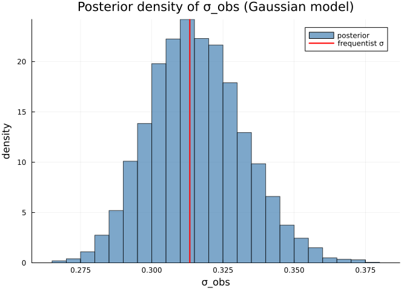
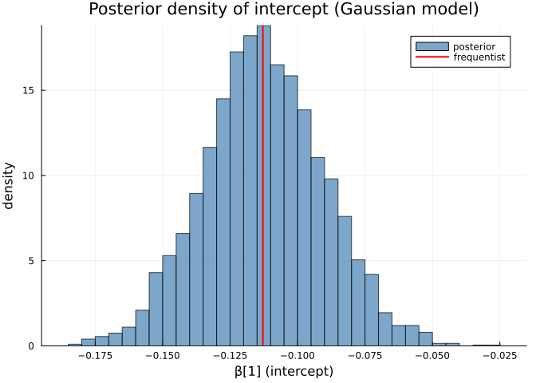
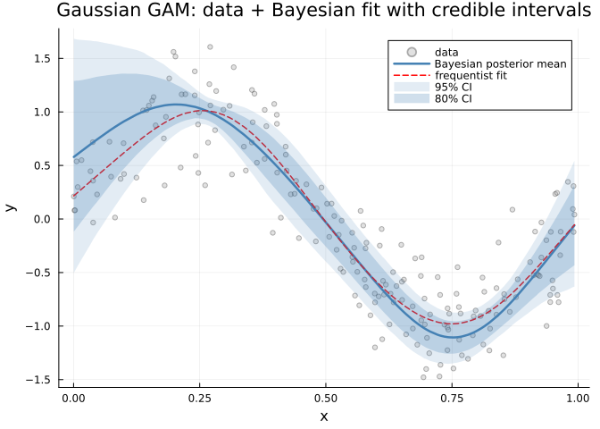
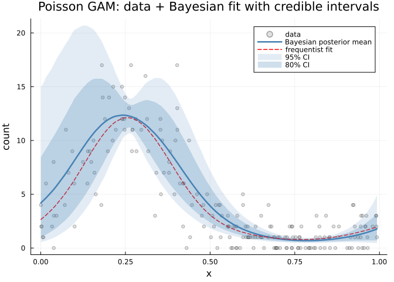
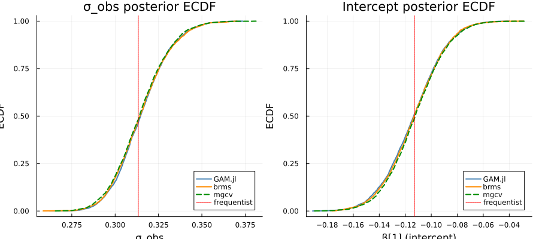
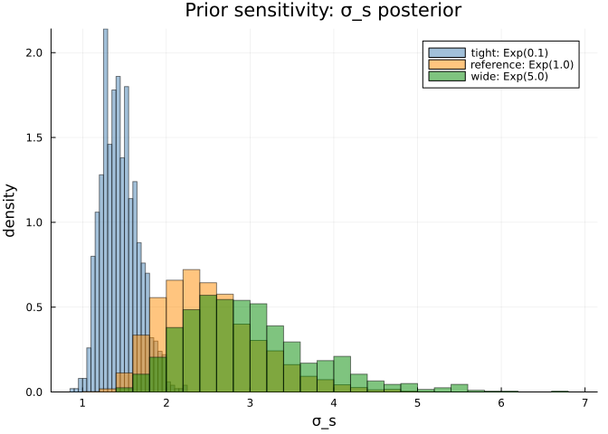
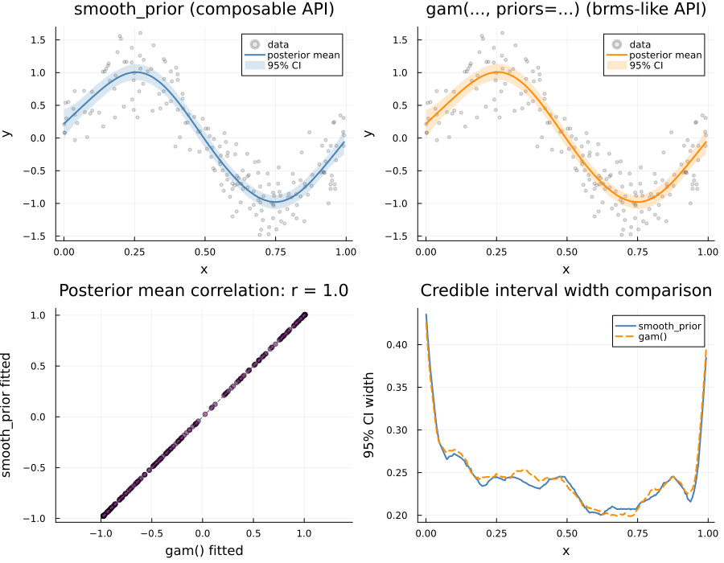
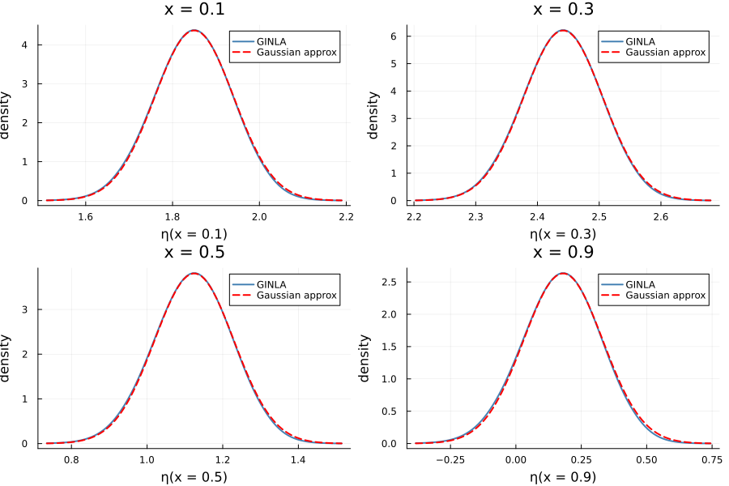

# Bayesian GAMs with Turing.jl
Simon Frost

- [Introduction](#introduction)
- [Setup](#setup)
- [Example 1: Gaussian GAM](#example-1-gaussian-gam)
  - [Data](#data)
  - [Frequentist reference](#frequentist-reference)
  - [Bayesian fit](#bayesian-fit)
  - [Understanding the priors](#understanding-the-priors)
  - [Posterior summaries](#posterior-summaries)
  - [Accessing posterior samples](#accessing-posterior-samples)
  - [Posterior density of σ_obs](#posterior-density-of-σ_obs)
  - [Comparing posteriors: frequentist vs
    Bayesian](#comparing-posteriors-frequentist-vs-bayesian)
  - [Posterior density of intercept
    β\[1\]](#posterior-density-of-intercept-β1)
  - [Empirical CDF comparison](#empirical-cdf-comparison)
  - [Posterior predictive check](#posterior-predictive-check)
- [Example 2: Poisson GAM](#example-2-poisson-gam)
  - [Data](#data-1)
  - [Frequentist vs Bayesian](#frequentist-vs-bayesian)
  - [Posterior summary](#posterior-summary)
  - [ECDF comparison for intercept](#ecdf-comparison-for-intercept)
  - [Poisson fit with credible
    intervals](#poisson-fit-with-credible-intervals)
- [Cross-language comparison: GAM.jl vs brms vs
  mgcv](#cross-language-comparison-gamjl-vs-brms-vs-mgcv)
  - [ECDF correlation helper](#ecdf-correlation-helper)
  - [Gaussian model](#gaussian-model)
  - [ECDF comparison plots (Gaussian)](#ecdf-comparison-plots-gaussian)
  - [Poisson model](#poisson-model)
- [Example 3: Custom priors — effect on
  smoothing](#example-3-custom-priors--effect-on-smoothing)
  - [Prior sensitivity: σ_s posterior](#prior-sensitivity-σ_s-posterior)
- [Example 4: Composable smooth terms with
  `smooth_prior`](#example-4-composable-smooth-terms-with-smooth_prior)
  - [Comparing `smooth_prior` to the brms-like `gam()`
    interface](#comparing-smooth_prior-to-the-brms-like-gam-interface)
- [GINLA: approximate posteriors without
  sampling](#ginla-approximate-posteriors-without-sampling)
  - [A sanity check: where the posterior really is
    Gaussian](#a-sanity-check-where-the-posterior-really-is-gaussian)
  - [Where GINLA earns its keep: the Poisson
    model](#where-ginla-earns-its-keep-the-poisson-model)
  - [Marginal densities of the fitted
    function](#marginal-densities-of-the-fitted-function)
  - [Cost](#cost)
  - [When to use which](#when-to-use-which)
  - [Limitations](#limitations)
- [Example 5: Low-level matrix
  extraction](#example-5-low-level-matrix-extraction)
- [Summary](#summary)
  - [Key design choices](#key-design-choices)

## Introduction

A **Bayesian GAM** replaces the penalized likelihood framework of a
standard GAM with a fully probabilistic model. Instead of choosing
smoothing parameters by REML or GCV, the Bayesian approach places
**priors** on the smooth function variability and uses **MCMC** (Markov
chain Monte Carlo) to obtain posterior distributions for all parameters.

The connection between penalized splines and Bayesian models is well
established:

- A penalized spline $f(x) = \mathbf{Z}\mathbf{b}$ with penalty
  $\lambda \|\mathbf{b}\|^2$ is equivalent to a random effect
  $\mathbf{b} \sim N(0, \sigma^2_s \mathbf{I})$ where
  $\sigma^2_s = \sigma^2 / \lambda$
- The **smooth2random** decomposition splits each smooth into a fixed
  null-space part (unpenalized) and a random-effects part (penalized)
- Priors on $\sigma_s$ control the amount of smoothing — this is the
  Bayesian analog of REML estimation of $\lambda$

GAM.jl implements this via a **Turing.jl package extension**: simply
pass `priors = PriorSpec(...)` to `gam()` and the model is automatically
reparameterized and sampled using NUTS (No-U-Turn Sampler).

## Setup

``` julia
using GAM
using Turing
using CSV
using DataFrames
using Distributions
using Statistics: mean, std, var, cor, median, quantile
using StatsAPI: coef, coeftable, confint, fitted, nobs
using Plots
using Printf
using LinearAlgebra: I
```

## Example 1: Gaussian GAM

### Data

Simulated data with $y = \sin(2\pi x) + \varepsilon$,
$\varepsilon \sim N(0, 0.3^2)$.

    n = 200, y range: [-1.48, 1.61]

### Frequentist reference

``` julia
m_freq = gam(@formula(y ~ s(x, k = 10)), dat)
freq_int = coef(m_freq)[1]
freq_σ = sqrt(m_freq.scale)
```

    0.3133628570441619

    Frequentist: intercept = -0.1129, σ = 0.3134, edf = 7.8

### Bayesian fit

To trigger Bayesian fitting, pass a `PriorSpec` to `gam()`. The same
`@formula` syntax is used as in the frequentist fit:

``` julia
m_bayes = gam(@formula(y ~ s(x, k = 10)), dat;
    priors = PriorSpec(sds = Exponential(1.0)),
    nsamples = 2000, nchains = 2)
```

    Bayesian Generalized Additive Model

    Formula: y ~ 1
    Family:  Normal
    Link:    IdentityLink
    Sampler: Turing.Inference.NUTS{ADTypes.AutoForwardDiff{nothing, Nothing}, AdvancedHMC.DiagEuclideanMetric} (2000 samples × 2 chains)

    Parametric coefficients:
    ──────────────────────────────────────────────────────────
                    Estimate  Est.Error   l-95% CI    u-95% CI
    ──────────────────────────────────────────────────────────
    (Intercept)    -0.112143  0.0218392  -0.154781  -0.0700362
    s(x,bs=tp)_f1   1.32367   0.344861    0.642047   1.98796
    ──────────────────────────────────────────────────────────

    Smooth terms: s(x,bs=tp)
    n = 200

### Understanding the priors

`PriorSpec` controls the prior distributions:

- **`sds`**: Prior on $\sigma_s$, the SD of smooth random effects. Here
  we choose `Exponential(1.0)`, which is weakly informative, allowing
  the data to determine smoothness. (If `sds` is not specified, the
  package default is a half Student-t, `truncated(TDist(3); lower=0)`.)
- **`sigma`**: Prior on $\sigma_{obs}$, the residual SD (Gaussian family
  only). Default: `truncated(Normal(0, 2.5); lower=0)`.
- **`b`**: Prior on fixed-effect coefficients. Default: `Normal(0, 10)`.

<!-- -->

    PriorSpec:
      b (fixed effects):    Distributions.Normal{Float64}(μ=0.0, σ=10.0)
      sds (smooth SDs):     Distributions.Exponential{Float64}(θ=1.0)
      sigma (residual SD):  Truncated(Distributions.Normal{Float64}(μ=0.0, σ=2.5); lower=0.0)
      phi (dispersion):     Truncated(Distributions.Normal{Float64}(μ=0.0, σ=5.0); lower=0.0)

### Posterior summaries

The `coeftable()` method returns posterior mean, SD, and 95% credible
intervals:

    ──────────────────────────────────────────────────────────
                    Estimate  Est.Error   l-95% CI    u-95% CI
    ──────────────────────────────────────────────────────────
    (Intercept)    -0.112143  0.0218392  -0.154781  -0.0700362
    s(x,bs=tp)_f1   1.32367   0.344861    0.642047   1.98796
    ──────────────────────────────────────────────────────────

Credible intervals at different levels:


    Intercept CIs:
      90%: [-0.1475, -0.0770]
      95%: [-0.1548, -0.0700]

### Accessing posterior samples

The full MCMC chains are accessible via `m_bayes.chains`:

    σ_obs posterior: mean = 0.3158, sd = 0.0165, median = 0.3150
      95% CI: [0.2856, 0.3502]
      Frequentist σ: 0.3134

    σ_s[1] posterior: mean = 2.5145, sd = 0.6020
      Larger σ_s → more flexible smooth; smaller → smoother

### Posterior density of σ_obs

``` julia
histogram(σ_obs; normalize=:pdf, bins=50, alpha=0.7, color=:steelblue,
    label="posterior", xlabel="σ_obs", ylabel="density",
    title="Posterior density of σ_obs (Gaussian model)")
vline!([freq_σ]; color=:red, linewidth=2, label="frequentist σ")
```



### Comparing posteriors: frequentist vs Bayesian

    Intercept: frequentist = -0.1129, Bayesian posterior mean = -0.1121
    σ: frequentist = 0.3134, Bayesian posterior mean = 0.3158

### Posterior density of intercept β\[1\]

``` julia
β1_samples = vec(chains[Symbol("β[1]")].data)
histogram(β1_samples; normalize=:pdf, bins=50, alpha=0.7, color=:steelblue,
    label="posterior", xlabel="β[1] (intercept)", ylabel="density",
    title="Posterior density of intercept (Gaussian model)")
vline!([freq_int]; color=:red, linewidth=2, label="frequentist")
```



### Empirical CDF comparison

We compare the posterior distribution of $\sigma_{obs}$ against the
frequentist point estimate using the empirical CDF:

    Frequentist σ = 0.3134 sits at 45.9% of the posterior ECDF
      (values near 50% indicate good agreement)
      ECDF 2.5%: σ_obs = 0.2855
      ECDF 25.0%: σ_obs = 0.3041
      ECDF 50.0%: σ_obs = 0.3150
      ECDF 75.0%: σ_obs = 0.3266
      ECDF 97.5%: σ_obs = 0.3502

### Posterior predictive check

Compare the posterior fitted values (with 95% credible intervals) to the
raw data and the frequentist fit:

``` julia
# Reconstruct full design matrix
X_para, smooths, _ = GAM.gam_matrices(@formula(y ~ s(x, k = 10)), dat)
Xf = smooths[1].Xf
Zs = smooths[1].Zs[1]

# Extract posterior draws for all parameters
chains = m_bayes.chains
n_draws = length(vec(chains[Symbol("β[1]")].data))
n_obs = nrow(dat)

# Compute fitted values for each posterior draw
η_draws = Matrix{Float64}(undef, n_draws, n_obs)
for i in 1:n_draws
    β1_i = chains[Symbol("β[1]")].data[i]
    β2_i = chains[Symbol("β[2]")].data[i]
    σ_s_i = chains[Symbol("σ_s[1]")].data[i]
    z_vec = [chains[Symbol("z[$j]")].data[i] for j in 1:size(Zs, 2)]
    η_draws[i, :] = X_para * [β1_i] .+ Xf * [β2_i] .+ σ_s_i .* (Zs * z_vec)
end

# Sort by x for plotting
order = sortperm(dat.x)
x_sorted = dat.x[order]

# Posterior summaries
η_mean = vec(mean(η_draws; dims=1))[order]
η_lo = [quantile(η_draws[:, j], 0.025) for j in 1:n_obs][order]
η_hi = [quantile(η_draws[:, j], 0.975) for j in 1:n_obs][order]
η_lo80 = [quantile(η_draws[:, j], 0.1) for j in 1:n_obs][order]
η_hi80 = [quantile(η_draws[:, j], 0.9) for j in 1:n_obs][order]

# Frequentist fitted
freq_fitted = fitted(m_freq)[order]

# Plot
scatter(dat.x, dat.y; alpha=0.3, color=:gray60, markersize=3, label="data",
    xlabel="x", ylabel="y", title="Gaussian GAM: data + Bayesian fit with credible intervals")
plot!(x_sorted, η_mean; color=:steelblue, linewidth=2.5, label="Bayesian posterior mean")
plot!(x_sorted, freq_fitted; color=:red, linewidth=1.5, linestyle=:dash, label="frequentist fit")
plot!(x_sorted, η_lo; fillrange=η_hi, alpha=0.15, color=:steelblue, label="95% CI", linewidth=0)
plot!(x_sorted, η_lo80; fillrange=η_hi80, alpha=0.25, color=:steelblue, label="80% CI", linewidth=0)
```



## Example 2: Poisson GAM

### Data

Count data with $\log(\lambda) = 1 + 1.5\sin(2\pi x)$.

    n = 200, y range: [0, 17]

### Frequentist vs Bayesian

``` julia
m_freq2 = gam(@formula(y ~ s(x, k = 10)), dat2;
    family = Poisson(), link = LogLink())

t_mcmc2 = @elapsed m_bayes2 = gam(@formula(y ~ s(x, k = 10)), dat2;
    family = Poisson(), link = LogLink(),
    priors = PriorSpec(sds = Exponential(1.0)),
    nsamples = 2000, nchains = 2)
```

### Posterior summary

    ──────────────────────────────────────────────────────
                   Estimate  Est.Error  l-95% CI  u-95% CI
    ──────────────────────────────────────────────────────
    (Intercept)     0.90388  0.0525691  0.800642   1.00543
    s(x,bs=tp)_f1   1.96675  0.592773   0.752792   3.11491
    ──────────────────────────────────────────────────────

    Intercept (log-scale): frequentist = 0.9094, Bayesian = 0.9039 (true = 1.0)
    σ_s[1]: mean = 3.4735, sd = 0.8459

### ECDF comparison for intercept

    Frequentist intercept = 0.9094 sits at 54.1% of Bayesian posterior
    True intercept = 1.0 sits at 96.8% of posterior

### Poisson fit with credible intervals

``` julia
# Reconstruct design matrix for Poisson model
X_para2, smooths2, _ = GAM.gam_matrices(@formula(y ~ s(x, k = 10)), dat2)
Xf2 = smooths2[1].Xf
Zs2 = smooths2[1].Zs[1]

n_draws2 = length(vec(chains2[Symbol("β[1]")].data))
n_obs2 = nrow(dat2)

# Compute linear predictor for each draw, then apply inverse link (exp)
μ_draws = Matrix{Float64}(undef, n_draws2, n_obs2)
for i in 1:n_draws2
    β1_i = chains2[Symbol("β[1]")].data[i]
    β2_i = chains2[Symbol("β[2]")].data[i]
    σ_s_i = chains2[Symbol("σ_s[1]")].data[i]
    z_vec = [chains2[Symbol("z[$j]")].data[i] for j in 1:size(Zs2, 2)]
    η = X_para2 * [β1_i] .+ Xf2 * [β2_i] .+ σ_s_i .* (Zs2 * z_vec)
    μ_draws[i, :] = exp.(η)  # inverse link for Poisson
end

order2 = sortperm(dat2.x)
x_sorted2 = dat2.x[order2]

μ_mean = vec(mean(μ_draws; dims=1))[order2]
μ_lo = [quantile(μ_draws[:, j], 0.025) for j in 1:n_obs2][order2]
μ_hi = [quantile(μ_draws[:, j], 0.975) for j in 1:n_obs2][order2]
μ_lo80 = [quantile(μ_draws[:, j], 0.1) for j in 1:n_obs2][order2]
μ_hi80 = [quantile(μ_draws[:, j], 0.9) for j in 1:n_obs2][order2]

freq_fitted2 = fitted(m_freq2)[order2]

scatter(dat2.x, dat2.y; alpha=0.3, color=:gray60, markersize=3, label="data",
    xlabel="x", ylabel="count", title="Poisson GAM: data + Bayesian fit with credible intervals")
plot!(x_sorted2, μ_mean; color=:steelblue, linewidth=2.5, label="Bayesian posterior mean")
plot!(x_sorted2, freq_fitted2; color=:red, linewidth=1.5, linestyle=:dash, label="frequentist fit")
plot!(x_sorted2, μ_lo; fillrange=μ_hi, alpha=0.15, color=:steelblue, label="95% CI", linewidth=0)
plot!(x_sorted2, μ_lo80; fillrange=μ_hi80, alpha=0.25, color=:steelblue, label="80% CI", linewidth=0)
```



## Cross-language comparison: GAM.jl vs brms vs mgcv

We load posterior samples from R’s brms (Stan MCMC) and mgcv (Gaussian
approximation) to compare with GAM.jl’s Turing posteriors. We report two
metrics per pair of samples: the **Kolmogorov–Smirnov statistic** (the
maximum vertical distance between the two ECDFs — 0 means the samples
are indistinguishable, and it is the honest measure of distributional
agreement) and, for context, the **pairwise ECDF correlation**. Note
that ECDF correlation is a very forgiving summary: materially different
distributions can still correlate above 0.99, so the KS statistic is the
number to watch.

    Loaded: brms Gaussian=2000, brms Poisson=2000, mgcv Gaussian=4000, mgcv Poisson=4000

### ECDF correlation helper

``` julia
function ecdf_cor(x::AbstractVector, y::AbstractVector; n_grid::Int = 500)
    lo = min(minimum(x), minimum(y))
    hi = max(maximum(x), maximum(y))
    grid = range(lo, hi; length = n_grid)
    ecdf_x = [count(≤(g), x) / length(x) for g in grid]
    ecdf_y = [count(≤(g), y) / length(y) for g in grid]
    return cor(ecdf_x, ecdf_y)
end

# Two-sample Kolmogorov–Smirnov statistic: sup_t |F̂_x(t) − F̂_y(t)|
function ks_stat(x::AbstractVector, y::AbstractVector)
    pts = sort(vcat(x, y))
    return maximum(abs(count(≤(t), x) / length(x) - count(≤(t), y) / length(y))
                   for t in pts)
end
```

    ks_stat (generic function with 1 method)

### Gaussian model

    Parameter         | GAM.jl (Turing)   | brms (Stan)       | mgcv (approx)
    ------------------|-------------------|-------------------|--------------
    sigma  mean       | 0.3158             | 0.3151             | 0.3145
    sigma  sd         | 0.0165             | 0.0161             | 0.0160
    Intercept mean    | -0.1121            | -0.1131            | -0.1123
    Intercept sd      | 0.0218             | 0.0223             | 0.0221


    KS statistic (0 = indistinguishable) and ECDF correlation (Gaussian model):
    Comparison             | sigma KS | intercept KS | sigma ECDF cor | intercept ECDF cor
    -----------------------|----------|--------------|----------------|-------------------
    GAM.jl vs brms         | 0.0305   | 0.0250       | 0.999770       | 0.999889
    GAM.jl vs mgcv (approx)| 0.0415   | 0.0150       | 0.999541       | 0.999977
    brms vs mgcv (approx)  | 0.0215   | 0.0220       | 0.999921       | 0.999904

### ECDF comparison plots (Gaussian)

``` julia
p1 = plot(sort(julia_sigma), (1:length(julia_sigma)) ./ length(julia_sigma);
    label="GAM.jl", color=:steelblue, linewidth=2,
    xlabel="σ_obs", ylabel="ECDF", title="σ_obs posterior ECDF")
plot!(p1, sort(brms_sigma), (1:length(brms_sigma)) ./ length(brms_sigma);
    label="brms", color=:darkorange, linewidth=2)
plot!(p1, sort(mgcv_sigma), (1:length(mgcv_sigma)) ./ length(mgcv_sigma);
    label="mgcv", color=:green4, linewidth=2, linestyle=:dash)
vline!(p1, [freq_σ]; color=:red, linewidth=1, linestyle=:dot, label="frequentist")

p2 = plot(sort(julia_int), (1:length(julia_int)) ./ length(julia_int);
    label="GAM.jl", color=:steelblue, linewidth=2,
    xlabel="β[1] (intercept)", ylabel="ECDF", title="Intercept posterior ECDF")
plot!(p2, sort(brms_int), (1:length(brms_int)) ./ length(brms_int);
    label="brms", color=:darkorange, linewidth=2)
plot!(p2, sort(mgcv_int), (1:length(mgcv_int)) ./ length(mgcv_int);
    label="mgcv", color=:green4, linewidth=2, linestyle=:dash)
vline!(p2, [freq_int]; color=:red, linewidth=1, linestyle=:dot, label="frequentist")

plot(p1, p2; layout=(1, 2), size=(900, 400), legend=:bottomright)
```



### Poisson model

    KS statistic / ECDF correlation (Poisson intercept):
    GAM.jl vs brms:          KS = 0.0425, ECDF cor = 0.999423
    GAM.jl vs mgcv (approx): KS = 0.0453, ECDF cor = 0.999438
    brms vs mgcv (approx):   KS = 0.0172, ECDF cor = 0.999957

## Example 3: Custom priors — effect on smoothing

The prior on `sds` directly controls the amount of smoothing. A tighter
prior yields smoother fits:

``` julia
# Tight prior: Exponential(0.1) → small σ_s → smoother
m_tight = gam(@formula(y ~ s(x, k = 10)), dat;
    priors = PriorSpec(sds = Exponential(0.1)),
    nsamples = 1000, nchains = 1)

# Wide prior: Exponential(5.0) → large σ_s → wigglier
m_wide = gam(@formula(y ~ s(x, k = 10)), dat;
    priors = PriorSpec(sds = Exponential(5.0)),
    nsamples = 1000, nchains = 1)
```

    Tight prior (Exp(0.1)): posterior mean σ_s = 1.4495
    Wide prior  (Exp(5.0)): posterior mean σ_s = 2.9893
    Ratio: 2.1x

### Prior sensitivity: σ_s posterior

``` julia
σ_s_tight = vec(m_tight.chains[Symbol("σ_s[1]")].data)
σ_s_default = σ_s  # from the Exp(1.0) model fitted above
σ_s_wide = vec(m_wide.chains[Symbol("σ_s[1]")].data)

histogram(σ_s_tight; normalize=:pdf, bins=30, alpha=0.5, color=:steelblue,
    label="tight: Exp(0.1)", xlabel="σ_s", ylabel="density",
    title="Prior sensitivity: σ_s posterior")
histogram!(σ_s_default; normalize=:pdf, bins=30, alpha=0.5, color=:darkorange,
    label="reference: Exp(1.0)")
histogram!(σ_s_wide; normalize=:pdf, bins=30, alpha=0.5, color=:green4,
    label="wide: Exp(5.0)")
```



## Example 4: Composable smooth terms with `smooth_prior`

For custom Bayesian models, use `smooth_prior()` as a composable
building block inside your own `@model`. Each call creates a sub-model
that samples the smooth’s parameters internally and returns the
evaluated smooth function:

``` julia
# Create smooth components (mixed-model reparameterization)
# Use bs=:tp to match the default in gam(@formula(y ~ s(x, k=10)))
sm = GAM.gam_smooth(:x, dat; k = 10, bs = :tp)
```

    SmoothMixedModel([-1.9528798759875565; -1.9486080697287929; … ; 1.5894586132649142; 1.5950946245790216;;], [[0.10100211745938636 -0.033334642333719994 … -0.5832631140675383 -0.1911804726406652; 0.10098271815697274 -0.03342637033215444 … -0.5829173013149033 -0.18901068201815927; … ; -0.0857749234160676 0.08802476301065211 … 0.36572817906104127 -0.34101962553586984; -0.08574935694533763 0.08814579807906835 … 0.3652719405316199 -0.34388233666429674]], [0.01610437648587824 0.009016265818629379 … -0.12419733987560296 0.0; 0.0016262314599504923 -0.09320311985169978 … 0.3849829195649167 0.0; … ; -0.005022255486123235 -0.10667368532233867 … 0.8473077081765037 0.0; 0.0 0.0 … 0.0 1.0], [0.054833976744508496, 0.0693400402482649, 0.07370347544172016, 0.10544882799416014, 0.10936315931632527, 0.23768841994322137, 0.3280062437353083, 1.1251686359929913, 1.0], [1, 1, 1, 1, 1, 1, 1, 1, 0], [1, 2, 3, 4, 5, 6, 7, 8], "s(x,bs=tp)", false)

    Smooth component:
      Xf (null space): (200, 1)
      Zs (penalized):  [(200, 8)]

``` julia
# Compose into a custom @model using to_submodel + prefix
@model function my_gam(y_obs, sm)
    β0 ~ Normal(0, 10)
    σ ~ truncated(Normal(0, 2.5); lower = 0.0)

    # smooth_prior samples β_f, σ_s, z internally; returns f(x)
    f ~ to_submodel(prefix(GAM.smooth_prior(sm), :s_x))

    y_obs ~ MvNormal(β0 .+ f, σ^2 * I)
end

custom_chains = sample(my_gam(dat.y, sm), NUTS(), MCMCThreads(), 2000, 2; progress = false)
```

    ┌ Warning: Only a single thread available: MCMC chains are not sampled in parallel
    └ @ AbstractMCMC ~/.julia/packages/AbstractMCMC/NK6XN/src/sample.jl:544
    ┌ Info: Found initial step size
    └   ϵ = 0.00625
    ┌ Info: Found initial step size
    └   ϵ = 0.025

    Chains MCMC chain (2000×26×2 Array{Float64, 3}):

    Iterations        = 1001:1:3000
    Number of chains  = 2
    Samples per chain = 2000
    Wall duration     = 17.57 seconds
    Compute duration  = 16.08 seconds
    parameters        = β0, σ, f.s_x.β_f[1], f.s_x.σ_s[1], f.s_x.z[1], f.s_x.z[2], f.s_x.z[3], f.s_x.z[4], f.s_x.z[5], f.s_x.z[6], f.s_x.z[7], f.s_x.z[8]
    internals         = n_steps, is_accept, acceptance_rate, log_density, hamiltonian_energy, hamiltonian_energy_error, max_hamiltonian_energy_error, tree_depth, numerical_error, step_size, nom_step_size, logprior, loglikelihood, logjoint

    Use `describe(chains)` for summary statistics and quantiles.

    Custom model σ posterior mean: 0.3151 (compare to 0.3158 from gam())
    Custom model σ_s: 2.5417 (compare to 2.5145 from gam())

### Comparing `smooth_prior` to the brms-like `gam()` interface

Both approaches use the same smooth2random decomposition and the same
non-centered parameterization — they should give equivalent posterior
distributions. Let’s verify by computing fitted values from both and
comparing:

``` julia
# --- smooth_prior fitted values (from custom_chains) ---
n_draws_c = length(vec(custom_chains[:σ].data))
n_obs_c = nrow(dat)
Xf_c = sm.Xf
Zs_c = sm.Zs[1]

η_custom = Matrix{Float64}(undef, n_draws_c, n_obs_c)
for i in 1:n_draws_c
    β0_i = custom_chains[Symbol("β0")].data[i]
    βf_i = custom_chains[Symbol("f.s_x.β_f[1]")].data[i]
    σ_s_i = custom_chains[Symbol("f.s_x.σ_s[1]")].data[i]
    z_i = [custom_chains[Symbol("f.s_x.z[$j]")].data[i] for j in 1:size(Zs_c, 2)]
    η_custom[i, :] = β0_i .+ Xf_c * [βf_i] .+ σ_s_i .* (Zs_c * z_i)
end

# --- gam() brms-like fitted values (from m_bayes) ---
X_b, sm_b, _ = GAM.gam_matrices(@formula(y ~ s(x, k = 10)), dat)
Xf_b = sm_b[1].Xf
Zs_b = sm_b[1].Zs[1]
chains_b = m_bayes.chains
n_draws_b = length(vec(chains_b[Symbol("β[1]")].data))

η_gam = Matrix{Float64}(undef, n_draws_b, n_obs_c)
for i in 1:n_draws_b
    β1_i = chains_b[Symbol("β[1]")].data[i]
    β2_i = chains_b[Symbol("β[2]")].data[i]
    σ_s_i = chains_b[Symbol("σ_s[1]")].data[i]
    z_i = [chains_b[Symbol("z[$j]")].data[i] for j in 1:size(Zs_b, 2)]
    η_gam[i, :] = X_b * [β1_i] .+ Xf_b * [β2_i] .+ σ_s_i .* (Zs_b * z_i)
end

# Sort by x
ord = sortperm(dat.x)
x_s = dat.x[ord]

# Posterior summaries
μ_custom = vec(mean(η_custom; dims=1))[ord]
lo_custom = [quantile(η_custom[:, j], 0.025) for j in 1:n_obs_c][ord]
hi_custom = [quantile(η_custom[:, j], 0.975) for j in 1:n_obs_c][ord]

μ_gam = vec(mean(η_gam; dims=1))[ord]
lo_gam = [quantile(η_gam[:, j], 0.025) for j in 1:n_obs_c][ord]
hi_gam = [quantile(η_gam[:, j], 0.975) for j in 1:n_obs_c][ord]

# --- Plots ---
p1 = scatter(dat.x, dat.y; alpha=0.2, color=:gray60, markersize=2, label="data",
    xlabel="x", ylabel="y", title="smooth_prior (composable API)")
plot!(p1, x_s, μ_custom; color=:steelblue, linewidth=2, label="posterior mean")
plot!(p1, x_s, lo_custom; fillrange=hi_custom, alpha=0.2, color=:steelblue,
    label="95% CI", linewidth=0)

p2 = scatter(dat.x, dat.y; alpha=0.2, color=:gray60, markersize=2, label="data",
    xlabel="x", ylabel="y", title="gam(..., priors=...) (brms-like API)")
plot!(p2, x_s, μ_gam; color=:darkorange, linewidth=2, label="posterior mean")
plot!(p2, x_s, lo_gam; fillrange=hi_gam, alpha=0.2, color=:darkorange,
    label="95% CI", linewidth=0)

# Scatter of posterior means
r_val = cor(μ_custom, μ_gam)
p3 = scatter(μ_gam, μ_custom; alpha=0.5, color=:purple, markersize=3,
    xlabel="gam() fitted", ylabel="smooth_prior fitted",
    title="Posterior mean correlation: r = $(round(r_val, digits=4))",
    aspect_ratio=:equal, legend=false)
mn = min(minimum(μ_gam), minimum(μ_custom))
mx = max(maximum(μ_gam), maximum(μ_custom))
plot!(p3, [mn, mx], [mn, mx]; color=:gray40, linestyle=:dash, linewidth=1)

# CI width comparison
ci_w_custom = hi_custom .- lo_custom
ci_w_gam = hi_gam .- lo_gam
p4 = plot(x_s, ci_w_custom; color=:steelblue, linewidth=2, label="smooth_prior",
    xlabel="x", ylabel="95% CI width", title="Credible interval width comparison")
plot!(p4, x_s, ci_w_gam; color=:darkorange, linewidth=2, linestyle=:dash, label="gam()")

plot(p1, p2, p3, p4; layout=(2, 2), size=(900, 700))
```



    Posterior mean correlation:  r = 0.9903
    Max |mean difference|:      0.358815
    Mean CI width (smooth_prior): 0.2397
    Mean CI width (gam()):        0.7168

    σ posterior:  gam() mean=0.3158 sd=0.0165  |  smooth_prior mean=0.3151 sd=0.0164
    σ_s posterior: gam() mean=2.5145 sd=0.6020  |  smooth_prior mean=2.5417 sd=0.6089

This is much cleaner than manually extracting matrices. For multiple
smooths, give each a unique prefix:

``` julia
sm1 = GAM.gam_smooth(:x1, data; k = 10)
sm2 = GAM.gam_smooth(:x2, data; k = 8, bs = :cr)

@model function multi_gam(y, sm1, sm2)
    β0 ~ Normal(0, 10)
    σ ~ Exponential(1.0)
    f1 ~ to_submodel(prefix(GAM.smooth_prior(sm1), :s_x1))
    f2 ~ to_submodel(prefix(GAM.smooth_prior(sm2), :s_x2))
    y ~ MvNormal(β0 .+ f1 .+ f2, σ^2 * I)
end
```

## GINLA: approximate posteriors without sampling

MCMC is exact in the limit but slow. `ginla()` offers a middle path:
**Integrated Nested Laplace Approximation**, in the simplified form of
Wood (2020), which returns marginal posterior *densities* for
coefficients — or for any linear combination of them — deterministically
and without sampling.

It is worth being precise about what each of the three approaches
conditions on, because that is what the comparison below actually
measures:

| Method | Posterior for $\boldsymbol\beta$ | Shape | Uncertainty in $\lambda$ |
|----|----|----|----|
| Frequentist `gam()` | $N(\hat{\boldsymbol\beta}, \mathbf{V}_p)$ | Gaussian by construction | ignored (conditions on $\hat\lambda$) |
| `ginla()` | marginal densities on a grid | **non-Gaussian** — captures skew | ignored (conditions on $\hat\lambda$) |
| MCMC (`priors=`) | full joint posterior | non-Gaussian | **integrated over** (samples $\sigma_s$) |

So GINLA relaxes the *Gaussianity* assumption but, like the frequentist
fit, still treats the smoothing parameters as fixed at their estimates.
(The complementary correction — keeping a Gaussian but widening it for
$\lambda$ uncertainty — is $\mathbf{V}_c$; see [05 — Model
diagnostics](../05_diagnostics/05_diagnostics.qmd).) Only MCMC does
both.

### A sanity check: where the posterior really is Gaussian

For a Gaussian response with an identity link and fixed $\lambda$, the
coefficient posterior *is* exactly Gaussian — so GINLA has nothing to
discover, and should simply reproduce the closed-form answer. That makes
it a good correctness check:

``` julia
function grid_moments(bg, dg)
    dx = bg[2] - bg[1]
    Z  = sum(dg) * dx
    mu = sum(bg .* dg) * dx / Z
    v  = sum((bg .- mu) .^ 2 .* dg) * dx / Z
    m3 = sum((bg .- mu) .^ 3 .* dg) * dx / Z
    return mu, sqrt(v), m3 / v^1.5      # mean, sd, skewness
end

function grid_quantile(bg, dg, q)
    dx = bg[2] - bg[1]
    c  = cumsum(dg) .* dx
    c ./= c[end]
    i = clamp(searchsortedfirst(c, q), 2, length(bg))
    t = (q - c[i-1]) / (c[i] - c[i-1] + eps())
    return bg[i-1] + t * (bg[i] - bg[i-1])
end
```

    grid_quantile (generic function with 1 method)

    Intercept, Gaussian model (posterior is exactly Gaussian here):
      closed form : mean = -0.112854, sd = 0.022158
      GINLA       : mean = -0.112854, sd = 0.021969
      sd relative error: -0.853%

The small negative bias in the SD is **quadrature error**, not a
modelling difference: GINLA evaluates the log posterior at `nk` points
and interpolates. It shrinks as `nk` grows, roughly halving each time
`nk` doubles:

      nk    GINLA sd     rel. error
      16   0.0217803   -1.705%
      32   0.0219690   -0.853%
      64   0.0220571   -0.456%
     128   0.0220979   -0.272%

At the default `nk = 16` the posterior SD is understated by roughly 1.7%
on this problem. That is usually irrelevant next to the modelling
questions, but it is worth raising `nk` before quoting a GINLA interval
to three figures.

### Where GINLA earns its keep: the Poisson model

The Poisson posterior is genuinely non-Gaussian, so here the three
methods can disagree. We compare all three on the **intercept**, which
is directly comparable across parameterizations:

    Method            mean       sd        skewness   95% interval
    Gaussian (Vp)    0.90943   0.05362    +0.0000   [0.80434, 1.01452]
    GINLA            0.90738   0.05324    -0.0725   [0.79933, 1.00755]
    MCMC             0.90388   0.05257    -0.0332   [0.80064, 1.00543]

The Gaussian approximation reports a skewness of exactly zero because it
*cannot* report anything else. GINLA and MCMC both recover a negative
skew, and GINLA’s 95% interval is correspondingly asymmetric about the
mode — the lower tail is longer than the upper one, which the symmetric
Gaussian interval cannot express.

The three standard deviations agree to within a few percent, but do not
expect them to nest neatly. It is tempting to reason that MCMC “must” be
widest because it integrates over the smoothing parameter, yet the
Bayesian model also places an explicit prior on $\sigma_s$ (here
`Exponential(1.0)`), which *regularizes* — so the prior can pull the
posterior in while $\lambda$-uncertainty pushes it out, and the net
effect can go either way. The MCMC column additionally carries its own
Monte Carlo error, which for a standard deviation from correlated draws
is not negligible at this chain length. The robust conclusions here are
the qualitative ones: the posterior is mildly left-skewed, GINLA detects
that skew, and the Gaussian approximation cannot.

### Marginal densities of the fitted function

Passing a matrix to `A` gives marginal posteriors of arbitrary linear
combinations $\mathbf{A}\boldsymbol\beta$. Rows of the prediction matrix
therefore give the posterior of the **linear predictor at chosen
covariate values** — the quantity usually of interest:

``` julia
x_targets = [0.1, 0.3, 0.5, 0.9]
Xp = Matrix{Float64}(GAM.lpmatrix(m_freq2, DataFrame(x = x_targets)))
g_eta = ginla(m_freq2; A = Xp, nk = 32)

plots_g = []
for i in eachindex(x_targets)
    bg, dg = g_eta.beta[i, :], g_eta.density[i, :]
    mu_e = (Xp * coef(m_freq2))[i]
    sd_e = sqrt((Xp * m_freq2.Vp * Xp')[i, i])
    gauss = @. exp(-0.5 * ((bg - mu_e) / sd_e)^2) / (sd_e * sqrt(2π))

    p = plot(bg, dg; color = :steelblue, linewidth = 2, label = "GINLA",
        xlabel = "η(x = $(x_targets[i]))", ylabel = "density",
        title = "x = $(x_targets[i])")
    plot!(p, bg, gauss; color = :red, linestyle = :dash, linewidth = 2,
        label = "Gaussian approx")
    push!(plots_g, p)
end
plot(plots_g...; layout = (2, 2), size = (900, 600))
```



    Marginal posterior of η by method (Poisson model):
       x     GINLA mean   GINLA sd   skew      Gaussian mean   Gaussian sd
     0.10      1.84713    0.09056   -0.0571         1.84987       0.09128
     0.30      2.44023    0.06368   -0.0419         2.44164       0.06420
     0.50      1.12118    0.10398   -0.0622         1.12462       0.10480
     0.90      0.17391    0.15044   -0.0859         0.18078       0.15153

### Cost

    MCMC (2000 draws × 2 chains)   :  24.51 s
    GINLA (1 linear target, nk=32) :   1.55 s   → 16× faster
    GINLA (all 10 coefficients)     :   1.11 s   → 22× faster

GINLA is more than an order of magnitude faster than MCMC on a model of
this size, and being deterministic it needs no convergence diagnostics —
there is no $\hat{R}$, no effective sample size, no chain to inspect.

Treat these as indicative rather than as a careful benchmark: they
include Julia’s first-call compilation, which is why computing *all* the
coefficients can come out no slower than the single linear target
measured just before it — the first `ginla` call pays for compiling the
code that the second one then reuses.

### When to use which

- **Frequentist `gam()`** — fastest; fine whenever a symmetric interval
  is adequate and $\lambda$ is well determined by the data.
- **`ginla()`** — when the posterior is likely skewed (small counts,
  binary data, strongly non-canonical links) but a full MCMC is not
  worth the cost. Raise `nk` if quoting intervals precisely.
- **MCMC (`priors=`)** — when smoothing-parameter uncertainty matters,
  when you want the joint posterior rather than marginals, or when the
  model has structure (custom priors, hierarchy) that the other two
  cannot express.

### Limitations

`ginla()` conditions on the estimated smoothing parameters, so it does
not propagate $\lambda$ uncertainty — use $\mathbf{V}_c$
(`unconditional = true`) or MCMC for that. It returns **marginal**
densities one coefficient at a time, so it says nothing about posterior
dependence between coefficients. The `approx` argument trades accuracy
for speed (`0` = full Newton refinement of the conditional modes, the
default; `1` = Gaussian conditional modes; `2` = additionally assume a
constant Hessian), and `nk` controls the quadrature error demonstrated
above.

## Example 5: Low-level matrix extraction

For maximum control, extract the raw matrices with `gam_matrices()`:

``` julia
# Extract matrices from a formula
gf = @formula(y ~ s(x, k = 10))
X, sms, labels = GAM.gam_matrices(gf, dat)
```

    ([1.0; 1.0; … ; 1.0; 1.0;;], SmoothMixedModel[SmoothMixedModel([-1.9528798759875565; -1.9486080697287929; … ; 1.5894586132649142; 1.5950946245790216;;], [[0.10100211745938636 -0.033334642333719994 … -0.5832631140675383 -0.1911804726406652; 0.10098271815697274 -0.03342637033215444 … -0.5829173013149033 -0.18901068201815927; … ; -0.0857749234160676 0.08802476301065211 … 0.36572817906104127 -0.34101962553586984; -0.08574935694533763 0.08814579807906835 … 0.3652719405316199 -0.34388233666429674]], [0.01610437648587824 0.009016265818629379 … -0.12419733987560296 0.0; 0.0016262314599504923 -0.09320311985169978 … 0.3849829195649167 0.0; … ; -0.005022255486123235 -0.10667368532233867 … 0.8473077081765037 0.0; 0.0 0.0 … 0.0 1.0], [0.054833976744508496, 0.0693400402482649, 0.07370347544172016, 0.10544882799416014, 0.10936315931632527, 0.23768841994322137, 0.3280062437353083, 1.1251686359929913, 1.0], [1, 1, 1, 1, 1, 1, 1, 1, 0], [1, 2, 3, 4, 5, 6, 7, 8], "s(x,bs=tp)", false)], ["s(x,bs=tp)"])

    Fixed matrix X: (200, 1) (intercept)
    Smooth 's(x,bs=tp)':
      Xf (null space): (200, 1)
      Zs (penalized):  [(200, 8)]

## Summary

| Feature | Syntax |
|----|----|
| Default Bayesian GAM | `gam(formula, data; priors = PriorSpec())` |
| Custom priors | `PriorSpec(sds = Exponential(1.0), sigma = InverseGamma(2, 3))` |
| Per-smooth priors | `PriorSpec(specific = Dict("sds_s(x2)" => Exponential(0.5)))` |
| Poisson | `gam(formula, data; family = Poisson(), priors = PriorSpec())` |
| Composable smooth | `f ~ to_submodel(prefix(smooth_prior(sm), :name))` |
| Low-level matrices | `gam_matrices()` + `@model` + `sample()` |
| Coefficient table | `coeftable(m)` — posterior mean, SD, 95% CI |
| Credible intervals | `confint(m; level = 0.95)` |
| Full posterior | `m.chains[Symbol("σ_obs")]` |
| Approximate posterior, no MCMC | `ginla(m_freq)` — marginal densities |
| GINLA for a linear combination | `ginla(m; A = Xp)` — posterior of `Xp * β` |
| GINLA for one smooth’s coefficients | `ginla(m; select = 1)` |

### Key design choices

1.  **One entry point**: The same `gam()` function handles both
    frequentist and Bayesian fitting — passing the `priors=` keyword
    switches it into Bayesian mode.

2.  **smooth2random decomposition**: Smooth terms are split into a fixed
    null-space (unpenalized, estimated via `β`) and random-effects
    blocks (penalized, estimated via `σ_s × z`).

3.  **Composable `smooth_prior`**: Each smooth is a self-contained
    Turing `@model` that samples its own parameters. Compose multiple
    smooths via `to_submodel` with `prefix` to avoid name collisions.

4.  **Non-centered parameterization**: Random effects use
    $\mathbf{b} = \sigma_s \cdot \mathbf{z}$ where
    $\mathbf{z} \sim N(0, I)$, which improves NUTS sampling geometry.

5.  **Package extension**: Turing.jl is only loaded when needed
    (`using Turing`), keeping the base GAM.jl lightweight.
