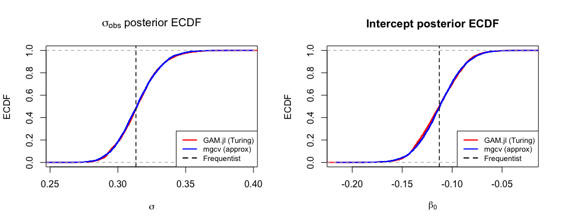

# Bayesian GAMs: R Comparison
GAM.jl Contributors

- [Overview](#overview)
- [Setup](#setup)
- [Example 1: Gaussian GAM](#example-1-gaussian-gam)
  - [Frequentist fit (mgcv)](#frequentist-fit-mgcv)
  - [mgcv Bayesian posterior](#mgcv-bayesian-posterior)
  - [Comparing Julia (Turing MCMC) vs R (mgcv approximate
    posterior)](#comparing-julia-turing-mcmc-vs-r-mgcv-approximate-posterior)
- [Example 2: Poisson GAM](#example-2-poisson-gam)
  - [Frequentist fit](#frequentist-fit)
  - [mgcv Bayesian posterior](#mgcv-bayesian-posterior-1)
  - [Comparing posteriors](#comparing-posteriors)
  - [KS test and ECDF](#ks-test-and-ecdf)
- [Appendix: brms code (for
  reference)](#appendix-brms-code-for-reference)
- [Syntax Comparison](#syntax-comparison)
  - [Key differences](#key-differences)

## Overview

This vignette compares Bayesian GAM posterior distributions from
**GAM.jl** (Turing.jl MCMC) with two R approaches:

1.  **mgcv’s Bayesian posterior approximation** — `mgcv::gam()` computes
    a Bayesian posterior covariance matrix `Vp` alongside frequentist
    estimates. We sample from this multivariate normal posterior.
2.  **brms** (code shown for reference) — the full MCMC approach using
    Stan, which is the direct R analog of GAM.jl’s Turing backend.

Both GAM.jl and brms use the same **smooth2random** decomposition to
convert penalized smooths into random effects with
half-normal/exponential priors on the smoothing SD. The mgcv posterior
is a Gaussian approximation that avoids MCMC but captures the main
posterior uncertainty.

## Setup

``` r
library(mgcv)
library(MASS)

# Julia posterior samples (from Turing.jl MCMC)
julia_gauss <- read.csv("../posteriors_gaussian_julia.csv")
julia_poisson <- read.csv("../posteriors_poisson_julia.csv")

cat(sprintf("Julia posterior samples: %d (Gaussian), %d (Poisson)\n",
            nrow(julia_gauss), nrow(julia_poisson)))
```

    Julia posterior samples: 4000 (Gaussian), 4000 (Poisson)

## Example 1: Gaussian GAM

### Frequentist fit (mgcv)

``` r
dat <- read.csv("../data_bayes_gaussian.csv")
m <- gam(y ~ s(x, k = 10), data = dat, method = "REML")
summary(m)
```


    Family: gaussian 
    Link function: identity 

    Formula:
    y ~ s(x, k = 10)

    Parametric coefficients:
                Estimate Std. Error t value Pr(>|t|)    
    (Intercept) -0.11285    0.02216  -5.093 8.38e-07 ***
    ---
    Signif. codes:  0 '***' 0.001 '**' 0.01 '*' 0.05 '.' 0.1 ' ' 1

    Approximate significance of smooth terms:
           edf Ref.df     F p-value    
    s(x) 6.847  7.937 124.6  <2e-16 ***
    ---
    Signif. codes:  0 '***' 0.001 '**' 0.01 '*' 0.05 '.' 0.1 ' ' 1

    R-sq.(adj) =  0.832   Deviance explained = 83.8%
    -REML = 65.726  Scale est. = 0.098196  n = 200

### mgcv Bayesian posterior

`mgcv::gam()` computes the Bayesian posterior covariance `Vp`
(accounting for smoothing parameter uncertainty). We sample from the
multivariate normal posterior
$\boldsymbol{\beta} \sim N(\hat{\boldsymbol{\beta}}, \mathbf{V}_p)$ and
use a scaled inverse-$\chi^2$ posterior for $\sigma^2$:

``` r
set.seed(2024)
n_samples <- 4000

# Coefficient posterior: beta ~ MVN(beta_hat, Vp)
beta_post <- mvrnorm(n_samples, coef(m), vcov(m))

# Residual SD posterior: sigma^2 ~ Inv-chi^2(df_resid, sigma^2_hat)
n <- nrow(dat)
p <- sum(m$edf)
df_resid <- n - p
sigma2_post <- df_resid * m$scale / rchisq(n_samples, df = df_resid)
sigma_post <- sqrt(sigma2_post)

cat(sprintf("mgcv posterior (Bayesian approximation):\n"))
```

    mgcv posterior (Bayesian approximation):

``` r
cat(sprintf("  sigma:  mean = %.4f, sd = %.4f\n", mean(sigma_post), sd(sigma_post)))
```

      sigma:  mean = 0.3145, sd = 0.0160

``` r
cat(sprintf("  beta_0: mean = %.4f, sd = %.4f\n", mean(beta_post[, 1]), sd(beta_post[, 1])))
```

      beta_0: mean = -0.1123, sd = 0.0221

### Comparing Julia (Turing MCMC) vs R (mgcv approximate posterior)

#### Point estimates and posterior SDs

``` r
cat("Parameter         | GAM.jl (Turing)   | mgcv (approx)     | Frequentist\n")
```

    Parameter         | GAM.jl (Turing)   | mgcv (approx)     | Frequentist

``` r
cat("------------------|-------------------|--------------------|------------\n")
```

    ------------------|-------------------|--------------------|------------

``` r
cat(sprintf("sigma  mean       | %.4f             | %.4f              | %.4f\n",
            mean(julia_gauss$sigma_obs), mean(sigma_post), sqrt(m$scale)))
```

    sigma  mean       | 0.3148             | 0.3145              | 0.3134

``` r
cat(sprintf("sigma  sd         | %.4f             | %.4f              |\n",
            sd(julia_gauss$sigma_obs), sd(sigma_post)))
```

    sigma  sd         | 0.0161             | 0.0160              |

``` r
cat(sprintf("Intercept mean    | %.4f            | %.4f             | %.4f\n",
            mean(julia_gauss$beta_intercept), mean(beta_post[, 1]), coef(m)[1]))
```

    Intercept mean    | -0.1128            | -0.1123             | -0.1129

``` r
cat(sprintf("Intercept sd      | %.4f             | %.4f              |\n",
            sd(julia_gauss$beta_intercept), sd(beta_post[, 1])))
```

    Intercept sd      | 0.0223             | 0.0221              |

#### Kolmogorov-Smirnov tests

The KS test compares the shapes of the two posterior distributions:

``` r
ks_sigma <- ks.test(julia_gauss$sigma_obs, sigma_post)
```

    Warning in ks.test.default(julia_gauss$sigma_obs, sigma_post): p-value will be
    approximate in the presence of ties

``` r
ks_int <- ks.test(julia_gauss$beta_intercept, beta_post[, 1])
```

    Warning in ks.test.default(julia_gauss$beta_intercept, beta_post[, 1]): p-value
    will be approximate in the presence of ties

``` r
cat(sprintf("KS test for sigma:     D = %.4f, p = %.4f\n",
            ks_sigma$statistic, ks_sigma$p.value))
```

    KS test for sigma:     D = 0.0228, p = 0.2518

``` r
cat(sprintf("KS test for intercept: D = %.4f, p = %.4f\n",
            ks_int$statistic, ks_int$p.value))
```

    KS test for intercept: D = 0.0325, p = 0.0293

``` r
cat("\n(High p-value = posteriors are not significantly different)\n")
```


    (High p-value = posteriors are not significantly different)

#### ECDF comparison plots

``` r
par(mfrow = c(1, 2))

# sigma ECDF
plot(ecdf(julia_gauss$sigma_obs), col = "red", main = expression(sigma[obs] ~ "posterior ECDF"),
     xlab = expression(sigma), ylab = "ECDF", lwd = 2)
lines(ecdf(sigma_post), col = "blue", lwd = 2)
abline(v = sqrt(m$scale), lty = 2, col = "black", lwd = 1.5)
legend("bottomright", c("GAM.jl (Turing)", "mgcv (approx)", "Frequentist"),
       col = c("red", "blue", "black"), lty = c(1, 1, 2), lwd = 2, cex = 0.8)

# Intercept ECDF
plot(ecdf(julia_gauss$beta_intercept), col = "red", main = "Intercept posterior ECDF",
     xlab = expression(beta[0]), ylab = "ECDF", lwd = 2)
lines(ecdf(beta_post[, 1]), col = "blue", lwd = 2)
abline(v = coef(m)[1], lty = 2, col = "black", lwd = 1.5)
legend("bottomright", c("GAM.jl (Turing)", "mgcv (approx)", "Frequentist"),
       col = c("red", "blue", "black"), lty = c(1, 1, 2), lwd = 2, cex = 0.8)
```



#### Quantile-quantile comparison

``` r
par(mfrow = c(1, 2))
probs <- seq(0.01, 0.99, by = 0.01)

# sigma Q-Q
q_julia <- quantile(julia_gauss$sigma_obs, probs)
q_mgcv <- quantile(sigma_post, probs)
plot(q_mgcv, q_julia, pch = 16, cex = 0.6,
     main = expression(sigma[obs] ~ "Q-Q: GAM.jl vs mgcv"),
     xlab = "mgcv quantiles", ylab = "GAM.jl quantiles")
abline(0, 1, col = "red", lwd = 2)

# Intercept Q-Q
q_julia_int <- quantile(julia_gauss$beta_intercept, probs)
q_mgcv_int <- quantile(beta_post[, 1], probs)
plot(q_mgcv_int, q_julia_int, pch = 16, cex = 0.6,
     main = "Intercept Q-Q: GAM.jl vs mgcv",
     xlab = "mgcv quantiles", ylab = "GAM.jl quantiles")
abline(0, 1, col = "red", lwd = 2)
```


## Example 2: Poisson GAM

### Frequentist fit

``` r
dat2 <- read.csv("../data_bayes_poisson.csv")
m2 <- gam(y ~ s(x, k = 10), data = dat2, family = poisson(), method = "REML")
cat(sprintf("Frequentist intercept (log-scale): %.4f (true: 1.0)\n", coef(m2)[1]))
```

    Frequentist intercept (log-scale): 0.9094 (true: 1.0)

### mgcv Bayesian posterior

``` r
beta_post2 <- mvrnorm(n_samples, coef(m2), vcov(m2))
cat(sprintf("mgcv beta_0 posterior: mean = %.4f, sd = %.4f\n",
            mean(beta_post2[, 1]), sd(beta_post2[, 1])))
```

    mgcv beta_0 posterior: mean = 0.9092, sd = 0.0536

### Comparing posteriors

``` r
cat("Parameter         | GAM.jl (Turing)   | mgcv (approx)     | Freq     | True\n")
```

    Parameter         | GAM.jl (Turing)   | mgcv (approx)     | Freq     | True

``` r
cat("------------------|-------------------|--------------------|----------|------\n")
```

    ------------------|-------------------|--------------------|----------|------

``` r
cat(sprintf("Intercept mean    | %.4f            | %.4f            | %.4f   | 1.0\n",
            mean(julia_poisson$beta_intercept), mean(beta_post2[, 1]), coef(m2)[1]))
```

    Intercept mean    | 0.9083            | 0.9092            | 0.9094   | 1.0

``` r
cat(sprintf("Intercept sd      | %.4f             | %.4f             |          |\n",
            sd(julia_poisson$beta_intercept), sd(beta_post2[, 1])))
```

    Intercept sd      | 0.0529             | 0.0536             |          |

### KS test and ECDF

``` r
ks_int2 <- ks.test(julia_poisson$beta_intercept, beta_post2[, 1])
```

    Warning in ks.test.default(julia_poisson$beta_intercept, beta_post2[, 1]):
    p-value will be approximate in the presence of ties

``` r
cat(sprintf("KS test for Poisson intercept: D = %.4f, p = %.4f\n",
            ks_int2$statistic, ks_int2$p.value))
```

    KS test for Poisson intercept: D = 0.0163, p = 0.6664

``` r
par(mfrow = c(1, 2))

# ECDF
plot(ecdf(julia_poisson$beta_intercept), col = "red",
     main = "Poisson intercept ECDF",
     xlab = expression(beta[0]), ylab = "ECDF", lwd = 2)
lines(ecdf(beta_post2[, 1]), col = "blue", lwd = 2)
abline(v = 1.0, lty = 2, col = "black", lwd = 1.5)
legend("bottomright", c("GAM.jl (Turing)", "mgcv (approx)", "True"),
       col = c("red", "blue", "black"), lty = c(1, 1, 2), lwd = 2, cex = 0.8)

# Q-Q
q_julia2 <- quantile(julia_poisson$beta_intercept, probs)
q_mgcv2 <- quantile(beta_post2[, 1], probs)
plot(q_mgcv2, q_julia2, pch = 16, cex = 0.6,
     main = "Poisson intercept Q-Q",
     xlab = "mgcv quantiles", ylab = "GAM.jl quantiles")
abline(0, 1, col = "red", lwd = 2)
```


## Appendix: brms code (for reference)

The code below shows how to fit the same models with brms (Stan
backend). brms uses `mgcv::smoothCon()` + `mgcv::smooth2random()`
internally, making it the most direct R comparison to GAM.jl’s Turing
backend.

``` r
library(brms)

# Gaussian GAM
m_brms <- brm(
  y ~ s(x, k = 10),
  data = dat,
  family = gaussian(),
  prior = c(
    prior(normal(0, 10), class = "b"),
    prior(exponential(1), class = "sds"),
    prior(normal(0, 2.5), class = "sigma", lb = 0)
  ),
  chains = 2, iter = 2000, warmup = 1000, seed = 2024
)
summary(m_brms)

# Extract posterior samples
draws <- as_draws_df(m_brms)
sigma_brms <- draws$sigma
b_int_brms <- draws$b_Intercept
sds_brms <- draws[[grep("^sds_", names(draws), value = TRUE)[1]]]

# KS test against GAM.jl
ks.test(sigma_brms, julia_gauss$sigma_obs)
ks.test(b_int_brms, julia_gauss$beta_intercept)

# Poisson GAM
m_brms2 <- brm(
  y ~ s(x, k = 10),
  data = dat2,
  family = poisson(),
  prior = c(
    prior(normal(0, 10), class = "b"),
    prior(exponential(1), class = "sds")
  ),
  chains = 2, iter = 2000, warmup = 1000, seed = 2024
)
summary(m_brms2)
```

## Syntax Comparison

| Feature | Julia (GAM.jl + Turing) | R (brms + Stan) | R (mgcv approx) |
|----|----|----|----|
| Bayesian GAM | `gam(f, data; priors=PriorSpec(...))` | `brm(f, data, prior=...)` | `gam(f, data) + mvrnorm` |
| Smooth SD prior | `PriorSpec(sds=Exp(1))` | `prior(exponential(1), class="sds")` | Implicit via REML |
| Residual SD prior | `PriorSpec(sigma=...)` | `prior(..., class="sigma")` | Scaled Inv-chi-sq |
| Posterior samples | `m.chains[Symbol("sigma_obs")]` | `as_draws_df(m)$sigma` | `mvrnorm(n, coef(m), Vp)` |
| MCMC algorithm | NUTS (Turing.jl) | NUTS (Stan) | No MCMC (Gaussian approx) |

### Key differences

1.  **Full MCMC vs approximation**: GAM.jl (Turing) and brms (Stan) both
    run full NUTS MCMC. The mgcv approach uses a Gaussian posterior
    approximation, which is accurate for well-identified models but may
    miss posterior skewness.

2.  **Smoothing SD**: GAM.jl and brms explicitly estimate $\sigma_s$
    with MCMC. mgcv estimates $\lambda$ via REML, then converts to a
    posterior via the Bayesian interpretation of the penalized
    likelihood.

3.  **Prior specification**: GAM.jl uses `PriorSpec` (class-level
    defaults + specific overrides). brms uses a vector of `prior()`
    statements. mgcv has no explicit prior specification — priors are
    implicit in the REML objective.

4.  **Basis construction**: All three use the same smooth2random
    decomposition (mgcv-style). brms calls `mgcv::smoothCon()` directly;
    GAM.jl re-implements it natively in Julia.
