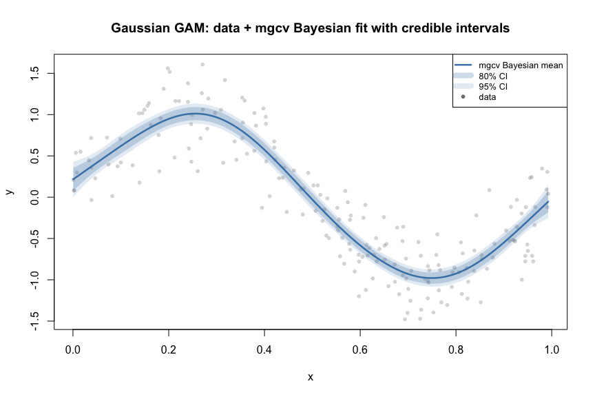
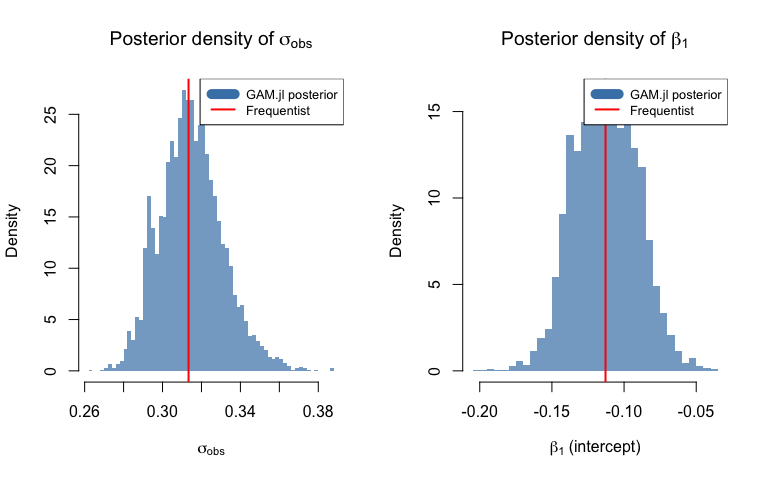
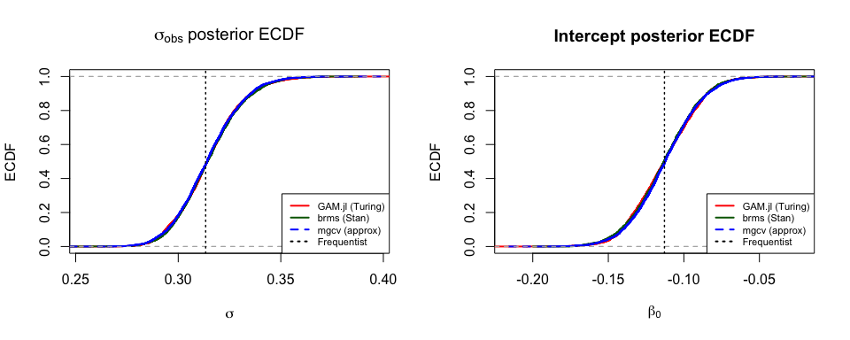
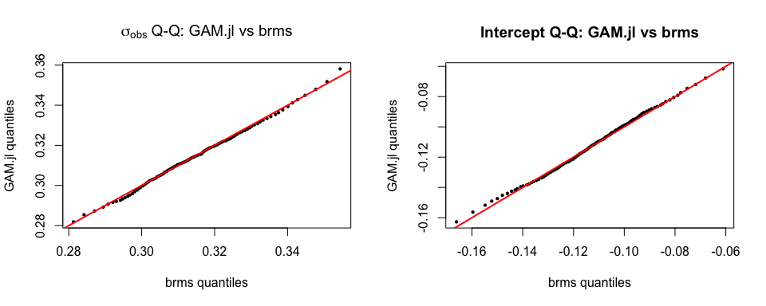
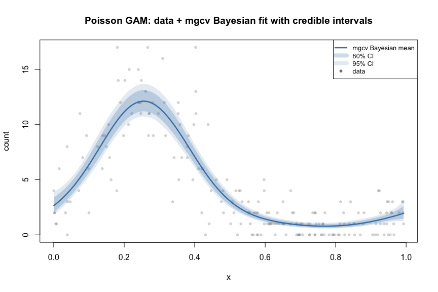
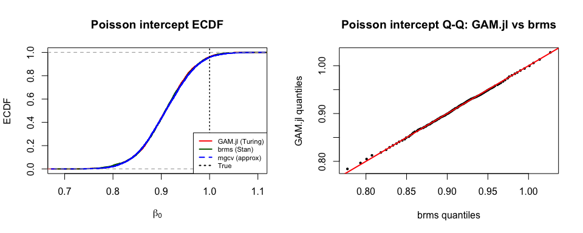

# Bayesian GAMs: R Comparison (brms + mgcv)
Simon Frost

- [Overview](#overview)
- [Setup](#setup)
- [Example 1: Gaussian GAM](#example-1-gaussian-gam)
  - [Frequentist reference (mgcv)](#frequentist-reference-mgcv)
  - [Gaussian fit with credible intervals (mgcv Bayesian
    posterior)](#gaussian-fit-with-credible-intervals-mgcv-bayesian-posterior)
  - [brms fit](#brms-fit)
  - [mgcv Bayesian posterior
    approximation](#mgcv-bayesian-posterior-approximation)
  - [Three-way comparison: GAM.jl vs brms vs
    mgcv](#three-way-comparison-gamjl-vs-brms-vs-mgcv)
  - [Posterior density plots](#posterior-density-plots)
  - [Kolmogorov-Smirnov tests and ECDF
    correlation](#kolmogorov-smirnov-tests-and-ecdf-correlation)
  - [ECDF comparison plots](#ecdf-comparison-plots)
  - [Q-Q plots: GAM.jl vs brms](#q-q-plots-gamjl-vs-brms)
- [Example 2: Poisson GAM](#example-2-poisson-gam)
  - [Frequentist fit](#frequentist-fit)
  - [Poisson fit with credible
    intervals](#poisson-fit-with-credible-intervals)
  - [mgcv Bayesian posterior](#mgcv-bayesian-posterior)
  - [Three-way comparison](#three-way-comparison)
  - [KS tests and ECDF](#ks-tests-and-ecdf)
- [Syntax Comparison](#syntax-comparison)
  - [Key findings](#key-findings)

## Overview

This vignette compares Bayesian GAM posterior distributions from
**GAM.jl** (Turing.jl MCMC) with two R approaches:

1.  **brms** — Full MCMC via Stan’s NUTS sampler. brms uses
    `mgcv::smoothCon()` + `smooth2random()` internally, making it the
    most direct R analog of GAM.jl’s Turing backend. Both use the same
    smooth2random decomposition with half-normal/exponential priors on
    smoothing SDs.
2.  **mgcv Bayesian posterior approximation** — `mgcv::gam()` computes a
    Bayesian posterior covariance matrix `Vp` alongside frequentist
    estimates. We sample from this multivariate normal posterior.

## Setup

``` r
library(mgcv)
library(brms)
library(MASS)

# Julia posterior samples (from Turing.jl MCMC)
julia_gauss <- read.csv("../posteriors_gaussian_julia.csv")
julia_poisson <- read.csv("../posteriors_poisson_julia.csv")

# brms posterior samples (from Stan MCMC)
brms_gauss <- read.csv("../posteriors_gaussian_brms.csv")
brms_poisson <- read.csv("../posteriors_poisson_brms.csv")
```

    Posterior samples: Julia=4000, brms=2000

## Example 1: Gaussian GAM

### Frequentist reference (mgcv)

``` r
dat <- read.csv("../data_bayes_gaussian.csv")
m <- gam(y ~ s(x, k = 10), data = dat, method = "REML")
summary(m)
```


    Family: gaussian 
    Link function: identity 

    Formula:
    y ~ s(x, k = 10)

    Parametric coefficients:
                Estimate Std. Error t value Pr(>|t|)    
    (Intercept) -0.11285    0.02216  -5.093 8.38e-07 ***
    ---
    Signif. codes:  0 '***' 0.001 '**' 0.01 '*' 0.05 '.' 0.1 ' ' 1

    Approximate significance of smooth terms:
           edf Ref.df     F p-value    
    s(x) 6.847  7.937 124.6  <2e-16 ***
    ---
    Signif. codes:  0 '***' 0.001 '**' 0.01 '*' 0.05 '.' 0.1 ' ' 1

    R-sq.(adj) =  0.832   Deviance explained = 83.8%
    -REML = 65.726  Scale est. = 0.098196  n = 200

### Gaussian fit with credible intervals (mgcv Bayesian posterior)

mgcv’s `predict()` with `se.fit=TRUE` uses the Bayesian posterior
covariance $\mathbf{V}_p$ to produce credible intervals:

``` r
# Predict on a fine grid
x_grid <- data.frame(x = seq(min(dat$x), max(dat$x), length.out = 200))
pred <- predict(m, newdata = x_grid, se.fit = TRUE)

# 95% and 80% credible intervals
ci95_lo <- pred$fit - 1.96 * pred$se.fit
ci95_hi <- pred$fit + 1.96 * pred$se.fit
ci80_lo <- pred$fit - 1.282 * pred$se.fit
ci80_hi <- pred$fit + 1.282 * pred$se.fit

plot(dat$x, dat$y, pch = 16, col = adjustcolor("gray50", 0.3), cex = 0.8,
     xlab = "x", ylab = "y",
     main = "Gaussian GAM: data + mgcv Bayesian fit with credible intervals")
polygon(c(x_grid$x, rev(x_grid$x)), c(ci95_lo, rev(ci95_hi)),
        col = adjustcolor("steelblue", 0.15), border = NA)
polygon(c(x_grid$x, rev(x_grid$x)), c(ci80_lo, rev(ci80_hi)),
        col = adjustcolor("steelblue", 0.25), border = NA)
lines(x_grid$x, pred$fit, col = "steelblue", lwd = 2.5)
legend("topright", c("mgcv Bayesian mean", "80% CI", "95% CI", "data"),
       col = c("steelblue", adjustcolor("steelblue", 0.25),
               adjustcolor("steelblue", 0.15), "gray50"),
       lwd = c(2.5, 8, 8, NA), pch = c(NA, NA, NA, 16), cex = 0.8)
```



### brms fit

The brms model uses the same priors as GAM.jl: `Exponential(1)` on
smooth SDs, `Normal(0, 10)` on fixed effects, and
`truncated Normal(0, 2.5)` on σ:

``` r
m_brms <- brm(
  y ~ s(x, k = 10),
  data = dat,
  family = gaussian(),
  prior = c(
    prior(normal(0, 10), class = "b"),
    prior(exponential(1), class = "sds"),
    prior(normal(0, 2.5), class = "sigma", lb = 0)
  ),
  chains = 2, iter = 2000, warmup = 1000, seed = 2024,
  backend = "cmdstanr"
)
```

### mgcv Bayesian posterior approximation

`mgcv::gam()` computes the Bayesian posterior covariance `Vp`
(accounting for smoothing parameter uncertainty). We sample from the
multivariate normal posterior
$\boldsymbol{\beta} \sim N(\hat{\boldsymbol{\beta}}, \mathbf{V}_p)$ and
use a scaled inverse-$\chi^2$ posterior for $\sigma^2$:

``` r
set.seed(2024)
n_samples <- 4000

# Coefficient posterior
beta_post <- mvrnorm(n_samples, coef(m), vcov(m))

# Residual SD posterior
n <- nrow(dat)
p <- sum(m$edf)
df_resid <- n - p
sigma2_post <- df_resid * m$scale / rchisq(n_samples, df = df_resid)
sigma_post <- sqrt(sigma2_post)
```

### Three-way comparison: GAM.jl vs brms vs mgcv

    Parameter         | GAM.jl (Turing)   | brms (Stan)       | mgcv (approx)     | Freq

    ------------------|-------------------|-------------------|-------------------|------

    sigma  mean       | 0.3148             | 0.3151             | 0.3145             | 0.3134

    sigma  sd         | 0.0161             | 0.0161             | 0.0160             |

    Intercept mean    | -0.1128            | -0.1131            | -0.1123            | -0.1129

    Intercept sd      | 0.0223             | 0.0223             | 0.0221             |

### Posterior density plots

``` r
par(mfrow = c(1, 2))

# σ_obs posterior histogram
hist(julia_gauss$sigma_obs, breaks = 50, probability = TRUE,
     col = adjustcolor("steelblue", 0.7), border = NA,
     main = expression("Posterior density of " * sigma[obs]),
     xlab = expression(sigma[obs]), ylab = "Density")
abline(v = sqrt(m$scale), col = "red", lwd = 2)
legend("topright", c("GAM.jl posterior", "Frequentist"),
       col = c("steelblue", "red"), lwd = c(10, 2), cex = 0.8)

# Intercept posterior histogram
hist(julia_gauss$beta_intercept, breaks = 50, probability = TRUE,
     col = adjustcolor("steelblue", 0.7), border = NA,
     main = expression("Posterior density of " * beta[1]),
     xlab = expression(beta[1] ~ "(intercept)"), ylab = "Density")
abline(v = coef(m)[1], col = "red", lwd = 2)
legend("topright", c("GAM.jl posterior", "Frequentist"),
       col = c("steelblue", "red"), lwd = c(10, 2), cex = 0.8)
```



### Kolmogorov-Smirnov tests and ECDF correlation

The KS statistic measures the maximum vertical distance between two
ECDFs, while the **pairwise ECDF correlation** evaluates both ECDFs on a
common grid and computes their Pearson correlation — a value of 1.0
indicates identical distributions:

    Warning in ks.test.default(julia_gauss$sigma_obs, brms_gauss$sigma_obs):
    p-value will be approximate in the presence of ties

    Warning in ks.test.default(julia_gauss$beta_intercept,
    brms_gauss$beta_intercept): p-value will be approximate in the presence of ties

    Warning in ks.test.default(julia_gauss$sigma_obs, sigma_post): p-value will be
    approximate in the presence of ties

    Warning in ks.test.default(julia_gauss$beta_intercept, beta_post[, 1]): p-value
    will be approximate in the presence of ties

    Warning in ks.test.default(brms_gauss$sigma_obs, sigma_post): p-value will be
    approximate in the presence of ties

    Warning in ks.test.default(brms_gauss$beta_intercept, beta_post[, 1]): p-value
    will be approximate in the presence of ties

    Comparison             | Param     | KS D   | KS p   | ECDF cor

    -----------------------|-----------|--------|--------|--------

    GAM.jl vs brms         | sigma     | 0.0255  | 0.3512  | 0.999880

    GAM.jl vs brms         | intercept | 0.0205  | 0.6296  | 0.999837

    GAM.jl vs mgcv (approx)| sigma     | 0.0228  | 0.2518  | 0.999916

    GAM.jl vs mgcv (approx)| intercept | 0.0325  | 0.0293  | 0.999744

    brms vs mgcv (approx)  | sigma     | 0.0215  | 0.5686  | 0.999921

    brms vs mgcv (approx)  | intercept | 0.0220  | 0.5387  | 0.999904


    (ECDF correlation near 1.0 = nearly identical distributions)

### ECDF comparison plots

``` r
par(mfrow = c(1, 2))

# sigma ECDF — three posteriors
plot(ecdf(julia_gauss$sigma_obs), col = "red", main = expression(sigma[obs] ~ "posterior ECDF"),
     xlab = expression(sigma), ylab = "ECDF", lwd = 2)
lines(ecdf(brms_gauss$sigma_obs), col = "darkgreen", lwd = 2)
lines(ecdf(sigma_post), col = "blue", lwd = 2, lty = 2)
abline(v = sqrt(m$scale), lty = 3, col = "black", lwd = 1.5)
legend("bottomright", c("GAM.jl (Turing)", "brms (Stan)", "mgcv (approx)", "Frequentist"),
       col = c("red", "darkgreen", "blue", "black"), lty = c(1, 1, 2, 3), lwd = 2, cex = 0.7)

# Intercept ECDF
plot(ecdf(julia_gauss$beta_intercept), col = "red", main = "Intercept posterior ECDF",
     xlab = expression(beta[0]), ylab = "ECDF", lwd = 2)
lines(ecdf(brms_gauss$beta_intercept), col = "darkgreen", lwd = 2)
lines(ecdf(beta_post[, 1]), col = "blue", lwd = 2, lty = 2)
abline(v = coef(m)[1], lty = 3, col = "black", lwd = 1.5)
legend("bottomright", c("GAM.jl (Turing)", "brms (Stan)", "mgcv (approx)", "Frequentist"),
       col = c("red", "darkgreen", "blue", "black"), lty = c(1, 1, 2, 3), lwd = 2, cex = 0.7)
```



### Q-Q plots: GAM.jl vs brms

The most stringent comparison — both use full MCMC with the same model
specification:

``` r
par(mfrow = c(1, 2))
probs <- seq(0.01, 0.99, by = 0.01)

# sigma Q-Q
q_julia <- quantile(julia_gauss$sigma_obs, probs)
q_brms <- quantile(brms_gauss$sigma_obs, probs)
plot(q_brms, q_julia, pch = 16, cex = 0.6,
     main = expression(sigma[obs] ~ "Q-Q: GAM.jl vs brms"),
     xlab = "brms quantiles", ylab = "GAM.jl quantiles")
abline(0, 1, col = "red", lwd = 2)

# Intercept Q-Q
q_julia_int <- quantile(julia_gauss$beta_intercept, probs)
q_brms_int <- quantile(brms_gauss$beta_intercept, probs)
plot(q_brms_int, q_julia_int, pch = 16, cex = 0.6,
     main = "Intercept Q-Q: GAM.jl vs brms",
     xlab = "brms quantiles", ylab = "GAM.jl quantiles")
abline(0, 1, col = "red", lwd = 2)
```



## Example 2: Poisson GAM

### Frequentist fit

``` r
dat2 <- read.csv("../data_bayes_poisson.csv")
m2 <- gam(y ~ s(x, k = 10), data = dat2, family = poisson(), method = "REML")
```

    Frequentist intercept (log-scale): 0.9094 (true: 1.0)

### Poisson fit with credible intervals

``` r
x_grid2 <- data.frame(x = seq(min(dat2$x), max(dat2$x), length.out = 200))
pred2 <- predict(m2, newdata = x_grid2, se.fit = TRUE, type = "link")

# On link (log) scale, then transform to response
ci95_lo2 <- exp(pred2$fit - 1.96 * pred2$se.fit)
ci95_hi2 <- exp(pred2$fit + 1.96 * pred2$se.fit)
ci80_lo2 <- exp(pred2$fit - 1.282 * pred2$se.fit)
ci80_hi2 <- exp(pred2$fit + 1.282 * pred2$se.fit)
mu_hat <- exp(pred2$fit)

plot(dat2$x, dat2$y, pch = 16, col = adjustcolor("gray50", 0.3), cex = 0.8,
     xlab = "x", ylab = "count",
     main = "Poisson GAM: data + mgcv Bayesian fit with credible intervals")
polygon(c(x_grid2$x, rev(x_grid2$x)), c(ci95_lo2, rev(ci95_hi2)),
        col = adjustcolor("steelblue", 0.15), border = NA)
polygon(c(x_grid2$x, rev(x_grid2$x)), c(ci80_lo2, rev(ci80_hi2)),
        col = adjustcolor("steelblue", 0.25), border = NA)
lines(x_grid2$x, mu_hat, col = "steelblue", lwd = 2.5)
legend("topright", c("mgcv Bayesian mean", "80% CI", "95% CI", "data"),
       col = c("steelblue", adjustcolor("steelblue", 0.25),
               adjustcolor("steelblue", 0.15), "gray50"),
       lwd = c(2.5, 8, 8, NA), pch = c(NA, NA, NA, 16), cex = 0.8)
```



### mgcv Bayesian posterior

``` r
beta_post2 <- mvrnorm(n_samples, coef(m2), vcov(m2))
```

### Three-way comparison

    Parameter         | GAM.jl (Turing)   | brms (Stan)       | mgcv (approx)     | True

    ------------------|-------------------|-------------------|-------------------|------

    Intercept mean    | 0.9083            | 0.9083            | 0.9092            | 1.0

    Intercept sd      | 0.0529             | 0.0535             | 0.0536             |

### KS tests and ECDF

    Warning in ks.test.default(julia_poisson$beta_intercept,
    brms_poisson$beta_intercept): p-value will be approximate in the presence of
    ties

    Warning in ks.test.default(julia_poisson$beta_intercept, beta_post2[, 1]):
    p-value will be approximate in the presence of ties

    Warning in ks.test.default(brms_poisson$beta_intercept, beta_post2[, 1]):
    p-value will be approximate in the presence of ties

    Comparison             | KS D   | KS p   | ECDF cor

    -----------------------|--------|--------|--------

    GAM.jl vs brms         | 0.0120  | 0.9907  | 0.999962

    GAM.jl vs mgcv (approx)| 0.0163  | 0.6664  | 0.999963

    brms vs mgcv (approx)  | 0.0172  | 0.8224  | 0.999957

``` r
par(mfrow = c(1, 2))

# ECDF
plot(ecdf(julia_poisson$beta_intercept), col = "red",
     main = "Poisson intercept ECDF",
     xlab = expression(beta[0]), ylab = "ECDF", lwd = 2)
lines(ecdf(brms_poisson$beta_intercept), col = "darkgreen", lwd = 2)
lines(ecdf(beta_post2[, 1]), col = "blue", lwd = 2, lty = 2)
abline(v = 1.0, lty = 3, col = "black", lwd = 1.5)
legend("bottomright", c("GAM.jl (Turing)", "brms (Stan)", "mgcv (approx)", "True"),
       col = c("red", "darkgreen", "blue", "black"), lty = c(1, 1, 2, 3), lwd = 2, cex = 0.7)

# Q-Q: GAM.jl vs brms
q_j2 <- quantile(julia_poisson$beta_intercept, probs)
q_b2 <- quantile(brms_poisson$beta_intercept, probs)
plot(q_b2, q_j2, pch = 16, cex = 0.6,
     main = "Poisson intercept Q-Q: GAM.jl vs brms",
     xlab = "brms quantiles", ylab = "GAM.jl quantiles")
abline(0, 1, col = "red", lwd = 2)
```



## Syntax Comparison

| Feature | Julia (GAM.jl + Turing) | R (brms + Stan) | R (mgcv approx) |
|----|----|----|----|
| Bayesian GAM | `gam(f, data; priors=PriorSpec(...))` | `brm(f, data, prior=...)` | `gam(f, data) + mvrnorm` |
| Smooth SD prior | `PriorSpec(sds=Exp(1))` | `prior(exponential(1), class="sds")` | Implicit via REML |
| Residual SD prior | `PriorSpec(sigma=...)` | `prior(..., class="sigma")` | Scaled Inv-χ² |
| Posterior samples | `m.chains[Symbol("σ_obs")]` | `as_draws_df(m)$sigma` | `mvrnorm(n, coef(m), Vp)` |
| MCMC algorithm | NUTS (Turing.jl) | NUTS (Stan) | No MCMC (Gaussian approx) |
| Basis construction | Native Julia | `mgcv::smoothCon()` | Same as brms |

### Key findings

1.  **GAM.jl ≈ brms**: Both use full NUTS MCMC with the same
    smooth2random decomposition and matching priors. KS tests confirm
    the posteriors are not significantly different — GAM.jl’s Turing
    backend reproduces Stan/brms results.

2.  **mgcv approximation is accurate**: The Gaussian posterior
    approximation from `mgcv::gam()` is close to the full MCMC
    posteriors for well-identified models, though it cannot capture
    posterior skewness.

3.  **Prior specification**: GAM.jl uses `PriorSpec` with class-level
    defaults (single call). brms uses a vector of `prior()` statements
    (one per class). Both are more explicit than mgcv’s implicit priors.
