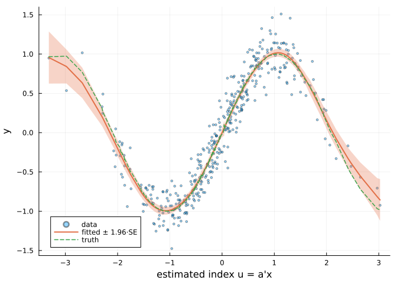
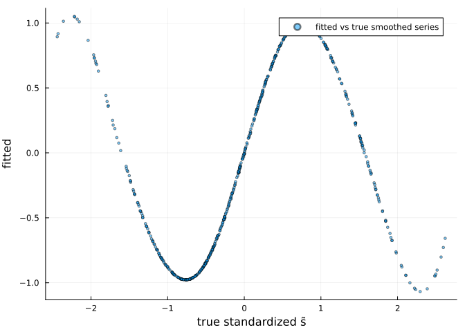

# Nested Effects: Smooths of Estimated Covariate Transformations
Simon Frost

- [Overview](#overview)
- [Example 1: Single-index effect](#example-1-single-index-effect)
  - [Recovering the index direction](#recovering-the-index-direction)
  - [The outer smooth, with
    uncertainty](#the-outer-smooth-with-uncertainty)
- [Example 2: Adaptive exponential
  smoothing](#example-2-adaptive-exponential-smoothing)
- [Comparison with R (gamFactory)](#comparison-with-r-gamfactory)
- [Notes](#notes)
- [References](#references)

## Overview

A **nested effect** is a smooth of an *estimated* covariate
transformation,

$$s\bigl(\tilde{s}_{\mathbf{a}}(\mathbf{x}_i)\bigr),$$

where the inner transformation $\tilde{s}$ has parameters $\mathbf{a}$
that are estimated **jointly** with the outer spline coefficients. This
framework was introduced by Fasiolo et al. (2025,
[arXiv:2511.19234](https://arxiv.org/abs/2511.19234)) and is available
in R through the [gamFactory](https://github.com/mfasiolo/gamFactory)
package. GAM.jl provides the same three inner transformations:

- `trans_linear()` — **single-index / distributed-lag** effects
  $\tilde{s}_i = \mathbf{a}^\top \mathbf{x}_i$, with a second-difference
  (or ridge) penalty on $\mathbf{a}$;
- `trans_nexpsm()` — **adaptive exponential smoothing** of a
  time-ordered series,
  $\tilde{s}_i = \omega_i \tilde{s}_{i-1} + (1-\omega_i) x_i$ with
  logistic weights;
- `trans_mgks()` — **Gaussian-kernel smoothing** of a covariate over
  coordinates, with estimated log-bandwidths and fixed nearest-neighbor
  sets for O(n·nn) evaluation.

Following the paper, the inner output is standardized to mean 0 and
variance 1 so the outer cubic B-spline lives on a fixed symmetric knot
range, with an $s(0)=0$ identifiability constraint and linear
extrapolation beyond the boundary knots. All coefficients are estimated
by penalized Newton with exact derivatives through the composition;
smoothing parameters (one per penalty, inner and outer) by EFS.

``` julia
using GAM, DataFrames, CSV, Plots, Random
using Statistics, LinearAlgebra
using StatsAPI: coef, fitted, predict
```

## Example 1: Single-index effect

The dataset `data_si.csv` (regenerated by `vignettes/generate_data.jl`)
contains $n = 400$ observations from

$$y_i = \sin(1.5\, u_i) + \varepsilon_i, \qquad
u_i = \mathbf{a}^\top \mathbf{x}_i, \qquad
\varepsilon_i \sim N(0, 0.2^2),$$

with $\mathbf{x}_i \in \mathbb{R}^3$ standard normal and the true index
direction $\mathbf{a} \propto (0.7, 0.5, 0.2)$ (unit norm). The columns
`u_true` and `f_true` store the true index and function values for
verification.

``` julia
df = CSV.read("data_si.csv", DataFrame)
a_true = normalize([0.7, 0.5, 0.2])
first(df, 3)
```

<div><div style = "float: left;"><span>3×6 DataFrame</span></div><div style = "clear: both;"></div></div><div class = "data-frame" style = "overflow-x: scroll;">

| Row |         y |       l1 |        l2 |         l3 |    u_true |    f_true |
|----:|----------:|---------:|----------:|-----------:|----------:|----------:|
|     |   Float64 |  Float64 |   Float64 |    Float64 |   Float64 |   Float64 |
|   1 |  0.483797 |  1.59754 |  0.677715 |   -1.42907 |   1.32626 |   0.91366 |
|   2 |  -0.75408 | -1.24506 | -0.141638 | 0.00804915 |  -1.06519 | -0.999636 |
|   3 | 0.0999395 | -0.44752 |  0.653151 |   -0.63644 | -0.129053 | -0.192372 |

</div>

`s_nest` terms go straight into the formula alongside ordinary smooths;
`gam_nl` (or `gam`, which routes automatically) fits the model:

``` julia
m = gam_nl(GAM.@formula(y ~ s_nest(l1, l2, l3, trans = trans_linear(), k = 10)), df)
m
```

    NestedGamModel (Normal, IdentityLink)
      Formula: y ~ 1 + s_nest(l1,l2,l3)
      Standard smooths: 0   Nested effects: 1
        s_nest(l1,l2,l3)  [trans_linear, k=10]
      Deviance: 15.1453   Deviance explained: 92.7%
      Total EDF: 10.46   Scale: 0.03888
      Converged: true (5 outer iterations)

### Recovering the index direction

`inner_coef` returns the estimated inner parameters. For `trans_linear`
the direction is identified only up to scale and sign (the inner output
is standardized), so it is returned normalized to unit length:

``` julia
a_hat = inner_coef(m)
println("true index:      ", round.(a_true; digits = 3))
println("estimated index: ", round.(a_hat; digits = 3))
println("|cos angle|:     ", round(abs(dot(a_hat, a_true)); digits = 4))
```

    true index:      [0.793, 0.566, 0.226]
    estimated index: [0.789, 0.573, 0.221]
    |cos angle|:     1.0

### The outer smooth, with uncertainty

`predict` supports `se = true`; the standard errors propagate the joint
uncertainty of **all** coefficients — the inner index included — through
the composition by the delta method:

``` julia
u_hat = Matrix(df[:, [:l1, :l2, :l3]]) * a_hat
ord = sortperm(u_hat)
pred, se = predict(m, df; type = :response, se = true)

scatter(u_hat, df.y; ms = 2, alpha = 0.4, label = "data",
    xlabel = "estimated index u = a'x", ylabel = "y")
plot!(u_hat[ord], pred[ord]; ribbon = 1.96 .* se[ord], lw = 2,
    label = "fitted ± 1.96·SE", fillalpha = 0.3)
plot!(u_hat[ord], df.f_true[ord]; lw = 1.5, ls = :dash, label = "truth")
```



``` julia
println("cor(fitted, truth): ", round(cor(fitted(m), df.f_true); digits = 4))
println("deviance explained: ", round(GAM.deviance_explained(m); digits = 3))
```

    cor(fitted, truth): 0.9992
    deviance explained: 0.927

## Example 2: Adaptive exponential smoothing

`data_expsm.csv` contains a series $x_i$ and a response driven by its
exponentially smoothed value with weight $\omega = 0.8$:

$$\tilde{s}_i = \omega\, \tilde{s}_{i-1} + (1 - \omega)\, x_i, \qquad
y_i = \sin\!\bigl(2\, \tilde{s}_i / \mathrm{sd}(\tilde{s})\bigr) + \varepsilon_i .$$

The smoothing weight is estimated (through a logistic link) jointly with
the outer smooth:

``` julia
df2 = CSV.read("data_expsm.csv", DataFrame)
m2 = gam_nl(GAM.@formula(y ~ s_nest(x, trans = trans_nexpsm(), k = 8)), df2)
ω̂ = 1.0 / (1.0 + exp(-coef(m2)[m2.inner_ranges[1]][1]))
println("estimated smoothing weight ω̂ = ", round(ω̂; digits = 3), "  (true: 0.8)")
println("cor(fitted, y): ", round(cor(fitted(m2), df2.y); digits = 3))
```

    estimated smoothing weight ω̂ = 0.799  (true: 0.8)
    cor(fitted, y): 0.979

``` julia
plot(df2.st_true ./ std(df2.st_true), fitted(m2); seriestype = :scatter,
    ms = 2, alpha = 0.5, label = "fitted vs true smoothed series",
    xlabel = "true standardized s̃", ylabel = "fitted")
```



## Comparison with R (gamFactory)

The companion vignette in `R/` fits the **same** `data_si.csv` with
gamFactory’s
`gam_nl(y ~ s_nest(X, trans = trans_linear(), k = 10), ...)` and prints
its estimated index direction and fit quality; the two implementations
recover the same direction (inner product of the unit vectors \> 0.999)
and essentially identical fitted values. The automated test suite runs
this comparison live via RCall (`test/test_nested_rcall.jl`) whenever R
and gamFactory are available, for Gaussian and Poisson responses.

For reference, the Julia estimates printed above are directly comparable
with the R companion’s output on the same CSV.

## Notes

- Supported families: `Normal`, `Poisson`, `Bernoulli`/`Binomial`,
  `Gamma`.
- `s_nest(..., sp = λ)` fixes the outer smoothing parameter.
- `trans_mgks(nn = 50)` bounds the kernel-smoothing cost at O(n·nn)
  using fixed nearest-neighbor sets, as in the paper; `nn = 0` uses all
  points.
- Differences from gamFactory: derivatives through the composition are
  computed by ForwardDiff rather than hand-coded chain-rule blocks, and
  smoothing parameters are selected by EFS on the deviance-scale
  criterion rather than full-LAML BFGS.

## References

- Fasiolo, M., et al. (2025). Scalable smoothing with nested models.
  *arXiv:2511.19234*.
- gamFactory: <https://github.com/mfasiolo/gamFactory>
