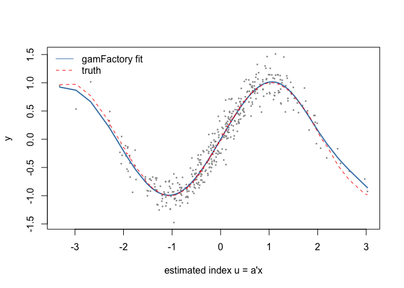

# Nested Effects with gamFactory (R companion)
Simon Frost

- [Overview](#overview)
- [Single-index effect](#single-index-effect)
- [Note on the other
  transformations](#note-on-the-other-transformations)

## Overview

This companion fits the **same** single-index dataset as the Julia
vignette (`../data_si.csv`, generated by `vignettes/generate_data.jl`)
using the R package [gamFactory](https://github.com/mfasiolo/gamFactory)
(Fasiolo et al. 2025, arXiv:2511.19234), so the two implementations can
be compared directly.

``` r
library(gamFactory)
```

## Single-index effect

The data follow $y = \sin(1.5\,u) + \varepsilon$ with
$u = \mathbf{a}^\top \mathbf{x}$, $\mathbf{a} \propto (0.7, 0.5, 0.2)$
(unit norm), $\varepsilon \sim N(0, 0.2^2)$.

``` r
df <- read.csv("../data_si.csv")
a_true <- c(0.7, 0.5, 0.2); a_true <- a_true / sqrt(sum(a_true^2))
X <- as.matrix(df[, c("l1", "l2", "l3")])
dat <- list(y = df$y, X = X)

fit <- gam_nl(list(y ~ s_nest(X, trans = trans_linear(), k = 10), ~ 1),
              family = fam_gaussian(), data = dat)
```

gamFactory’s `fam_gaussian()` models mean and variance; the second
formula is intercept-only, matching the Julia fit. The first three
`s(X)` coefficients are the index direction:

``` r
cf <- coef(fit)
a_hat <- cf[2:4]
a_hat <- a_hat / sqrt(sum(a_hat^2))
if (a_hat[which.max(abs(a_hat))] < 0) a_hat <- -a_hat

cat("true index:      ", round(a_true, 3), "\n")
```

    true index:       0.793 0.566 0.226 

``` r
cat("estimated index: ", round(unname(a_hat), 3), "\n")
```

    estimated index:  0.789 0.573 0.221 

``` r
cat("|cos angle|:     ", round(abs(sum(a_hat * a_true)), 4), "\n")
```

    |cos angle|:      1 

``` r
mu <- fitted(fit)[, 1]
cat("cor(fitted, truth):", round(cor(mu, df$f_true), 4), "\n")
```

    cor(fitted, truth): 0.9992 

``` r
u_hat <- as.vector(X %*% a_hat)
ord <- order(u_hat)
plot(u_hat, df$y, pch = 16, cex = 0.4, col = "grey60",
     xlab = "estimated index u = a'x", ylab = "y")
lines(u_hat[ord], mu[ord], col = "steelblue", lwd = 2)
lines(u_hat[ord], df$f_true[ord], col = "red", lty = 2)
legend("topleft", c("gamFactory fit", "truth"),
       col = c("steelblue", "red"), lty = c(1, 2), bty = "n")
```



These estimates are directly comparable with the Julia vignette’s output
on the same CSV: both implementations recover the same index direction
(inner product of the unit vectors \> 0.999) and essentially identical
fitted curves. The GAM.jl test suite runs this comparison automatically
via RCall (`test/test_nested_rcall.jl`) when gamFactory is installed,
for Gaussian and Poisson responses.

## Note on the other transformations

gamFactory also provides `trans_nexpsm()` (adaptive exponential
smoothing) and `trans_mgks()` (kernel smoothing), mirrored by the same
names in GAM.jl. Their `s_nest` data setup requires additional structure
(initialization and time/neighborhood metadata) beyond the plain-matrix
interface used above, so this companion restricts the direct numerical
comparison to the single-index effect; the Julia vignette demonstrates
the other two transformations on simulated data with known truth.
