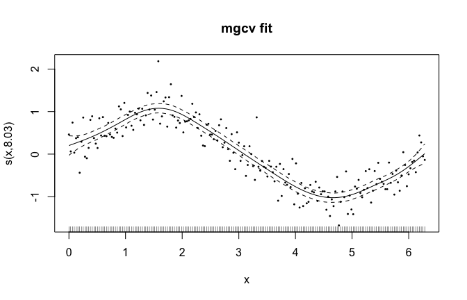

# Migrating from mgcv (R side)
Simon Frost

- [Overview](#overview)
- [The model](#the-model)
- [The quantities compared against
  GAM.jl](#the-quantities-compared-against-gamjl)

## Overview

This companion fits the **same** model on the **same** CSV as the Julia
vignette, so the two printouts can be compared line by line. The
quantities below are the ones the automated parity suite asserts
elementwise.

``` r
library(mgcv)
```

## The model

$y = \sin(x) + \varepsilon$, $\varepsilon \sim N(0, 0.3^2)$, $n = 200$.

``` r
d <- read.csv("../data.csv")
m <- gam(y ~ s(x, k = 15, bs = "cr"), data = d, method = "REML")
summary(m)
```


    Family: gaussian 
    Link function: identity 

    Formula:
    y ~ s(x, k = 15, bs = "cr")

    Parametric coefficients:
                Estimate Std. Error t value Pr(>|t|)
    (Intercept) -0.01313    0.02148  -0.611    0.542

    Approximate significance of smooth terms:
           edf Ref.df     F p-value    
    s(x) 8.033  9.731 113.1  <2e-16 ***
    ---
    Signif. codes:  0 '***' 0.001 '**' 0.01 '*' 0.05 '.' 0.1 ' ' 1

    R-sq.(adj) =  0.847   Deviance explained = 85.3%
    -REML = 59.528  Scale est. = 0.092271  n = 200

## The quantities compared against GAM.jl

``` r
cat(sprintf("edf   = %.4f\n", sum(summary(m)$edf)))
```

    edf   = 8.0329

``` r
cat(sprintf("sp    = %.6f  (log scale: %.6f)\n", m$sp[1], log(m$sp[1])))
```

    sp    = 33.052467  (log scale: 3.498096)

``` r
cat(sprintf("scale = %.6f\n", m$scale))
```

    scale = 0.092271

``` r
cat(sprintf("AIC   = %.4f\n", AIC(m)))
```

    AIC   = 102.4209

Prediction standard errors (first five), which GAM.jl matches to a
maximum relative difference of 5.1e-7:

``` r
p <- predict(m, se.fit = TRUE)
round(head(p$se.fit, 5), 8)
```

             1          2          3          4          5 
    0.11865276 0.10983162 0.10149546 0.09377780 0.08681157 

The smooth-term table — note the test statistic, which is the one
inference quantity that differs between the packages (GAM.jl uses a
documented simplification of Wood (2013)’s `testStat`; the edf and the
p-value conclusion agree):

``` r
summary(m)$s.table
```

             edf   Ref.df       F p-value
    s(x) 8.03295 9.730895 113.146       0

``` r
plot(m, shade = TRUE, residuals = TRUE, pch = 16, cex = 0.4,
     main = "mgcv fit")
```



The Julia vignette’s corresponding output is directly comparable: the
two implementations agree on the smoothing parameter to the printed
precision, on the coefficients to 8.7e-8, and on prediction standard
errors to 5.1e-7.
