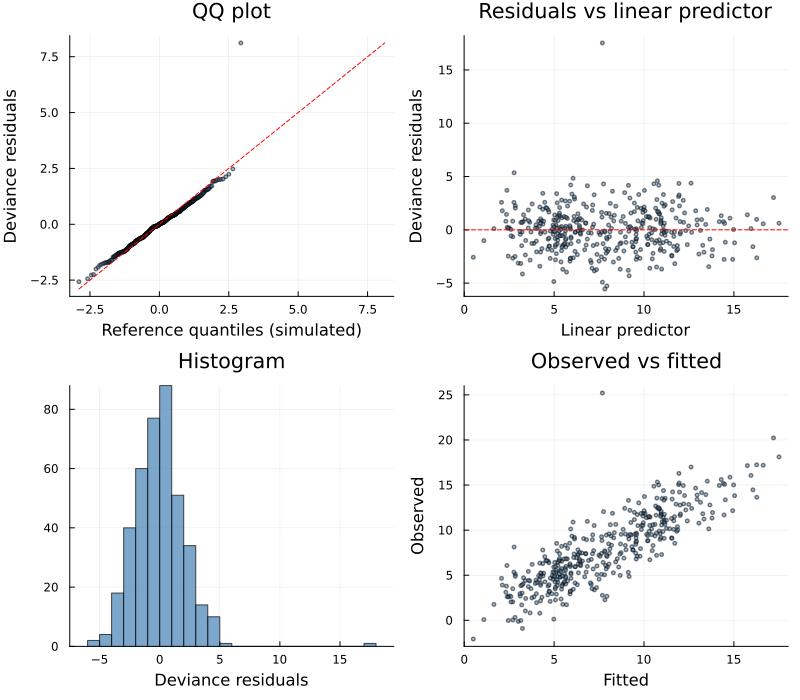
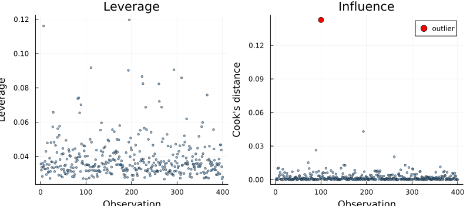
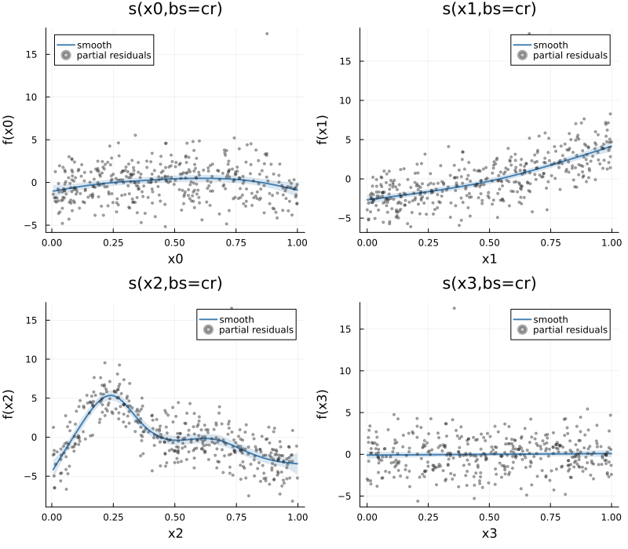

# Model Selection and Diagnostics: A Complete Workflow
Simon Frost

- [Overview](#overview)
- [The data](#the-data)
- [Step 1 — Fit, then check basis
  dimensions](#step-1--fit-then-check-basis-dimensions)
- [Step 2 — Is any term unnecessary?](#step-2--is-any-term-unnecessary)
- [Step 3 — Concurvity](#step-3--concurvity)
- [Step 4 — Comparing families by
  AIC](#step-4--comparing-families-by-aic)
- [Step 5 — Distributional
  assumptions](#step-5--distributional-assumptions)
- [Step 6 — Influential observations](#step-6--influential-observations)
- [Step 7 — Partial residuals](#step-7--partial-residuals)
- [Summary](#summary)
- [See also](#see-also)

## Overview

Earlier vignettes introduce the diagnostic tools one at a time. This one
runs a single dataset through the whole sequence in the order you would
actually use it:

1.  fit, and ask whether each basis is **large enough** (`k_check`)
2.  ask whether any term is **unnecessary** (`select=true`)
3.  ask whether the terms are **mutually identifiable** (`concurvity`)
4.  compare **families** by AIC
5.  check the **distributional assumptions** (`appraise`)
6.  find **influential observations** (`leverage`, `cooksdistance`)
7.  look at **partial residuals** to see what the smooths are fitting

``` julia
using GAM
using DataFrames, CSV, Plots
using StatsAPI: fitted, predict, coef, aic, residuals
using Statistics, Printf
```

## The data

`data.csv` (from `vignettes/generate_data.jl`) is the Gu & Wahba
four-term example with three deliberate complications:

- $f_0(x) = 2\sin(\pi x)$, $f_1(x) = e^{2x}$,
  $f_2(x) = 0.2x^{11}(10(1-x))^6 + 10(10x)^3(1-x)^{10}$
- $f_3(x) = 0$ — a **null smooth**, included in the model but absent
  from the truth
- `x4` is `x1` plus small noise — a **near-duplicate covariate**, to
  create concurvity
- observation 100 has **+15 added** — a gross outlier

$y = f_0(x_0) + f_1(x_1) + f_2(x_2) + \varepsilon$,
$\varepsilon \sim N(0, 2^2)$, $n = 400$.

``` julia
df = CSV.read("data.csv", DataFrame)
first(df, 4)
```

<div><div style = "float: left;"><span>4×6 DataFrame</span></div><div style = "clear: both;"></div></div><div class = "data-frame" style = "overflow-x: scroll;">

| Row |       y |       x0 |       x1 |       x2 |       x3 |       x4 |
|----:|--------:|---------:|---------:|---------:|---------:|---------:|
|     | Float64 |  Float64 |  Float64 |  Float64 |  Float64 |  Float64 |
|   1 | 11.0715 |  0.74297 | 0.897689 | 0.567029 | 0.627656 | 0.875939 |
|   2 | 6.43739 | 0.436851 | 0.219132 | 0.443732 | 0.859653 | 0.233823 |
|   3 | 7.82962 | 0.645113 |  0.46134 | 0.759085 | 0.121214 | 0.415769 |
|   4 | 12.8498 | 0.461213 | 0.607854 | 0.166182 |  0.63642 |  0.59443 |

</div>

## Step 1 — Fit, then check basis dimensions

Start with a generous basis for each term and let the penalty do the
work.

``` julia
m = gam(@formula(y ~ s(x0, k=10, bs=:cr) + s(x1, k=10, bs=:cr) +
                     s(x2, k=10, bs=:cr) + s(x3, k=10, bs=:cr)), df)
m
```

    Generalized Additive Model

    Formula: y ~ 1 + s(x0,bs=cr) + s(x1,bs=cr) + s(x2,bs=cr) + s(x3,bs=cr)

    Family: Normal
    Link:   IdentityLink
    Method: REML

    Parametric coefficients:
    ─────────────────────────────────────────────────
                   Coef.  Std. Error      t  Pr(>|t|)
    ─────────────────────────────────────────────────
    (Intercept)  7.85138     0.10801  72.69    <1e-99
    ─────────────────────────────────────────────────

    Approximate significance of smooth terms:
    ──────────────────────────────────────────────────────────────────
    Smooth                    edf   Ref.df          F    p-value
    ──────────────────────────────────────────────────────────────────
    s(x0,bs=cr)              3.20     4.00      4.528   0.001384
    s(x1,bs=cr)              2.57     3.00    114.545  5.272e-53
    s(x2,bs=cr)              7.80     8.00     70.801  6.614e-71
    s(x3,bs=cr)              1.00     1.00      0.255     0.6137
    ──────────────────────────────────────────────────────────────────

    R² (adj) = 0.713   Deviance explained = 72.3%
    Scale est. = 4.6665   n = 400

`k_check` reports, per smooth, the basis dimension `k`, the effective
degrees of freedom, mgcv’s **k-index**, and a permutation p-value. The
k-index compares the variability of neighbouring residuals to the
overall residual variance: **low k-index with a small p-value means the
basis is too small** — there is pattern left in the residuals at a scale
the basis cannot represent.

``` julia
for r in k_check(m)
    @printf("%-16s k=%2d  edf=%5.2f  k-index=%.3f  p=%.3f\n",
            r.label, r.k, r.edf, r.k_index, r.p_value)
end
```

    s(x0,bs=cr)      k= 9  edf= 3.20  k-index=0.988  p=0.350
    s(x1,bs=cr)      k= 9  edf= 2.57  k-index=0.964  p=0.235
    s(x2,bs=cr)      k= 9  edf= 7.80  k-index=1.076  p=0.930
    s(x3,bs=cr)      k= 9  edf= 1.00  k-index=1.051  p=0.845

All four p-values are comfortable, and the edf sit well below `k`, so
the bases are large enough. Had `s(x2)` come back with edf near its `k`
and a small p-value, the fix would be to raise `k` for that term and
refit.

## Step 2 — Is any term unnecessary?

`select=true` adds a penalty on each smooth’s null space, so a term with
no support in the data can be shrunk to *zero* effective degrees of
freedom — not merely to a straight line.

``` julia
ms = gam(@formula(y ~ s(x0, k=10, bs=:cr) + s(x1, k=10, bs=:cr) +
                      s(x2, k=10, bs=:cr) + s(x3, k=10, bs=:cr)), df; select=true)

for (i, sm) in enumerate(ms.smooths)
    @printf("%-16s edf(plain) = %6.3f   edf(select) = %6.3f\n",
            sm.spec.label, edf(m)[i], edf(ms)[i])
end
```

    s(x0,bs=cr)      edf(plain) =  3.202   edf(select) =  2.414
    s(x1,bs=cr)      edf(plain) =  2.567   edf(select) =  2.558
    s(x2,bs=cr)      edf(plain) =  7.798   edf(select) =  7.790
    s(x3,bs=cr)      edf(plain) =  1.004   edf(select) =  0.004

`s(x3)` — the null smooth — collapses from about 1 effective degree of
freedom (a straight line, the least a plain penalty can shrink it to) to
essentially zero: the term is removed from the model. The genuine terms
keep their structure, though note that the extra null-space penalty
shrinks them a little too — `s(x0)` loses some flexibility. That is the
trade term selection makes, and it is why `select=true` is a modelling
choice rather than a free lunch.

``` julia
@printf("deviance explained: plain %.3f, select %.3f\n",
        GAM.deviance_explained(m), GAM.deviance_explained(ms))
```

    deviance explained: plain 0.723, select 0.723

## Step 3 — Concurvity

Concurvity is the smooth analogue of collinearity: it asks how well one
smooth can be reproduced by the others. It matters because concurve
terms have unstable, hard-to-interpret individual estimates even when
the overall fit is fine.

`concurvity(m; full=true)` returns all three of mgcv’s measures. `worst`
is the pessimistic bound, `observed` uses the fitted values, and
`estimate` is a squared-Frobenius ratio. Values near 1 are trouble.

``` julia
c1 = concurvity(m; full=true)
for (i, sm) in enumerate(m.smooths)
    @printf("%-16s worst=%.3f  observed=%.3f  estimate=%.3f\n",
            sm.spec.label, c1.worst[i], c1.observed[i], c1.estimate[i])
end
```

    s(x0,bs=cr)      worst=0.118  observed=0.067  estimate=0.064
    s(x1,bs=cr)      worst=0.176  observed=0.082  estimate=0.067
    s(x2,bs=cr)      worst=0.128  observed=0.064  estimate=0.067
    s(x3,bs=cr)      worst=0.111  observed=0.062  estimate=0.057

Low across the board — the covariates are independent draws. Now add
`x4`, which is `x1` plus small noise:

``` julia
m_conc = gam(@formula(y ~ s(x0, k=10, bs=:cr) + s(x1, k=10, bs=:cr) +
                          s(x2, k=10, bs=:cr) + s(x4, k=10, bs=:cr)), df)
c2 = concurvity(m_conc; full=true)
for (i, sm) in enumerate(m_conc.smooths)
    @printf("%-16s worst=%.3f  observed=%.3f  estimate=%.3f\n",
            sm.spec.label, c2.worst[i], c2.observed[i], c2.estimate[i])
end
```

    s(x0,bs=cr)      worst=0.146  observed=0.075  estimate=0.073
    s(x1,bs=cr)      worst=0.993  observed=0.969  estimate=0.817
    s(x2,bs=cr)      worst=0.137  observed=0.083  estimate=0.076
    s(x4,bs=cr)      worst=0.993  observed=0.991  estimate=0.843

`s(x1)` and `s(x4)` now flag high concurvity, exactly as they should:
the model cannot tell their contributions apart. The remedy is to drop
one, not to reach for a bigger basis.

## Step 4 — Comparing families by AIC

AIC here uses full log-likelihoods including saturated-model constants,
so it is comparable across families fitted to the same response.

``` julia
m_gauss = gam(@formula(y ~ s(x0, k=10, bs=:cr) + s(x1, k=10, bs=:cr) +
                           s(x2, k=10, bs=:cr)), df)
df_pos = copy(df)
df_pos.ypos = df.y .- minimum(df.y) .+ 0.5      # shift to positive support
m_gamma = gam(@formula(ypos ~ s(x0, k=10, bs=:cr) + s(x1, k=10, bs=:cr) +
                              s(x2, k=10, bs=:cr)), df_pos,
              Gamma(), LogLink())

@printf("Gaussian  AIC = %9.2f  (edf %.2f)\n", aic(m_gauss), m_gauss.edf_total)
@printf("Gamma/log AIC = %9.2f  (edf %.2f)\n", aic(m_gamma), m_gamma.edf_total)
```

    Gaussian  AIC =   1767.10  (edf 14.56)
    Gamma/log AIC =   1865.64  (edf 12.11)

Note the caveat: these two models have **different responses** (`y`
versus a shifted `ypos`), so their AIC values are *not* comparable with
each other — they are shown to illustrate the call, not to select
between them. AIC comparisons are only meaningful across models of the
same response.

## Step 5 — Distributional assumptions

`appraise` returns the data behind the four standard residual plots. Its
QQ reference is a **simulated envelope** by default (`method=:simulate`,
matching gratia and mgcv’s `qq.gam`); pass `method=:normal` for normal
theory.

``` julia
ap = appraise(m)
@printf("residual sd = %.3f,  fitted range = [%.2f, %.2f]\n",
        std(ap.residuals_deviance), minimum(ap.fitted), maximum(ap.fitted))
```

    residual sd = 2.120,  fitted range = [0.50, 17.51]

``` julia
p1 = scatter(ap.qq_theoretical, ap.qq_sample; ms=2, alpha=0.5, label="",
    xlabel="Reference quantiles (simulated)", ylabel="Deviance residuals",
    title="QQ plot", color=:steelblue)
lims = extrema(vcat(ap.qq_theoretical, ap.qq_sample))
plot!(p1, [lims[1], lims[2]], [lims[1], lims[2]]; ls=:dash, color=:red, label="")

p2 = scatter(ap.linear_predictor, ap.residuals_deviance; ms=2, alpha=0.5,
    label="", xlabel="Linear predictor", ylabel="Deviance residuals",
    title="Residuals vs linear predictor", color=:steelblue)
hline!(p2, [0.0]; ls=:dash, color=:red, label="")

p3 = histogram(ap.residuals_deviance; bins=30, label="", color=:steelblue,
    alpha=0.7, xlabel="Deviance residuals", title="Histogram")

p4 = scatter(ap.fitted, ap.observed; ms=2, alpha=0.5, label="",
    xlabel="Fitted", ylabel="Observed", title="Observed vs fitted",
    color=:steelblue)

plot(p1, p2, p3, p4; layout=(2,2), size=(800,700))
```



The outlier at observation 100 is visible in the QQ tail and as the
isolated point in the observed-vs-fitted panel.

## Step 6 — Influential observations

`leverage` gives the hat-matrix diagonal (it sums to the model’s
effective degrees of freedom, a useful sanity check), and
`cooksdistance` combines leverage with residual size to measure each
point’s influence on the fit.

``` julia
lev = GAM.leverage(m)
cook = GAM.cooksdistance(m)

@printf("sum(leverage) = %.3f   edf_total = %.3f   (should match)\n",
        sum(lev), m.edf_total)
@printf("largest Cook's distance at observation %d (value %.4f, median %.5f)\n",
        argmax(cook), maximum(cook), median(cook))
```

    sum(leverage) = 15.570   edf_total = 15.570   (should match)
    largest Cook's distance at observation 100 (value 0.1427, median 0.00089)

The planted outlier is identified as the most influential point.

``` julia
p_lev = scatter(1:nrow(df), lev; ms=2, alpha=0.6, label="", color=:steelblue,
    xlabel="Observation", ylabel="Leverage", title="Leverage")
p_cook = scatter(1:nrow(df), cook; ms=2, alpha=0.6, label="", color=:steelblue,
    xlabel="Observation", ylabel="Cook's distance", title="Influence")
scatter!(p_cook, [argmax(cook)], [maximum(cook)]; ms=5, color=:red,
    label="outlier")
plot(p_lev, p_cook; layout=(1,2), size=(800,350))
```



## Step 7 — Partial residuals

`partial_residuals` returns a long-format table (`smooth`, `xname`, `x`,
`residual`) that implements the Tables.jl interface, so it converts
straight to a `DataFrame`. Overlaying these on the estimated smooth
shows whether the fit follows the data or is being dragged by a few
points.

``` julia
pr = partial_residuals(m)
first(DataFrame(pr), 3)
```

<div><div style = "float: left;"><span>3×4 DataFrame</span></div><div style = "clear: both;"></div></div><div class = "data-frame" style = "overflow-x: scroll;">

| Row | smooth      | xname  |        x | residual |
|----:|:------------|:-------|---------:|---------:|
|     | String      | String |  Float64 |  Float64 |
|   1 | s(x0,bs=cr) | x0     |  0.74297 | 0.308782 |
|   2 | s(x0,bs=cr) | x0     | 0.436851 | 0.308732 |
|   3 | s(x0,bs=cr) | x0     | 0.645113 |  1.98115 |

</div>

``` julia
plots = []
for (i, xvar) in enumerate([:x0, :x1, :x2, :x3])
    se_i = smooth_estimates(m; select=string(xvar), n=200)
    lab = m.smooths[i].spec.label
    mask = pr.smooth .== lab

    p = plot(se_i.covariates[xvar], se_i.estimate;
        ribbon=2 .* se_i.se, fillalpha=0.2, color=:steelblue, lw=2,
        label="smooth", xlabel=string(xvar), ylabel="f($(xvar))", title=lab)
    scatter!(p, pr.x[mask], pr.residual[mask];
        ms=1.5, alpha=0.35, color=:grey40, label="partial residuals")
    push!(plots, p)
end
plot(plots...; layout=(2,2), size=(800,700))
```



`s(x3)` is visibly flat with a band covering zero — the graphical
counterpart of the `select=true` result in step 2.

## Summary

| Question | Tool | What to look for |
|----|----|----|
| Basis big enough? | `k_check` | low k-index **and** small p-value → raise `k` |
| Term needed? | `select=true` | edf shrinking toward 0 |
| Terms identifiable? | `concurvity(full=true)` | values near 1 → drop or merge terms |
| Right family? | `aic` | only comparable across the same response |
| Assumptions OK? | `appraise` | QQ departures, structure vs linear predictor |
| Any point dominating? | `leverage`, `cooksdistance` | isolated large values |
| What is each smooth fitting? | `partial_residuals` | scatter tracking the curve |

## See also

- [Diagnostics](../05_diagnostics/05_diagnostics.md) — each tool in more
  depth
- [Migrating from
  mgcv](../13_migrating_from_mgcv/13_migrating_from_mgcv.md)
- [Multiple smooths](../03_multiple_smooths/03_multiple_smooths.md)
