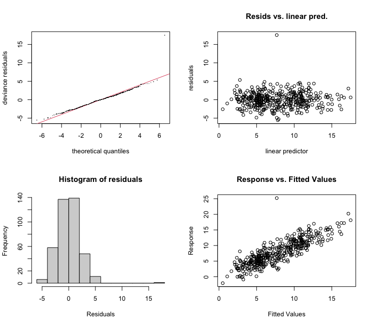
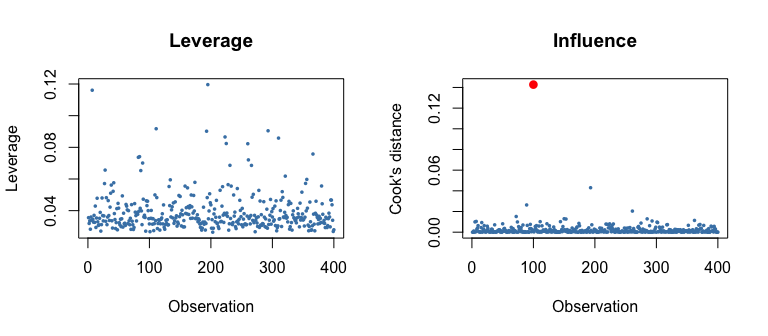
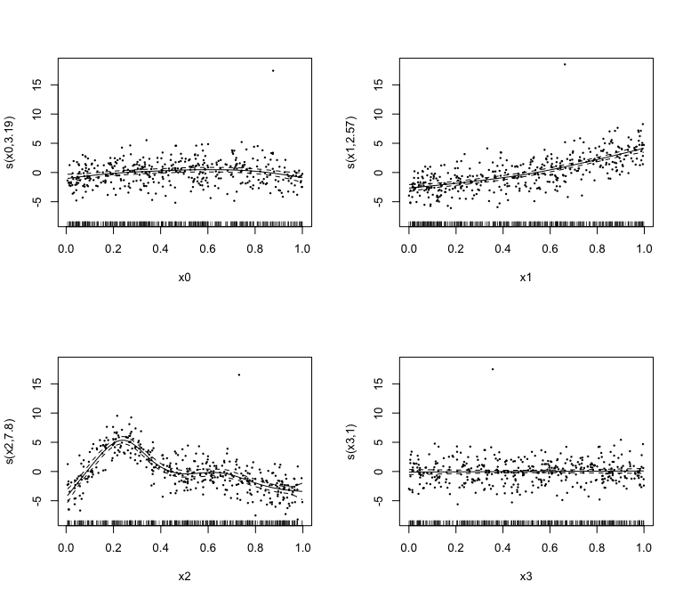

# Model Selection and Diagnostics: R Comparison
Simon Frost

- [Overview](#overview)
- [The data](#the-data)
- [Step 1 — Fit, then check basis
  dimensions](#step-1--fit-then-check-basis-dimensions)
- [Step 2 — Is any term unnecessary?](#step-2--is-any-term-unnecessary)
- [Step 3 — Concurvity](#step-3--concurvity)
- [Step 4 — Comparing families by
  AIC](#step-4--comparing-families-by-aic)
- [Step 5 — Distributional
  assumptions](#step-5--distributional-assumptions)
- [Step 6 — Influential observations](#step-6--influential-observations)
- [Step 7 — Partial residuals](#step-7--partial-residuals)
- [Step 8 — When the observations are correlated:
  NCV](#step-8--when-the-observations-are-correlated-ncv)
- [Summary](#summary)
  - [Numerical agreement with the Julia
    vignette](#numerical-agreement-with-the-julia-vignette)
  - [Notes on comparability](#notes-on-comparability)

## Overview

This companion runs the **same** seven-step model-selection workflow on
the **same** `data.csv` as `14_model_selection.qmd`, using mgcv, so the
two printouts can be compared step by step:

1.  fit, and ask whether each basis is **large enough** (`k.check`)
2.  ask whether any term is **unnecessary** (`select = TRUE`)
3.  ask whether the terms are **mutually identifiable** (`concurvity`)
4.  compare **families** by AIC
5.  check the **distributional assumptions** (`gam.check`, `qq.gam`)
6.  find **influential observations** (leverage, Cook’s distance)
7.  look at **partial residuals** to see what the smooths are fitting

``` r
library(mgcv)
```

    Loading required package: nlme

    This is mgcv 1.9-4. For overview type '?mgcv'.

## The data

The Gu & Wahba four-term example with three deliberate complications:

- $f_0(x) = 2\sin(\pi x)$, $f_1(x) = e^{2x}$,
  $f_2(x) = 0.2x^{11}(10(1-x))^6 + 10(10x)^3(1-x)^{10}$
- $f_3(x) = 0$ — a **null smooth**, in the model but absent from the
  truth
- `x4` is `x1` plus small noise — a **near-duplicate covariate**,
  creating concurvity
- observation 100 has **+15 added** — a gross outlier

``` r
df <- read.csv("../data.csv")
cat(sprintf("n = %d, columns: %s\n", nrow(df), paste(names(df), collapse = ", ")))
```

    n = 400, columns: y, x0, x1, x2, x3, x4

``` r
head(df, 4)
```

              y        x0        x1        x2        x3        x4
    1 11.071546 0.7429700 0.8976893 0.5670288 0.6276559 0.8759386
    2  6.437388 0.4368509 0.2191324 0.4437322 0.8596529 0.2338225
    3  7.829618 0.6451130 0.4613402 0.7590853 0.1212141 0.4157689
    4 12.849822 0.4612131 0.6078537 0.1661821 0.6364195 0.5944305

## Step 1 — Fit, then check basis dimensions

``` r
m <- gam(y ~ s(x0, k = 10, bs = "cr") + s(x1, k = 10, bs = "cr") +
             s(x2, k = 10, bs = "cr") + s(x3, k = 10, bs = "cr"),
         data = df, method = "REML")
summary(m)
```


    Family: gaussian 
    Link function: identity 

    Formula:
    y ~ s(x0, k = 10, bs = "cr") + s(x1, k = 10, bs = "cr") + s(x2, 
        k = 10, bs = "cr") + s(x3, k = 10, bs = "cr")

    Parametric coefficients:
                Estimate Std. Error t value Pr(>|t|)    
    (Intercept)    7.851      0.108   72.69   <2e-16 ***
    ---
    Signif. codes:  0 '***' 0.001 '**' 0.01 '*' 0.05 '.' 0.1 ' ' 1

    Approximate significance of smooth terms:
            edf Ref.df       F p-value    
    s(x0) 3.191  3.947   4.486 0.00144 ** 
    s(x1) 2.566  3.182 107.986 < 2e-16 ***
    s(x2) 7.798  8.620  65.768 < 2e-16 ***
    s(x3) 1.001  1.002   0.255 0.61454    
    ---
    Signif. codes:  0 '***' 0.001 '**' 0.01 '*' 0.05 '.' 0.1 ' ' 1

    R-sq.(adj) =  0.713   Deviance explained = 72.3%
    -REML = 890.73  Scale est. = 4.6667    n = 400

`k.check` reports the basis dimension, the effective degrees of freedom,
the k-index and a permutation p-value per smooth. A **low k-index with a
small p-value means the basis is too small**.

``` r
k.check(m)
```

          k'      edf   k-index p-value
    s(x0)  9 3.191462 0.9908050  0.4200
    s(x1)  9 2.566080 0.9659281  0.1850
    s(x2)  9 7.797928 1.0782549  0.9275
    s(x3)  9 1.000885 1.0536908  0.8750

All four p-values are comfortable and the edf sit well below `k`, so the
bases are large enough — the same conclusion the Julia vignette reaches
with `k_check(m)`.

## Step 2 — Is any term unnecessary?

`select = TRUE` adds a penalty on each smooth’s null space, so a term
with no support can be shrunk to *zero* effective degrees of freedom,
not merely to a straight line.

``` r
ms <- gam(y ~ s(x0, k = 10, bs = "cr") + s(x1, k = 10, bs = "cr") +
              s(x2, k = 10, bs = "cr") + s(x3, k = 10, bs = "cr"),
          data = df, method = "REML", select = TRUE)

cmp <- data.frame(
  term        = c("s(x0)", "s(x1)", "s(x2)", "s(x3)"),
  edf_plain   = round(summary(m)$edf, 3),
  edf_select  = round(summary(ms)$edf, 3)
)
print(cmp, row.names = FALSE)
```

      term edf_plain edf_select
     s(x0)     3.191      2.379
     s(x1)     2.566      2.557
     s(x2)     7.798      7.790
     s(x3)     1.001      0.001

`s(x3)` — the null smooth — collapses to essentially zero: the term is
removed from the model. The genuine terms keep their structure, though
the extra null-space penalty shrinks them a little too. That is the
trade term selection makes, and it is why `select = TRUE` is a modelling
choice rather than a free lunch.

``` r
cat(sprintf("deviance explained: plain %.3f, select %.3f\n",
            summary(m)$dev.expl, summary(ms)$dev.expl))
```

    deviance explained: plain 0.723, select 0.723

## Step 3 — Concurvity

Concurvity is the smooth analogue of collinearity: how well can one
smooth be reproduced by the others? `concurvity(m, full = TRUE)` returns
mgcv’s three measures — `worst` is the pessimistic bound, `observed`
uses the fitted values, `estimate` is a squared-Frobenius ratio. Values
near 1 are trouble.

``` r
round(concurvity(m, full = TRUE), 3)
```

             para s(x0) s(x1) s(x2) s(x3)
    worst       0 0.118 0.176 0.128 0.111
    observed    0 0.067 0.082 0.064 0.062
    estimate    0 0.064 0.067 0.067 0.057

Low across the board — the covariates are independent draws. Now swap in
`x4`, which is `x1` plus small noise:

``` r
m_conc <- gam(y ~ s(x0, k = 10, bs = "cr") + s(x1, k = 10, bs = "cr") +
                  s(x2, k = 10, bs = "cr") + s(x4, k = 10, bs = "cr"),
              data = df, method = "REML")
round(concurvity(m_conc, full = TRUE), 3)
```

             para s(x0) s(x1) s(x2) s(x4)
    worst       0 0.146 0.993 0.137 0.993
    observed    0 0.075 0.969 0.083 0.991
    estimate    0 0.073 0.817 0.076 0.843

`s(x1)` and `s(x4)` now flag high concurvity, exactly as they should:
the model cannot tell their contributions apart. The remedy is to drop
one, not to reach for a bigger basis.

## Step 4 — Comparing families by AIC

``` r
m_gauss <- gam(y ~ s(x0, k = 10, bs = "cr") + s(x1, k = 10, bs = "cr") +
                   s(x2, k = 10, bs = "cr"), data = df, method = "REML")

df_pos <- df
df_pos$ypos <- df$y - min(df$y) + 0.5          # shift to positive support
m_gamma <- gam(ypos ~ s(x0, k = 10, bs = "cr") + s(x1, k = 10, bs = "cr") +
                      s(x2, k = 10, bs = "cr"), data = df_pos,
               family = Gamma(link = "log"), method = "REML")

cat(sprintf("Gaussian  AIC = %9.2f  (edf %.2f)\n", AIC(m_gauss), sum(m_gauss$edf)))
```

    Gaussian  AIC =   1769.81  (edf 14.55)

``` r
cat(sprintf("Gamma/log AIC = %9.2f  (edf %.2f)\n", AIC(m_gamma), sum(m_gamma$edf)))
```

    Gamma/log AIC =   1867.27  (edf 11.85)

The same caveat as in the Julia vignette applies: these two models have
**different responses** (`y` versus a shifted `ypos`), so their AIC
values are *not* comparable with each other. They are shown to
illustrate the call. AIC comparisons are only meaningful across models
of the same response.

## Step 5 — Distributional assumptions

`gam.check` produces the four standard residual plots and reprints the
basis check. mgcv’s `qq.gam` uses a simulated reference by default,
matching the `method = :simulate` default of GAM.jl’s `appraise`.

``` r
par(mfrow = c(2, 2))
gam.check(m)
```




    Method: REML   Optimizer: outer newton
    full convergence after 7 iterations.
    Gradient range [-0.0004144111,2.798324e-05]
    (score 890.7268 & scale 4.666658).
    Hessian positive definite, eigenvalue range [0.0004141388,197.5686].
    Model rank =  37 / 37 

    Basis dimension (k) checking results. Low p-value (k-index<1) may
    indicate that k is too low, especially if edf is close to k'.

            k'  edf k-index p-value
    s(x0) 9.00 3.19    0.99    0.42
    s(x1) 9.00 2.57    0.97    0.26
    s(x2) 9.00 7.80    1.08    0.91
    s(x3) 9.00 1.00    1.05    0.88

The outlier at observation 100 is visible in the QQ tail and in the
residuals-versus-linear-predictor panel.

## Step 6 — Influential observations

The hat-matrix diagonal sums to the model’s effective degrees of
freedom, a useful sanity check. Cook’s distance combines leverage with
residual size.

``` r
lev <- influence(m)                       # hat diagonal for a fitted gam
# mgcv's m$edf is per-coefficient and already includes the intercept, so its
# sum is the model's total effective degrees of freedom.
edf_total <- sum(m$edf)
cat(sprintf("sum(leverage) = %.3f   total edf = %.3f   (should match)\n",
            sum(lev), edf_total))
```

    sum(leverage) = 15.556   total edf = 15.556   (should match)

``` r
r    <- residuals(m, type = "response")
phi  <- m$sig2
cook <- (r^2 * lev) / (phi * edf_total * (1 - lev)^2)
cat(sprintf("largest Cook's distance at observation %d (value %.4f, median %.5f)\n",
            which.max(cook), max(cook), median(cook)))
```

    largest Cook's distance at observation 100 (value 0.1427, median 0.00089)

The planted outlier is identified as the most influential point.

``` r
par(mfrow = c(1, 2))
plot(lev, pch = 16, cex = 0.5, col = "steelblue",
     xlab = "Observation", ylab = "Leverage", main = "Leverage")
plot(cook, pch = 16, cex = 0.5, col = "steelblue",
     xlab = "Observation", ylab = "Cook's distance", main = "Influence")
points(which.max(cook), max(cook), col = "red", pch = 16, cex = 1.2)
```



## Step 7 — Partial residuals

Partial residuals are the working residuals plus the term’s own
contribution. Overlaying them on the estimated smooth shows whether the
fit follows the data or is being dragged by a few points.
`plot.gam(..., residuals = TRUE)` does this directly.

``` r
par(mfrow = c(2, 2))
plot(m, residuals = TRUE, pch = 16, cex = 0.4, shade = TRUE, seWithMean = TRUE)
```



`s(x3)` is visibly flat with a band covering zero — the graphical
counterpart of the `select = TRUE` result in step 2.

## Step 8 — When the observations are correlated: NCV

mgcv’s `method = "NCV"` is neighbourhood cross validation. The data is a
smooth mean plus AR(1) errors with $\rho = 0.9$, so the truth has about
3 effective degrees of freedom buried in strongly correlated noise.

Note the `nei` encoding, which is easy to get wrong: the dropped sets
are `a` with endpoints `ma`, and the prediction points are `d` with
endpoints `md`. **If `a` or `ma` is missing mgcv silently falls back to
leave-one-out** rather than erroring, so a mis-named list looks like it
worked and simply reproduces the LOO answer.

``` r
d_ar <- read.csv("../data_ar1.csv")
n <- nrow(d_ar); hw <- 15
rmse_true <- function(m) sqrt(mean((fitted(m) - d_ar$f_true)^2))

m_gcv <- gam(y ~ s(x, k = 30, bs = "cr"), data = d_ar, method = "GCV.Cp")
m_loo <- gam(y ~ s(x, k = 30, bs = "cr"), data = d_ar, method = "NCV")

sets <- lapply(1:n, function(i) max(1, i - hw):min(n, i + hw))
nei <- list(a = unlist(sets), ma = cumsum(sapply(sets, length)),
            d = 1:n, md = 1:n)
m_nei <- gam(y ~ s(x, k = 30, bs = "cr"), data = d_ar, method = "NCV", nei = nei)

for (nm in c("GCV", "NCV (leave-one-out)", "NCV (half-width 15)")) {
  mm <- switch(nm, "GCV" = m_gcv, "NCV (leave-one-out)" = m_loo, m_nei)
  cat(sprintf("%-22s edf = %6.2f   RMSE vs truth = %.4f\n",
              nm, sum(pen.edf(mm)), rmse_true(mm)))
}
```

    GCV                    edf =  28.10   RMSE vs truth = 0.9999
    NCV (leave-one-out)    edf =  28.24   RMSE vs truth = 1.0021
    NCV (half-width 15)    edf =   4.47   RMSE vs truth = 0.7270

This is close agreement with the GAM.jl vignette: GCV selects edf 28.10
with RMSE 0.9999 in both packages, leave-one-out NCV 28.24 / 1.0021 in
both, and the half-width-15 neighbourhood recovers **edf 4.47 in both**.
The RMSE differs slightly there (0.7270 here against GAM.jl’s 0.7069)
because the two optimizers stop at marginally different smoothing
parameters on a flat optimum — GAM.jl selects with a derivative-free
optimizer where mgcv uses analytic derivatives of the NCV score.

## Summary

| Question | mgcv | GAM.jl |
|----|----|----|
| Basis big enough? | `k.check(m)` | `k_check(m)` |
| Term needed? | `select = TRUE` | `select = true` |
| Terms identifiable? | `concurvity(m, full = TRUE)` | `concurvity(m; full = true)` |
| Right family? | `AIC(m)` | `aic(m)` |
| Assumptions OK? | `gam.check(m)`, `qq.gam` | `appraise(m)` |
| Any point dominating? | `influence(m)`, Cook’s distance | `leverage(m)`, `cooksdistance(m)` |
| What is each smooth fitting? | `plot(m, residuals = TRUE)` | `partial_residuals(m)` |

### Numerical agreement with the Julia vignette

Run side by side on this dataset, the two packages agree closely:

| Quantity                              | GAM.jl  | mgcv    |
|---------------------------------------|---------|---------|
| edf `s(x0)`                           | 3.202   | 3.191   |
| edf `s(x1)`                           | 2.567   | 2.566   |
| edf `s(x2)`                           | 7.798   | 7.798   |
| edf `s(x3)` (null term)               | 1.004   | 1.001   |
| edf `s(x3)` under `select`            | 0.004   | 0.001   |
| deviance explained                    | 0.723   | 0.723   |
| concurvity `worst`, `s(x1)`           | 0.176   | 0.176   |
| concurvity `worst`, `s(x1)` with `x4` | 0.993   | 0.993   |
| concurvity `worst`, `s(x4)`           | 0.993   | 0.993   |
| total edf = Σ leverage                | 15.570  | 15.556  |
| most influential observation          | 100     | 100     |
| largest Cook’s distance               | 0.1427  | 0.1427  |
| median Cook’s distance                | 0.00089 | 0.00089 |

Concurvity agrees to three decimal places, effective degrees of freedom
to about 0.01, and Cook’s distances agree to the four decimals printed.
Both packages identify the planted outlier at observation 100, and the
null smooth collapses to essentially zero edf under term selection in
both.

### Notes on comparability

- **Term selection** behaves the same way in both packages: the null
  smooth `s(x3)` shrinks to essentially zero edf under `select`, while
  the genuine terms lose a little flexibility to the extra null-space
  penalty.
- **Concurvity** uses the same three measures and the same definitions,
  so the numbers are directly comparable — as the table shows.
- **Cook’s distance** is computed explicitly above because mgcv exposes
  the hat diagonal through `influence()` rather than providing a
  `cooks.distance` method for `gam` objects. Scaling by `sum(m$edf)` —
  which already counts the intercept — reproduces GAM.jl’s
  `cooksdistance(m)` exactly.
- **Smooth-term p-values** can differ slightly: GAM.jl uses a
  simplification of mgcv’s `testStat`, so the printed statistic may not
  match `summary.gam`’s even where the conclusion is identical.
  Empirical rejection rates agree with mgcv’s to within Monte Carlo
  error, so test *size* is unaffected.
- **`aic`** in GAM.jl follows mgcv’s `AIC()` convention (`edf2`-based)
  and agrees to about 1e-4 on REML fits.
