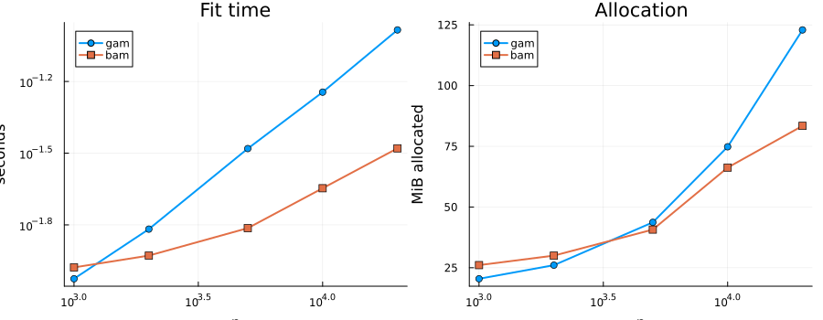
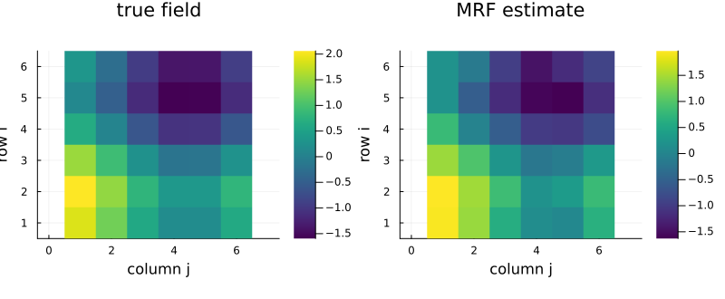
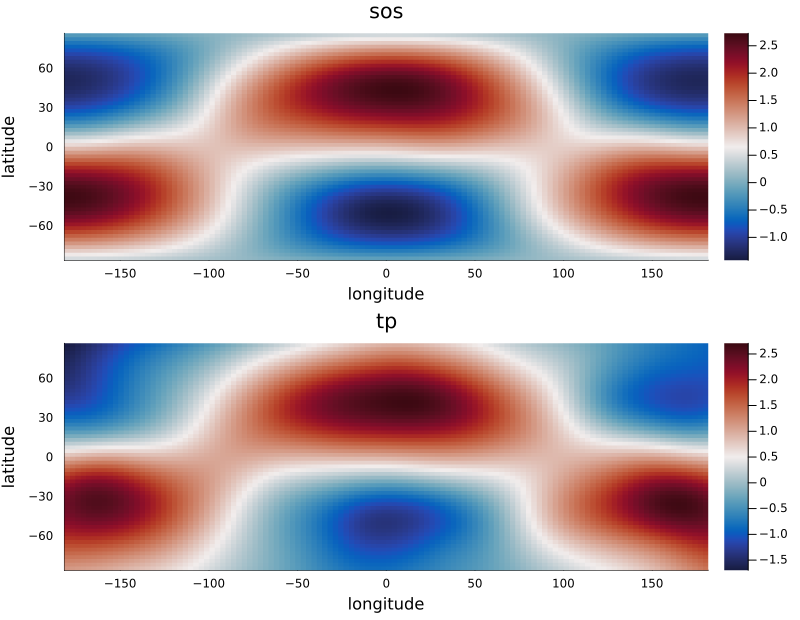

# Large Data and Spatial Models
Simon Frost

- [Overview](#overview)
- [Part 1 — When `bam()` helps](#part-1--when-bam-helps)
  - [What `bam()` actually does
    differently](#what-bam-actually-does-differently)
  - [The data](#the-data)
  - [Measured crossover](#measured-crossover)
  - [Do they agree?](#do-they-agree)
  - [The same comparison in mgcv](#the-same-comparison-in-mgcv)
  - [Scaling in `k`, not just `n`](#scaling-in-k-not-just-n)
  - [Chunk size](#chunk-size)
- [Part 2 — Areal data: Markov random
  fields](#part-2--areal-data-markov-random-fields)
  - [The lattice](#the-lattice)
  - [Recovering the spatial field](#recovering-the-spatial-field)
  - [Against mgcv](#against-mgcv)
- [Part 3 — Points on a sphere: `sos` versus
  `tp`](#part-3--points-on-a-sphere-sos-versus-tp)
  - [The data](#the-data-1)
  - [The seam test](#the-seam-test)
  - [How close is `sos` to mgcv’s?](#how-close-is-sos-to-mgcvs)
- [Part 4 — Choosing a fitter and a
  basis](#part-4--choosing-a-fitter-and-a-basis)
- [Notes and known differences from
  mgcv](#notes-and-known-differences-from-mgcv)
- [References](#references)

## Overview

Two questions come up as soon as a GAM leaves the textbook setting:

1.  **The data are large.** Does `bam()` help, and from what $n$?
2.  **The data are spatial.** Regions on a map need `bs=:mrf`; points on
    a globe need `bs=:sos`. What do they cost, and how close are they to
    mgcv?

This vignette answers both with measurements taken while the page
renders, and compares each fit against its `mgcv` counterpart (the
companion in `R/` fits the **same** CSVs, so the printouts line up).

``` julia
using GAM
using DataFrames, CSV, Plots
using StatsAPI: fitted, predict, aic, coef
using Statistics, LinearAlgebra, Printf
```

## Part 1 — When `bam()` helps

### What `bam()` actually does differently

`gam()` forms a QR decomposition of the (square-root weighted) design
matrix at every P-IRLS step: cost $O(np^2)$ in time and $O(np)$ in
memory, since the full $n \times p$ working matrix has to be held.

`bam()` instead accumulates the normal equations
$$X^\top W X = \sum_{c} X_c^\top W_c X_c, \qquad
X^\top W z = \sum_{c} X_c^\top W_c z_c$$
over row-chunks of `chunk_size` rows (default 10,000) using BLAS `syrk`,
and solves the $p \times p$ system by Cholesky. Time is still $O(np^2)$,
but the constant is smaller and the working memory beyond the design
matrix is $O(\texttt{chunk\_size} \cdot p + p^2)$ rather than $O(np)$.

The price is numerical: the normal equations square the condition number
of $X$. For well-scaled penalized bases that is harmless; for a badly
scaled basis, prefer `gam()`.

> [!NOTE]
>
> mgcv’s `bam(..., discrete = TRUE)` additionally bins each covariate
> and works on unique values only, which changes the *asymptotic* cost.
> GAM.jl’s `bam()` does **not** implement discretization —
> `bam_control(discrete = ...)` is deprecated and warns. So the
> comparison below is against mgcv’s `discrete = FALSE` behaviour.

### The data

`data_large.csv` (from `vignettes/generate_data.jl`, seed 20260815)
holds $n = 20{,}000$ draws from a plain additive Gaussian model,

$$y = \sin(2\pi x_1) + x_2^2 + e^{-8(x_3 - 0.4)^2} + \varepsilon,
\qquad \varepsilon \sim N(0, 0.5^2),$$

with $x_1, x_2, x_3 \sim U(0,1)$ independently.

``` julia
df = CSV.read("data_large.csv", DataFrame)
fm = @formulak(y ~ s(x1, k=30, bs=:cr) + s(x2, k=30, bs=:cr) + s(x3, k=30, bs=:cr))
println("n = ", nrow(df), ",  p = 3 × 30 = 90 coefficients (before constraints)")
first(df, 3)
```

    n = 20000,  p = 3 × 30 = 90 coefficients (before constraints)

<div><div style = "float: left;"><span>3×4 DataFrame</span></div><div style = "clear: both;"></div></div><div class = "data-frame" style = "overflow-x: scroll;">

| Row |         y |       x1 |       x2 |       x3 |
|----:|----------:|---------:|---------:|---------:|
|     |   Float64 |  Float64 |  Float64 |  Float64 |
|   1 |   1.15257 | 0.166962 | 0.107863 | 0.182832 |
|   2 | -0.196765 | 0.933139 | 0.518496 | 0.757508 |
|   3 |  0.523185 | 0.632999 | 0.789845 | 0.087237 |

</div>

### Measured crossover

Timings are wall-clock minima over five fits, taken on whatever machine
rendered this page. The first pair of fits is discarded so no
compilation time leaks into the table — without that warm-up the very
first `bam()` call looks about a hundred times slower than it is.

``` julia
# warm up at two sizes so no size-dependent specialization remains
for n in (800, 3000)
    d = df[1:n, :]
    gam(fm, d); bam(fm, d); gam(fm, d); bam(fm, d)
end

sizes = [1_000, 2_000, 5_000, 10_000, 20_000]
rows = NamedTuple[]
for n in sizes
    d = df[1:n, :]
    tg = minimum(@elapsed(gam(fm, d)) for _ in 1:5)
    tb = minimum(@elapsed(bam(fm, d)) for _ in 1:5)
    ag = (@allocated gam(fm, d)) / 2^20
    ab = (@allocated bam(fm, d)) / 2^20
    mg = gam(fm, d); mb = bam(fm, d)
    push!(rows, (n = n, gam_s = tg, bam_s = tb, speedup = tg / tb,
        gam_MB = ag, bam_MB = ab, mem_ratio = ag / ab,
        edf_gam = mg.edf_total, edf_bam = mb.edf_total,
        max_absdiff = maximum(abs, fitted(mg) .- fitted(mb))))
end

println(rpad("n", 8), rpad("gam (s)", 10), rpad("bam (s)", 10), rpad("speedup", 10),
        rpad("gam (MB)", 11), rpad("bam (MB)", 11), "mem ratio")
println("─"^70)
for r in rows
    println(rpad(r.n, 8),
        rpad(round(r.gam_s; digits = 4), 10), rpad(round(r.bam_s; digits = 4), 10),
        rpad(string(round(r.speedup; digits = 2), "×"), 10),
        rpad(round(r.gam_MB; digits = 1), 11), rpad(round(r.bam_MB; digits = 1), 11),
        round(r.mem_ratio; digits = 2), "×")
end
```

    n       gam (s)   bam (s)   speedup   gam (MB)   bam (MB)   mem ratio
    ──────────────────────────────────────────────────────────────────────
    1000    0.0096    0.0115    0.84×     20.6       26.2       0.79×
    2000    0.0169    0.012     1.41×     26.2       30.1       0.87×
    5000    0.0374    0.0158    2.37×     43.8       40.8       1.07×
    10000   0.0635    0.0252    2.51×     68.2       59.7       1.14×
    20000   0.1039    0.0324    3.21×     129.4      92.5       1.4×

There are two separate crossovers in that table — one in time, one in
memory — and they need not coincide:

``` julia
first_or(f, xs, default) = (i = findfirst(f, xs); i === nothing ? default : xs[i])
t_cross = first_or(r -> r.speedup   > 1, rows, nothing)
m_cross = first_or(r -> r.mem_ratio > 1, rows, nothing)

println("bam() first beats gam() on time   at n = ",
        t_cross === nothing ? "none of the sizes tried" : t_cross.n)
println("bam() first beats gam() on memory at n = ",
        m_cross === nothing ? "none of the sizes tried" : m_cross.n)
println("at the largest n tried (", rows[end].n, "): ",
        round(rows[end].speedup; digits = 2), "× faster, ",
        round(rows[end].mem_ratio; digits = 2), "× lighter")
```

    bam() first beats gam() on time   at n = 2000
    bam() first beats gam() on memory at n = 5000
    at the largest n tried (20000): 3.21× faster, 1.4× lighter

`bam()`’s overhead is the $p \times p$ accumulator and the chunk
buffers, which are pure cost when the design matrix is small — that is
why it can lose at small $n$ on both axes. Past the crossovers,
`gam()`’s allocations keep growing linearly in $n$ while `bam()`’s
flatten out, so the gap widens from there.

``` julia
plot(sizes, [r.gam_s for r in rows]; label = "gam", lw = 2, marker = :circle,
    xscale = :log10, yscale = :log10, xlabel = "n", ylabel = "seconds",
    title = "Fit time", legend = :topleft)
p1 = plot!(sizes, [r.bam_s for r in rows]; label = "bam", lw = 2, marker = :square)

plot(sizes, [r.gam_MB for r in rows]; label = "gam", lw = 2, marker = :circle,
    xscale = :log10, xlabel = "n", ylabel = "MiB allocated",
    title = "Allocation", legend = :topleft)
p2 = plot!(sizes, [r.bam_MB for r in rows]; label = "bam", lw = 2, marker = :square)

plot(p1, p2; layout = (1, 2), size = (900, 350))
```



### Do they agree?

Speed is worthless if the answer moves. The two fitters use the same EFS
smoothing-parameter search on the same REML criterion, so they should
agree to within the extra rounding the normal equations introduce:

``` julia
println(rpad("n", 8), rpad("EDF (gam)", 12), rpad("EDF (bam)", 12), "max |Δ fitted|")
println("─"^50)
for r in rows
    println(rpad(r.n, 8),
        rpad(round(r.edf_gam; digits = 3), 12),
        rpad(round(r.edf_bam; digits = 3), 12),
        @sprintf("%.2e", r.max_absdiff))
end
```

    n       EDF (gam)   EDF (bam)   max |Δ fitted|
    ──────────────────────────────────────────────────
    1000    19.429      19.436      1.05e-04
    2000    22.616      22.623      9.65e-05
    5000    27.212      27.246      3.77e-04
    10000   30.425      30.456      1.49e-04
    20000   33.53       33.579      9.55e-05

The EDFs agree to three significant figures and the fitted values to
within $4 \times 10^{-4}$ on a response with unit-scale variation. That
residual difference is the squared condition number at work, and it is
orders of magnitude below any inferential resolution.

### The same comparison in mgcv

The R companion runs exactly this benchmark with
`mgcv::gam(method="REML")` and `mgcv::bam(method="fREML")` on the same
CSV. Its speedups are much larger — around 11× at $n = 1000$, rising to
roughly 27× — which is easy to misread as “GAM.jl’s `bam()`
underperforms”. The absolute times say otherwise. The mgcv figures below
are transcribed from one rendering of that companion (wall-clock, so
expect a few percent of run-to-run drift); the GAM.jl figures come from
the table just computed, so at least the two Julia tables can never
disagree:

``` julia
mgcv_gam = Dict(1_000 => 0.472, 2_000 => 0.835, 5_000 => 2.108,
                10_000 => 3.667, 20_000 => 7.325)
mgcv_bam = Dict(1_000 => 0.041, 2_000 => 0.045, 5_000 => 0.079,
                10_000 => 0.136, 20_000 => 0.276)

println(rpad("n", 8), rpad("mgcv gam", 11), rpad("GAM.jl gam", 13),
        rpad("mgcv bam", 11), rpad("GAM.jl bam", 13), "GAM.jl gam vs mgcv gam")
println("─"^76)
for r in rows
    println(rpad(r.n, 8),
        rpad(string(mgcv_gam[r.n], " s"), 11),
        rpad(string(round(r.gam_s; digits = 4), " s"), 13),
        rpad(string(mgcv_bam[r.n], " s"), 11),
        rpad(string(round(r.bam_s; digits = 4), " s"), 13),
        round(mgcv_gam[r.n] / r.gam_s; digits = 1), "× faster")
end
```

    n       mgcv gam   GAM.jl gam   mgcv bam   GAM.jl bam   GAM.jl gam vs mgcv gam
    ────────────────────────────────────────────────────────────────────────────
    1000    0.472 s    0.0096 s     0.041 s    0.0115 s     49.1× faster
    2000    0.835 s    0.0169 s     0.045 s    0.012 s      49.3× faster
    5000    2.108 s    0.0374 s     0.079 s    0.0158 s     56.4× faster
    10000   3.667 s    0.0635 s     0.136 s    0.0252 s     57.8× faster
    20000   7.325 s    0.1039 s     0.276 s    0.0324 s     70.5× faster

GAM.jl’s `gam()` is the fast one in absolute terms; mgcv’s `bam()` has a
large ratio to report mainly because mgcv’s `gam()` re-forms a QR at
every outer iteration. So the practical advice differs by package: in
mgcv, reach for `bam()` almost as soon as $n$ leaves the hundreds; in
GAM.jl, `gam()` stays competitive for longer. (mgcv’s
`bam(discrete = TRUE)`, which GAM.jl does not implement, would be faster
again — these are `discrete = FALSE` timings.)

### Scaling in `k`, not just `n`

Cost is $O(np^2)$, so basis size bites harder than sample size —
doubling `k` costs four times as much, doubling `n` only twice. Fixing
$n = 10{,}000$ and growing `k`:

``` julia
d10 = df[1:10_000, :]
k_formulas = [
    10 => @formulak(y ~ s(x1, k=10, bs=:cr) + s(x2, k=10, bs=:cr) + s(x3, k=10, bs=:cr)),
    20 => @formulak(y ~ s(x1, k=20, bs=:cr) + s(x2, k=20, bs=:cr) + s(x3, k=20, bs=:cr)),
    40 => @formulak(y ~ s(x1, k=40, bs=:cr) + s(x2, k=40, bs=:cr) + s(x3, k=40, bs=:cr)),
    60 => @formulak(y ~ s(x1, k=60, bs=:cr) + s(x2, k=60, bs=:cr) + s(x3, k=60, bs=:cr)),
]

println(rpad("k", 6), rpad("p", 6), rpad("gam (s)", 11), rpad("bam (s)", 11), "speedup")
println("─"^45)
for (k, fk) in k_formulas
    gam(fk, d10); bam(fk, d10)   # warm up this basis size
    tg = minimum(@elapsed(gam(fk, d10)) for _ in 1:3)
    tb = minimum(@elapsed(bam(fk, d10)) for _ in 1:3)
    println(rpad(k, 6), rpad(3k, 6), rpad(round(tg; digits = 4), 11),
        rpad(round(tb; digits = 4), 11), round(tg / tb; digits = 2), "×")
end
```

    k     p     gam (s)    bam (s)    speedup
    ─────────────────────────────────────────────
    10    30    0.0121     0.0061     1.99×
    20    60    0.03       0.0117     2.55×
    40    120   0.11       0.0395     2.79×
    60    180   0.2095     0.0848     2.47×

Both fitters slow down steeply in `k`, as the $O(np^2)$ cost predicts —
compare the growth here against the near-linear growth in the $n$ table
above, where $p$ was held fixed. `bam()`’s relative advantage rises with
$p$ and then flattens: once $p$ is large enough that the chunked `syrk`
accumulation is BLAS-bound, both fitters are doing the same dominant
work and the ratio stops moving.

### Chunk size

`chunk_size` trades accumulator memory against BLAS efficiency. It
should not change the answer at all — the chunked sum is the same sum —
which is worth checking directly:

``` julia
d20 = df
for cs in (1_000, 10_000, 20_000)
    m = bam(fm, d20; bam_ctrl = bam_control(chunk_size = cs))
    t = minimum(@elapsed(bam(fm, d20; bam_ctrl = bam_control(chunk_size = cs))) for _ in 1:3)
    println("chunk_size = ", rpad(cs, 7), "  time = ", rpad(round(t; digits = 4), 9),
        "  EDF = ", round(m.edf_total; digits = 4))
end
```

    chunk_size = 1000     time = 0.0323     EDF = 33.5785
    chunk_size = 10000    time = 0.0354     EDF = 33.5785
    chunk_size = 20000    time = 0.0354     EDF = 33.5785

## Part 2 — Areal data: Markov random fields

For data indexed by **regions** with a known adjacency graph, `bs=:mrf`
puts an intrinsic Gaussian Markov random field prior on the region
effects. The penalty is the graph Laplacian $S = D - A$, so the penalty
null space has one dimension per connected component of the graph.

### The lattice

`data_mrf.csv` and `nb.csv` describe a $6 \times 6$ rook-contiguity
lattice (36 regions `r01`…`r36`, 20 observations each, $n = 720$).
Region $(i,j)$ has spatial effect $g(i,j) = \sin(0.9 i) + \cos(0.7 j)$,
and

$$y = g(\text{region}) + 1.5\sin(\pi z) + \varepsilon,
\qquad \varepsilon \sim N(0, 0.4^2).$$

`nb.csv` is the $36 \times 36$ adjacency matrix; the R companion reads
the same file, so both fits use an identical graph.

``` julia
dm = CSV.read("data_mrf.csv", DataFrame)
nb = Matrix{Float64}(CSV.read("nb.csv", DataFrame))
println("adjacency: ", size(nb), "  symmetric = ", issymmetric(nb))
println("neighbour counts: ", sort(unique(Int.(vec(sum(nb; dims = 2))))),
        "  (corner / edge / interior cells)")
first(dm, 3)
```

    adjacency: (36, 36)  symmetric = true
    neighbour counts: [2, 3, 4]  (corner / edge / interior cells)

<div><div style = "float: left;"><span>3×4 DataFrame</span></div><div style = "clear: both;"></div></div><div class = "data-frame" style = "overflow-x: scroll;">

| Row |       y | region  |        z |  g_true |
|----:|--------:|:--------|---------:|--------:|
|     | Float64 | String3 |  Float64 | Float64 |
|   1 | 2.74757 | r01     | 0.806616 | 1.54817 |
|   2 | 2.10644 | r01     | 0.865956 | 1.54817 |
|   3 | 2.98956 | r01     | 0.726343 | 1.54817 |

</div>

`s(region, bs=:mrf, xt=Dict(:nb => nb))` takes the adjacency as a matrix
(a `Vector{Vector{Int}}` of neighbour lists is also accepted). The
region column is matched to the rows of `nb` by `sort(unique(region))`,
which is why the labels are zero-padded — `r01`…`r36` sorts numerically,
`r1`…`r36` would not.

``` julia
mm = gam(@formulak(y ~ s(region, bs=:mrf, xt=Dict(:nb => nb)) + s(z, k=10, bs=:cr)), dm)
mm
```

    Generalized Additive Model

    Formula: y ~ 1 + s(region,bs=mrf) + s(z,bs=cr)

    Family: Normal
    Link:   IdentityLink
    Method: REML

    Parametric coefficients:
    ──────────────────────────────────────────────────
                    Coef.  Std. Error      t  Pr(>|t|)
    ──────────────────────────────────────────────────
    (Intercept)  0.632451    0.015137  41.78    <1e-99
    ──────────────────────────────────────────────────

    Approximate significance of smooth terms:
    ──────────────────────────────────────────────────────────────────
    Smooth                    edf   Ref.df          F    p-value     
    ──────────────────────────────────────────────────────────────────
    s(region,bs=mrf)        33.14    34.87    124.298  3.45e-266 *** 
    s(z,bs=cr)               5.93     7.07    138.870 1.378e-114 *** 
    ──────────────────────────────────────────────────────────────────
    Signif. codes:  0 '***' 0.001 '**' 0.01 '*' 0.05 '.' 0.1 ' ' 1

    R² (adj) = 0.876   Deviance explained = 88.2%
    -REML = 439.6   Scale est. = 0.1650   n = 720

``` julia
truth = dm.g_true .+ 1.5 .* sin.(π .* dm.z)
@printf("EDF total          = %.3f\n", mm.edf_total)
@printf("scale              = %.4f   (truth: 0.4² = %.4f)\n", mm.scale, 0.4^2)
@printf("AIC                = %.3f\n", aic(mm))
@printf("cor(fitted, truth) = %.4f\n", cor(fitted(mm), truth))
```

    EDF total          = 40.066
    scale              = 0.1650   (truth: 0.4² = 0.1600)
    AIC                = 787.205
    cor(fitted, truth) = 0.9964

### Recovering the spatial field

Predicting one observation per region at a fixed $z$ isolates the
spatial component, which we can lay back out on the lattice:

``` julia
labels = sort(unique(dm.region))
grid = DataFrame(region = labels, z = fill(0.5, length(labels)))
ghat = predict(mm, grid)
ghat = ghat .- mean(ghat)

gtrue = [sin(0.9 * ((idx - 1) ÷ 6 + 1)) + cos(0.7 * ((idx - 1) % 6 + 1))
         for idx in 1:36]
gtrue = gtrue .- mean(gtrue)

M_hat  = reshape(ghat,  6, 6)'
M_true = reshape(gtrue, 6, 6)'

h1 = heatmap(M_true; title = "true field", aspect_ratio = 1, c = :viridis,
    xlabel = "column j", ylabel = "row i")
h2 = heatmap(M_hat; title = "MRF estimate", aspect_ratio = 1, c = :viridis,
    xlabel = "column j", ylabel = "row i")
plot(h1, h2; layout = (1, 2), size = (800, 330))
```



``` julia
@printf("cor(estimated field, true field) = %.4f\n", cor(ghat, gtrue))
```

    cor(estimated field, true field) = 0.9962

### Against mgcv

The R companion fits
`gam(y ~ s(region, bs="mrf", xt=list(nb=nb)) + s(z, k=10, bs="cr"), method="REML")`
on the same CSVs, converting `nb.csv` to mgcv’s neighbour-list form. The
two implementations agree closely on this dataset:

| quantity           | GAM.jl  | mgcv 1.9-4 |
|--------------------|---------|------------|
| EDF total          | 40.066  | 40.066     |
| scale              | 0.1650  | 0.1650     |
| cor(fitted, truth) | 0.9964  | 0.9964     |
| AIC                | 787.199 | 787.205    |

Every quantity agrees to the digits shown, AIC to 0.006. The AIC
agreement is worth a note: mgcv’s `AIC.gam` does not charge
$2\sum\mathrm{edf}$ but $2\sum\mathrm{edf}_2$, the Wood, Pya & Säfken
(2016) correction that accounts for having *estimated* the smoothing
parameters rather than fixed them. GAM.jl computes `edf2` from the same
corrected covariance $V_c$ and uses it in `dof`, so the two conventions
now coincide.

## Part 3 — Points on a sphere: `sos` versus `tp`

Latitude/longitude are not a plane. A thin-plate spline
`s(lat, lon, bs=:tp)` treats them as one, which has two consequences:
distance is distorted away from the equator, and the $\pm 180°$ meridian
is a seam the basis cannot see across. `bs=:sos` builds the basis from a
**spherical reproducing kernel** evaluated on great-circle angles
instead, so the sphere closes up.

### The data

`data_sphere.csv` holds $n = 800$ points drawn uniformly on the sphere
(longitude uniform, $\sin(\text{latitude})$ uniform), with

$$y = 2\sin(2\phi)\cos(\lambda) + \cos(\phi) + \varepsilon,
\qquad \varepsilon \sim N(0, 0.3^2),$$

for latitude $\phi$ and longitude $\lambda$ (in radians in that
formula). The CSV stores `lat` and `lon` in **degrees**, which both
packages read directly.

> [!NOTE]
>
> `bs=:sos` takes latitude and longitude in **degrees**, matching mgcv —
> and **latitude first**, also matching mgcv (whose constructor notes
> “Assumption: first variable is lat, second is lon”). Pass
> `xt = Dict(:units => :radians)` if your coordinates are already in
> radians. Earlier releases of GAM.jl required radians; see the
> CHANGELOG for the breaking change.

``` julia
ds = CSV.read("data_sphere.csv", DataFrame)
first(ds, 3)
```

<div><div style = "float: left;"><span>3×4 DataFrame</span></div><div style = "clear: both;"></div></div><div class = "data-frame" style = "overflow-x: scroll;">

| Row |        y |      lat |     lon |   f_true |
|----:|---------:|---------:|--------:|---------:|
|     |  Float64 |  Float64 | Float64 |  Float64 |
|   1 | -1.38908 |  62.6379 | 179.455 | -1.17308 |
|   2 |     1.24 | -17.3937 | 106.814 |  1.28435 |
|   3 |  2.77768 | -44.5018 | 146.816 |   2.3868 |

</div>

``` julia
m_sos = gam(@formulak(y ~ s(lat, lon, k=50, bs=:sos)), ds)
m_tp  = gam(@formulak(y ~ s(lat, lon, k=50, bs=:tp)),  ds)

println(rpad("basis", 7), rpad("EDF", 10), rpad("AIC", 12), rpad("scale", 10),
        rpad("cor(fit,truth)", 16), "RMSE vs truth")
println("─"^68)
for (nm, m) in (("sos", m_sos), ("tp", m_tp))
    println(rpad(nm, 7),
        rpad(round(m.edf_total; digits = 3), 10),
        rpad(round(aic(m); digits = 2), 12),
        rpad(round(m.scale; digits = 4), 10),
        rpad(round(cor(fitted(m), ds.f_true); digits = 4), 16),
        round(sqrt(mean((fitted(m) .- ds.f_true).^2)); digits = 4))
end
```

    basis  EDF       AIC         scale     cor(fit,truth)  RMSE vs truth
    ────────────────────────────────────────────────────────────────────
    sos    45.955    358.8       0.0865    0.9983          0.0642
    tp     47.696    384.75      0.0892    0.9963          0.0931

`sos` wins on every column: lower AIC, higher correlation with the
truth, and lower RMSE, using slightly *fewer* effective degrees of
freedom.

### The seam test

The sharpest way to see the difference is to predict at two points $2°$
apart on the ground but $358°$ apart in the `lon` column. Both sit on
the equator, where the truth is
$2\sin(2 \cdot 0)\cos(\lambda) + \cos(0) = 1$ for **every** longitude —
so the true value at the two points is identical, and any difference
between the predictions is pure model error:

``` julia
seam = DataFrame(lat = [0.0, 0.0], lon = [179.0, -179.0])

ps = predict(m_sos, seam)
pt = predict(m_tp,  seam)
@printf("truth at both points: %+.4f\n\n", 1.0)
@printf("sos:  f(0°,+179°) = %+.4f   f(0°,−179°) = %+.4f   |jump| = %.4f   max |error| = %.4f\n",
        ps[1], ps[2], abs(ps[1] - ps[2]), maximum(abs, ps .- 1))
@printf("tp:   f(0°,+179°) = %+.4f   f(0°,−179°) = %+.4f   |jump| = %.4f   max |error| = %.4f\n",
        pt[1], pt[2], abs(pt[1] - pt[2]), maximum(abs, pt .- 1))
@printf("\ntp's jump is %.1f× the sos jump\n", abs(pt[1] - pt[2]) / abs(ps[1] - ps[2]))
```

    truth at both points: +1.0000

    sos:  f(0°,+179°) = +0.8978   f(0°,−179°) = +0.8982   |jump| = 0.0005   max |error| = 0.1022
    tp:   f(0°,+179°) = +0.8175   f(0°,−179°) = +0.8931   |jump| = 0.0756   max |error| = 0.1825

    tp's jump is 155.3× the sos jump

The `tp` fit is discontinuous across the meridian *as a model*: its
basis is built on the raw `lon` axis, on which those two points are at
opposite ends, so nothing ties them together. The `sos` basis is built
on geodesic distance, on which they are neighbours, so it has no seam to
begin with — the small residual difference it shows is ordinary
estimation noise. More data shrinks the `sos` difference; it does not
remove the `tp` one, because that is a property of the basis rather than
of the sample.

``` julia
lat_grid = range(-85, 85; length = 60)
lon_grid = range(-180, 180; length = 120)
gridpts = DataFrame(
    lat = repeat(collect(lat_grid); outer = length(lon_grid)),
    lon = repeat(collect(lon_grid); inner = length(lat_grid)))

Zs = reshape(predict(m_sos, gridpts), length(lat_grid), length(lon_grid))
Zt = reshape(predict(m_tp,  gridpts), length(lat_grid), length(lon_grid))

hs = heatmap(lon_grid, lat_grid, Zs; title = "sos", c = :balance,
    xlabel = "longitude", ylabel = "latitude")
ht = heatmap(lon_grid, lat_grid, Zt; title = "tp", c = :balance,
    xlabel = "longitude", ylabel = "latitude")
plot(hs, ht; layout = (2, 1), size = (800, 620))
```



### How close is `sos` to mgcv’s?

As close as it is possible to get: GAM.jl’s `bs=:sos` is a **direct
port** of mgcv’s construction — Wahba’s (1981) spherical reproducing
kernels evaluated on great-circle angles, the same truncated
eigendecomposition keeping the largest-*magnitude* eigenpairs, the same
constraint absorption and column rescaling. On this dataset both
packages agree on every printed digit:

| quantity        | GAM.jl `sos` | mgcv `sos` | GAM.jl `tp` | mgcv `tp` |
|-----------------|--------------|------------|-------------|-----------|
| EDF             | 45.955       | 45.955     | 47.696      | 47.696    |
| AIC             | 358.802      | 358.802    | 384.748     | 384.748   |
| scale           | 0.0865       | 0.0865     | 0.0892      | 0.0892    |
| cor(fit, truth) | 0.9983       | 0.9983     | 0.9963      | 0.9963    |
| RMSE vs truth   | 0.0642       | 0.0642     | 0.0931      | 0.0931    |

Both the `sos` and `tp` columns now agree across packages, which neither
did before this release — `sos` was previously a geodesic-kernel
approximation (EDF 45.354, RMSE 0.0756 here), and `tp` was affected by
the thin-plate knot-rule bug described in the CHANGELOG (EDF 47.361,
RMSE 0.0969).

Agreement this tight is not guaranteed at every setting, and the reason
is worth knowing. The *basis* is mgcv’s exactly: the generalized
eigenvalues of $(S, X^\top X)$ — which determine EDF as a function of
the smoothing parameter — agree to $5\times10^{-8}$, and fitting at
mgcv’s selected `sp` reproduces mgcv’s fit to $5\times10^{-9}$. What can
still differ is the *selection* of `sp`, because GAM.jl uses extended
Fellner–Schall where mgcv uses outer Newton on the LAML. On a harder
±30° problem at $k = 20$ the two optimizers land on different smoothing
parameters (0.093 versus 0.234), giving EDF 16.0 versus 13.2 — a
difference in the optimizer, not the basis.

A practical consequence: unlike `bs=:tp`, **`sp` values are portable
between the packages** for `sos`, so an mgcv `sp` can be passed straight
to GAM.jl.

## Part 4 — Choosing a fitter and a basis

| $n$ | spatial structure | use |
|----|----|----|
| below the time crossover printed above | none | `gam()` |
| between the two crossovers | none | either; `bam()` is faster but not yet lighter |
| above the memory crossover | none | `bam()` — faster *and* lighter, by a widening margin |
| any | regions with adjacency | `s(region, bs=:mrf, xt=Dict(:nb => A))` |
| any | irregular points, small extent | `s(x, y, bs=:tp)` |
| any | points on a sphere | `s(lat, lon, bs=:sos)` (degrees, lat first; give `k` room, and see the accuracy caveat above) |
| any | points inside a bounded domain with barriers | `bs=:so` (soap film) |
| large | points, needs sparse GMRF | `bs=:spde` |
| any | one covariate, many groups | `bs=:fs` factor-smooth |

The `n` thresholds are specific to the $k = 30$ per-term model measured
above, on the machine that rendered this page. Re-run the timing chunk
on your own data before treating them as anything more than a starting
point.

## Notes and known differences from mgcv

- **`discrete = TRUE` is not implemented.** GAM.jl’s `bam()` chunks the
  accumulation but never bins covariates, so it does not reproduce
  mgcv’s `discrete = TRUE` timings. `bam_control(discrete = …)` is
  deprecated and warns.
- **`sos` now takes degrees**, matching mgcv, with
  `xt = Dict(:units => :radians)` to opt out. Latitude comes first in
  both packages. This was a breaking change; earlier releases required
  radians.
- **`sos` is now a direct port of mgcv’s basis**, replacing the
  geodesic-kernel approximation earlier releases used. The generalized
  eigenvalues of $(S, X^\top X)$ agree with mgcv’s to $5\times10^{-8}$,
  and fitting at mgcv’s `sp` reproduces its fit to $5\times10^{-9}$ — so
  unlike `bs=:tp`, `sp` values transfer between the packages.
  Freely-selected fits can still differ where the two
  smoothing-parameter optimizers (EFS here, outer Newton in mgcv) land
  in different places. `mrf` also matches closely.
- **AIC** now follows mgcv’s convention, charging $2\sum\mathrm{edf}_2$
  (the smoothing-parameter-uncertainty correction) rather than
  $2\sum\mathrm{edf}$ — agreement on the MRF fit above is 0.006. `edf2`
  needs the corrected covariance $V_c$, which is computed lazily on
  first access, so ordinary fits do not pay for it. Where mgcv leaves
  `edf2` unset (GCV/UBRE fits), GAM.jl falls back to `edf_total`,
  matching mgcv there too.
- **Method names**: mgcv’s `bam()` defaults to `method="fREML"`;
  GAM.jl’s `bam()` optimizes the same REML criterion by EFS and takes
  `method=:REML` or `:ML`.

## References

- Wood, S. N., Goude, Y. & Shaw, S. (2015). Generalized additive models
  for large data sets. *JRSS-C* **64**, 139–155. (The `bam` algorithm.)
- Wood, S. N. (2017). *Generalized Additive Models: An Introduction with
  R*, 2nd ed. Chapman & Hall/CRC. (§5.8 MRF, §5.7 splines on the
  sphere.)
- Wood, S. N., Pya, N. & Säfken, B. (2016). Smoothing parameter and
  model selection for general smooth models. *JASA* **111**, 1548–1563.
  (`edf2`, and the AIC correction.)
- Duchon, J. (1977). Splines minimizing rotation-invariant semi-norms in
  Sobolev spaces. In *Constructive Theory of Functions of Several
  Variables*.
