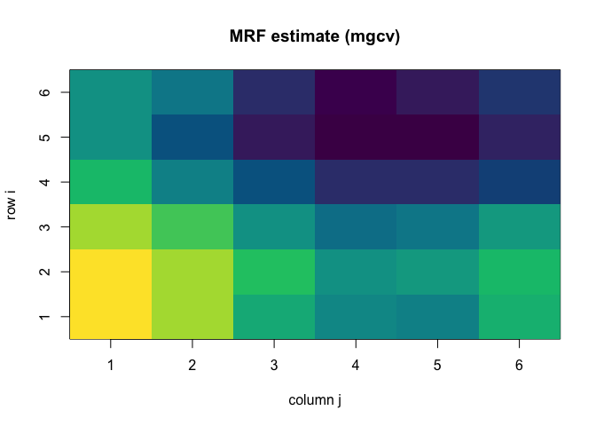
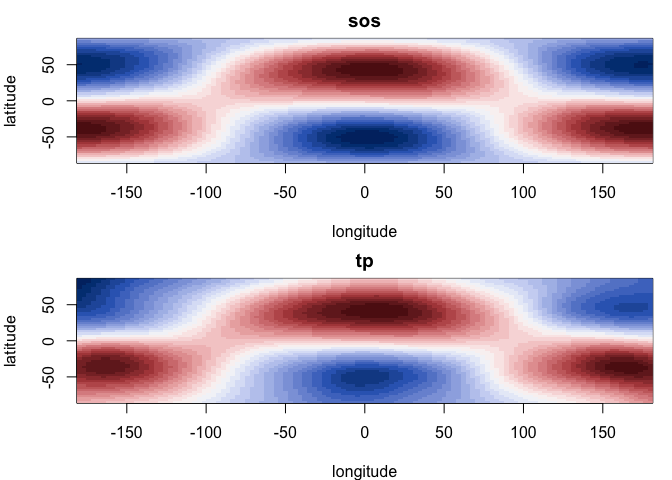

# Large Data and Spatial Models (R companion)
Simon Frost

- [Overview](#overview)
- [Part 1 — `gam()` versus `bam()`](#part-1--gam-versus-bam)
- [Part 2 — Markov random field](#part-2--markov-random-field)
- [Part 3 — Splines on the sphere](#part-3--splines-on-the-sphere)
- [Quantities compared against
  GAM.jl](#quantities-compared-against-gamjl)

## Overview

This companion fits the **same** models on the **same** CSVs as the
Julia vignette, using `mgcv`, so the two printouts can be compared line
by line. All three datasets come from `vignettes/generate_data.jl` with
fixed seeds.

``` r
library(mgcv)
```

## Part 1 — `gam()` versus `bam()`

Same additive model as the Julia side: three `k = 30` cubic-regression
smooths, so $p = 90$ before constraints.

``` r
dl <- read.csv("../data_large.csv")
f <- y ~ s(x1, k = 30, bs = "cr") + s(x2, k = 30, bs = "cr") + s(x3, k = 30, bs = "cr")

res <- do.call(rbind, lapply(c(1000, 2000, 5000, 10000, 20000), function(n) {
  d <- dl[seq_len(n), ]
  tg <- system.time(mg <- gam(f, data = d, method = "REML"))[["elapsed"]]
  tb <- system.time(mb <- bam(f, data = d, method = "fREML"))[["elapsed"]]
  data.frame(n = n, gam_s = tg, bam_s = tb, speedup = tg / tb,
             edf_gam = sum(mg$edf), edf_bam = sum(mb$edf))
}))
print(res, row.names = FALSE, digits = 4)
```

         n gam_s bam_s speedup edf_gam edf_bam
      1000 0.475 0.039   12.18   19.43   19.43
      2000 0.821 0.043   19.09   22.61   22.61
      5000 2.055 0.077   26.69   27.20   27.20
     10000 3.591 0.130   27.62   30.41   30.41
     20000 7.258 0.265   27.39   33.53   33.54

Note that mgcv’s `bam()` wins by a much wider margin than GAM.jl’s does.
That is not because GAM.jl’s `bam()` is slow — it is because GAM.jl’s
`gam()` is already fast, so there is less to recover. Compare the
*absolute* times in the two vignettes rather than the ratios.

`bam(..., discrete = TRUE)` bins covariates onto a grid of unique values
and is faster again; GAM.jl does not implement it, so it is excluded
here for a like-for-like comparison.

## Part 2 — Markov random field

`nb.csv` is a $36 \times 36$ adjacency matrix; mgcv wants a **named list
of neighbour indices**, so we convert. The names must match the factor
levels of `region`.

``` r
dm <- read.csv("../data_mrf.csv")
dm$region <- factor(dm$region)
A <- as.matrix(read.csv("../nb.csv", check.names = FALSE))
nb <- lapply(seq_len(ncol(A)), function(j) which(A[, j] == 1))
names(nb) <- colnames(A)

mm <- gam(y ~ s(region, bs = "mrf", xt = list(nb = nb)) + s(z, k = 10, bs = "cr"),
          data = dm, method = "REML")
summary(mm)
```


    Family: gaussian 
    Link function: identity 

    Formula:
    y ~ s(region, bs = "mrf", xt = list(nb = nb)) + s(z, k = 10, 
        bs = "cr")

    Parametric coefficients:
                Estimate Std. Error t value Pr(>|t|)    
    (Intercept)  0.63245    0.01514   41.78   <2e-16 ***
    ---
    Signif. codes:  0 '***' 0.001 '**' 0.01 '*' 0.05 '.' 0.1 ' ' 1

    Approximate significance of smooth terms:
                 edf Ref.df     F p-value    
    s(region) 33.138 35.000 120.8  <2e-16 ***
    s(z)       5.928  7.074 117.9  <2e-16 ***
    ---
    Signif. codes:  0 '***' 0.001 '**' 0.01 '*' 0.05 '.' 0.1 ' ' 1

    R-sq.(adj) =  0.876   Deviance explained = 88.2%
    -REML = 439.61  Scale est. = 0.16497   n = 720

``` r
truth <- dm$g_true + 1.5 * sin(pi * dm$z)
cat(sprintf("EDF total          = %.3f\n", sum(mm$edf)))
```

    EDF total          = 40.066

``` r
cat(sprintf("scale              = %.4f\n", mm$scale))
```

    scale              = 0.1650

``` r
cat(sprintf("AIC                = %.3f\n", AIC(mm)))
```

    AIC                = 787.205

``` r
cat(sprintf("cor(fitted, truth) = %.4f\n", cor(fitted(mm), truth)))
```

    cor(fitted, truth) = 0.9964

``` r
cat(sprintf("sp                 = %s\n", paste(round(mm$sp, 5), collapse = ", ")))
```

    sp                 = 2.6417, 76.07072

The recovered spatial field, on the same lattice layout as the Julia
vignette:

``` r
labels <- levels(dm$region)
grid <- data.frame(region = factor(labels, levels = labels), z = rep(0.5, length(labels)))
ghat <- predict(mm, grid)
ghat <- ghat - mean(ghat)
image(1:6, 1:6, t(matrix(ghat, 6, 6, byrow = TRUE)),
      xlab = "column j", ylab = "row i", main = "MRF estimate (mgcv)",
      col = hcl.colors(32, "viridis"))
```



## Part 3 — Splines on the sphere

`mgcv::s(..., bs = "sos")` takes latitude and longitude in **degrees**,
which is how `data_sphere.csv` stores them. GAM.jl’s `bs=:sos` now
follows the same convention (degrees, latitude first), so both fits
below read the CSV columns directly with no conversion.

``` r
ds <- read.csv("../data_sphere.csv")
m_sos <- gam(y ~ s(lat, lon, k = 50, bs = "sos"), data = ds, method = "REML")
m_tp  <- gam(y ~ s(lat, lon, k = 50, bs = "tp"),  data = ds, method = "REML")

for (nm in c("sos", "tp")) {
  m <- get(paste0("m_", nm))
  cat(sprintf("%-4s EDF=%7.3f  AIC=%9.3f  scale=%.4f  cor=%.4f  RMSE=%.4f\n",
              nm, sum(m$edf), AIC(m), m$scale, cor(fitted(m), ds$f_true),
              sqrt(mean((fitted(m) - ds$f_true)^2))))
}
```

    sos  EDF= 45.955  AIC=  358.802  scale=0.0865  cor=0.9983  RMSE=0.0642
    tp   EDF= 47.696  AIC=  384.748  scale=0.0892  cor=0.9963  RMSE=0.0931

The seam test — two points $2^\circ$ apart on the ground, $358^\circ$
apart in the `lon` column:

``` r
seam <- data.frame(lat = c(0, 0), lon = c(179, -179))
ps <- predict(m_sos, seam); pt <- predict(m_tp, seam)
cat(sprintf("sos: %+.4f / %+.4f   |jump| = %.4f\n", ps[1], ps[2], abs(ps[1] - ps[2])))
```

    sos: +0.8978 / +0.8982   |jump| = 0.0005

``` r
cat(sprintf("tp:  %+.4f / %+.4f   |jump| = %.4f\n", pt[1], pt[2], abs(pt[1] - pt[2])))
```

    tp:  +0.8175 / +0.8931   |jump| = 0.0756

``` r
par(mfrow = c(2, 1), mar = c(4, 4, 2, 1))
lat_grid <- seq(-85, 85, length.out = 60)
lon_grid <- seq(-180, 180, length.out = 120)
gp <- expand.grid(lat = lat_grid, lon = lon_grid)
for (nm in c("sos", "tp")) {
  z <- matrix(predict(get(paste0("m_", nm)), gp), nrow = length(lat_grid))
  image(lon_grid, lat_grid, t(z), main = nm, xlab = "longitude", ylab = "latitude",
        col = hcl.colors(32, "Blue-Red 3"))
}
```



## Quantities compared against GAM.jl

The Julia vignette reproduces the tables above on the same CSVs. Both
the MRF and `sos` fits now agree to the printed digits on EDF, AIC,
scale and fit quality: GAM.jl’s `bs=:sos` is a direct port of mgcv’s
spherical-spline construction, not the geodesic-kernel approximation
earlier releases used.
