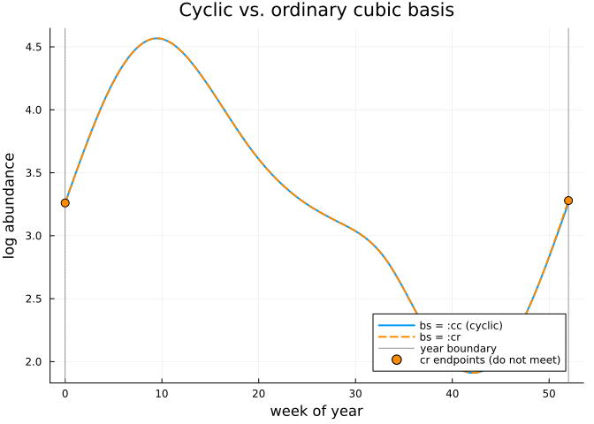
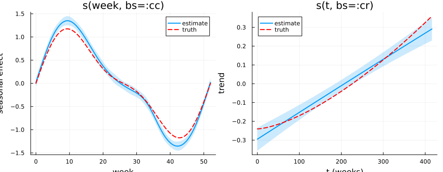
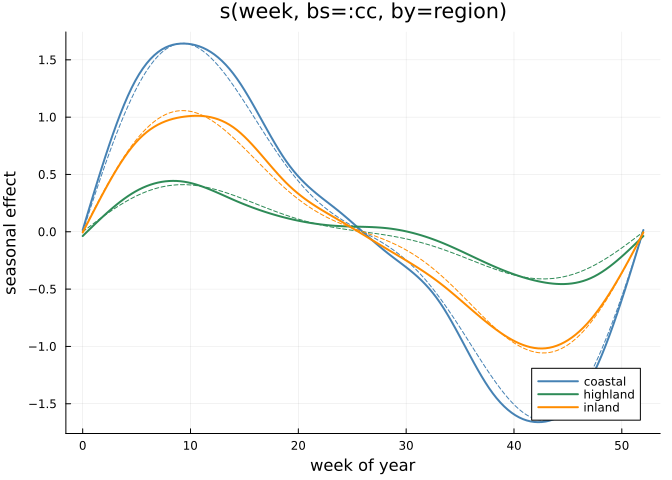
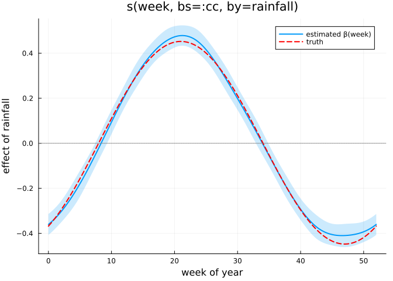
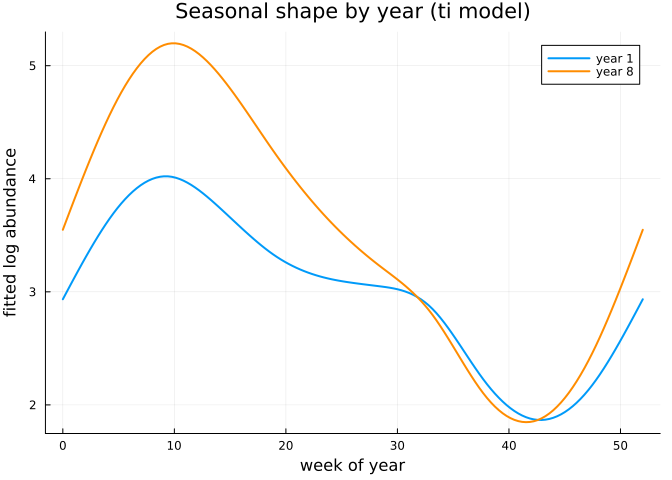

# Seasonal and Group-Varying Smooths
Simon Frost

- [Overview](#overview)
- [Setup](#setup)
- [The data](#the-data)
  - [A note on the period](#a-note-on-the-period)
- [Cyclic smooths](#cyclic-smooths)
- [Separating season from trend](#separating-season-from-trend)
- [Factor `by`: a separate curve per
  group](#factor-by-a-separate-curve-per-group)
  - [One smoothing parameter per
    level](#one-smoothing-parameter-per-level)
  - [`by = factor`, `bs = :fs`, or
    `bs = :sz`?](#by--factor-bs--fs-or-bs--sz)
- [`bs = :sz`: deviations from a common
  curve](#bs--sz-deviations-from-a-common-curve)
- [Numeric `by`: varying-coefficient
  terms](#numeric-by-varying-coefficient-terms)
- [`ti()`: is the seasonality itself
  changing?](#ti-is-the-seasonality-itself-changing)
  - [`k` in a tensor smooth is
    per-marginal](#k-in-a-tensor-smooth-is-per-marginal)
  - [What the interaction says](#what-the-interaction-says)
- [Limitations](#limitations)
- [Comparison with mgcv](#comparison-with-mgcv)
- [Summary](#summary)

## Overview

Surveillance data are rarely a single smooth curve. A weekly time series
of disease or vector abundance usually carries at least three
distinguishable signals:

- a **within-year cycle** that must join up at the year boundary,
- a **multi-year trend** that need not repeat at all,
- **differences between groups** — regions, age bands, serotypes — that
  may each need their own amount of smoothing.

This vignette covers the machinery for all three, and the interaction
between the first two:

| Construction | Purpose |
|----|----|
| `s(x, bs = :cc)` | cyclic smooth: the curve and its first two derivatives match at the ends |
| `s(x, bs = :cc) + s(t)` | separating a within-year cycle from a multi-year trend |
| `s(x, by = factor)` | one curve per level, **each with its own smoothing parameter** |
| `s(x, by = numeric)` | varying-coefficient term: a slope that changes smoothly with `x` |
| `ti(x, z)` | the *pure interaction*, with both main effects excluded |

The running example is simulated weekly vector-abundance surveillance.
Both datasets are simulated, with the data-generating processes stated
below; they are not real surveillance data.

## Setup

``` julia
using GAM
using CSV
using StatsAPI: predict, fitted, aic, coef, deviance
using Statistics: mean, std, cor

using DataFrames
using Plots
using Printf
```

## The data

``` julia
df_season = CSV.read("data_season.csv", DataFrame)
df_region = CSV.read("data_region.csv", DataFrame)
@printf("data_season: %d rows, %d years\n", nrow(df_season), maximum(df_season.year))
@printf("data_region: %d rows, regions = %s\n",
    nrow(df_region), join(unique(df_region.region), ", "))
first(df_season, 4)
```

    data_season: 424 rows, 8 years
    data_region: 954 rows, regions = coastal, inland, highland

<div><div style = "float: left;"><span>4×6 DataFrame</span></div><div style = "clear: both;"></div></div><div class = "data-frame" style = "overflow-x: scroll;">

| Row |  week |  year |     t |       y | mu_true | amp_true |
|----:|------:|------:|------:|--------:|--------:|---------:|
|     | Int64 | Int64 | Int64 | Float64 | Float64 |  Float64 |
|   1 |     0 |     1 |     0 | 3.11144 |     3.0 |      0.8 |
|   2 |     1 |     1 |     1 | 2.66644 | 3.16351 |      0.8 |
|   3 |     2 |     1 |     2 | 3.64543 | 3.32178 |      0.8 |
|   4 |     3 |     1 |     3 | 3.30776 | 3.46973 |      0.8 |

</div>

Both are generated from the same seasonal shape, a two-harmonic curve
with a period of exactly 52 weeks:

$$\text{season}(w) = \sin\!\left(\frac{2\pi w}{52}\right)
                 + 0.35 \sin\!\left(\frac{4\pi w}{52}\right)$$

``` julia
season(w) = sin(2π * w / 52) + 0.35 * sin(4π * w / 52)
@printf("season(0) = %.3f    season(52) = %.3e\n", season(0), season(52))
```

    season(0) = 0.000    season(52) = 1.094e-15

`data_season.csv` is a single site observed for 8 years:

$$y = 3.0 + A(\text{year})\,\text{season}(\text{week}) + 0.6\left(\frac{t}{t_{\max}}\right)^{1.5} + \varepsilon,
\quad \varepsilon \sim N(0, 0.25^2)$$

with a seasonal amplitude $A(\text{year}) = 0.8 + 0.10(\text{year}-1)$
that **grows over the 8 years** — a fact we ignore until the final
section, and then detect.

### A note on the period

A cyclic basis has to know the period. By default it takes it from the
**observed range of the covariate**: the constraint imposed is
$f(\min x) = f(\max x)$. You can also state the period explicitly with
`knots=`, exactly as in mgcv:

``` julia
gam(@formula(y ~ s(week, k = 10, bs = :cc)), df;
    knots = Dict(:week => [0.0, 52.0]))
```

Two knots on a cyclic basis are read as the period *endpoints*, with the
interior knots filled in — mgcv’s convention.

The distinction matters whenever the observed range is not the period.
If these data were coded 0–51, the last week would be treated as the
turn of the year, and the fitted curve would fail to join:
$|f(0) - f(52)| = 0.2519$ on this dataset. Passing
`knots = Dict(:week => [0.0, 52.0])` restores the join exactly ($0.0$).

That is also why `week` runs from 0 to 52 rather than 1 to 52 here. Week
0 and week 52 both mark the turn of the year — the same point in the
seasonal cycle — so the observed range (52 weeks) is exactly the period,
and the default constraint is one that is genuinely true of the process.
Coding the covariate so its range *is* the period and stating the period
with `knots=` are two ways to reach the same model; be sure you have
done one of them.

## Cyclic smooths

A January estimate should not be free to disagree with itself depending
on whether it is read as the start or the end of the year. The cyclic
cubic basis (`bs = :cc`) enforces that directly: the fitted value, slope
and curvature all match at the two ends of the range.

``` julia
m_cc = gam(@formula(y ~ s(week, k = 12, bs = :cc)), df_season)
m_cr = gam(@formula(y ~ s(week, k = 12, bs = :cr)), df_season)

@printf("cc: edf = %.3f, %d basis columns, null space = %d\n",
    edf(m_cc)[1], size(m_cc.smooths[1].X, 2), m_cc.smooths[1].null_dim)
@printf("cr: edf = %.3f, %d basis columns, null space = %d\n",
    edf(m_cr)[1], size(m_cr.smooths[1].X, 2), m_cr.smooths[1].null_dim)
```

    cc: edf = 8.288, 10 basis columns, null space = 1
    cr: edf = 9.375, 11 basis columns, null space = 2

Two structural differences are worth reading off. A cyclic basis with
`k = 12` contributes **10** columns where the ordinary cubic basis
contributes 11: the wrap identifies the first and last basis functions,
and the usual centring constraint removes one more. And its null space
has dimension 1 rather than 2 — a periodic function cannot have an
unpenalized linear trend, so only the constant survives the penalty.

The constraint itself is exact, not approximate:

``` julia
ends = DataFrame(week = [0, 52])
p_cc = predict(m_cc, ends)
p_cr = predict(m_cr, ends)
@printf("cc  f(0) = %.6f   f(52) = %.6f   |difference| = %.3e\n",
    p_cc[1], p_cc[2], abs(p_cc[1] - p_cc[2]))
@printf("cr  f(0) = %.6f   f(52) = %.6f   |difference| = %.3e\n",
    p_cr[1], p_cr[2], abs(p_cr[1] - p_cr[2]))
```

    cc  f(0) = 3.259721   f(52) = 3.259721   |difference| = 0.000e+00
    cr  f(0) = 3.259899   f(52) = 3.279065   |difference| = 1.917e-02

The cyclic fit closes to machine zero. The unconstrained cubic fit
leaves a visible step at the year boundary — small here, because the
data really are periodic and the two ends are estimated from adjacent
weeks, but it is a discontinuity the process does not have.

``` julia
wg = collect(range(0, 52; length = 300))
grid = DataFrame(week = wg)
pl = plot(wg, predict(m_cc, grid); label = "bs = :cc (cyclic)", linewidth = 2,
    xlabel = "week of year", ylabel = "log abundance",
    title = "Cyclic vs. ordinary cubic basis", legend = :bottomright)
plot!(pl, wg, predict(m_cr, grid); label = "bs = :cr", linewidth = 2,
    linestyle = :dash, color = :darkorange)
vline!(pl, [0, 52]; label = "year boundary", color = :grey, linestyle = :dot)
scatter!(pl, [0, 52], predict(m_cr, ends);
    label = "cr endpoints (do not meet)", color = :darkorange, markersize = 5)
pl
```



## Separating season from trend

The seasonal cycle and the multi-year trend are different functions of
different variables: `week` is the position *within* a year, `t` is
elapsed time *across* years. Because they are separate covariates with
separate bases, they are estimated additively and remain identifiable.

``` julia
m_st = gam(@formula(y ~ s(week, k = 12, bs = :cc) + s(t, k = 10, bs = :cr)), df_season)
for (i, sm) in enumerate(m_st.smooths)
    @printf("%-16s edf = %6.3f   sp = %.4f\n", sm.spec.label, edf(m_st)[i], m_st.sp[i])
end
@printf("\nDeviance explained: %.1f%%\n", GAM.deviance_explained(m_st) * 100)
```

    s(week,bs=cc)    edf =  8.592   sp = 1.8976
    s(t,bs=cr)       edf =  1.063   sp = 12.3124

    Deviance explained: 89.0%

The seasonal term uses most of its basis (edf ≈ 8.6 of a possible 10)
while the trend is close to a straight line (edf ≈ 1.1) — which is what
the simulation put there.

Identifiability is not the same as independence, so it is worth checking
concurvity — the smooth analogue of collinearity:

``` julia
conc = concurvity(m_st; full = true)
for (i, sm) in enumerate(m_st.smooths)
    @printf("%-16s worst = %.4f  observed = %.4f  estimate = %.4f\n",
        sm.spec.label, conc.worst[i], conc.observed[i], conc.estimate[i])
end
```

    s(week,bs=cc)    worst = 0.0791  observed = 0.0677  estimate = 0.0097
    s(t,bs=cr)       worst = 0.0791  observed = 0.0132  estimate = 0.0033

These are low. A seasonal term and a trend term *can* become badly
confounded when the series is short — with only one or two years of
data, “late in the year” and “late in the series” are nearly the same
thing — and concurvity is how that shows up.

Both components are recovered accurately:

``` julia
se_s = smooth_estimates(m_st; select = 1, n = 200)
se_t = smooth_estimates(m_st; select = 2, n = 200)

wgrid = se_s.covariates[:week]
s_true = season.(wgrid); s_true .-= mean(s_true)
s_hat = se_s.estimate .- mean(se_s.estimate)

tgrid = se_t.covariates[:t]
t_true = 0.6 .* (tgrid ./ maximum(df_season.t)) .^ 1.5; t_true .-= mean(t_true)
t_hat = se_t.estimate .- mean(se_t.estimate)

@printf("season: correlation with truth = %.5f, RMSE = %.4f\n",
    cor(s_hat, s_true), sqrt(mean((s_hat .- s_true) .^ 2)))
@printf("trend : correlation with truth = %.5f, RMSE = %.4f\n",
    cor(t_hat, t_true), sqrt(mean((t_hat .- t_true) .^ 2)))

p1 = plot(wgrid, s_hat; ribbon = 2 .* se_s.se, fillalpha = 0.2, linewidth = 2,
    label = "estimate", xlabel = "week", ylabel = "seasonal effect", title = "s(week, bs=:cc)")
plot!(p1, wgrid, s_true; label = "truth", linestyle = :dash, linewidth = 2, color = :red)
p2 = plot(tgrid, t_hat; ribbon = 2 .* se_t.se, fillalpha = 0.2, linewidth = 2,
    label = "estimate", xlabel = "t (weeks)", ylabel = "trend", title = "s(t, bs=:cr)")
plot!(p2, tgrid, t_true; label = "truth", linestyle = :dash, linewidth = 2, color = :red)
plot(p1, p2; layout = (1, 2), size = (900, 350))
```

    season: correlation with truth = 0.99957, RMSE = 0.1154
    trend : correlation with truth = 0.98895, RMSE = 0.0282



The seasonal estimate averages over the 8 years, so it recovers the
*mean* seasonal shape; the amplitude growth built into the simulation is
not represented in this model at all. We return to it below.

## Factor `by`: a separate curve per group

`data_region.csv` has three regions whose seasonal amplitudes differ by
a factor of four:

| region   | level | amplitude |
|----------|-------|-----------|
| coastal  | 3.4   | 1.40      |
| inland   | 3.0   | 0.90      |
| highland | 2.6   | 0.35      |

A factor `by=` fits one copy of the smooth per level:

``` julia
m_by = gam(@formula(y ~ region + s(week, k = 12, bs = :cc, by = region)), df_region)
sm = m_by.smooths[1]
@printf("smooth label : %s\n", sm.spec.label)
@printf("levels       : %s\n", join(sm.spec.xt[:_by_levels], ", "))
@printf("total edf    : %.3f over %d coefficients\n", edf(m_by)[1], length(coef(m_by)))
```

    smooth label : s(week,by=region,bs=cc)
    levels       : coastal, highland, inland
    total edf    : 20.977 over 33 coefficients

Note the `region` main effect in the formula. A `by=` smooth is centred
within each level, so it carries the *shape* of each level’s curve but
not its mean; without the parametric main effect the level offsets have
nowhere to go. This is the same requirement mgcv imposes.

### One smoothing parameter per level

This is the substantive difference from a single shared curve. Each
level gets its own penalty and therefore its own smoothing parameter, so
a group with a weak signal is smoothed more heavily than a group with a
strong one:

``` julia
amps = Dict("coastal" => 1.40, "inland" => 0.90, "highland" => 0.35)
println("level      true amplitude    sp")
for (i, lev) in enumerate(sm.spec.xt[:_by_levels])
    @printf("%-10s %8.2f %14.4f\n", lev, amps[lev], m_by.sp[i])
end
```

    level      true amplitude    sp
    coastal        1.40         1.9318
    highland       0.35         3.8926
    inland         0.90         2.9150

The ordering is monotone: the smoothing parameter increases as the
seasonal signal weakens. That is the behaviour a single shared smoothing
parameter cannot produce, and it is the reason to prefer `by=` when
groups genuinely differ in how much structure they contain.

Each level’s curve is recovered:

``` julia
regions = String.(sm.spec.xt[:_by_levels])
gw = collect(range(0, 52; length = 150))
grid_by = DataFrame(week = repeat(gw, outer = length(regions)),
                    region = repeat(regions, inner = length(gw)))
se_by = smooth_estimates(m_by; select = 1, data = grid_by)

pl_by = plot(; xlabel = "week of year", ylabel = "seasonal effect",
    title = "s(week, bs=:cc, by=region)", legend = :bottomright)
cols = [:steelblue, :seagreen, :darkorange]
for (i, r) in enumerate(regions)
    idx = ((i - 1) * length(gw) + 1):(i * length(gw))
    e = se_by.estimate[idx]; e = e .- mean(e)
    tr = amps[r] .* season.(gw); tr = tr .- mean(tr)
    @printf("%-10s fitted range = %.3f   true range = %.3f   correlation = %.5f\n",
        r, maximum(e) - minimum(e), maximum(tr) - minimum(tr), cor(e, tr))
    plot!(pl_by, gw, e; label = r, linewidth = 2, color = cols[i])
    plot!(pl_by, gw, tr; label = "", linestyle = :dash, linewidth = 1, color = cols[i])
end
pl_by
```

    coastal    fitted range = 3.303   true range = 3.288   correlation = 0.99926
    highland   fitted range = 0.900   true range = 0.822   correlation = 0.98650
    inland     fitted range = 2.030   true range = 2.114   correlation = 0.99720



Dashed lines are the truth. Against a single shared seasonal curve, the
per-region model is decisively better:

``` julia
m_shared = gam(@formula(y ~ region + s(week, k = 12, bs = :cc)), df_region)
@printf("shared curve   : edf = %6.3f   AIC = %8.2f\n", edf(m_shared)[1], aic(m_shared))
@printf("by = region    : edf = %6.3f   AIC = %8.2f\n", edf(m_by)[1], aic(m_by))
@printf("ΔAIC = %.2f in favour of per-region curves\n", aic(m_shared) - aic(m_by))
```

    shared curve   : edf =  7.892   AIC =  1507.52
    by = region    : edf = 20.977   AIC =  1041.44
    ΔAIC = 466.08 in favour of per-region curves

### `by = factor`, `bs = :fs`, or `bs = :sz`?

All three fit a curve per level, and they answer different questions:

- **`s(x, by = f)`** — one penalty and one smoothing parameter *per
  level*. The levels are treated as distinct populations, each estimated
  on its own terms. Requires the factor main effect. Use it when the
  groups are few, named and individually interesting, as the regions are
  here.

- **`s(x, bs = :fs)`** — a single shared smoothing parameter across
  levels, which are treated as exchangeable draws from a common
  distribution of curves, with the level means absorbed into the smooth.
  Use it when the levels are many and interchangeable — subjects in a
  cohort, say — and you want them to borrow strength from one another
  rather than each being fitted alone.

- **`s(x, f, bs = :sz)`** — a *constrained* factor interaction: one
  common smooth plus per-level deviations from it, constrained to sum to
  zero across levels. Use it when the question is “is there a shared
  pattern, and how does each group depart from it?” rather than “what is
  each group’s curve?”.

Vignette 10 covers `bs = :fs` in a mixed-model setting; `bs = :sz` is
below.

## `bs = :sz`: deviations from a common curve

A factor `by=` gives you three separate seasonal curves. Often the more
useful decomposition is a **common** seasonal curve plus each region’s
*departure* from it, which is what `bs = :sz` estimates. The deviations
are constrained to sum to zero across levels at every point, so the
common smooth really is the shared pattern rather than an arbitrary
reference level.

``` julia
m_sz = gam(@formula(y ~ s(week, k = 12, bs = :cc) +
                        s(week, region, k = 12, bs = :sz)), df_region)
round.(edf(m_sz), digits = 3)
```

    2-element Vector{Float64}:
      8.456
     10.244

The first smooth is the common seasonal curve, the second the pooled set
of per-region deviations. At the same `k` as the factor-`by` model
above, fit quality is essentially identical — this is a
reparameterisation of similar model space, not a different amount of
flexibility:

``` julia
@printf("sz  deviance = %.3f\n", deviance(m_sz))
@printf("by  deviance = %.3f\n", deviance(m_by))
```

    sz  deviance = 158.456
    by  deviance = 157.697

The constraint is what makes the decomposition interpretable, and it
holds exactly rather than approximately:

``` julia
gw_sz = collect(range(0, 52; length = 53))
nd_sz = DataFrame(week = repeat(gw_sz, outer = length(regions)),
                  region = repeat(regions, inner = length(gw_sz)))
terms_sz = predict(m_sz, nd_sz; type = :terms)
dev_sz = terms_sz[Symbol("s(week,region,bs=sz)")]
M_sz = reshape(dev_sz, length(gw_sz), length(regions))
@printf("max |sum of deviations over levels| = %.1e\n",
        maximum(abs.(sum(M_sz, dims = 2))))
```

    max |sum of deviations over levels| = 1.1e-15

Reading the deviations recovers the simulation directly:

``` julia
for (j, r) in enumerate(regions)
    lo, hi = extrema(M_sz[:, j])
    @printf("%-9s deviation range [%6.3f, %6.3f]\n", r, lo, hi)
end
```

    coastal   deviation range [-0.210,  1.009]
    highland  deviation range [-1.013,  0.189]
    inland    deviation range [-0.002,  0.027]

Coastal (true amplitude 1.40) sits above the common curve and highland
(0.35) below it, while **inland is almost exactly the common curve** —
its amplitude, 0.90, is close to the mean of the three, so it has almost
nothing to deviate by. That is the reading `:sz` is for, and it is not
visible at all in three separately-fitted `by` curves.

Like a factor `by=` smooth, `:sz` carries **one smoothing parameter per
level** — three here, plus one for the common curve. That is what lets
it shrink a weakly-deviating level hard while leaving a
strongly-deviating one alone, and it is why inland’s deviation collapses
almost to nothing above while coastal’s does not.

``` julia
@printf("smoothing parameters: %d (1 common curve + %d levels)\n",
        length(m_sz.sp), length(regions))
```

    smoothing parameters: 4 (1 common curve + 3 levels)

> [!NOTE]
>
> ### Comparing `:sz` with mgcv
>
> The fits agree closely — deviation edf 10.244 here against mgcv’s
> 10.2412, deviance 158.456 against 158.457, and fitted values within
> 4.1e-5 (about 1.2e-5 of the fitted range). The *smoothing parameters*
> do not transfer, though: GAM.jl absorbs an orthonormal level contrast
> at construction where mgcv applies its own non-orthonormal contrast
> afterwards, so λ sits on a different scale and not even by a constant
> factor. Compare edf, deviance and fitted curves; do not compare `:sz`
> smoothing parameters between the packages.

## Numeric `by`: varying-coefficient terms

A numeric `by=` is a genuinely different construction. Rather than
replicating the smooth once per level, it **multiplies** the basis by
the covariate, so the term contributes $z_i f(x_i)$ — a coefficient on
$z$ that varies smoothly with $x$.

In the simulation, rainfall acts on abundance with a strength that
itself varies through the season, $\beta(w) = 0.45\sin(2\pi(w-8)/52)$:
rainfall matters in some parts of the year and not others.

``` julia
m_vc = gam(@formula(y ~ region + rainfall +
                        s(week, k = 12, bs = :cc, by = region) +
                        s(week, k = 12, bs = :cc, by = rainfall)), df_region)
for (i, s) in enumerate(m_vc.smooths)
    @printf("%-28s edf = %.3f\n", s.spec.label, edf(m_vc)[i])
end
```

    s(week,by=region,bs=cc)      edf = 24.166
    s(week,by=rainfall,bs=cc)    edf = 6.839

As with a factor `by=`, the smooth is centred, so `rainfall` also
appears as a parametric main effect — that term carries the constant
part of the rainfall effect, and the smooth carries how it varies.

``` julia
grid_vc = DataFrame(week = gw, region = fill(regions[1], length(gw)),
                    rainfall = fill(1.0, length(gw)))
se_vc = smooth_estimates(m_vc; select = 2, data = grid_vc)
b_true = 0.45 .* sin.(2π .* (gw .- 8) ./ 52)
b_hat = se_vc.estimate
@printf("β(week) recovery: correlation = %.5f, RMSE = %.4f\n",
    cor(b_hat, b_true), sqrt(mean((b_hat .- (b_true .- mean(b_true))) .^ 2)))
@printf("fitted range = %.3f   true range = %.3f\n",
    maximum(b_hat) - minimum(b_hat), maximum(b_true) - minimum(b_true))

pv = plot(gw, b_hat; ribbon = 2 .* se_vc.se, fillalpha = 0.2, linewidth = 2,
    label = "estimated β(week)", xlabel = "week of year",
    ylabel = "effect of rainfall", title = "s(week, bs=:cc, by=rainfall)")
plot!(pv, gw, b_true .- mean(b_true); label = "truth", linestyle = :dash,
    linewidth = 2, color = :red)
hline!(pv, [0.0]; label = "", color = :grey, linestyle = :dot)
pv
```

    β(week) recovery: correlation = 0.99854, RMSE = 0.0178
    fitted range = 0.888   true range = 0.900



Against a model in which rainfall has a single constant slope:

``` julia
m_const = gam(@formula(y ~ region + rainfall +
                           s(week, k = 12, bs = :cc, by = region)), df_region)
@printf("constant slope      : AIC = %8.2f\n", aic(m_const))
@printf("varying coefficient : AIC = %8.2f\n", aic(m_vc))
@printf("ΔAIC = %.2f\n", aic(m_const) - aic(m_vc))
```

    constant slope      : AIC =  1040.44
    varying coefficient : AIC =    48.52
    ΔAIC = 991.92

## `ti()`: is the seasonality itself changing?

The simulation grew the seasonal amplitude from 0.8 in year 1 to 1.5 in
year 8. A model with a seasonal term and a year term cannot express
that: it can say what the average season looks like and how the overall
level moved, but not that the *shape* of the season depends on the year.
That is an interaction, and `ti()` is the construction for testing one.

`te()` builds a full tensor product which absorbs the main effects, so
it cannot be separated from them. `ti()` excludes the marginal main
effects from the tensor basis, leaving the **pure interaction** — which
means you can keep `s(week)` and `s(year)` in the model and ask
specifically whether anything is left over.

``` julia
m_main = gam(@formula(y ~ s(week, k = 12, bs = :cc) + s(year, k = 6, bs = :cr)),
    df_season)
m_int = gam(@formula(y ~ s(week, k = 12, bs = :cc) + s(year, k = 6, bs = :cr) +
                         ti(week, year, bs = [:cc, :cr], k = 5)), df_season)

@printf("main effects only : AIC = %8.2f\n", aic(m_main))
@printf("with ti()         : AIC = %8.2f\n", aic(m_int))
@printf("ΔAIC = %.2f\n", aic(m_main) - aic(m_int))
```

    main effects only : AIC =   210.54
    with ti()         : AIC =    81.60
    ΔAIC = 128.95

``` julia
an = anova_gam(m_int)
st = an.smooth_table
for i in eachindex(st.label)
    @printf("%-18s edf = %6.3f   ref.df = %6.3f   p = %.3e\n",
        st.label[i], st.edf[i], st.ref_df[i], st.p_value[i])
end
```

    s(week,bs=cc)      edf =  8.835   ref.df =  9.695   p = 1.292e-212
    s(year,bs=cr)      edf =  1.575   ref.df =  1.938   p = 4.639e-33
    ti(week,year)      edf =  5.474   ref.df =  6.998   p = 2.531e-26

The interaction takes about 5.5 effective degrees of freedom and is
overwhelmingly supported. Fitting the same data *without* the amplitude
growth would drive that edf towards zero instead — the term is not
forced to be used.

### `k` in a tensor smooth is per-marginal

`k` in `te`, `ti` and `t2` sets the basis dimension of **each
marginal**, as in mgcv — not the total size of the tensor.
`ti(week, year, k = 5)` therefore requests 5 basis functions for `week`
and 5 for `year`, and the resulting block is their product, not 5
columns:

``` julia
for s in m_int.smooths
    @printf("%-18s %2d columns\n", s.spec.label, size(s.X, 2))
end
@printf("%-18s %2d coefficients\n", "whole model", length(coef(m_int)))
```

    s(week,bs=cc)      10 columns
    s(year,bs=cr)       5 columns
    ti(week,year)      12 columns
    whole model        28 coefficients

The 12 columns are $3 \times 4$: the cyclic marginal contributes 3 after
its wrap and centring constraints, the cubic marginal 4 after centring.
For contrast, the full tensor keeps the marginal main effects and is
correspondingly larger:

``` julia
m_te = gam(@formula(y ~ te(week, year, bs = [:cc, :cr], k = 5)), df_season)
@printf("te(week, year, k=5) : %d columns, edf = %.3f, AIC = %.2f\n",
    size(m_te.smooths[1].X, 2), edf(m_te)[1], aic(m_te))
```

    te(week, year, k=5) : 19 columns, edf = 8.033, AIC = 391.90

To give the marginals different dimensions, pass a vector: `k = [8, 4]`.

### What the interaction says

Predicting the seasonal curve in the first and last year shows the
amplitude growth the additive model could not represent:

``` julia
g_first = DataFrame(week = gw, year = fill(1, length(gw)))
g_last  = DataFrame(week = gw, year = fill(8, length(gw)))
f1 = predict(m_int, g_first)
f8 = predict(m_int, g_last)
rng_of(v) = maximum(v) - minimum(v)
s_rng = rng_of(season.(gw))
@printf("fitted seasonal range: year 1 = %.3f, year 8 = %.3f  (ratio %.2f)\n",
    rng_of(f1), rng_of(f8), rng_of(f8) / rng_of(f1))
@printf("true   seasonal range: year 1 = %.3f, year 8 = %.3f  (ratio %.2f)\n",
    0.8 * s_rng, 1.5 * s_rng, 1.5 / 0.8)

pt = plot(gw, f1; linewidth = 2, label = "year 1", xlabel = "week of year",
    ylabel = "fitted log abundance", title = "Seasonal shape by year (ti model)")
plot!(pt, gw, f8; linewidth = 2, label = "year 8", color = :darkorange)
pt
```

    fitted seasonal range: year 1 = 2.155, year 8 = 3.350  (ratio 1.55)
    true   seasonal range: year 1 = 1.879, year 8 = 3.523  (ratio 1.88)



The direction and rough size of the change are recovered. The fitted
ratio is smaller than the truth because the interaction is penalized
like any other smooth: shrinkage pulls the two years’ curves towards a
common shape, which is the conservative behaviour you want from a term
whose job is to answer “is there anything here at all?”.

## Limitations

**Tensor smooths take no per-margin knots.** `knots=` accepts a knot
vector per 1-D covariate. For a tensor smooth the per-margin knots are
ignored rather than half-applied, so set a tensor’s period by coding its
covariate instead.

**Per-smooth edf is reported per term, not per level.** For a factor
`by=` smooth GAM.jl reports one combined edf (20.977 above), where
mgcv’s `summary()` reports one row per level. The two agree when mgcv’s
rows are summed.

## Comparison with mgcv

The R companion in `R/` runs the same models on the same CSVs. Fitted
values agree closely (largest discrepancy across the four models,
free-fitted with smoothing parameters selected independently in each
package):

| model | max abs. difference in fitted values | relative to response range |
|----|----|----|
| season + trend | 1.7e-3 | 5.4e-4 |
| `ti` interaction | 5.5e-5 | 1.6e-5 |
| factor `by` | 2.4e-6 | 7.1e-7 |
| numeric `by` | 3.4e-5 | 7.9e-6 |

Basis dimensions match exactly — 10, 5 and 12 columns for the three
terms of the `ti` model in both packages, 19 for the `te` — as do the
model comparisons (ΔAIC 128.95 here against 128.92 in mgcv for the
interaction).

Two caveats when comparing directly:

- **Smoothing parameters for `cc` are on a different scale.** For the
  factor-`by` model GAM.jl reports `[1.93, 3.89, 2.92]` where mgcv
  reports `[6.90, 49.04, 18.45]`. The *ordering* is identical, the edf
  agree to four decimal places, and fitted values agree to 2.4e-6 — only
  the parameterisation of $\lambda$ differs. Compare edf, not `sp`.
- **A nearly-linear term leaves `sp` weakly determined.** In the
  season+trend model mgcv drives the trend’s smoothing parameter to
  1.8e7 while GAM.jl stops at 12.3; both give a trend edf of
  essentially 1. The criterion is flat once the term is effectively a
  straight line, which is why that model shows the largest fitted
  difference of the four — and it is still 0.05% of the response range.

## Summary

In this vignette we:

1.  Used a cyclic basis (`bs = :cc`) to enforce an exact join at the
    year boundary, and saw why the period is set by how the covariate is
    coded
2.  Separated a within-year cycle from a multi-year trend, and checked
    concurvity between them
3.  Fitted a factor `by=` smooth, giving each region its own curve **and
    its own smoothing parameter**, which ordered monotonically with
    signal strength
4.  Distinguished factor `by=` from `bs = :fs`, and both from the
    numeric `by=` varying-coefficient construction
5.  Used `ti()` to test whether the seasonal shape itself changed across
    years, and confirmed that `k` in a tensor smooth is per-marginal

For large surveillance series, `bam(...; discrete = true)` discretises
both the cyclic bases and factor-`by` smooths used here (`:cc` and `:cr`
are among the bases eligible for reduced construction); `ti` and `t2`
terms and numeric `by=` fall back to dense construction. Vignette 15
covers large-data fitting.
