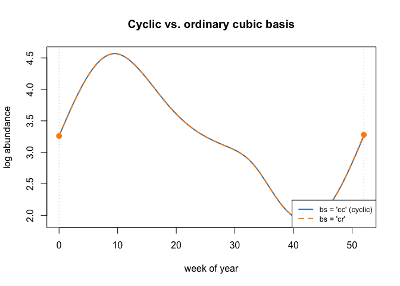
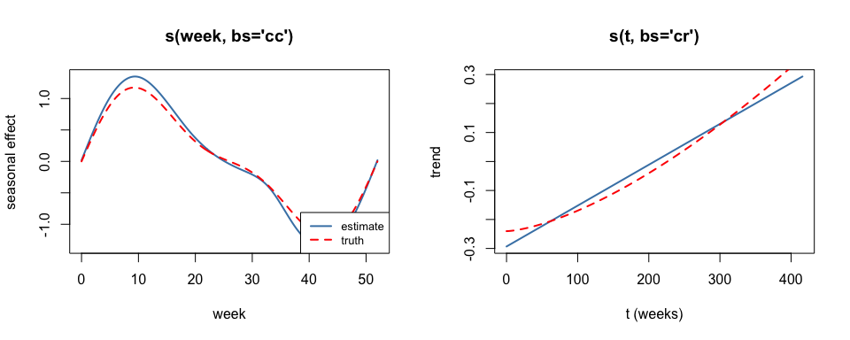
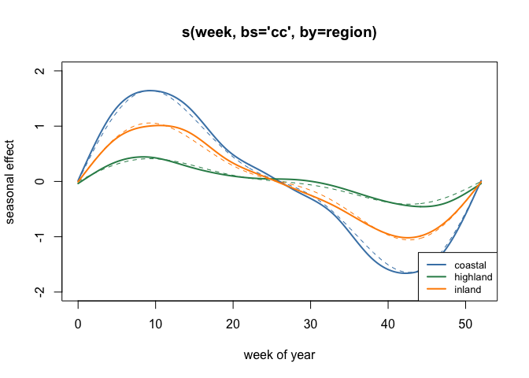
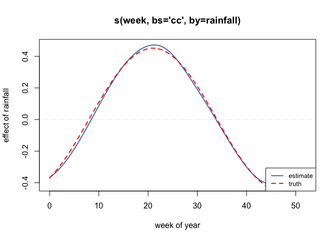
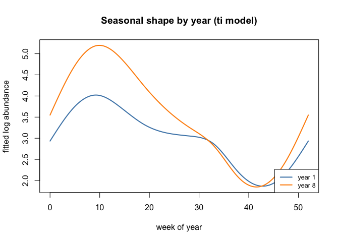

# Seasonal and Group-Varying Smooths
Simon Frost

- [Overview](#overview)
- [Setup](#setup)
- [The data](#the-data)
- [Cyclic smooths](#cyclic-smooths)
- [Separating season from trend](#separating-season-from-trend)
- [Factor `by`: a separate curve per
  group](#factor-by-a-separate-curve-per-group)
  - [`by = factor` or `bs = "fs"`?](#by--factor-or-bs--fs)
- [Numeric `by`: varying-coefficient
  terms](#numeric-by-varying-coefficient-terms)
- [`ti()`: is the seasonality itself
  changing?](#ti-is-the-seasonality-itself-changing)
  - [`k` in a tensor smooth is
    per-marginal](#k-in-a-tensor-smooth-is-per-marginal)
  - [What the interaction says](#what-the-interaction-says)
- [Summary](#summary)

## Overview

This is the mgcv companion to the GAM.jl vignette of the same name, run
on the same simulated CSV data. It covers:

| Construction | Purpose |
|----|----|
| `s(x, bs = "cc")` | cyclic smooth: the curve and its first two derivatives match at the ends |
| `s(x, bs = "cc") + s(t)` | separating a within-year cycle from a multi-year trend |
| `s(x, by = factor)` | one curve per level, **each with its own smoothing parameter** |
| `s(x, by = numeric)` | varying-coefficient term: a slope that changes smoothly with `x` |
| `ti(x, z)` | the *pure interaction*, with both main effects excluded |

## Setup

``` r
library(mgcv)
```

    Loading required package: nlme

    This is mgcv 1.9-4. For overview type '?mgcv'.

``` r
library(ggplot2)
```

## The data

``` r
df_season <- read.csv("../data_season.csv")
df_region <- read.csv("../data_region.csv")
df_region$region <- factor(df_region$region)
cat(sprintf("data_season: %d rows, %d years\n", nrow(df_season), max(df_season$year)))
```

    data_season: 424 rows, 8 years

``` r
cat(sprintf("data_region: %d rows, regions = %s\n",
            nrow(df_region), paste(levels(df_region$region), collapse = ", ")))
```

    data_region: 954 rows, regions = coastal, highland, inland

``` r
head(df_season, 4)
```

      week year t        y  mu_true amp_true
    1    0    1 0 3.111444 3.000000      0.8
    2    1    1 1 2.666438 3.163508      0.8
    3    2    1 2 3.645430 3.321775      0.8
    4    3    1 3 3.307760 3.469726      0.8

Both datasets use the same two-harmonic seasonal shape with a period of
exactly 52 weeks:

$$\text{season}(w) = \sin\!\left(\frac{2\pi w}{52}\right)
                 + 0.35 \sin\!\left(\frac{4\pi w}{52}\right)$$

``` r
season <- function(w) sin(2 * pi * w / 52) + 0.35 * sin(4 * pi * w / 52)
cat(sprintf("season(0) = %.3f    season(52) = %.3e\n", season(0), season(52)))
```

    season(0) = 0.000    season(52) = 1.094e-15

`week` runs 0–52 rather than 1–52 so that the observed range equals the
period. mgcv would also let you set the period explicitly with
`knots = list(week = c(0, 52))`; coding the covariate this way gives the
same result and is what the GAM.jl vignette must do, since `gam()` there
has no `knots` argument.

## Cyclic smooths

``` r
m_cc <- gam(y ~ s(week, k = 12, bs = "cc"), data = df_season, method = "REML")
m_cr <- gam(y ~ s(week, k = 12, bs = "cr"), data = df_season, method = "REML")

ncol_of <- function(m) m$smooth[[1]]$last.para - m$smooth[[1]]$first.para + 1
cat(sprintf("cc: edf = %.3f, %d basis columns\n", sum(pen.edf(m_cc)), ncol_of(m_cc)))
```

    cc: edf = 8.288, 10 basis columns

``` r
cat(sprintf("cr: edf = %.3f, %d basis columns\n", sum(pen.edf(m_cr)), ncol_of(m_cr)))
```

    cr: edf = 9.375, 11 basis columns

A cyclic basis with `k = 12` contributes 10 columns against the ordinary
cubic basis’s 11, and its null space contains only the constant.

``` r
ends <- data.frame(week = c(0, 52))
p_cc <- predict(m_cc, ends)
p_cr <- predict(m_cr, ends)
cat(sprintf("cc  f(0) = %.6f   f(52) = %.6f   |difference| = %.3e\n",
            p_cc[1], p_cc[2], abs(p_cc[1] - p_cc[2])))
```

    cc  f(0) = 3.259721   f(52) = 3.259721   |difference| = 0.000e+00

``` r
cat(sprintf("cr  f(0) = %.6f   f(52) = %.6f   |difference| = %.3e\n",
            p_cr[1], p_cr[2], abs(p_cr[1] - p_cr[2])))
```

    cr  f(0) = 3.259901   f(52) = 3.279062   |difference| = 1.916e-02

``` r
wg <- seq(0, 52, length.out = 300)
grid <- data.frame(week = wg)
plot(wg, predict(m_cc, grid), type = "l", lwd = 2, col = "steelblue",
     xlab = "week of year", ylab = "log abundance",
     main = "Cyclic vs. ordinary cubic basis",
     ylim = range(c(predict(m_cc, grid), predict(m_cr, grid))))
lines(wg, predict(m_cr, grid), lwd = 2, lty = 2, col = "darkorange")
abline(v = c(0, 52), col = "grey", lty = 3)
points(c(0, 52), predict(m_cr, ends), col = "darkorange", pch = 19, cex = 1.2)
legend("bottomright", c("bs = 'cc' (cyclic)", "bs = 'cr'"),
       col = c("steelblue", "darkorange"), lty = c(1, 2), lwd = 2, cex = 0.8)
```



## Separating season from trend

``` r
m_st <- gam(y ~ s(week, k = 12, bs = "cc") + s(t, k = 10, bs = "cr"),
            data = df_season, method = "REML")
e <- pen.edf(m_st)
for (i in seq_along(m_st$smooth)) {
  cat(sprintf("%-16s edf = %6.3f   sp = %.4f\n",
              m_st$smooth[[i]]$label, e[i], m_st$sp[i]))
}
```

    s(week)          edf =  8.592   sp = 6.6707
    s(t)             edf =  1.001   sp = 17774512.5350

``` r
cat(sprintf("\nDeviance explained: %.1f%%\n", summary(m_st)$dev.expl * 100))
```


    Deviance explained: 89.0%

Note the trend’s smoothing parameter. The trend is nearly a straight
line, and once a term is effectively linear the REML criterion is flat
in its smoothing parameter — mgcv runs it up to a very large value,
GAM.jl stops much earlier, and both report a trend edf of essentially 1.
Compare edf, not `sp`.

``` r
conc <- concurvity(m_st, full = TRUE)
print(round(conc, 4))
```

             para s(week)   s(t)
    worst       0  0.0791 0.0791
    observed    0  0.0677 0.0132
    estimate    0  0.0097 0.0033

``` r
par(mfrow = c(1, 2))

se_s <- predict(m_st, data.frame(week = wg, t = mean(df_season$t)),
                type = "terms", se.fit = TRUE)
s_hat <- se_s$fit[, 1] - mean(se_s$fit[, 1])
s_true <- season(wg); s_true <- s_true - mean(s_true)
cat(sprintf("season: correlation with truth = %.5f, RMSE = %.4f\n",
            cor(s_hat, s_true), sqrt(mean((s_hat - s_true)^2))))
```

    season: correlation with truth = 0.99957, RMSE = 0.1155

``` r
plot(wg, s_hat, type = "l", lwd = 2, col = "steelblue",
     xlab = "week", ylab = "seasonal effect", main = "s(week, bs='cc')")
lines(wg, s_true, lty = 2, lwd = 2, col = "red")
legend("bottomright", c("estimate", "truth"), col = c("steelblue", "red"),
       lty = c(1, 2), lwd = 2, cex = 0.8)

tg <- seq(min(df_season$t), max(df_season$t), length.out = 200)
se_t <- predict(m_st, data.frame(week = 0, t = tg), type = "terms")
t_hat <- se_t[, 2] - mean(se_t[, 2])
t_true <- 0.6 * (tg / max(df_season$t))^1.5; t_true <- t_true - mean(t_true)
cat(sprintf("trend : correlation with truth = %.5f, RMSE = %.4f\n",
            cor(t_hat, t_true), sqrt(mean((t_hat - t_true)^2))))
```

    trend : correlation with truth = 0.98960, RMSE = 0.0275

``` r
plot(tg, t_hat, type = "l", lwd = 2, col = "steelblue",
     xlab = "t (weeks)", ylab = "trend", main = "s(t, bs='cr')")
lines(tg, t_true, lty = 2, lwd = 2, col = "red")
```



``` r
par(mfrow = c(1, 1))
```

## Factor `by`: a separate curve per group

The three regions differ in both mean level and seasonal amplitude:

| region   | level | amplitude |
|----------|-------|-----------|
| coastal  | 3.4   | 1.40      |
| inland   | 3.0   | 0.90      |
| highland | 2.6   | 0.35      |

``` r
m_by <- gam(y ~ region + s(week, k = 12, bs = "cc", by = region),
            data = df_region, method = "REML")
cat(sprintf("levels    : %s\n", paste(levels(df_region$region), collapse = ", ")))
```

    levels    : coastal, highland, inland

``` r
cat(sprintf("total edf : %.3f over %d coefficients\n",
            sum(pen.edf(m_by)), length(coef(m_by))))
```

    total edf : 20.977 over 33 coefficients

The `region` main effect is required: a `by=` smooth is centred within
each level, so it carries each level’s shape but not its mean.

Unlike GAM.jl, which reports one combined edf for the whole `by=` term,
mgcv reports one row per level; the two agree when these are summed.

``` r
amps <- c(coastal = 1.40, highland = 0.35, inland = 0.90)
cat("level      true amplitude    sp        edf\n")
```

    level      true amplitude    sp        edf

``` r
e_by <- pen.edf(m_by)
for (i in seq_along(levels(df_region$region))) {
  lev <- levels(df_region$region)[i]
  cat(sprintf("%-10s %8.2f %14.4f %8.3f\n", lev, amps[[lev]], m_by$sp[i], e_by[i]))
}
```

    coastal        1.40         6.9024    8.257
    highland       0.35        49.0433    5.689
    inland         0.90        18.4492    7.030

The smoothing parameter increases as the seasonal signal weakens,
exactly as in GAM.jl. The *values* differ between the packages — mgcv’s
are roughly an order of magnitude larger for this basis — but the
ordering, the edf and the fitted values all agree; only the
parameterisation of $\lambda$ differs.

``` r
regions <- levels(df_region$region)
cols <- c("steelblue", "seagreen", "darkorange")
plot(NULL, xlim = c(0, 52), ylim = c(-2, 2), xlab = "week of year",
     ylab = "seasonal effect", main = "s(week, bs='cc', by=region)")
for (i in seq_along(regions)) {
  nd <- data.frame(week = wg, region = factor(regions[i], levels = regions))
  tm <- predict(m_by, nd, type = "terms")
  cn <- paste0("s(week):region", regions[i])
  est <- tm[, cn]; est <- est - mean(est)
  tr <- amps[[regions[i]]] * season(wg); tr <- tr - mean(tr)
  cat(sprintf("%-10s fitted range = %.3f   true range = %.3f   correlation = %.5f\n",
              regions[i], diff(range(est)), diff(range(tr)), cor(est, tr)))
  lines(wg, est, lwd = 2, col = cols[i])
  lines(wg, tr, lwd = 1, lty = 2, col = cols[i])
}
```

    coastal    fitted range = 3.303   true range = 3.289   correlation = 0.99926
    highland   fitted range = 0.900   true range = 0.822   correlation = 0.98653
    inland     fitted range = 2.030   true range = 2.114   correlation = 0.99720

``` r
legend("bottomright", regions, col = cols, lwd = 2, cex = 0.8)
```



``` r
m_shared <- gam(y ~ region + s(week, k = 12, bs = "cc"),
                data = df_region, method = "REML")
cat(sprintf("shared curve   : edf = %6.3f   AIC = %8.2f\n",
            sum(pen.edf(m_shared)), AIC(m_shared)))
```

    shared curve   : edf =  7.892   AIC =  1507.52

``` r
cat(sprintf("by = region    : edf = %6.3f   AIC = %8.2f\n",
            sum(pen.edf(m_by)), AIC(m_by)))
```

    by = region    : edf = 20.977   AIC =  1041.44

``` r
cat(sprintf("dAIC = %.2f in favour of per-region curves\n",
            AIC(m_shared) - AIC(m_by)))
```

    dAIC = 466.08 in favour of per-region curves

### `by = factor` or `bs = "fs"`?

- **`s(x, by = f)`** — one smoothing parameter per level; levels treated
  as distinct populations. Requires the factor main effect.
- **`s(x, bs = "fs")`** — a single shared smoothing parameter, levels
  treated as exchangeable, level means absorbed into the smooth. Better
  when levels are many and interchangeable.

## Numeric `by`: varying-coefficient terms

A numeric `by=` multiplies the basis by the covariate, contributing
$z_i f(x_i)$ — a coefficient on $z$ that varies smoothly with $x$. Here
the effect of rainfall varies through the season,
$\beta(w) = 0.45\sin(2\pi(w-8)/52)$.

``` r
m_vc <- gam(y ~ region + rainfall + s(week, k = 12, bs = "cc", by = region) +
              s(week, k = 12, bs = "cc", by = rainfall),
            data = df_region, method = "REML")
e_vc <- pen.edf(m_vc)
for (i in seq_along(m_vc$smooth)) {
  cat(sprintf("%-28s edf = %.3f\n", m_vc$smooth[[i]]$label, e_vc[i]))
}
```

    s(week):regioncoastal        edf = 9.141
    s(week):regionhighland       edf = 6.358
    s(week):regioninland         edf = 8.663
    s(week):rainfall             edf = 6.837

``` r
nd <- data.frame(week = wg, region = factor(regions[1], levels = regions),
                 rainfall = 1)
tm <- predict(m_vc, nd, type = "terms")
b_hat <- tm[, "s(week):rainfall"]
b_true <- 0.45 * sin(2 * pi * (wg - 8) / 52)
cat(sprintf("beta(week) recovery: correlation = %.5f, RMSE = %.4f\n",
            cor(b_hat, b_true), sqrt(mean((b_hat - (b_true - mean(b_true)))^2))))
```

    beta(week) recovery: correlation = 0.99854, RMSE = 0.0173

``` r
plot(wg, b_hat, type = "l", lwd = 2, col = "steelblue", xlab = "week of year",
     ylab = "effect of rainfall", main = "s(week, bs='cc', by=rainfall)")
lines(wg, b_true - mean(b_true), lty = 2, lwd = 2, col = "red")
abline(h = 0, col = "grey", lty = 3)
legend("bottomright", c("estimate", "truth"), col = c("steelblue", "red"),
       lty = c(1, 2), lwd = 2, cex = 0.8)
```



``` r
m_const <- gam(y ~ region + rainfall + s(week, k = 12, bs = "cc", by = region),
               data = df_region, method = "REML")
cat(sprintf("constant slope      : AIC = %8.2f\n", AIC(m_const)))
```

    constant slope      : AIC =  1040.44

``` r
cat(sprintf("varying coefficient : AIC = %8.2f\n", AIC(m_vc)))
```

    varying coefficient : AIC =    48.27

``` r
cat(sprintf("dAIC = %.2f\n", AIC(m_const) - AIC(m_vc)))
```

    dAIC = 992.17

## `ti()`: is the seasonality itself changing?

The simulation grew the seasonal amplitude from 0.8 in year 1 to 1.5 in
year 8. `te()` builds a full tensor product that absorbs the marginal
main effects; `ti()` excludes them, leaving the pure interaction, so the
main effects can stay in the model and be tested against.

``` r
m_main <- gam(y ~ s(week, k = 12, bs = "cc") + s(year, k = 6, bs = "cr"),
              data = df_season, method = "REML")
m_int <- gam(y ~ s(week, k = 12, bs = "cc") + s(year, k = 6, bs = "cr") +
               ti(week, year, bs = c("cc", "cr"), k = 5),
             data = df_season, method = "REML")
cat(sprintf("main effects only : AIC = %8.2f\n", AIC(m_main)))
```

    main effects only : AIC =   210.52

``` r
cat(sprintf("with ti()         : AIC = %8.2f\n", AIC(m_int)))
```

    with ti()         : AIC =    81.61

``` r
cat(sprintf("dAIC = %.2f\n", AIC(m_main) - AIC(m_int)))
```

    dAIC = 128.92

``` r
summary(m_int)$s.table
```

                       edf    Ref.df         F p-value
    s(week)       8.835339 10.000000 442.98135       0
    s(year)       1.573199  1.936365  95.14381       0
    ti(week,year) 5.472129 12.000000  13.13090       0

### `k` in a tensor smooth is per-marginal

`k` sets the basis dimension of each marginal, not the total. In both
mgcv and GAM.jl, `ti(week, year, k = 5)` gives a 12-column block —
$3 \times 4$, the cyclic marginal contributing 3 after its wrap and
centring constraints and the cubic marginal 4 after centring:

``` r
for (s in m_int$smooth) {
  cat(sprintf("%-18s %2d columns\n", s$label, s$last.para - s$first.para + 1))
}
```

    s(week)            10 columns
    s(year)             5 columns
    ti(week,year)      12 columns

``` r
cat(sprintf("%-18s %2d coefficients\n", "whole model", length(coef(m_int))))
```

    whole model        28 coefficients

``` r
m_te <- gam(y ~ te(week, year, bs = c("cc", "cr"), k = 5),
            data = df_season, method = "REML")
cat(sprintf("te(week, year, k=5) : %d columns, edf = %.3f, AIC = %.2f\n",
            m_te$smooth[[1]]$last.para - m_te$smooth[[1]]$first.para + 1,
            summary(m_te)$s.table[1, "edf"], AIC(m_te)))
```

    te(week, year, k=5) : 19 columns, edf = 8.003, AIC = 391.86

Note that `pen.edf()` returns one value per *penalty*, and a tensor
product carries one penalty per marginal — so `sum(pen.edf())` counts a
`te` or `ti` term twice. Use `summary(m)$s.table` for per-smooth degrees
of freedom, which is what GAM.jl’s `edf()` reports.

To give the marginals different dimensions, pass a vector:
`k = c(8, 4)`.

### What the interaction says

``` r
f1 <- predict(m_int, data.frame(week = wg, year = 1))
f8 <- predict(m_int, data.frame(week = wg, year = 8))
s_rng <- diff(range(season(wg)))
cat(sprintf("fitted seasonal range: year 1 = %.3f, year 8 = %.3f  (ratio %.2f)\n",
            diff(range(f1)), diff(range(f8)), diff(range(f8)) / diff(range(f1))))
```

    fitted seasonal range: year 1 = 2.155, year 8 = 3.351  (ratio 1.55)

``` r
cat(sprintf("true   seasonal range: year 1 = %.3f, year 8 = %.3f  (ratio %.2f)\n",
            0.8 * s_rng, 1.5 * s_rng, 1.5 / 0.8))
```

    true   seasonal range: year 1 = 1.879, year 8 = 3.524  (ratio 1.88)

``` r
plot(wg, f1, type = "l", lwd = 2, col = "steelblue", xlab = "week of year",
     ylab = "fitted log abundance", main = "Seasonal shape by year (ti model)",
     ylim = range(c(f1, f8)))
lines(wg, f8, lwd = 2, col = "darkorange")
legend("bottomright", c("year 1", "year 8"),
       col = c("steelblue", "darkorange"), lwd = 2, cex = 0.8)
```



The interaction is penalized like any other smooth, so shrinkage pulls
the two years’ curves towards a common shape and the fitted amplitude
ratio is smaller than the truth — the conservative behaviour wanted from
a term whose job is to answer whether there is anything there at all.

## Summary

In this vignette we:

1.  Used a cyclic basis (`bs = "cc"`) to enforce an exact join at the
    year boundary
2.  Separated a within-year cycle from a multi-year trend and checked
    concurvity
3.  Fitted a factor `by=` smooth giving each region its own curve and
    its own smoothing parameter
4.  Distinguished factor `by=` from `bs = "fs"` and from the numeric
    `by=` varying-coefficient construction
5.  Used `ti()` to test whether the seasonal shape changed across years,
    and confirmed that `k` in a tensor smooth is per-marginal
